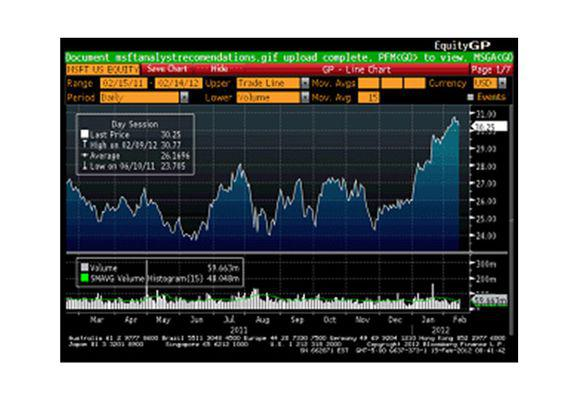

In the fast-paced world of financial markets, Bloomberg plays a crucial role in providing essential tools for financial analysis and algorithmic trading. Central to its suite of offerings is the Bloomberg Terminal, a platform renowned for delivering real-time market data, comprehensive analytics, and robust trading functionalities to professionals on a global scale. The Terminal's capabilities have transformed how market participants interact with financial data, enabling them to execute informed decisions swiftly and accurately.

This article takes an in-depth look at the impact and contributions of Bloomberg's tools in the context of financial analysis and algorithmic trading. Among its offerings, Bloomberg provides an expansive range of products and services designed to enhance trading strategies, optimize execution, and manage risk effectively. The integration of these resources aids market participants in staying competitive amidst evolving market dynamics.



Additionally, we will consider Bloomberg's ongoing innovations aimed at advancing algorithmic trading. The incorporation of advancements such as artificial intelligence and machine learning into Bloomberg's solutions signifies a commitment to keeping pace with technological evolutions. The company's focus on future trends, including automation and AI-driven analytics, supports its position as an integral player in the financial markets, underscoring its dedication to maintaining state-of-the-art technology for traders worldwide.

## Table of Contents

## Role of Bloomberg in Algorithmic Trading

Bloomberg Terminal is a fundamental tool for traders engaged in algorithmic trading, offering a comprehensive suite of resources that enhance the efficiency and precision of trading activities. At its core, the Terminal provides real-time market data critical for developing intricate trading algorithms. This includes not only asset prices and trading volumes but also immediate access to global news feeds, which are essential for traders to respond swiftly to market dynamics.

The real-time data access is complemented by Bloomberg's robust analytics capabilities, which enable the detailed analysis necessary for effective strategy formulation. These analytics cover a wide array of financial instruments, providing traders with the insights needed to optimize their trading models. This feature is critical for understanding market trends, volatility, and potential trading signals, which can be integrated into algorithmic strategies for enhanced performance.

Another significant advantage of Bloomberg Terminal is its ability to seamlessly integrate with proprietary trading systems through its comprehensive API offerings. This integration facilitates the automation of trading processes, allowing traders to implement and adjust their trading strategies with minimal manual intervention. The APIs provide programmatic access to Bloomberg's vast dataset, enabling the automated gathering, processing, and execution of trades in a manner that aligns with pre-defined strategies.

In addition to supporting strategy development and execution, Bloomberg’s technological infrastructure plays a pivotal role in risk management within the trading lifecycle. By offering tools for real-time risk assessment, traders can assess potential market changes and adjust their positions accordingly to mitigate losses. Immediate alerts for market changes empower traders to make informed decisions promptly, enhancing their ability to capitalize on emerging opportunities or to mitigate adverse scenarios.

In summary, Bloomberg Terminal stands as an indispensable asset in the domain of [algorithmic trading](/wiki/algorithmic-trading). Its capacity to provide real-time data, powerful analytics, and integration capabilities positions it as a critical tool for traders seeking to develop and execute advanced trading strategies effectively. By streamlining strategy execution and refining risk management, Bloomberg enhances the overall effectiveness of algorithmic trading operations.

## Bloomberg’s Algorithmic Trading Products and Services

Bloomberg offers a comprehensive suite of algorithmic trading products and services designed to enhance trade management and operational efficiency. One of the key products is the Execution Management System (EMSX), which plays a pivotal role in automating trade executions across multiple asset classes. By leveraging advanced algorithms, EMSX ensures that trades are executed at optimal times and prices, thereby maximizing performance and reducing slippage. This tool is particularly beneficial for traders looking to minimize manual intervention and streamline their trading strategies.

Another critical offering by Bloomberg is the Bloomberg Asset and Investment Manager (AIM). This platform provides end-to-end solutions for portfolio management, equipping traders with real-time data and analytics crucial for strategic decision-making. Bloomberg AIM is designed to support the entire investment process, from pre-trade compliance and order management to post-trade support. Its sophisticated analytics and data integration capabilities allow traders to make informed decisions based on current market conditions and historical data.

Bloomberg’s products are engineered to integrate seamlessly with other trading technologies, ensuring connectivity and interoperability across diverse trading environments. This integration is key to providing traders with a unified platform that supports various aspects of the trading lifecycle, including strategy development, execution, and risk management.

Empirical evidence from case studies demonstrates the significant impact of Bloomberg’s tools on execution quality and operational efficiency. For instance, traders using EMSX have reported improved execution speeds and reduced transaction costs, leading to enhanced overall performance. Similarly, Bloomberg AIM users have experienced streamlined operations and improved compliance management, contributing to more effective portfolio management.

Overall, Bloomberg's algorithmic trading products and services provide traders with reliable, robust, and efficient tools that support modern trading strategies and help maintain a competitive edge in the financial markets.

## Impact of Bloomberg Analytics on Trading Strategies

Bloomberg's analytical tools, such as the Bloomberg Quant Platform (BQuant), play a pivotal role in the development of advanced trading models. BQuant offers access to both real-time and historical data, which are essential for the [backtesting](/wiki/backtesting) of trading algorithms. Backtesting involves simulating trades using historical data to evaluate the performance of a trading strategy before it is deployed in real markets. This process helps traders assess the viability of their strategies over time and across varying market conditions.

Utilizing Bloomberg’s robust analytics, traders can optimize entry and [exit](/wiki/exit-strategy) points for trades, enhancing their strategy's effectiveness. Entry and exit optimization involves determining the most beneficial times to open or close a trade to maximize profits and minimize losses. Bloomberg’s tools allow for this optimization through iterative testing, where strategies are repeatedly tested and refined to improve performance metrics.

An essential aspect of trading is risk management, and Bloomberg's analytics assist traders in this critical area. By analyzing market data and modeling potential outcomes, traders can identify and mitigate risks associated with their portfolios. For instance, VaR (Value at Risk) and stress testing are tools leveraged to measure and manage financial risk, allowing traders to prepare for unexpected market movements.

A notable feature of Bloomberg's analytics is their capability to predict price movements and [volatility](/wiki/volatility-trading-strategies) changes. Quantitative trading models, built using Bloomberg data, often incorporate complex statistical methods and [machine learning](/wiki/machine-learning) algorithms to anticipate market trends. For example, techniques such as regression analysis, neural networks, or support vector machines can be employed to model and predict future price movements.

Here's a simplified Python example demonstrating how a trader might use historical data to predict future prices using a linear regression model:

```python
import pandas as pd
from sklearn.linear_model import LinearRegression
from sklearn.model_selection import train_test_split
from sklearn.metrics import mean_squared_error

# Load historical price data
data = pd.read_csv('historical_prices.csv')
X = data[['feature1', 'feature2']]  # Independent variables (e.g., factors influencing price)
y = data['price']  # Dependent variable (price)

# Split data into training and testing sets
X_train, X_test, y_train, y_test = train_test_split(X, y, test_size=0.2, random_state=42)

# Create and train the linear regression model
model = LinearRegression()
model.fit(X_train, y_train)

# Make predictions and evaluate the model
predictions = model.predict(X_test)
mse = mean_squared_error(y_test, predictions)
print(f'Mean Squared Error: {mse}')

# Predict future prices based on new data
future_data = pd.DataFrame({'feature1': [value1], 'feature2': [value2]})
future_price_prediction = model.predict(future_data)
print(f'Predicted Future Price: {future_price_prediction[0]}')
```

By employing such analytical techniques, Bloomberg empowers traders to devise strategies that are not only data-driven but also highly adaptive to the ever-changing dynamics of financial markets. These capabilities ensure that trading models remain competitive and resilient amidst market volatility.

## Bloomberg’s Innovations and Future in Algo Trading

Bloomberg is a leader in integrating [artificial intelligence](/wiki/ai-artificial-intelligence) (AI) and machine learning (ML) into the domain of algorithmic trading. These cutting-edge technologies enhance the capabilities of predictive analytics, pattern recognition, and anomaly detection within trading models, offering significant advantages for traders seeking to optimize performance.

AI and ML facilitate advanced predictive analytics by processing vast amounts of market data to identify patterns and trends that are not immediately apparent through traditional analysis. This enhances the accuracy of forecasts regarding asset price movements and market volatility. For instance, machine learning algorithms can identify subtle correlations and market inefficiencies, which can be exploited to design more robust trading strategies.

The future of algorithmic trading with Bloomberg involves increased automation and reliance on AI-driven analytics. This trend reflects a shift towards more autonomous trading systems capable of executing trades based on real-time data analysis without human intervention. As the demand for efficiency grows, the integration of [alternative data](/wiki/best-alternative-data) sources, such as social media sentiment and macroeconomic indicators, will further refine the decision-making processes.

Despite these advancements, Bloomberg must address several challenges to maintain its competitive edge. Data security remains a critical concern, as the increased use of AI necessitates stringent measures to protect sensitive information against cyber threats. Regulatory compliance is another significant [factor](/wiki/factor-investing), requiring Bloomberg to ensure that its innovations adhere to evolving financial regulations.

Moreover, as technology continues to evolve, Bloomberg must embrace new technologies and methodologies to remain at the forefront of financial markets. Innovations such as natural language processing and [deep learning](/wiki/deep-learning) have the potential to revolutionize how trading insights are generated and applied.

In summary, Bloomberg's dedication to advancing AI and ML within algorithmic trading ensures that its platforms remain state-of-the-art. By continuously integrating innovative technologies and adapting to the changing landscape of financial markets, Bloomberg solidifies its role as a pivotal component of modern trading ecosystems.

## Conclusion

Bloomberg continues to be a cornerstone in algorithmic trading, offering an extensive suite of tools tailored for modern traders. At the heart of this offering is the Bloomberg Terminal, which seamlessly integrates real-time data, cutting-edge analytics, and robust trading tools. These features are essential for crafting efficient and responsive trading strategies, enabling traders to navigate the complexities of contemporary financial markets with precision and agility.

The dynamic nature of financial markets necessitates adaptive strategies, and Bloomberg's platforms allow traders to harness high-quality data and analytics to maintain a competitive edge. By leveraging Bloomberg's extensive resources, traders can effectively respond to market fluctuations and capitalize on opportunities as they arise. The platform's advanced analytics capabilities, combined with its real-time data access, provide the necessary tools to enhance decision-making and strategy formulation.

Bloomberg's unwavering commitment to innovation ensures that its platforms remain at the forefront of financial technology advancements. By continuously incorporating artificial intelligence and machine learning into its offerings, Bloomberg enhances the predictive capabilities and analytical power of its tools. This focus on innovation not only strengthens Bloomberg's position as a leader in the industry but also empowers traders to develop more sophisticated algorithms that are responsive to market trends and changes.

As financial technology continues to evolve, Bloomberg's dedication to advancing its platforms ensures they remain relevant and impactful in an ever-changing landscape. For traders aiming to stay competitive, Bloomberg represents a vital partner, providing the tools and resources necessary to successfully navigate the intricacies of algorithmic trading.

## References & Further Reading

[1]: Bergstra, J., Bardenet, R., Bengio, Y., & Kégl, B. (2011). ["Algorithms for Hyper-Parameter Optimization."](https://dl.acm.org/doi/10.5555/2986459.2986743) Advances in Neural Information Processing Systems 24.

[2]: ["Advances in Financial Machine Learning"](https://www.amazon.com/Advances-Financial-Machine-Learning-Marcos/dp/1119482089) by Marcos Lopez de Prado

[3]: ["Evidence-Based Technical Analysis: Applying the Scientific Method and Statistical Inference to Trading Signals"](https://www.amazon.com/Evidence-Based-Technical-Analysis-Scientific-Statistical/dp/0470008741) by David Aronson

[4]: ["Machine Learning for Algorithmic Trading"](https://github.com/stefan-jansen/machine-learning-for-trading) by Stefan Jansen

[5]: ["Quantitative Trading: How to Build Your Own Algorithmic Trading Business"](https://www.amazon.com/Quantitative-Trading-Build-Algorithmic-Business/dp/1119800064) by Ernest P. Chan