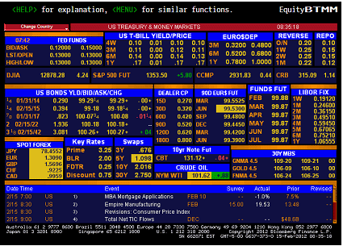

Algorithmic trading, commonly known as algo trading, has markedly transformed the landscape of financial markets. This form of trading employs sophisticated computer algorithms to automate and streamline trading processes. By eliminating human limitations such as emotion and fatigue, algo trading allows for higher speed and accuracy in executing trades. This technology-driven approach enhances efficiency, reduces transaction costs, and capitalizes on market opportunities that may be imperceptible to the human trader.

Bloomberg, a preeminent force in financial data and analytics, serves as a cornerstone in the algo trading ecosystem. Through its Bloomberg Terminal, it offers a wealth of real-time data, analytics, and trading tools that are indispensable for traders and financial institutions. The platform's robust infrastructure supports the development, execution, and optimization of trading strategies, enabling users to manage their trading activities effectively and efficiently.

This article investigates into Bloomberg's substantial contributions and widespread influence on algorithmic trading. We examine how its suite of state-of-the-art technologies assists traders in refining their strategies and adapting to complex financial markets. From providing data analytics to enabling seamless integration with trading systems, Bloomberg equips traders with the essential tools needed for success in today's fast-paced trading environment.

For both novice and expert traders, understanding Bloomberg’s offerings in algorithmic trading is crucial. Leveraging these technologies not only enhances their trading strategies but also ensures they remain competitive. As financial markets continue to evolve, the ability to utilize advanced technological solutions like those offered by Bloomberg will be pivotal. This article outlines the key aspects that firmly position Bloomberg as a leader in the field of algorithmic trading.

## Table of Contents

## Role of Bloomberg in Algo Trading

Bloomberg Terminal is a crucial asset for traders engaged in [algorithmic trading](/wiki/algorithmic-trading), supplying them with essential real-time data, robust analytics, and efficient trading tools. The Bloomberg Terminal provides comprehensive market data, which is vital in crafting and refining trading algorithms designed to optimize financial market interactions. This extensive data includes, but is not limited to, asset prices, trading volumes, and news feeds. Traders can leverage this rich dataset to create algorithms that react quickly to market changes, potentially maximizing their trading effectiveness.

In addition to data provision, Bloomberg offers powerful application programming interfaces (APIs), most notably the Bloomberg API. These APIs enable traders to seamlessly integrate Bloomberg’s extensive data sources into their proprietary trading systems. This integration facilitates the automation of trading processes, streamlining the management of large datasets, and provides access to historical data, technical indicators, and other analytics needed for informed decision-making.

Bloomberg’s technology supports several stages of algorithmic trading, particularly in strategy development, execution, and risk management. During strategy development, Bloomberg Terminals help traders analyze historical market data to identify trends and patterns. This analysis assists in constructing predictive models and algorithms that can automatically execute trades based on predefined criteria. 

For execution, Bloomberg’s platform offers execution management capabilities that allow traders to automate the buying and selling of securities. This ensures that trades are executed at optimal times and prices, reducing transaction costs and increasing potential profit margins. The platform’s real-time analytics and alerts also contribute to high-frequency trading environments, where decisions need to be made and acted upon swiftly.

Risk management is another critical phase supported by Bloomberg’s tools. The analytics features enable traders to quantify risks and assess the impact of their strategies under different market conditions. Traders can simulate various market scenarios to understand potential outcomes and adjust their strategies accordingly to mitigate risk exposure.

Moreover, Bloomberg alerts are a notable feature that enhances decision-making capabilities. These alerts provide immediate notifications of market changes or specific conditions that meet predefined parameters, allowing traders to react promptly. This feature is invaluable in high-frequency trading, where the speed of reaction to market events can significantly influence the success of trading strategies.

In summary, Bloomberg plays an integral role in algorithmic trading by offering a comprehensive suite of data and tools that assist traders in developing, executing, and refining their trading strategies effectively. Leveraging Bloomberg's vast data and technology capabilities, traders can gain a competitive edge in the fast-paced world of financial markets.

## Bloomberg’s Algorithmic Trading Products and Services

Bloomberg offers a range of products and services specifically designed for algorithmic trading, enabling traders to execute and manage trades efficiently. One significant tool in Bloomberg's arsenal is the Execution Management Systems (EMSX). EMSX facilitates automation and management of trade executions across multiple asset classes. It provides traders with advanced functionalities such as order routing, trade execution, and post-trade analysis, ensuring optimal execution performance and streamlined operations. The platform also integrates seamlessly with other Bloomberg systems and external trading platforms, offering a comprehensive solution for traders seeking connectivity across diverse trading environments.

Another essential product is Bloomberg AIM (Asset and Investment Manager), which caters to the complex needs of asset managers and investment professionals. AIM provides an end-to-end solution that incorporates portfolio management, order management, and risk analytics. It helps users navigate intricate market conditions by offering tools for strategy development, performance measurement, and compliance management. The integration within Bloomberg’s ecosystem ensures that users have access to real-time data and analytics, enhancing decision-making processes in fast-moving markets.

Bloomberg's products are designed to integrate smoothly with various trading technologies and platforms, fostering a holistic trading ecosystem. By leveraging Bloomberg's APIs, traders can incorporate Bloomberg's data and analytics into their proprietary trading systems, creating customized solutions that meet specific trading requirements. This integration flexibility allows firms to maintain a competitive edge, responding swiftly to market changes and executing strategies efficiently.

Case studies from industry experts illustrate how leveraging Bloomberg's products can provide a competitive advantage. For instance, traders have reported enhanced execution quality and increased operational efficiency by using EMSX's comprehensive suite of trading tools. Similarly, asset managers utilizing Bloomberg AIM have achieved greater insights into portfolio performance and risk management through its robust analytics capabilities.

Overall, Bloomberg's suite of algorithmic trading products and services supports traders throughout the trading lifecycle, from strategy development to execution and post-trade analysis, contributing to more informed and effective trading strategies.

## Impact of Bloomberg Analytics on Trading Strategies

Bloomberg's analytical tools play a crucial role in shaping sophisticated trading strategies by providing an extensive suite of capabilities essential for developing, testing, and refining trading models. One of the flagship analytical platforms offered by Bloomberg is the Bloomberg Quant Platform (BQuant). BQuant is designed for quantitative analysts and data scientists who focus on building and testing complex trading algorithms. It leverages Bloomberg's extensive data environment, allowing users to utilize both real-time and historical data in their algorithmic models. This integration facilitates rigorous [backtesting](/wiki/backtesting), a process where trading strategies are tested using historical data to evaluate their potential performance.

Real-time and historical data available on the Bloomberg Terminal serve as the backbone for backtesting and optimizing trading algorithms. The quality and breadth of Bloomberg's data allow traders to conduct comprehensive analyses that can identify market trends, optimize entry and [exit](/wiki/exit-strategy) points, and fine-tune risk management strategies. By employing various statistical and [machine learning](/wiki/machine-learning) techniques, traders can derive insights that help enhance the robustness and efficiency of their trading models.

Several successful trading models have been developed with Bloomberg's analytical capabilities. For instance, [quantitative trading](/wiki/quantitative-trading) firms often utilize Bloomberg's data sets to create predictive models that anticipate stock price movements or [volatility](/wiki/volatility-trading-strategies) changes. By incorporating machine learning algorithms, these models can adapt to evolving market conditions, thus maintaining a competitive edge.

Insights from traders who have integrated Bloomberg analytics into their workflows highlight the platform's effectiveness in enriching decision-making processes. Access to real-time data analytics allows traders to promptly adjust their strategies in response to market movements. Advanced charting tools and custom alerts further enable traders to monitor key indicators and optimize their positions dynamically.

By utilizing Bloomberg's comprehensive analytics suite, traders can not only create sophisticated trading strategies but also continuously improve them through iterative testing and data-driven refinements. This capability makes Bloomberg an indispensable ally for traders striving to achieve high performance and adaptability in the fast-paced financial markets.

## Bloomberg’s Innovations and Future in Algo Trading

Bloomberg continues to play a critical role in shaping the future of algorithmic trading through its ongoing innovations, particularly in the integration of [artificial intelligence](/wiki/ai-artificial-intelligence) (AI) and machine learning. These technologies are increasingly central to refining algo trading strategies and enhancing the decision-making process for traders and financial institutions.

AI and machine learning are transforming Bloomberg's strategy by enabling the development of more sophisticated algorithms capable of analyzing large volumes of data in real time. These technologies facilitate pattern recognition, anomaly detection, and predictive analytics, thereby improving the accuracy and efficiency of trading models. For instance, machine learning algorithms can analyze past trading data to predict future market trends, allowing traders to make informed decisions faster than ever before.

The future of algorithmic trading is likely to be dominated by trends such as increased automation, greater reliance on AI-driven analytics, and the incorporation of [alternative data](/wiki/best-alternative-data) sources. Bloomberg is positioning itself to adapt to these changes by continually updating its platforms to integrate the latest technological advancements. The company's commitment to innovation ensures that its services remain at the forefront of financial technology.

Despite these advancements, Bloomberg faces several challenges and opportunities in the evolving landscape of financial technology. One significant challenge is the requirement to maintain data security and privacy, which becomes increasingly difficult as trading systems grow more complex. Additionally, regulatory compliance is a critical concern, with financial authorities closely monitoring the use of AI in trading activities.

Opportunities for Bloomberg include expanding its partnerships with tech firms to leverage shared expertise in AI and machine learning, as well as exploring new markets where these technologies can be applied to trading. By continuing to innovate and adapt, Bloomberg can enhance its offerings and solidify its leadership in the market.

Industry thought leaders emphasize Bloomberg's potential to significantly impact the future of algorithmic trading. By integrating advanced technologies into its platforms and maintaining a strong focus on innovation, Bloomberg is well-positioned to set new standards in financial trading. The company's proactive approach to adapting to emerging trends and challenges ensures its continued relevance in a rapidly changing financial landscape.

## Conclusion

Bloomberg has proven itself to be a cornerstone in the algorithmic trading industry by providing an extensive suite of tools and resources that are crucial for modern traders. The Bloomberg Terminal, a flagship offering, integrates real-time data, comprehensive analytics, and sophisticated trading tools that help market participants to craft efficient and effective trading strategies. These platforms offer a robust framework that caters to a wide range of trading needs, from developing algorithms to executing trades seamlessly.

Traders are encouraged to continue utilizing Bloomberg's platforms to stay ahead in the rapidly evolving markets. The rich functionalities provided by tools like the Bloomberg Execution Management Systems (EMSX) and Bloomberg AIM not only simplify complex trading operations but also offer competitive advantages through enhanced execution capabilities and advanced risk management.

The dynamic nature of financial markets presents constant challenges and opportunities. Bloomberg plays a pivotal role in helping traders navigate these changes with confidence. Its commitment to innovation ensures that its tools remain at the cutting edge, adapting to new technological advancements such as artificial intelligence and machine learning. These innovations further empower traders to refine their strategies and gain deeper insights through powerful analytical capabilities.

Ultimately, Bloomberg remains at the forefront of innovation in financial technology and trading. By consistently advancing its platforms and services, it continues to support traders in achieving their goals and adapting to the ever-shifting landscape of global markets. As Bloomberg maintains its leadership in this domain, traders can look forward to a future where technology and finance intersect more seamlessly than ever before.

## References & Further Reading

[1]: ["Advances in Financial Machine Learning"](https://www.amazon.com/Advances-Financial-Machine-Learning-Marcos/dp/1119482089) by Marcos Lopez de Prado

[2]: ["Evidence-Based Technical Analysis: Applying the Scientific Method and Statistical Inference to Trading Signals"](https://www.amazon.com/Evidence-Based-Technical-Analysis-Scientific-Statistical/dp/0470008741) by David Aronson

[3]: ["Machine Learning for Algorithmic Trading"](https://github.com/PacktPublishing/Machine-Learning-for-Algorithmic-Trading-Second-Edition) by Stefan Jansen

[4]: ["Quantitative Trading: How to Build Your Own Algorithmic Trading Business"](https://books.google.com/books/about/Quantitative_Trading.html?id=j70yEAAAQBAJ) by Ernest P. Chan

[5]: Bergstra, J., Bardenet, R., Bengio, Y., & Kégl, B. (2011). ["Algorithms for Hyper-Parameter Optimization."](https://dl.acm.org/doi/10.5555/2986459.2986743) Advances in Neural Information Processing Systems 24.