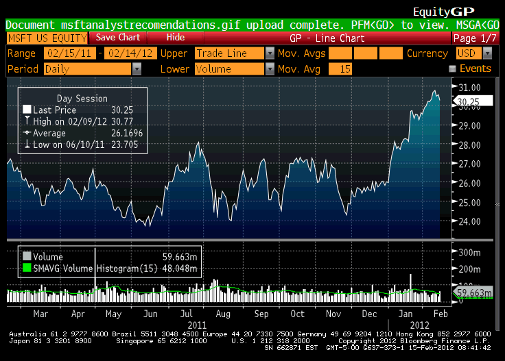

In the rapidly evolving world of finance, maintaining accurate and detailed records is crucial for effective trading operations. The complexity and speed of today's financial markets demand that traders have access to precise information to make informed decisions. This article examines the importance of blotter financial records in algorithmic trading, offering valuable insights for both traders and investors.

Blotter financial records play a crucial role in the trading ecosystem, functioning as real-time logs where transactions are meticulously recorded. Traders rely on these records to monitor trades, assess performance, and adhere to regulatory requirements. As financial regulations become stricter, ensuring compliance through accurate record-keeping has become increasingly important. Regulatory bodies worldwide stipulate stringent documentation standards, underscoring the necessity for traders to maintain thorough and precise records. Blotter records provide credibility and transparency in trading activities, making them indispensable for meeting such standards.



Algorithmic trading, often termed algo trading, has transformed the trading landscape by utilizing automated systems to execute trades based on predefined criteria and quantitative analysis. This form of trading necessitates exceptional precision and reliability in record-keeping to ensure that trading algorithms function as intended. The integration of blotter records with these systems is critical for the seamless operation and optimization of trading strategies. As algorithms analyze historical and real-time data to make trading decisions, the integrity of financial records directly impacts the algorithm's performance and effectiveness.

With the rapid advancements in technology, the methods and tools used for maintaining financial records continuously evolve. Innovations in software and data analysis are providing traders with more sophisticated tools to manage and analyze blotter data. The transition from traditional paper blotters to digital formats allows for easier access, manipulation, transmission, and analysis of trading data. Modern technologies, such as artificial intelligence and machine learning, are further enhancing the capabilities of traders by offering predictive analytics and automated data management solutions.

In conclusion, blotter financial records are essential components in the architecture of modern finance, particularly in algorithmic trading. As technology continues to advance, traders and firms must remain adaptable, leveraging new tools and methodologies to ensure accurate and efficient record-keeping. This continuous evolution not only helps in optimizing trading strategies but also ensures compliance and competitive advantage in the financial industry.

## Table of Contents

## What are Blotter Financial Records?

A blotter, in financial contexts, is a critical tool used for documenting and tracking trading transactions by brokerage firms or individual traders. These records serve as a comprehensive repository of trading activity, capturing essential details such as buy and sell orders, transaction volumes, prices, time of execution, and other pertinent information. The fundamental purpose of a blotter is to verify trade details, reconcile accounts, and provide evidence in the event of disputes or audits.

Historically, blotters were maintained on paper, which involved manually entering and cross-checking information. This method was not only time-consuming but also prone to human error. With the advent of technology, the process has transitioned to digital platforms, allowing for easier access, manipulation, and transmission of data. Digital blotters can automatically pull data from electronic trading platforms, which enhances accuracy and reduces the likelihood of discrepancies.

The structure of a blotter can vary, but it typically includes fields for trade identifiers, timestamps, counterparty information, and status indicators of each trade. This structured approach ensures that all relevant information is systematically organized and readily available for analysis or reporting.

Understanding how blotters function is key to grasping the intricacies of market activities and developing informed trading strategies. By providing a real-time view of trading activity, blotters enable traders to monitor their positions, assess market movements, and make timely decisions. The data recorded in blotters can also be used in post-trade analysis to identify patterns, assess risk exposure, and optimize trading strategies.

In recent years, technological advances have further enhanced the capabilities of blotters. Integration with sophisticated trading algorithms and data analytics tools has made it possible to automate the recording and monitoring of trades. This integration not only improves efficiency but also aids in the compliance with regulatory requirements by ensuring that all relevant data is captured and stored accurately.

Overall, blotter financial records are indispensable for maintaining the integrity and efficiency of trading operations, particularly in environments reliant on high-frequency trading and complex financial instruments. By leveraging digital technology, traders and firms can enhance their ability to track, analyze, and optimize their trading activities effectively.

## The Role of Blotters in Algo Trading

Algorithmic trading, often referred to as algo trading, leverages automated systems to execute trades based on predefined criteria and quantitative data. These systems require highly accurate and timely information to function optimally, making blotter financial records indispensable. Blotters provide a real-time snapshot of trading activities, enabling algo trading systems to analyze performance and execute decisions swiftly and efficiently.

Blotters detail buy and sell orders, executed volumes, prices, and times, offering essential insights into the activities of a trading day. In [algorithmic trading](/wiki/algorithmic-trading), where speed is paramount, these records ensure that algorithms operate within set parameters, substantially reducing the risk of critical errors that might arise from outdated or inaccurate data.

Moreover, blotters can be seamlessly integrated with algorithmic trading systems, facilitating a smooth flow of information. This integration allows for rapid decision-making and execution, which is crucial in a competitive trading environment. The interface between blotters and trading systems helps in maintaining consistency and accuracy, ensuring that the trading algorithm can react to market changes on a moment's notice.

Consistent monitoring of blotter data is essential in refining and adjusting algorithms to improve trading strategies. By reviewing blotter records, traders can gain insights into the effectiveness of their trading strategies and make necessary adjustments to optimize performance. This continuous feedback loop is vital for the evolution and improvement of trading algorithms, helping traders stay ahead in a dynamic market.

In summary, blotters play a critical role in algorithmic trading by providing the necessary infrastructure for real-time monitoring and decision-making. Their accuracy and integration with trading systems help maintain operational efficiency and competitive edge. Through continual interaction with these records, traders can fine-tune their strategies, ultimately enhancing their trading operations.

## Importance of Accurate Financial Records

Maintaining precise financial records is of paramount importance in the trading industry, serving not only as a regulatory obligation but also as a crucial component for effective trading practices. Accurate financial records enable traders to meticulously track and report profits and losses, which is vital for making informed strategic adjustments. These records provide a precise accounting of each trade, ensuring that any discrepancies are promptly addressed. This is essential for maintaining the financial integrity of trading operations.

For algorithmic traders, the importance of data integrity in financial records cannot be overstated. Algorithms depend on reliable data to function correctly, as inaccuracies can lead to suboptimal trading decisions and potential financial losses. Ensuring the reliability of these algorithms means that the data they process must be free from errors. High-quality data allows for the fine-tuning of algorithms, improving their performance and the success rates of trades executed.

Errors in financial records can have severe consequences, including inaccuracies in financial reporting. Such errors can lead to regulatory penalties, as compliance with financial regulations is mandatory. Misreporting financial information not only risks financial penalties but can also damage a firm's reputation and standing with regulatory bodies and clients. Furthermore, strategic mishaps resulting from erroneous records can lead to significant financial losses and missed opportunities.

Recognizing the critical nature of accurate financial records, firms allocate considerable resources to ensure that the systems used to maintain these records are both robust and efficient. This investment typically includes employing advanced technologies and software solutions designed to enhance data accuracy and facilitate seamless integration with trading platforms. Employing technologies such as [machine learning](/wiki/machine-learning) and [artificial intelligence](/wiki/ai-artificial-intelligence) can further improve the integrity and efficiency of record-keeping processes.

In summary, the maintenance of accurate financial records underpins the successful operation of trading activities, allowing for precise tracking and strategic planning while ensuring compliance with regulatory standards. By investing in robust systems for record maintenance, firms enhance their operational integrity and competitive edge in the financial markets.

## Challenges in Blotter Records for Algo Trading

Maintaining accurate and up-to-date blotter records in algorithmic trading presents several inherent challenges, particularly in the context of high-frequency trading environments where trades are executed in fractions of a second. Firstly, discrepancies between executed trades and blotter entries are not uncommon. These inaccuracies can stem from network latency, system glitches, or human error, making continual system checks a necessity to ensure consistency and accuracy in trade records.

The nature of high-frequency trading further compounds this issue. The need for exceptionally fast and reliable data recording is imperative to match the rapid execution speeds. Even minor delays or errors in recording trades can lead to significant operational and financial discrepancies over time. This underscores the importance of robust and resilient infrastructure capable of handling vast amounts of data without compromising speed or accuracy.

Integration of blotter data across diverse technology stacks and trading platforms also introduces technical challenges. Algo trading systems often need to communicate and interact with multiple platforms that may use different protocols and data formats. Ensuring seamless interoperability between these systems is crucial, demanding sophisticated middleware solutions and API integrations to bridge gaps and facilitate smooth data flow.

Additionally, adapting to regulatory changes is a constant concern for firms involved in algorithmic trading. Regulatory agencies frequently update requirements related to trade reporting and information sharing, necessitating that systems capturing and storing blotter data are agile enough to accommodate new compliance demands. This requires ongoing updates to software systems and practices to remain aligned with the latest regulations, thus preventing potential penalties or operational disruptions.

Addressing these challenges requires a multi-faceted approach, involving the deployment of advanced technological solutions, regular audits, and updates to systems, and adherence to industry best practices in data management and regulatory compliance.

## Technology's Role in Improving Blotter Records

In the context of algorithmic trading, technology has significantly advanced the capacity to maintain accurate blotter records, mitigating the risks and inefficiencies that were once inherent to manual record-keeping. One of the primary technological contributions is the development of advanced software solutions that cater specifically to the needs of algorithmic traders. These software systems are equipped with sophisticated features allowing real-time monitoring and logging of trades, ensuring that traders have access to up-to-date and accurate data.

Artificial intelligence (AI) and machine learning (ML) have become substantial players in enhancing blotter functionality. These technologies are applied in analyzing and predicting trading patterns, offering invaluable insights that enable traders to refine their strategies and decision-making processes. For instance, AI-driven models can detect anomalies in trading patterns signifying potential errors in records or discrepancies that might need reconciliation. Python libraries such as TensorFlow and Scikit-learn are commonly employed to build such predictive models:

```python
import numpy as np
from sklearn.ensemble import RandomForestClassifier
from sklearn.model_selection import train_test_split

# Example of using Random Forest to predict trading anomalies
# Assume X is the feature set and y is the labels indicating anomalies

X_train, X_test, y_train, y_test = train_test_split(X, y, test_size=0.3, random_state=42)

model = RandomForestClassifier(n_estimators=100, random_state=42)
model.fit(X_train, y_train)

predictions = model.predict(X_test)
```

Moreover, blockchain technology is under exploration for its potential to furnish tamper-proof and transparent trading records. The decentralized and immutable nature of blockchain offers a robust framework for securing financial transactions, enabling traders to maintain a verifiable chain of transaction history that is resistant to unauthorized modifications.

Cloud technologies have also gained traction as firms invest in them for improved data storage, access, and security. Cloud-based solutions offer scalable infrastructure that accommodates vast volumes of trading data, ensuring that blotter records are not only stored securely but also accessible from different geographic locations with minimal latency. Services like Amazon Web Services (AWS) or Google Cloud Platform (GCP) support traders in efficiently handling resource-intensive operations and data analytics processes, promoting a seamless integration with trading systems.

These technological advancements emphasize the commitment of the financial industry to leverage modern solutions for enhancing the reliability and efficiency of blotter records, aligning with the broader goals of accuracy, compliance, and strategic decision-making in trading operations.

## Conclusion

Blotter financial records are indispensable tools in modern trading environments, particularly in algorithmic trading. These records serve as a critical lynchpin, verifying, reconciling, and optimizing trading transactions with high precision. This verification process ensures that trade details align with executed orders, mitigating discrepancies and enhancing operational integrity. Reconciliation further allows for the seamless balancing of accounts, aiding in the detection and rectification of any inconsistencies promptly.

As technology advances, traders and firms face the necessity of adaptation and innovation to maintain accurate and efficient record-keeping. The financial industry's landscape is characterized by rapid technological changes, demanding real-time data handling and swift decision-making processes. The integration of advanced technologies, such as artificial intelligence and machine learning, presents unprecedented opportunities for optimizing blotter maintenance. These technologies facilitate predictive analytics and anomaly detection, significantly enhancing the efficiency and accuracy of algorithmic trading systems.

Moreover, the commitment to continuously refining these systems not only boosts competitive advantage but also ensures compliance with regulatory standards. Compliance is pivotal, as it safeguards against legal repercussions and fosters trust within the market. Firms that invest in cutting-edge technologies and robust record-keeping systems position themselves favorably in the competitive landscape, leveraging data accuracy and system reliability to excel.

In conclusion, the advancement and meticulous upkeep of blotter financial records are essential to the success and sustainability of trading operations. By embracing technological innovations and prioritizing strategic enhancements, firms can achieve remarkable improvements in their algorithmic trading activities, ultimately driving growth and ensuring compliance in the financial industry.

## References & Further Reading

[1]: Bergstra, J., Bardenet, R., Bengio, Y., & Kégl, B. (2011). ["Algorithms for Hyper-Parameter Optimization."](https://papers.nips.cc/paper/4443-algorithms-for-hyper-parameter-optimization) Advances in Neural Information Processing Systems 24.

[2]: ["Advances in Financial Machine Learning"](https://www.amazon.com/Advances-Financial-Machine-Learning-Marcos/dp/1119482089) by Marcos Lopez de Prado

[3]: ["Evidence-Based Technical Analysis: Applying the Scientific Method and Statistical Inference to Trading Signals"](https://www.amazon.com/Evidence-Based-Technical-Analysis-Scientific-Statistical/dp/0470008741) by David Aronson

[4]: ["Machine Learning for Algorithmic Trading"](https://github.com/stefan-jansen/machine-learning-for-trading) by Stefan Jansen

[5]: ["Quantitative Trading: How to Build Your Own Algorithmic Trading Business"](https://books.google.com/books/about/Quantitative_Trading.html?id=j70yEAAAQBAJ) by Ernest P. Chan