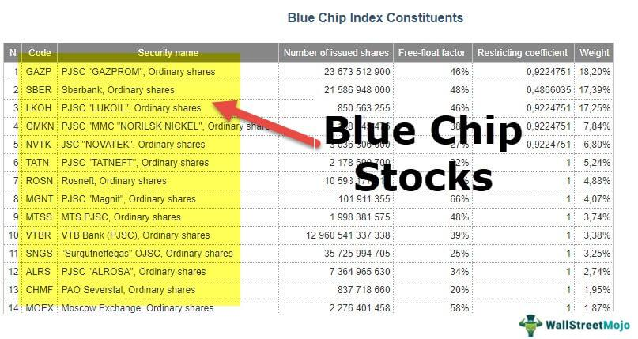

In investing, understanding the intricacies involved in Blue-Chip Index investments is crucial for ensuring stable and reliable returns. Blue-chip stocks, known for their established reputation and consistent performance, are often equated with reliability and steady growth, which makes them an attractive option for investors. These stocks are typically from well-established companies with strong financial performance, making them less volatile than other types of stocks.

In recent years, the significance of blue-chip indexes has grown, serving as benchmarks for measuring the performance of stock market segments or entire economies. An essential aspect of navigating the stock market is recognizing how algorithmic trading has become an integral component, affecting how stocks, particularly blue-chip stocks, are bought and sold. This systemized method of trading utilizes advanced computer programs to execute trades at speeds and efficiencies beyond human capability, thus reshaping the investment landscape.



This article will explore multiple facets of blue-chip indexes, their importance in investment strategies, and the influential role of algorithmic trading in modern stock market investments. By leveraging these elements, investors can make informed decisions to suit their investment goals, risk tolerance, and aspiration for stable financial growth.

## Table of Contents

## What is a Blue-Chip Index?

A Blue-Chip Index is a financial market indicator that monitors the performance of shares from well-established and financially robust companies, recognized as blue-chip stocks. These companies are distinguished by their reliable track records of generating consistent returns, often appealing to conservative investors seeking stability and growth over the long term. Blue-chip stocks typically belong to large-cap corporations with a reputation for quality, reliability, and the ability to operate profitably in various economic conditions.

Prominent blue-chip indexes such as the S&P 500 and the Dow Jones Industrial Average (DJIA) serve as critical benchmarks for the stock market. They often act as barometers of the overall health of industries or even entire economies. The S&P 500 comprises 500 of the largest companies listed on stock exchanges in the United States, offering a broad reflection of the U.S. economy. In contrast, the DJIA includes 30 significant publicly traded companies based in the United States and focuses on a diverse range of industries. Despite tracking fewer stocks than the S&P 500, the DJIA remains one of the oldest and most recognized indexes worldwide.

These indices are essential tools for investors looking to gauge market trends and business cycles. They reflect aggregate market movements and individual stock performances, assisting investors in making informed decisions. Additionally, blue-chip indexes provide a reliable framework for structuring investment products like index funds and exchange-traded funds (ETFs), allowing investors to partake in the financial prosperity often associated with these leading corporations.

## Benefits of Investing in a Blue-Chip Index

Blue-chip indexes provide investors with a diversified portfolio comprised of stable stocks, primarily of large, established companies known for their financial reliability. This diversification helps mitigate risk because the performance of individual stocks has a lesser impact on the overall investment. Furthermore, blue-chip companies often have a history of consistent performance, providing investors with modest but reliable dividend payments and long-term growth. Dividends are a significant aspect of blue-chip investments; these regular payments can be reinvested or used as a source of income, contributing to the overall return on investment. 

Investing in blue-chip indexes is often facilitated through Exchange-Traded Funds (ETFs) or index funds. These investment vehicles offer a cost-effective method of gaining access to a broad range of blue-chip stocks without the need to purchase each stock individually. The management fees associated with ETFs and index funds are generally lower than those of actively managed mutual funds, making them an attractive option for cost-conscious investors. Additionally, both ETFs and index funds provide [liquidity](/wiki/liquidity-risk-premium), allowing investors to buy or sell shares on an exchange throughout the trading day. This liquidity, combined with the diversification and lower costs, makes investing in blue-chip indexes through ETFs or index funds an appealing strategy for those seeking stable returns in the stock market.

## How Algorithmic Trading Influences the Stock Market

Algorithmic trading has become an integral component of modern financial markets, transforming the way trades are executed. This trading style employs sophisticated computer algorithms to automate the trading process, thereby enhancing efficiency and precision. By analyzing vast datasets at remarkable speeds, algorithms can identify patterns and opportunities that might be missed by human traders.

The primary advantage of [algorithmic trading](/wiki/algorithmic-trading) is its ability to execute trades at a speed and frequency that far surpasses human capabilities. For instance, trades can be executed within milliseconds, which is crucial in markets where conditions can change in the blink of an eye. Algorithmic trading systems utilize various strategies, such as [market making](/wiki/market-making), statistical [arbitrage](/wiki/arbitrage), and [trend following](/wiki/trend-following), to capitalize on subtle price movements.

In addition, these algorithms allow for minimal latency, enhancing the potential for capturing optimal prices. The precision of algorithmic trading extends to the exact timing, pricing, and [volume](/wiki/volume-trading-strategy) of orders, minimizing human errors and mitigating risks associated with manual trading. This is particularly advantageous for blue-chip stock investments, where timely decisions based on real-time data can be pivotal.

```python
# Example pseudo code for a basic algorithmic trading strategy
def moving_average_strategy(prices, short_window, long_window):
    # Calculating short and long moving averages
    short_moving_avg = prices.rolling(window=short_window, min_periods=1).mean()
    long_moving_avg = prices.rolling(window=long_window, min_periods=1).mean()

    # Generating trading signals based on moving averages
    # Buy signal when short-term moving average crosses above the long-term moving average
    # Sell signal when short-term moving average crosses below the long-term moving average
    signals = (short_moving_avg > long_moving_avg).astype(int) - (short_moving_avg < long_moving_avg).astype(int)

    return signals

# Example usage:
import pandas as pd

# Sample price data
prices = pd.Series([100, 102, 104, 103, 105, 108, 107, 109])
signals = moving_average_strategy(prices, short_window=2, long_window=3)
print(signals)  # Output will show buy(1) and sell(-1) signals
```

Algorithmic trading also facilitates high-frequency trading ([HFT](/wiki/high-frequency-trading-strategies)), where a high volume of trades is executed very quickly in order to capture small price inefficiencies. The ability to process information swiftly and make rapid trading decisions empowers investors to optimize their portfolios efficiently.

For blue-chip investments, algorithmic trading systems can incorporate data such as earnings reports, market sentiment, and macroeconomic indicators, enabling more informed and agile investment decisions. This strategic advantage is instrumental in achieving consistent returns in the traditionally stable yet competitive landscape of blue-chip stocks.

## Special Considerations with Blue-Chip Investments

Blue-chip indexes like the Dow Jones Industrial Average (DJIA) are composed of a select group of well-established companies, typically encompassing around 30 stocks. This relatively narrow focus can restrict the breadth of sector and company exposure compared to more comprehensive indices like the S&P 500, which includes 500 companies from a broader range of industries. Consequently, while blue-chip stocks are generally known for their stability and reliability, they may not capture the rapid growth found in emerging sectors or smaller, high-growth companies that are excluded from such indices.

The structure of blue-chip indexes inherently prioritizes stability over rapid expansion, often missing opportunities in burgeoning industries like technology or renewable energy, which can exhibit significant short-term growth potential. This limitation could mean that investors focusing solely on blue-chip stocks are not fully capitalizing on potential gains available in these rapidly evolving sectors. Consequently, investors looking for a balanced approach to asset growth and stability may consider diversifying their portfolios.

For investors seeking a more extensive market exposure, broader indices like the S&P 500 offer inclusion of a more expansive array of sectors and company sizes. Additionally, individuals may complement their blue-chip investments by integrating other asset classes such as small-cap stocks, which often include companies at earlier stages of growth with the potential for higher returns, albeit with increased risk.

Investors must thoughtfully balance between the security offered by blue-chip stocks and the dynamic growth prospects available in broader or sector-specific investments. By diversifying their investments across various asset classes and indices, investors can mitigate risks associated with limited exposure and potentially enhance portfolio performance.

## The Role of ETFs in Blue-Chip Investment Strategies

Exchange-Traded Funds (ETFs) play a significant role in blue-chip investment strategies due to their structural benefits and ease of access. Blue-chip ETFs, like the SPDR S&P 500 and iShares Core S&P 500, replicate the performance of blue-chip indexes by holding a portfolio that closely mirrors the index constituents. This approach provides investors exposure to a diversified basket of financially robust companies, characteristic of blue-chip stocks.

One of the primary advantages of ETFs is their flexibility. Unlike mutual funds, which are priced once per day, ETFs can be traded on exchanges throughout the trading day, allowing investors to react promptly to market changes. This intra-[day trading](/wiki/day-trading-spy) capability imparts a higher degree of flexibility for managing portfolios in volatile markets.

Liquidity is another attractive feature of ETFs. Since they are traded on major exchanges, ETFs typically offer high liquidity, ensuring that investors can enter or [exit](/wiki/exit-strategy) positions with relative ease and minimal impact on the market price. This liquidity also contributes to tighter bid-ask spreads, which can lower overall transaction costs.

Cost efficiency is a notable advantage of ETFs over mutual funds. Generally, ETFs have lower expense ratios due to their passive management style. By tracking an index, these funds incur fewer costs related to active management and research, enabling savings that are often passed on to investors in the form of lower management fees.

ETFs also simplify the diversification process. By purchasing shares of a single [ETF](/wiki/etf-trading-strategies), investors gain exposure to all the stocks within the index it tracks. This approach eliminates the need to buy shares of individual companies, saving time and reducing complexity in portfolio construction. Furthermore, this diversification can help mitigate idiosyncratic risk—the risk associated with individual stocks—thereby enhancing the stability of the investment.

Overall, ETFs like SPDR S&P 500 and iShares Core S&P 500 provide an accessible, cost-effective, and efficient means for investors to engage in blue-chip investment strategies. These investment vehicles allow for seamless exposure to a broad spectrum of stable, high-quality companies, aligning with the financial goals of those seeking stability and growth potential.

## Conclusion

Blue-chip indexes serve as a foundational element in constructing a robust investment portfolio, offering investors a blend of stability and predictable returns. These indexes typically comprise large, well-established companies with a history of financial reliability, making them a prudent choice for those seeking to mitigate risk while securing steady growth.

Incorporating algorithmic trading into blue-chip stock investments can further refine investment strategies by enhancing diversification and operational efficiency. Algorithmic trading employs complex algorithms for automated trading, capitalizing on market opportunities with precision and speed that are unattainable through manual trading. This approach optimizes execution, reduces transaction costs, and facilitates a more systematic investment process.

Additionally, Exchange-Traded Funds (ETFs), which track blue-chip indexes, provide investors with a convenient and cost-effective method to access a broad spectrum of blue-chip stocks. ETFs offer the advantages of flexibility, liquidity, and reduced management fees, unlike traditional mutual funds. By enabling investors to engage with a comprehensive collection of blue-chip stocks through a single investment vehicle, ETFs simplify portfolio management and contribute to diversified asset allocation.

Investors should carefully consider their unique financial goals and risk tolerance levels when applying blue-chip indexes, algorithmic trading, and ETFs to their investment portfolios. Balancing these elements can lead to a well-rounded strategy that leverages the strengths of blue-chip stability, technological trading advancements, and efficient fund structures, ultimately fostering long-term financial growth.

## References & Further Reading

[1]: ["Standard & Poor's 500 Index (S&P 500)"](https://www.spglobal.com/spdji/en/indices/equity/sp-500/) by S&P Dow Jones Indices

[2]: ["Dow Jones Industrial Average (DJIA) History"](https://finance.yahoo.com/quote/%5EDJI/history/) by Investopedia

[3]: Jamde, V., & Sengupta, S. (2016). ["Algorithmic Trading: A Primer"](https://assets.cambridge.org/97811070/91146/frontmatter/9781107091146_frontmatter.pdf) in ResearchGate.

[4]: Kissell, R. (2013). ["The Science of Algorithmic Trading and Portfolio Management"](https://www.sciencedirect.com/book/9780124016897/the-science-of-algorithmic-trading-and-portfolio-management) by Academic Press

[5]: ["A Review of the S&P 500 Index and the Dow Jones Industrial Average"](https://www.investopedia.com/ask/answers/difference-between-dow-jones-industrial-average-and-sp-500/) by CFA Institute

[6]: ["The Handbook of Equity Market Anomalies: Translating Market Inefficiencies into Effective Investment Strategies"](https://www.amazon.com/Handbook-Equity-Market-Anomalies-Inefficiencies/dp/0470905905) by Leonard Zacks

[7]: Aldridge, I. (2013). ["High-Frequency Trading: A Practical Guide to Algorithmic Strategies and Trading Systems"](https://www.amazon.com/High-Frequency-Trading-Practical-Algorithmic-Strategies/dp/1118343506) by Wiley 

[8]: ["Understanding Blue-Chip Stocks"](https://www.investopedia.com/terms/b/bluechipstock.asp) by Forbes