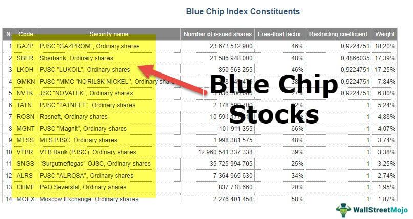

In today's dynamic financial environment, understanding investment options in the stock market is crucial for optimizing returns. Investors face a myriad of opportunities and challenges as they navigate through a landscape that is continuously evolving with technological advancements and economic shifts. Among these options, blue chip stocks and algorithmic trading have emerged as pivotal strategies for many investors seeking to balance stability with efficiency.

Blue chip stocks, known for their reliability and resilience, attract investors looking for stable growth and assured dividends. These companies are renowned for their solid financials, established market presence, and ability to weather economic fluctuations. On the other hand, algorithmic trading leverages technology to automate and enhance trading efficiency. By employing complex algorithms and data-driven strategies, this form of trading optimizes decision-making, allowing investors to capitalize on market movements with speed and precision.



This article aims to explore how these investment options can enhance your portfolio by providing both stability and optimized timing in trade executions. By combining the traditional roots of blue chip investments with the precision and agility of algorithmic techniques, investors can achieve a more balanced and dynamic investment strategy.

As financial markets become more interconnected and complex, understanding the synergies between these two approaches is increasingly vital. This article invites you to explore how blending time-tested investment vehicles with innovative trading technologies can offer new avenues for growth while managing risks in an ever-changing market landscape.

## Table of Contents

## Understanding the Stock Market

The stock market is a crucial component of the global financial system, acting as a barometer for economic health and growth. It comprises various exchanges where securities, such as stocks and bonds, are bought and sold. The significance of the stock market lies in its ability to facilitate capital formation, enabling companies to raise funds for expansion and innovation, while offering investors opportunities to earn returns on their investments. Economic growth is often closely linked with a vibrant stock market, as it reflects the broader economic conditions, investor confidence, and corporate performance.

Stock market dynamics, such as supply and demand fluctuations, investor sentiment, and economic indicators, can significantly impact investment performance. Market volatility, for instance, can lead to rapid changes in stock prices, affecting the value of investments. Additionally, macroeconomic factors, such as interest rates and inflation, play a pivotal role in shaping market conditions, influencing the cost of capital and the purchasing power of earnings.

Investors can participate in the stock market through various channels. Direct equity investment allows individuals to purchase shares of individual companies, thereby gaining partial ownership and a potential share of profits. Mutual funds pool capital from multiple investors to invest in a diversified portfolio of stocks, providing investors with professional management and reduced risk through diversification. Exchange-traded funds (ETFs) are similar to mutual funds but trade on stock exchanges like individual stocks, offering [liquidity](/wiki/liquidity-risk-premium) and real-time pricing.

Market indices, such as the S&P 500, are essential tools for investors as they provide benchmarks for evaluating the performance of individual investments and the broader market. The S&P 500, which comprises 500 of the largest publicly traded companies in the United States, is often used as a proxy for the overall health of the U.S. equity market. By tracking the performance of these indices, investors can gauge market trends, compare investment results, and make informed decisions about portfolio allocation.

Understanding the stock market's intricacies and its influence on investments is fundamental for investors aiming to maximize returns and manage risk. Each channel of market participation offers unique benefits and considerations, while market indices serve as valuable reference points for assessing investment performance.

## The Role of Blue Chip Stocks in Investment

Blue chip stocks are a cornerstone in the investment universe, renowned for their stability, reliability, and potential to deliver consistent returns over the long term. These stocks represent shares in large, well-established, and financially sound companies with a history of reliable performance. The term "blue chip" is derived from the game of poker, where blue chips hold the highest value. Similarly, blue chip companies are often leaders in their respective industries, known for their market dominance and capacity to weather economic downturns.

### Definition and Characteristics

Blue chip stocks are characterized by several key attributes:

1. **Large Market Capitalization**: These companies often have a market capitalization in the billions, reflecting their significant presence in the market. Large market cap is associated with stability and less volatility compared to smaller firms.

2. **Established Reputation**: Blue chip companies, such as IBM or Coca-Cola, have a long track record of delivering quality products or services, thereby earning the trust of consumers and investors alike.

3. **Strong Financials**: These companies are financially robust, often reporting solid revenue and profit growth over the years. They typically have strong balance sheets, low debt levels, and high credit ratings.

4. **Dividend Payments**: Many blue chip stocks are known for their ability to pay regular dividends, providing a reliable income stream to investors. The dividend yield can be an important factor for those seeking not just capital appreciation but also a steady income.

### Reasons for Safety and Reliability

Blue chip stocks are considered safe and reliable due to their history of enduring market fluctuations and economic cycles. They have proven business models, diverse product lines, and geographical market spreads that mitigate risks. Their ability to generate consistent earnings allows them to weather economic downturns better than smaller, less established companies.

### Examples and Historical Performance

Examples of major blue chip stocks include:

- **Apple Inc.**: Known for its innovation in consumer electronics, Apple has consistently delivered substantial returns to its investors, with a market cap surpassing $2 trillion.
- **Johnson & Johnson**: This healthcare giant has a diverse range of products and a long history of increasing dividends, often considered a defensive stock in economic uncertainty.
- **Microsoft Corporation**: As a leader in technology and software, Microsoft has shown steady growth and resilience, often outperforming the broader market.

Historically, blue chip stocks have shown the propensity to recover well after market downturns, thus offering a cushion against [volatility](/wiki/volatility-trading-strategies).

### Benefits and Potential Drawbacks

**Benefits**:

- **Stability**: The established nature of blue chip companies often translates to lower volatility in their stock prices.
- **Dividends**: Regular dividend payouts offer income even during periods of capital market stagnation.
- **Growth Potential**: While not as high as small caps, blue chips can offer growth opportunities through innovation and global expansion.

**Potential Drawbacks**:

- **Lower Returns**: The stability of blue chips often means less explosive growth compared to smaller, emerging companies.
- **Market Sensitivity**: While generally resilient, blue chip stocks can be sensitive to industry-specific downturns or regulatory changes.
- **Valuation Risk**: They can sometimes be overvalued due to their popularity, which might limit the upside potential.

In conclusion, blue chip stocks remain a viable choice for investors seeking a blend of stability, income, and moderate growth. They serve as a foundational element in a diversified portfolio, especially for risk-averse investors. However, it is important to consider market conditions, valuation levels, and diversified investment strategies to mitigate potential risks associated with these stocks.

## Algorithmic Trading in the Stock Market

Algorithmic trading, also known as algo trading or automated trading, fundamentally transforms how investors participate in the stock market by using computer programs to execute trades at speeds and frequencies that are impossible for human traders. At its core, [algorithmic trading](/wiki/algorithmic-trading) relies on complex mathematical models and formulas to make decisions, trading on financial instruments following pre-set criteria.

The primary advantage of algorithmic trading is its speed and precision. Algorithms can analyze a multitude of market conditions and execute thousands of trades within seconds. Moreover, they are devoid of human emotions, which often lead to irrational decision-making. This ensures that trades are made based purely on data and statistical models, optimizing the accuracy of trade executions.

Among the various strategies employed in algorithmic trading, high-frequency trading ([HFT](/wiki/high-frequency-trading-strategies)) and statistical [arbitrage](/wiki/arbitrage) are particularly noteworthy. High-frequency trading capitalizes on extremely small price discrepancies in the market. It involves the rapid trading of large volumes of securities, which can lead to substantial profits through sheer [volume](/wiki/volume-trading-strategy), despite slim profit margins per trade. This speed necessitates powerful computing systems to process trades in microseconds. In contrast, [statistical arbitrage](/wiki/statistical-arbitrage) involves the use of quantitative methods to model and predict price movements, enabling traders to profit from statistical anomalies across multiple markets or securities. This strategy combines statistical and mathematical models to identify relationships and predict future price movements.

Technology plays a pivotal role in algorithmic trading, principally through data analysis and predictive modeling. Data analysis involves scrutinizing real-time and historical market data to identify patterns and correlations that can inform trading decisions. Predictive modeling uses this data to create statistical models that forecast future market behavior. These models incorporate [machine learning](/wiki/machine-learning) techniques to improve their accuracy over time, adjusting to new market conditions and trends.

The Python programming language, with libraries such as Pandas for data manipulation, NumPy for numerical computations, and Scikit-learn for machine learning, is extensively used for building algorithmic trading models. A basic example of calculating moving averages, a fundamental technical analysis tool, is illustrated below:

```python
import pandas as pd

# Sample data: dates and stock prices
data = {'Date': ['2023-01-01', '2023-01-02', '2023-01-03', '2023-01-04', '2023-01-05'],
        'Stock_Price': [150, 152, 154, 153, 155]}

# Create a DataFrame
df = pd.DataFrame(data)

# Calculate a simple moving average over a 3-day window
df['Moving_Average'] = df['Stock_Price'].rolling(window=3).mean()

print(df)
```

In conclusion, algorithmic trading represents a significant advancement in the financial markets, offering enhanced speed, accuracy, and efficiency. Its reliance on data analysis and predictive modeling ensures that traders can harness objective strategies, ultimately contributing to more effective investment decisions. While the technology continues to evolve, staying informed and adept at using these tools becomes crucial for investors aiming to maintain a competitive edge.

## Integrating Blue Chip Stocks with Algorithmic Trading

Combining blue chip stocks with algorithmic trading represents a confluence of stability and precision in investment strategies. Blue chip stocks, characterized by their reliability and strong historical performance, can benefit significantly from the use of algorithmic trading techniques that enhance decision-making through speed and accuracy.

Algorithmic trading can optimize the timing of blue chip stock investments in several ways. By using sophisticated algorithms, traders can analyze vast datasets to identify patterns and trends that are not discernible through manual analysis. This allows for the precise timing of trades, improving entry and [exit](/wiki/exit-strategy) points to maximize returns. For instance, machine learning algorithms can be used to predict short-term movements in stock prices based on historical data, news sentiment, and other factors, enabling traders to act swiftly and efficiently.

The integrated approach of utilizing algorithmic trading with blue chip stocks offers substantial benefits in terms of risk management and returns. Algorithms can be programmed to adhere to strict risk management protocols, executing stop-loss orders or diversifying the investment portfolio automatically to mitigate potential losses. This reduces the emotional bias often associated with manual trading, thereby ensuring a more disciplined and consistent trading strategy.

Considerations for setting up algorithmic systems for trading blue chip stocks include ensuring robust data feeds and computational resources to handle real-time data processing. It's crucial to select the right algorithmic strategies that fit the investor's risk tolerance and investment goals. Popular strategies include statistical arbitrage, which exploits price inefficiencies, and mean reversion, which assumes that stock prices will revert to their historical mean. These strategies can be implemented using programming languages like Python, which offers libraries such as pandas for data manipulation and scikit-learn for machine learning.

For example, a basic Python implementation for a mean reversion strategy might look like this:

```python
import pandas as pd
import numpy as np
from sklearn.linear_model import LinearRegression

# Loading historical price data for a blue chip stock
data = pd.read_csv('blue_chip_stock_data.csv')
data['Returns'] = data['Close'].pct_change()

# Calculating rolling mean and standard deviation
rolling_mean = data['Close'].rolling(window=20).mean()
rolling_std = data['Close'].rolling(window=20).std()

# Defining buy and sell signals
buy_signal = (data['Close'] < rolling_mean - 2 * rolling_std)
sell_signal = (data['Close'] > rolling_mean + 2 * rolling_std)

# Implementing mean reversion logic
data['Position'] = np.where(buy_signal, 1, np.where(sell_signal, -1, 0))
data['Strategy_Returns'] = data['Position'].shift(1) * data['Returns']

# Summarizing results
cumulative_strategy_returns = (1 + data['Strategy_Returns'].dropna()).cumprod()
cumulative_market_returns = (1 + data['Returns'].dropna()).cumprod()

print(f"Cumulative Strategy Returns: {cumulative_strategy_returns[-1]:.2f}")
print(f"Cumulative Market Returns: {cumulative_market_returns[-1]:.2f}")
```

This code uses historical data to calculate buy and sell signals based on price deviations from the rolling mean. The strategy aims to capitalize on the periodic return of prices to the mean, thereby leveraging algorithmic trades for blue chip stocks. In conclusion, the amalgamation of blue chip stability with the precision of algorithmic trading can serve as a powerful tool for investors seeking optimized performance and reduced risks.

## Conclusion

Investing in the stock market offers significant benefits and opportunities for financial growth. By participating in this dynamic environment, investors can diversify their portfolios and potentially reap high returns over the long term. Blue chip stocks, known for their stability and reliability, provide a foundation for many investment strategies, offering consistent dividends and less volatility compared to other stocks. On the other hand, algorithmic trading brings a modern approach to investment, utilizing technology to enhance the precision and efficiency of trades. This dual approach of combining blue chip stocks and algorithmic trading can lead to a balanced investment strategy that optimizes both security and performance.

For a successful investment journey, it is crucial for investors to remain vigilant and continuously educate themselves about evolving financial tools and market trends. The landscape of investment is ever-evolving, with new techniques and technologies regularly emerging. Investors who stay informed and adaptable are better positioned to leverage these developments to their advantage.

Ultimately, achieving long-term financial success in the stock market hinges on informed decision-making and strategic investment choices. By understanding and integrating diversified strategies such as blue chip stocks with algorithmic trading, investors can create portfolios that not only withstand market fluctuations but also capitalize on opportunities for growth. Promoting a culture of continual learning and adaptation ensures that investors remain agile and prepared to meet the challenges and opportunities of the future financial landscape.

## References & Further Reading

1. **Books:**
   - *"A Random Walk Down Wall Street"* by Burton G. Malkiel: This book offers insight into various investment strategies, including the Efficient Market Hypothesis, and provides historical context on stock market performance.
   - *"The Intelligent Investor"* by Benjamin Graham: A classical work on value investing and the philosophy behind investing in blue chip stocks.
   - *"Algorithmic Trading: Winning Strategies and Their Rationale"* by Ernie Chan: This book provides a detailed look into algorithmic trading, with practical strategies and techniques that can be implemented.

2. **Academic Articles:**
   - "Blue Chip Stock Investing: Its Growth and Role in Modern Portfolios" by Financial Analysts Journal: This article examines the historical performance of blue chip stocks and their significance in portfolio management.
   - "The impact of algorithmic trading on liquidity and price efficiency in financial markets" by The Journal of Finance: An analysis of how algorithmic trading affects the stock market in terms of liquidity and efficiency.

3. **Online Resources:**
   - Investopedia (www.investopedia.com): A comprehensive financial resource with detailed articles on stock market investment, blue chip stocks, and algorithmic trading.
   - Morningstar (www.morningstar.com): Provides news, insights, and extensive data on stocks, mutual funds, and exchange-traded funds (ETFs).

4. **Research Papers:**
   - "High-Frequency Trading and Its Impact on Market Quality" by the Social Science Research Network (SSRN): Discusses the role high-frequency trading plays in today's financial markets and its implications for traders and investors.
   - "The Rise of Algorithmic Trading: Historical Background and Perspective" by the National Bureau of Economic Research (NBER): An exploration of the development of algorithmic trading within global markets.

5. **Webinars and Courses:**
   - Coursera (www.coursera.org): Offers courses on finance, investing, and specialized topics such as algorithmic trading and financial markets.
   - Khan Academy (www.khanacademy.org): Provides free educational materials on investing basics and detailed explanations of market concepts.

These resources provide a deeper understanding of stock market dynamics, blue chip stocks, and the mechanisms of algorithmic trading, catering to both novice investors and seasoned financial professionals seeking to enhance their investment strategies.

