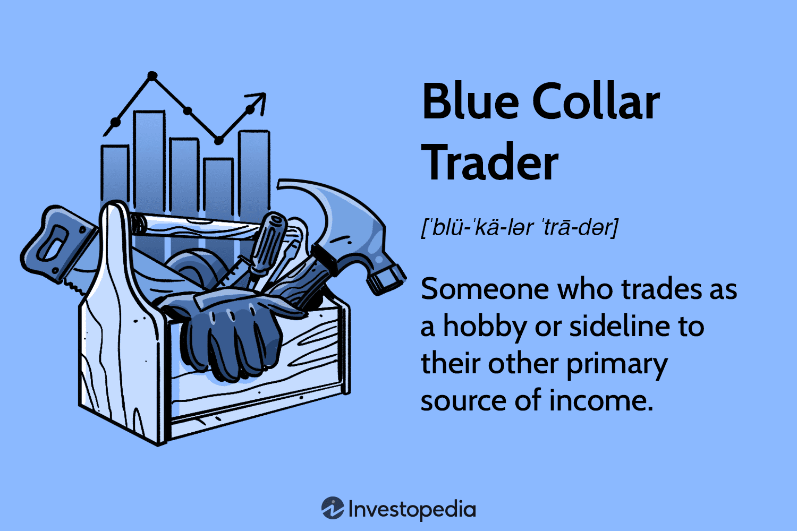

## Table of Contents

## What is a blue-collar trader?

A blue-collar trader is someone who works in trading but doesn't have a fancy degree or a lot of formal education. They often learn by doing the job and getting experience, rather than going to school for it. These traders might work in places like stock exchanges or commodity markets, and they use their practical skills and knowledge to make trades.

Blue-collar traders are important because they bring a different perspective to trading. They might not have the same kind of training as people with business degrees, but they can be very good at their job because they understand the markets well from their hands-on experience. This type of trader can be found in many different kinds of trading environments, and they often work hard to succeed in their careers.

## How does blue-collar trading differ from traditional trading?

Blue-collar trading and traditional trading differ mainly in the background and approach of the traders. Blue-collar traders often come from non-traditional paths, without formal education in finance or business. They learn their skills through hands-on experience and practical knowledge of the markets. This means they might not have degrees or certifications, but they have a deep understanding of trading from working in the field. They might trade in stock exchanges, commodity markets, or other trading environments, relying on their experience to make decisions.

Traditional trading, on the other hand, usually involves traders who have gone through formal education and training. These traders often have degrees in finance, economics, or related fields, and they might have certifications like the CFA (Chartered Financial Analyst). They use a more structured approach to trading, often relying on complex analysis and models to make their decisions. While blue-collar traders might focus more on the practical aspects of trading, traditional traders often use a combination of theory and practice, backed by their educational background.

Both types of trading are important and can be successful, but they bring different strengths to the table. Blue-collar traders can offer unique insights and adaptability gained from real-world experience, while traditional traders might bring more analytical rigor and a systematic approach to their trading strategies.

## What are the basic skills required to start as a blue-collar trader?

To start as a blue-collar trader, you need to be good at understanding markets. This means you should be able to watch and learn how prices move and why they change. You don't need a fancy degree, but you do need to be curious and willing to learn from watching and doing. Being able to talk to other traders and learn from them is also important. This helps you understand the tricks and tips that can make you better at trading.

Another key skill is being able to handle numbers and keep track of your trades. You need to be good at math, even if it's just basic math, so you can figure out profits and losses. Being organized is also crucial because you need to keep good records of your trades. Lastly, you need to be patient and able to handle stress. Trading can be tough, and prices can go up and down a lot, so staying calm and making smart decisions is really important.

## What tools and resources are essential for a beginner blue-collar trader?

For a beginner blue-collar trader, one of the most important tools is a reliable trading platform. This is a computer program or app that lets you buy and sell stocks, commodities, or other things you want to trade. It's good to choose a platform that is easy to use and doesn't cost too much money. Another essential tool is a charting software. This helps you see how prices have moved in the past, which can give you clues about where they might go in the future. You don't need fancy software; even simple, free tools can help you learn a lot.

In addition to tools, resources like trading books and online courses can be very helpful. These can teach you the basics of trading and give you tips from experienced traders. You might not have a lot of money to spend on these, so look for free resources or borrow books from a library. Joining a trading community, either online or in person, is also a great idea. Talking to other traders can help you learn faster and understand the markets better. They can share their experiences and give you advice that you can't find in books.

## How can a blue-collar trader manage risk effectively?

Managing risk is really important for a blue-collar trader. One way to do this is by not putting all your money into one trade. It's like not putting all your eggs in one basket. If you spread your money out over different trades, you won't lose everything if one trade goes bad. Another way to manage risk is by setting stop-loss orders. This means you tell your trading platform to sell a trade if it loses a certain amount of money. This can help you limit how much you lose on a bad trade.

Another important thing is to always know how much money you can afford to lose. This is called your risk capital. You should only use money that you can lose without it hurting your life. It's also a good idea to keep learning and watching the markets. The more you know, the better you can guess what might happen next. And remember, it's okay to take a break if trading is making you too stressed. Taking care of your mind is just as important as managing your money.

## What are common strategies used by blue-collar traders?

Blue-collar traders often use strategies that are simple but effective. One common strategy is called trend following. This means they watch the market to see which way prices are moving and then trade in that direction. If prices are going up, they buy, and if prices are going down, they sell. This strategy doesn't need a lot of fancy tools, just a good eye for spotting trends.

Another strategy blue-collar traders use is called scalping. This means they make a lot of small trades very quickly, trying to make a little bit of money on each one. They might buy something and then sell it just a few minutes later if the price goes up even a tiny bit. This strategy can be exciting but also stressful, so it's important to stay calm and focused.

Some blue-collar traders also use a strategy called swing trading. This is where they hold onto a trade for a few days or weeks, trying to catch bigger moves in the market. They look for times when the market might be about to change direction and then make their trades. This strategy needs a bit more patience, but it can lead to bigger profits if done right.

## How does market analysis play a role in blue-collar trading?

Market analysis is really important for blue-collar traders. It helps them understand what's going on in the market and make better decisions about when to buy and sell. Blue-collar traders might not have fancy degrees, but they can still learn a lot by watching the market closely. They look at things like price charts to see how prices have moved in the past and try to guess where they might go next. This kind of analysis helps them spot trends and find good times to make their trades.

Even though blue-collar traders might use simple tools, they can still do a good job with market analysis. They pay attention to news and events that can affect the market, like changes in the economy or big news stories. By keeping an eye on these things, they can get a feel for what the market might do next. This practical approach to market analysis helps them make smart trades without needing a lot of complicated math or expensive software.

## What are the psychological challenges faced by blue-collar traders?

Blue-collar traders face a lot of psychological challenges. One big challenge is dealing with stress. Trading can be very up and down, and it's easy to feel worried or scared when prices move a lot. Blue-collar traders might not have a lot of money to lose, so every trade can feel really important. This can make them feel stressed out and nervous, which can make it hard to make good decisions.

Another challenge is staying patient. It's tempting to want to make money fast, but good trading often means waiting for the right moment. Blue-collar traders need to learn to be patient and not rush into trades just because they want to make money quickly. This can be tough, especially when they see other people making money. Staying calm and waiting for the right time is a big part of being a successful trader.

Lastly, blue-collar traders can struggle with self-doubt. Since they might not have the same education as other traders, they can sometimes feel like they don't belong or that they're not as good. This can make them second-guess their decisions and feel less confident. Overcoming this self-doubt and believing in their own skills and experience is really important for blue-collar traders to keep going and succeed.

## How can a blue-collar trader advance their skills to an intermediate level?

To move up to an intermediate level, a blue-collar trader needs to keep learning and practicing. They should start by getting better at reading charts and understanding market trends. This means spending more time watching the market and trying to predict what will happen next. They can also learn from other traders by joining trading communities or online forums. Talking to other traders can help them pick up new strategies and get advice on how to improve. It's also a good idea to start using more tools, like better charting software or trading apps that give them more information about the market.

Another important step is to start managing risk better. Intermediate traders need to be good at setting stop-loss orders and figuring out how much money they can afford to lose on each trade. They should also start keeping a trading journal where they write down what they did and what they learned from each trade. This helps them see what works and what doesn't. Finally, they need to work on their patience and emotional control. Trading can be stressful, so learning to stay calm and make smart decisions even when the market is moving a lot is key to becoming a better trader.

## What are advanced trading techniques used by expert blue-collar traders?

Expert blue-collar traders often use a technique called position sizing. This means they decide how much money to put into each trade based on how risky it is. They don't just guess; they use math to figure out the best amount. This helps them make more money and lose less. Another advanced technique they use is called backtesting. This means they look at old market data to see how well their trading strategies would have worked in the past. By doing this, they can improve their strategies and make them better for the future.

Another technique expert blue-collar traders use is called hedging. This means they make trades that can protect them from losing too much money if the market goes the wrong way. For example, if they buy something, they might also sell something else that moves in the opposite direction. This way, if one trade loses money, the other trade might make money and balance it out. These traders also pay close attention to market sentiment. They watch what other traders are doing and feeling to guess where the market might go next. By understanding the mood of the market, they can make smarter trades and stay ahead of the game.

## How do blue-collar traders adapt to different market conditions?

Blue-collar traders adapt to different market conditions by keeping a close eye on what's happening around them. They watch the news and pay attention to big events that can change the market, like new laws or economic reports. By understanding these things, they can guess how the market might react and make trades that fit the situation. For example, if they hear about a new law that might make a certain industry grow, they might buy stocks in that industry before the prices go up. This way, they can take advantage of changes in the market and make money even when things are different from usual.

Another way blue-collar traders adapt is by changing their trading strategies. If the market is moving a lot and prices are going up and down quickly, they might use a strategy like scalping to make small, quick trades. But if the market is more stable, they might switch to swing trading and hold onto their trades for longer. They also keep learning and trying new things, so they can find what works best in different situations. By being flexible and willing to change their approach, blue-collar traders can keep making money no matter what the market is doing.

## What are the long-term career prospects for a blue-collar trader?

Blue-collar traders can have good long-term career prospects if they keep learning and working hard. As they get better at trading, they can make more money and become more successful. They might start their own trading business or work for a bigger company as a professional trader. Some blue-collar traders also become mentors or teachers, sharing what they know with new traders. This can give them a steady income and a way to help others succeed.

Over time, blue-collar traders can also move into other jobs in the finance world. They might become analysts, who study the market and give advice, or they could work in risk management, helping companies avoid losing money. These jobs can be more stable and pay well. By using their trading skills and experience, blue-collar traders can find many different opportunities and build a strong career in finance.

## What are some success stories and best practices?

Many blue-collar traders have successfully integrated algorithmic tools into their trading arsenals, leveraging their practical industry expertise along with the strategic use of automation. This blend of knowledge and technology has empowered them to enhance trading outcomes, capitalizing on both the information gleaned from their primary occupations and the efficiencies provided by algorithmic trading.

A notable aspect of their success lies in the ability to combine practical industry insights with strategic automation. Blue-collar traders often possess a deep understanding of the sectors they work in, allowing them to anticipate market shifts and make informed trading decisions. By developing or accessing algorithmic tools, they can automate trade execution—optimizing for speed and precision—which reduces emotional decision-making and human error.

Networking plays a crucial role in their success. By connecting with other traders and participating in online forums and communities, blue-collar traders gain access to a wealth of knowledge and experience. This networking also extends to engaging with online educational resources, which help them stay updated on the latest market trends and trading strategies. Many successful traders participate in webinars, workshops, and online courses to continuously develop their skills.

A disciplined approach to trading is essential. Blue-collar traders who thrive often do so by adopting clear risk management strategies. This includes setting stop-loss orders to limit potential losses, diversifying their investment portfolios to spread risk, and defining precise entry and exit points for trades. By maintaining discipline, they can better manage the uncertainties of the financial markets. Formulas such as the Kelly Criterion can be used to calculate the optimal size of a series of bets:

$$

f^* = \frac{bp - q}{b} 
$$

where:
- $f^*$ is the fraction of the portfolio to devote to the betting strategy,
- $b$ is the odds received on the wager,
- $p$ is the probability of winning,
- $q$ is the probability of losing, which is $1 - p$.

Success stories from this demographic underscore the potential for financial growth and independence. By strategically integrating industry knowledge with algorithmic trading tools, blue-collar traders can attain a level of financial autonomy that extends beyond their primary incomes. These narratives inspire others within their communities, demonstrating that with the right resources and strategies, successful trading is achievable regardless of professional background.

## References & Further Reading

[1]: Bergstra, J., Bardenet, R., Bengio, Y., & Kégl, B. (2011). ["Algorithms for Hyper-Parameter Optimization."](https://dl.acm.org/doi/10.5555/2986459.2986743) Advances in Neural Information Processing Systems 24.

[2]: ["Advances in Financial Machine Learning"](https://www.amazon.com/Advances-Financial-Machine-Learning-Marcos/dp/1119482089) by Marcos Lopez de Prado

[3]: ["Evidence-Based Technical Analysis: Applying the Scientific Method and Statistical Inference to Trading Signals"](https://www.amazon.com/Evidence-Based-Technical-Analysis-Scientific-Statistical/dp/0470008741) by David Aronson

[4]: ["Machine Learning for Algorithmic Trading"](https://github.com/stefan-jansen/machine-learning-for-trading) by Stefan Jansen

[5]: ["Quantitative Trading: How to Build Your Own Algorithmic Trading Business"](https://www.amazon.com/Quantitative-Trading-Build-Algorithmic-Business/dp/1119800064) by Ernest P. Chan