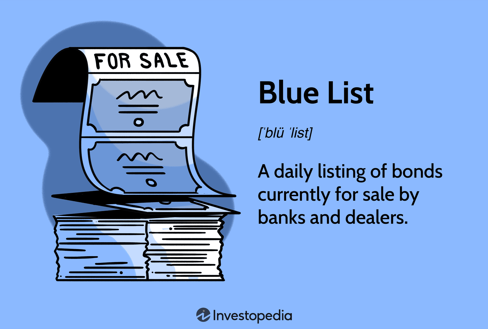

Understanding the intersection of environmental conservation and financial innovation is crucial in today's rapidly changing world. As environmental challenges become more pressing, there is an increasing need to identify and implement financial mechanisms that can effectively support conservation efforts. This article sheds light on the intricate and critical relationship between endangered species conservation efforts and finance, with particular focus on the Blue List and algorithmic trading.

Endangered species face numerous threats, including habitat loss, pollution, and climate change, making their conservation a priority for global biodiversity. Within this context, financial markets and advanced trading technologies offer a potential avenue to funnel resources toward conservation initiatives. By leveraging financial tools like algorithmic trading, we can potentially optimize the allocation of resources for conservation efforts, particularly for species listed as endangered on platforms like the IUCN Red List.



Algorithmic trading involves utilizing sophisticated algorithms to automatically execute trades at a speed and frequency that would be impossible for a human trader. This technological advancement has significant implications for the financial ecosystem, enabling new strategies for ethical investing, including those aligned with conservation objectives.

Additionally, we will examine the role of the Blue List in financial markets. The Blue List, though traditionally associated with municipal bonds, presents intriguing prospects for integrating ethical and conservation-focused criteria into investment strategies. Specifically, the concept of blue bonds—targeted at financing marine and waterway conservation projects—illustrates how financial instruments can be directly tied to specific environmental outcomes.

Through exploring these themes, we aim to provide insights into how novel financial mechanisms can be utilized to support endangered species conservation effectively. This relationship represents an opportunity to ensure that financial innovation aligns with ecological sustainability goals, potentially transforming how conservation is financed globally.

## Table of Contents

## The Endangered Species and the IUCN Red List

The International Union for Conservation of Nature (IUCN) Red List of Threatened Species is an indispensable tool in global conservation efforts. It provides a thorough inventory of the conservation status of plant and animal species, effectively cataloging and highlighting those facing a heightened risk of extinction. This list plays a crucial role in guiding conservation actions globally and is used by governments, policymakers, and environmental organizations to prioritize conservation initiatives.

The IUCN Red List assesses species using a set of precise criteria to evaluate the risk of extinction. Species are categorized into nine groups ranging from "Least Concern" to "Extinct," based on factors such as population size, rate of decline, area of geographic distribution, and the degree of population and distribution fragmentation. The primary aim of these assessments is to convey the urgency and scale of threats to biodiversity and the need for immediate conservation actions.

Understanding the criteria for listing species on the Red List is vital for developing effective conservation strategies. The Red List employs quantitative criteria, such as a reduction in population size over time, a restricted geographic range, or a small number of mature individuals. For instance, a species may be listed as "Endangered" if it meets any of the following criteria: there is a observed, estimated, projected, or inferred reduction of at least 50% over the last ten years or three generations, it has a geographic range of less than 5,000 square kilometers, or its population size is estimated to number fewer than 2,500 mature individuals.

By maintaining a comprehensive database, the IUCN Red List also facilitates research and planning efforts for biodiversity conservation. It provides a wealth of data that can be used to monitor trends in biodiversity loss and to target conservation efforts where they are most needed. Moreover, it raises awareness about the importance of biodiversity and the various threats it faces, ultimately aiming to promote transformations in human activities to support ecological preservation.

In summary, the IUCN Red List is a cornerstone of biodiversity conservation, offering critical insights into the status and trends of species across the globe. It serves as a guiding light for conservation planning, enabling targeted efforts to safeguard endangered species and their habitats.

## The Blue List in Financial Markets

The Blue List in financial markets presents an essential resource for monitoring municipal bonds, specifically targeting both general obligation and revenue bonds available daily. It provides a crucial snapshot for investors interested in diversifying their portfolios while incorporating ethical and environmental considerations into their strategies. Importantly, this list supports investors looking for sustainable investment opportunities that align with environmental conservation objectives.

Municipal bonds are sections of debt securities issued by local governments or other municipal entities, and they represent an effective means for financing public projects. These instruments appeal to investors for their typically low risk and potential tax-exempt benefits. Within this framework, the Blue List highlights sustainable investment avenues by including blue bonds, which are specifically issued to finance marine and waterway conservation projects. Blue bonds offer investors the ability to contribute to ecological preservation while achieving a financial return, thereby aligning investment objectives with sustainability goals.

The concept of blue bonds within the Blue List is innovative, offering a dedicated financial mechanism for promoting the sustainable use and conservation of ocean and freshwater resources. Such bonds help to bridge the gap between environmental stewardship and economic finance. By earmarking funds for environmentally impactful projects, blue bonds support global initiatives to preserve biodiversity and ensure the health of aquatic ecosystems, which are critical to maintaining ecological balance and supporting life on Earth.

Investors who incorporate blue bonds into their portfolios are, therefore, not only participating in traditional financial markets but are also acting as stewards for environmental sustainability. This form of investment offers both economic benefits and an opportunity to make a positive impact on global conservation efforts. As the demand for sustainable and ethical investment options grows, the Blue List provides a key resource for identifying municipal bonds that align with these principles, highlighting the significant role of financial markets in supporting conservation initiatives.

## Algorithmic Trading and Environmental Conservation

Algorithmic trading, a modern financial mechanism characterized by the utilization of automated systems, executes trading strategies at remarkable speeds and with optimal efficiency. Its capacity to handle large datasets and adapt dynamically to market changes makes it a powerful tool in creating diversified investment portfolios. This approach is increasingly being tailored towards investments that align with ethical or sustainable objectives, prominently featuring conservation efforts.

The integration of [algorithmic trading](/wiki/algorithmic-trading) with environmental conservation represents an innovative convergence between technology and ecological preservation. Ethical investing is becoming a major area of interest for traders seeking to balance financial returns with positive environmental impacts. Algorithms can be programmed to prioritize investments in companies with sustainable practices or in projects directly benefiting conservation efforts. For instance, certain algorithms may prioritize stocks or bonds from companies with a strong record of environmental responsibility or those contributing significantly to conservation projects like reforestation or renewable energy.

A promising aspect of algorithmic trading is the potential to channel trading profits into conservation goals. This approach introduces a dual benefit: achieving financial gains while supporting ecological initiatives. For example, traders might allocate a portion of their algorithmic trading profits to initiatives that protect endangered species or restore habitats. Using financial gains to bolster these initiatives could provide the necessary funding to drive conservation projects that are often constrained by limited resources.

To effectively implement algorithmic trading with a focus on conservation, a set of criteria or metrics relevant to environmental impact can be embedded into trading algorithms. These could include environmental, social, and governance ([ESG](/wiki/esg-investing)) criteria, which are increasingly analyzed alongside traditional financial metrics to assess investment opportunities. A sample Python script to guide such investment decisions might involve accessing ESG data alongside traditional financial indicators to optimize the investment portfolio:

```python
import pandas as pd
import numpy as np

# Sample data representing financial and ESG metrics
data = {
    'Company': ['A', 'B', 'C'],
    'Expected_Return': [0.05, 0.07, 0.04],
    'Risk': [0.02, 0.03, 0.01],
    'ESG_Score': [80, 85, 78]
}

df = pd.DataFrame(data)

# Determining the optimal investment based on a combination of Expected Return, Risk, and ESG Score
df['Investment_Score'] = df['Expected_Return'] / df['Risk'] * df['ESG_Score']

optimal_investment = df.loc[df['Investment_Score'].idxmax()]
print(optimal_investment)
```

This simplified model uses expected returns, risk levels, and ESG scores to derive an investment score, thereby quantifying how well an asset aligns with ethical investing strategies. Integrating these mechanisms within algorithmic trading platforms could catalyze a significant shift in financial markets, directing substantial capital flows towards sustainable ventures. As traders and investors become more cognizant of their roles in environmental stewardship, the adoption of algorithmic trading with a conservation focus can play a crucial role in advancing global conservation efforts.

## The Intersection of Blue and Red Lists for Conservation

Aligning the financial Blue List with the conservation-driven Red List offers a transformative opportunity for biodiversity investment. The Blue List, which encompasses municipal bonds, provides a framework for ethical investment strategies, including environmental conservation. On the other hand, the Red List, curated by the International Union for Conservation of Nature (IUCN), is a comprehensive inventory detailing the global conservation status of biological species, guiding conservation priorities and actions worldwide [source: IUCN Red List].

Investors can leverage the potential of blue bonds—financial instruments within the Blue List spectrum—to channel investments directly into ecological projects. These bonds are explicitly designed to fund marine and waterway conservation, aligning with the urgent need to protect threatened marine species. By investing in such bonds, investors not only maintain a sound financial strategy but also contribute actively to ecological sustainability.

Mathematically, if we let $R$ represent the return on investment from a blue bond portfolio, and $C$ denote the conservation impact measured by metrics such as species saved or habitat area preserved, the dual objective can be optimized using methods from multi-objective optimization. The goal is to maximize $R$ while simultaneously enhancing $C$.

In Python, this can be conceptualized as follows:

```python
from scipy.optimize import minimize

# Hypothetical functions for returns and conservation impact
def returns(x):
    return -sum(x)  # Simplified return; negative to maximize in minimization framework

def impact(x):
    return sum(x**2)  # Simplified impact function

# Constraints for optimization
constraints = ({'type': 'ineq', 'fun': lambda x: x - 0.1},  # Each bond investment > 0.1
               {'type': 'eq', 'fun': lambda x: sum(x) - 1})  # Total investment = 1

# Initial guess for bond investments
x0 = [0.25, 0.25, 0.25, 0.25]

# Multi-objective optimization to balance returns and conservation
res = minimize(lambda x: returns(x) - impact(x), x0, constraints=constraints, method='SLSQP')
```

This strategic initiative represents a bridge between financial markets and ecological objectives, potentially leading to increased resources for vital conservation programs. By supporting projects targeting endangered marine species, investors play a crucial role in driving positive biodiversity outcomes. Thus, the alignment of financial tools with conservation goals not only has the potential to safeguard biodiversity but also to establish a new standard for how investments are aligned with planetary health.

## Challenges and Opportunities in Algo Trading for Conservation

Aligning trading algorithms with conservation goals presents several challenges primarily rooted in the complexity of financial markets and the variability inherent in environmental systems. One core difficulty is ensuring that trading strategies not only achieve financial returns but also align with conservation objectives. To successfully integrate these goals, traders must develop sophisticated models that account for both market dynamics and ecological data. For instance, an algorithm designed to invest in green bonds must evaluate not just the financial metrics, but also the potential ecological impact of the underlying projects.

Opportunities are significant in using technology to enhance the financing of conservation efforts. Automation and data analytics, core components of algorithmic trading, can be employed to monitor and evaluate the sustainability credentials of investment opportunities. Algorithms can be programmed to incorporate environmental, social, and governance (ESG) criteria into investment decisions, thus steering capital towards projects with positive ecological impacts. This technological capability can increase the flow of resources to conservation projects that require consistent and substantial funding.

Pioneering efforts in integrating algorithmic trading with conservation initiatives can redefine standards for ethical investing. Consider, for example, the potential to set benchmarks for sustainability in financial instruments, or the creation of trading platforms dedicated to ESG-focused investments. These initiatives could pave the way for increased transparency and accountability in the financial sector, attracting capital from environmentally-conscious investors.

Ultimately, combining algorithmic trading with conservation efforts offers a transformative approach to ethical investing. By integrating advanced financial technologies with ecological considerations, stakeholders can drive more significant investment into conservation projects, contributing to both economic and environmental objectives.

## Conclusion

The marriage of conservation efforts with financial innovation presents promising avenues for supporting endangered species. The integration of financial instruments, such as the Blue List, with cutting-edge technologies like algorithmic trading, offers a dual opportunity: supporting ecological preservation while fostering economic growth.

Leveraging the Blue List and algorithmic trading strategies allows investors to channel capital into projects that offer both financial returns and positive environmental impacts. By investing in blue bonds, designed to support marine and waterway conservation, investors not only gain potential tax benefits and a stable return on investment but also contribute to the preservation of critical habitats and species. Algorithmic trading, with its capacity for analyzing vast datasets and executing complex trades, enhances this process by allowing for the real-time alignment of ethical considerations within portfolio management. This sophisticated approach can optimize investment decisions to favor conservation-focused outcomes while maintaining robust financial returns.

As these financial tools evolve, they could transform conventional investment paradigms. Future developments, particularly advances in data analytics and [machine learning](/wiki/machine-learning), could enable more precise targeting of conservation projects that yield both ecological and financial dividends. Moreover, the potential standardization of ethical metrics within financial markets could facilitate broader adoption, making conservation-centric investing more accessible and appealing to a global investor base.

This convergence of technology, finance, and ecology holds the potential to redefine the contemporary landscape of conservation funding. By prioritizing sustainable investments, we could see a shift in how conservation is financed, resulting in enhanced global efforts to preserve biodiversity. Investors, equipped with advanced tools and driven by ethical mandates, could play a pivotal role in sustaining endangered species, thereby fostering a more balanced and resilient ecosystem for future generations.

## References & Further Reading

[1]: [IUCN Red List of Threatened Species](https://www.iucnredlist.org/en)

[2]: Juniper, T. & Ellis, R. (2005). ["Sustaining the Future: Economic, Social, and Environmental Dimensions"](https://juniper.oregonstate.edu/bibliography/biology-ecology-and-management-western-juniper-juniperus-occidentalis).

[3]: "Algorithmic Trading: Winning Strategies and Their Rationale" by Ernie Chan (2013).

[4]: De Kort, J.F., & Nijkamp, H.P. (2013). ["Water, Sustainable Development and the Nexus: Response from the Aquatic Community to Water Scarcity Challenges"]. Environmental Science & Policy, Elsevier.

[5]: "The Economics of Biodiversity: The Dasgupta Review" by Partha Dasgupta (2021).

[6]: [Green Bonds Principles](https://www.icmagroup.org/sustainable-finance/the-principles-guidelines-and-handbooks/green-bond-principles-gbp/) by International Capital Markets Association.

[7]: "Advances in Financial Machine Learning" by Marcos Lopez de Prado (2018).