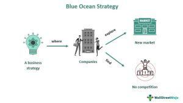

In the competitive world of business, finding the right market strategy is crucial for success. Industries across the globe are continuously seeking methods to distinguish themselves and gain a competitive edge, especially in markets saturated with established players. An effective market strategy not only involves positioning and differentiating products but also entering spaces that are free from direct competition. This article explores the synergies between Blue Ocean Strategy, a groundbreaking business framework for creating "blue oceans" or uncontested market spaces, and algorithmic trading, which utilizes advanced algorithms to operate in financial markets.

Blue Ocean Strategy revolutionizes the conventional approach of battling competitors in saturated markets, known as "red oceans," by encouraging businesses to chart new territories — blue oceans — where they can innovate and stand out. On the other hand, algorithmic trading optimizes trading processes through automation, speed, and precision, enabling companies to seize fleeting market opportunities.



By combining these concepts, businesses can identify new market opportunities with minimal competition and enhance their competitive positioning. This strategic integration of Blue Ocean Strategy and algorithmic trading offers the potential not just to compete but to lead in market spaces that are yet to be defined, fostering long-term success and sustainability.

## Table of Contents

## Understanding Market Strategy

Market strategy refers to the comprehensive plan that a company implements to achieve its business objectives. This plan encompasses several key elements such as positioning, pricing, promotion, and distribution, all of which are essential to reaching desired market segments and achieving competitive differentiation.

**Positioning** involves defining how a product or service should be perceived by its target audience relative to competitors. It requires understanding the unique selling points and value propositions that make the product stand out. By clearly communicating the benefits and distinctive features of their offerings, companies can create a strong market presence that resonates with consumers.

**Pricing** is another critical component of a market strategy. It involves determining the optimal price point that balances consumer value perception and the company's profit goals. Pricing strategies can vary from competitive pricing, value-based pricing, to penetration pricing, each serving different strategic purposes based on market conditions and business objectives.

**Promotion** encompasses all activities designed to communicate and promote products to the target audience. This includes advertising, public relations, digital marketing, and sales promotions. Effective promotional strategies aim to enhance brand awareness, generate interest, and drive sales.

**Distribution** refers to the pathways through which a product reaches the consumer. Strategically selecting distribution channels is crucial for ensuring product availability and convenience, which in turn, can have a significant impact on sales and customer satisfaction. Companies may choose from various distribution models, such as direct sales, online platforms, or partnerships with retailers.

An effective market strategy requires a deep understanding of customer needs and preferences. Companies need to conduct extensive market research to gather insights into consumer behavior, trends, and competitive dynamics. By aligning their offerings with these insights, businesses can better satisfy customer expectations and foster loyalty.

Innovative approaches like Blue Ocean Strategy and [algorithmic trading](/wiki/algorithmic-trading) have emerged as transformative methods for developing successful market strategies. Blue Ocean Strategy emphasizes creating new market spaces ('blue oceans') that are devoid of competition, thus allowing firms to craft unique value propositions and capture untapped customer bases. Algorithmic trading, on the other hand, uses sophisticated algorithms to automate financial transactions, enabling companies to execute swift and data-driven trading strategies. Both approaches illustrate how businesses can leverage innovation to go beyond traditional market competition and achieve sustainable growth.

## Blue Ocean Business Strategy

Blue Ocean Strategy is an influential concept in the domain of strategic business management, introduced by W. Chan Kim and Renée Mauborgne in their book "Blue Ocean Strategy." The core idea of this strategy is to generate and capture "blue oceans," or unexplored market spaces, by offering unique value propositions that set a business apart from competitors. Unlike traditional strategies that focus on outpacing competitors in saturated markets—referred to as "red oceans"—Blue Ocean Strategy prioritizes value innovation, a process that simultaneously pursues differentiation and low cost to open up new market territories.

Companies successfully implementing Blue Ocean Strategy transcend traditional market boundaries and create a new demand by offering entirely novel products or services. Apple Inc. exemplifies this approach with its introduction of iTunes, which transformed the music industry by providing a legal and user-friendly platform for purchasing digital music. Similarly, Netflix innovated the way people consume media content by pioneering online streaming services, thereby creating an entirely new market and significantly addressing an emerging customer need.

The methodology underlying Blue Ocean Strategy involves several analytical tools and frameworks, such as the Strategy Canvas and the Four Actions Framework, which help businesses identify untapped opportunities and reevaluate their industry's assumptions. The Strategy Canvas visualizes the current competitive landscape, allowing firms to plot existing player offerings against factors consumers value, thus revealing gaps in the market. The Four Actions Framework proposes four key actions—eliminate, reduce, raise, and create—that guide organizations in reshaping their industry curve.

Ultimately, Blue Ocean Strategy encourages businesses to break free from traditional competitive discourse and seek out novel paths for growth and profit. By focusing on innovation and unique value creation, businesses can discover latent customer appetite, thus achieving both strategic differentiation and new market creation.

## Algorithmic Trading as a Market Strategy

Algorithmic trading utilizes sophisticated algorithms to automate trading activities in financial markets, significantly enhancing decision-making processes by analyzing vast datasets at high speed. This computational approach fundamentally changes how trades are executed, offering unparalleled speed and precision. By eliminating human error and emotions from trading decisions, algorithmic trading ensures that transactions are executed at the optimal price, rapidly responding to market conditions.

One of the main advantages of algorithmic trading is its ability to identify and exploit fleeting market opportunities that occur for mere milliseconds. Algorithms can execute and manage multiple trades simultaneously across various markets and asset classes with incredible efficiency, facilitating a higher [volume](/wiki/volume-trading-strategy) of trades than manual processes can achieve.

Furthermore, algorithmic trading empowers firms to define their market strategies more effectively. Strategies can be tailored based on historical data analysis and testing, giving companies the advantage of predictive insights. This data-driven approach allows firms to optimize their market entry and [exit](/wiki/exit-strategy) points, enhancing their overall competitiveness.

The adoption of algorithmic trading is accelerating among firms seeking to bolster their market strategies. Companies can leverage algorithmic systems to analyze trends, predict potential market movements, and execute timely trades. These systems also offer flexibility, enabling firms to adjust their strategies based on real-time data. 

In a Python implementation, for instance, a basic moving average crossover strategy might be automated as follows:

```python
import pandas as pd

def moving_average_strategy(df, short_window, long_window):
    df['short_mavg'] = df['Close'].rolling(window=short_window, min_periods=1, center=False).mean()
    df['long_mavg'] = df['Close'].rolling(window=long_window, min_periods=1, center=False).mean()

    df['buy_signal'] = (df['short_mavg'] > df['long_mavg']).astype(int)
    df['sell_signal'] = (df['short_mavg'] < df['long_mavg']).astype(int)

    return df

# Example usage with a DataFrame 'data' containing stock prices
# data = pd.read_csv('stock_prices.csv')
# moving_average_strategy(data, short_window=50, long_window=200)
```

Despite its advantages, algorithmic trading presents challenges, such as the need for substantial technical and financial investment in infrastructure, as well as constant adaptation to evolving market conditions. Firms must also navigate regulatory landscapes and ensure compliance with trading regulations, which govern the use of algorithmic systems. Nonetheless, as firms continue to harness these powerful algorithms, the potential for gaining a competitive edge in the marketplace becomes increasingly attainable.

## Integration of Blue Ocean Strategy and Algorithmic Trading

Combining Blue Ocean Strategy with algorithmic trading is a novel approach that enables businesses to tap into unexplored market segments or 'blue oceans'. This integration offers the potential to identify and exploit trading opportunities that have not been targeted by traditional strategies.

Blue Ocean Strategy emphasizes the creation of unique value propositions and the development of uncontested market spaces. It encourages companies to seek out new opportunities by focusing on differentiation and innovation rather than competing directly with existing players. When applied to trading, this strategy involves identifying gaps in the market where demand is unmet or under-served, allowing businesses to introduce novel financial products or services.

Algorithmic trading, on the other hand, automates trading decisions through the use of sophisticated algorithms that process large volumes of data at high speeds. By leveraging advanced data analytics, [machine learning](/wiki/machine-learning), and AI, algorithmic trading systems can identify emerging trends and patterns that are not immediately apparent to human traders. This capability allows firms to execute trades with greater precision and efficiency, capitalizing on fleeting opportunities that manual trading might miss.

The integration of these two approaches creates a synergistic effect. Businesses can innovate trading strategies tailored to emerging market needs while optimizing their operations using algorithmic insights. For instance, by implementing predictive analytics, companies can anticipate market shifts and develop strategies that align with future trends, carving out new niches in the financial market.

Moreover, this hybrid approach facilitates sustainable growth and profit maximization. By continuously adapting to market dynamics, businesses can maintain a competitive edge and reduce vulnerability to market [volatility](/wiki/volatility-trading-strategies). Algorithmic systems can be programmed to adjust trading parameters in response to real-time data, ensuring that strategies remain relevant and effective.

In summary, the integration of Blue Ocean Strategy with algorithmic trading offers a powerful framework for discovering untapped opportunities and optimizing market strategies. By fostering innovation and responsiveness, firms can achieve sustained growth and profitability in an ever-evolving market environment.

## Challenges and Considerations

Implementing Blue Ocean Strategy alongside algorithmic trading involves multiple layers of complexity. A crucial challenge is the substantial initial investment required. Developing innovative strategies necessitates resources for research and development, market analysis, and the creation of a distinct value proposition. Algorithmic trading, similarly, demands investment in sophisticated technology infrastructure, including high-speed data feeds, trading platforms, and robust hardware to process large volumes of data efficiently.

Data management is another significant hurdle. Both Blue Ocean Strategy and algorithmic trading rely on extensive data analysis to uncover opportunities. Businesses must manage vast datasets, requiring advanced data storage solutions and analytical capabilities to extract actionable insights. Proper integration of structured and unstructured data is critical, along with ensuring data quality and security measures are in place to protect sensitive information.

Adaptability is essential in navigating rapid market changes. The dynamic nature of markets means strategies can quickly become obsolete. For Blue Ocean Strategy, this involves continuous monitoring of consumer trends to maintain a competitive edge. In algorithmic trading, algorithms must be regularly updated to reflect current market conditions while minimizing the risks of overfitting past data, which can lead to significant trading losses if market conditions change unexpectedly.

Ethical considerations are paramount when implementing these strategies. Blue Ocean Strategy requires firms to consider the broader societal impact of creating new markets. Ethical issues might arise regarding consumer privacy, especially when utilizing data analytics for market insights. In algorithmic trading, ethical dilemmas can occur in relation to high-frequency trading practices that may lead to market volatility and fairness concerns.

Compliance with regulatory frameworks is a further consideration. Businesses must navigate the legal landscape, ensuring compliance with financial regulations governing algorithmic trading such as the European Union’s Markets in Financial Instruments Directive (MiFID II) or the U.S. Securities and Exchange Commission (SEC) regulations. These regulations often include requirements around algorithm testing, risk management controls, and maintaining transparency in trading activities.

In conclusion, while Blue Ocean Strategy and algorithmic trading can offer significant advantages, they require meticulous planning to address these challenges and ensure sustainable implementation.

## Conclusion

Blue Ocean Strategy and algorithmic trading are transformative tools that empower businesses to innovate and circumvent intense market competition. By prioritizing the creation of new market spaces, companies can sidestep the overcrowded traditional markets and develop unique value propositions that set them apart. This strategy fosters an environment where businesses are not just competing but rather redefining the landscape and expanding opportunities. 

Algorithmic trading, with its capacity to process immense volumes of data and execute trades at unprecedented speeds, complements this strategic approach. It allows firms to optimize their operations, efficiently manage risks, and capitalize on fleeting market inefficiencies. The precision and scalability offered by algorithmic insights are invaluable in the fast-paced financial markets, enabling firms to maintain a competitive advantage.

When these concepts are strategically integrated, businesses can unlock significant growth potential. The synergy between Blue Ocean Strategy and algorithmic trading promotes sustainability and flexibility, crucial for navigating dynamic market environments. By focusing on innovation and advanced technology, companies are equipped to position themselves as industry leaders, driving long-term success and achieving robust profitability. This integrative approach not only secures immediate competitive advantages but also fosters resilience and adaptability in an ever-evolving market landscape.

## References & Further Reading

[1]: Kim, W. C., & Mauborgne, R. (2005). ["Blue Ocean Strategy: How to Create Uncontested Market Space and Make the Competition Irrelevant"](https://www.researchgate.net/publication/256807016_Blue_Ocean_Strategy_How_to_Create_Uncontested_Market_Space_and_Make_the_Competition_Irrelevant_W_Chan_Kim_Renee_Mauborgne_Harvard_Business_School_Press_2005_240_pp_2995_hardcover). Harvard Business Review Press.

[2]: Chouldechova, A., & Hastie, T. (2015). ["Generalized Additive Model Selection"](https://arxiv.org/abs/1506.03850) via the Journal of Computational and Graphical Statistics.

[3]: Lopez de Prado, M. (2018). ["Advances in Financial Machine Learning"](https://www.amazon.com/Advances-Financial-Machine-Learning-Marcos/dp/1119482089). Wiley.

[4]: Aronson, D. (2007). ["Evidence-Based Technical Analysis: Applying the Scientific Method and Statistical Inference to Trading Signals"](https://www.amazon.com/Evidence-Based-Technical-Analysis-Scientific-Statistical/dp/0470008741). Wiley.

[5]: Chan, E. P. (2008). ["Quantitative Trading: How to Build Your Own Algorithmic Trading Business"](https://github.com/ftvision/quant_trading_echan_book). Wiley.