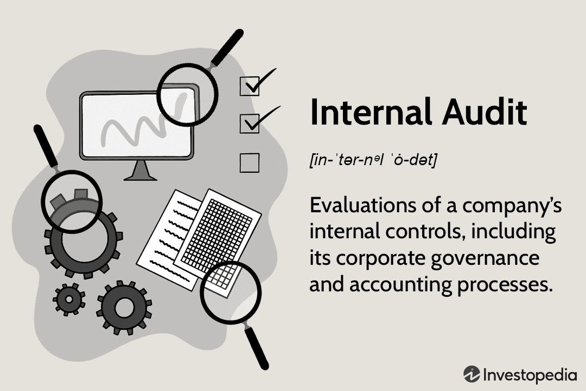

In today's rapidly evolving financial markets, compliance and transparency are more crucial than ever. As technology progresses, the integration of financial compliance blue sheets and algorithmic trading has gained prominence. Blue sheets, which are formal requests for detailed trading information made by regulatory authorities such as the Securities and Exchange Commission (SEC), serve as a cornerstone of market transparency. These sheets ensure that trading activities are conducted in line with established legal and ethical standards by providing regulators with critical data on specific trades, identity of account holders, and trading dates and times. This transparency is vital in preventing and detecting illegal activities such as insider trading and market manipulation.

On the other hand, algorithmic trading has transformed the landscape of modern financial markets by employing complex algorithms to execute trades at exceptional speed and efficiency. These algorithms are designed to analyze vast amounts of data almost instantaneously, allowing market participants to capitalize on emerging opportunities that would be undetectable to the human eye.

The intersection of blue sheets and algorithmic trading forms a critical part of maintaining market integrity. With the rapid execution and high frequency of trades facilitated by algorithmic systems, ensuring compliance with regulatory standards becomes even more essential. Thus, the role of blue sheets in maintaining transparency acts as a counterbalance, providing necessary oversight and accountability.

Understanding the role of blue sheets and their impact on financial compliance is essential for traders and institutions alike. Effective compliance mechanisms help promote fairness, integrity, and resilience in financial markets. As the use of technology in trading activities continues to expand, knowing how these tools and strategies fit into the regulatory framework is imperative. This article will explore these fundamental aspects, covering everything from compliance requirements to trading strategies, thereby highlighting how blue sheets and algorithmic trading intersect to foster an accountable trading environment.

## Table of Contents

## What Are Blue Sheets?

Blue sheets are a crucial tool utilized by regulators, particularly the Securities and Exchange Commission (SEC), to facilitate oversight in financial markets. Essentially, blue sheets are formal requests for comprehensive trading data sent to broker-dealers and clearinghouses, which are entities involved in executing and processing trades, respectively. Originally, these requests were printed on blue paper—hence the name—but in the interest of efficiency and compliance, they are now transmitted electronically.

The data gathered from blue sheets is extensive, encompassing information about account holders, the specific securities traded, trade dates, prices, and transaction volumes. This detailed information supply enables regulatory bodies to monitor trading activities effectively. By analyzing this data, regulators can detect illegal trading practices, such as insider trading and market manipulation. These illegal activities can undermine the integrity of financial markets, thus necessitating rigorous oversight.

Failure to provide accurate and timely data in response to blue sheet requests can lead to substantial penalties for financial institutions, underscoring the critical importance of transparency and accuracy in financial reporting. Thus, blue sheets play a vital role in enhancing the transparency and accountability of financial markets, helping to maintain their integrity.

## Blue Sheets and Financial Compliance

Blue sheets serve as a cornerstone for financial compliance by providing a crucial mechanism for identifying and addressing market irregularities. Regulatory bodies, such as the Financial Industry Regulatory Authority (FINRA), heavily rely on the data contained in blue sheets to scrutinize trading patterns that may suggest manipulative or illegal activities. This thorough examination helps in uncovering insider trading, market manipulation, and other breaches of financial regulations.

To harness the full potential of blue sheet data, firms must establish robust systems that facilitate the accurate and timely submission of the required information. This involves implementing advanced data management practices and ensuring seamless communication channels with regulatory authorities. The complexity of financial markets, coupled with the vast [volume](/wiki/volume-trading-strategy) of trades executed daily, necessitates the use of sophisticated technology to automate and streamline the compliance reporting process. This may involve the use of data analytics tools and software that can efficiently sift through large datasets to extract relevant information.

Although the compliance process associated with blue sheets may seem onerous, it is indispensable for upholding the integrity of the financial markets. It acts as a preventive measure, discouraging firms and individuals from deploying deceitful tactics that could lead to market instability. Compliance with blue sheet requests not only helps in regulatory investigations but also fosters a culture of transparency and accountability within financial institutions.

Moreover, through adherence to blue sheet protocols, financial institutions play an active role in promoting a fair trading environment. By ensuring that their trading activities are transparent and accessible for oversight, these institutions contribute significantly to maintaining investor confidence and the overall health of the financial ecosystem. This collaborative approach, involving both regulators and market participants, is vital for achieving equitable and transparent trading practices.

## The Rise of Algorithmic Trading

Algorithmic trading uses sophisticated algorithms to automate and execute trades rapidly and efficiently, often with minimal or no human intervention. It has transformed the landscape of financial markets, primarily through strategies such as high-frequency trading ([HFT](/wiki/high-frequency-trading-strategies)). These strategies leverage technological advancements to exploit fleeting market opportunities by executing a large number of orders in fractions of a second. 

One of the key attributes of [algorithmic trading](/wiki/algorithmic-trading) is its ability to process vast amounts of market data at lightning speed. This capability allows traders to identify and act on market patterns, pricing inefficiencies, and [arbitrage](/wiki/arbitrage) opportunities that might be impossible to detect through manual trading methods. By doing so, algorithmic trading can improve market [liquidity](/wiki/liquidity-risk-premium) and price efficiency.

However, the advantages of algorithmic trading come hand in hand with significant risks and challenges. One such risk involves the potential for market disruptions, as seen in the infamous "Flash Crash" of May 2010. During this event, algorithm-driven trades contributed to a rapid and severe market downturn, leading to regulatory scrutiny and reforms. The inherent complexity and automation in algorithmic trading make it susceptible to technical glitches, erroneous trades, and unintended interactions between algorithms.

To address these challenges and safeguard market integrity, regulatory frameworks have evolved to provide oversight of algorithmic trading activities. Regulations such as the European Union's Markets in Financial Instruments Directive II (MiFID II) and the U.S. Securities and Exchange Commission's rules require firms to implement robust risk controls and transparency measures. These frameworks are designed to monitor the impact of algorithmic trading on market stability and fairness. 

Firms engaging in algorithmic trading are subject to intense scrutiny and must adhere to stringent compliance standards. They are required to establish systems that ensure the accuracy and reliability of their trading algorithms. This includes regular testing and validation to prevent any adverse market effects. Compliance with regulatory requirements demands that firms maintain detailed audit trails and provide regulatory bodies with access to their trading data.

In conclusion, while algorithmic trading offers efficiency and speed, it also necessitates vigilant regulatory oversight to mitigate associated risks. Firms involved in this trading practice must navigate a complex landscape of regulations to ensure fair and stable markets. As technology continues to advance, the balance between innovation and regulation remains vital for the sustainability of algorithmic trading in global financial markets.

## Blue Sheets and Algorithmic Trading: An Intersection

The connection between blue sheets and algorithmic trading lies in their shared objective of enhancing transparency in financial markets. Blue sheets are essential tools that collect detailed trading data, which can be instrumental in monitoring algorithmic trading strategies. By furnishing regulators with comprehensive data sets, blue sheets enable a detailed analysis of trading patterns, offering insights into whether these algorithmic strategies comply with market regulations.

Algorithmic trading, characterized by its reliance on high-speed data processing and execution of trades, poses unique challenges for regulatory bodies. However, the systematic gathering of trading data through blue sheets allows regulators to effectively gauge the impact of algorithmic trading on market dynamics. Through this data, they can detect irregular patterns that may signify potential abuses such as spoofing, layering, or other forms of market manipulation.

As the prevalence of algorithmic trading continues to expand, the need for accurate and timely blue sheet submissions grows correspondingly. The vast volumes of data handled by algorithmic systems require an efficient data-sharing mechanism to ensure that regulatory checks are both comprehensive and swift. This necessity places a premium on the precision and punctuality of blue sheet data submissions.

Firm and market stability are deeply influenced by the harmonious integration of blue sheet data with algorithmic trading practices. For firms, leveraging blue sheets can help refine their compliance strategies, ensuring that trading algorithms align with regulatory standards. For the market, this integration aids in maintaining the integrity and stability essential for a healthy trading environment, as it helps prevent the adverse effects of manipulative practices on market dynamics.

In conclusion, the symbiotic relationship between blue sheets and algorithmic trading plays a crucial role in fostering transparency and fairness in financial markets. By bridging the data needs of regulators and the operational demands of trading firms, blue sheets contribute significantly to market oversight and integrity.

## Challenges and Opportunities

Implementing effective compliance mechanisms for blue sheets in the context of algorithmic trading presents several unique challenges and opportunities. One of the primary challenges faced by financial institutions is managing the enormous volume and velocity of data generated by algorithmic trading. High-frequency trading strategies can result in thousands of transactions per second, creating a substantial amount of data that must be accurately documented and reported. This necessitates sophisticated analytic tools and processes to ensure that the data submitted through blue sheets is both timely and precise. Failure to do so can lead to severe financial penalties and reputational damage.

Effective data management is crucial for staying compliant with regulatory requirements. Algorithms used in trading must be designed to adhere to existing financial laws, and any breach in compliance can have significant repercussions. Software tools that can automate compliance tasks and detect anomalies in trading data are becoming increasingly important. For instance, [machine learning](/wiki/machine-learning) algorithms could be employed to identify patterns indicative of non-compliant behavior, facilitating more proactive management of blue sheet data.

Despite these challenges, the effective utilization of blue sheet data offers significant opportunities. By properly analyzing and leveraging this data, firms can enhance regulatory oversight and improve market transparency. Blue sheets enable regulators to monitor trading activities more accurately, assisting in the identification of potential abuses such as insider trading or market manipulation. Furthermore, by maintaining comprehensive records of trading activities, financial institutions can provide auditors with a transparent view of their operations, thereby fostering greater trust and confidence among stakeholders.

As technology continues to evolve, financial firms must adapt their compliance strategies to align with changing regulatory expectations. This includes adopting emerging technologies like [artificial intelligence](/wiki/ai-artificial-intelligence) and blockchain to bolster data integrity and streamline compliance processes. An adaptive approach allows firms to remain agile in responding to regulatory changes and ensures sustained compliance in an increasingly complex trading environment. Maintaining such flexibility is essential for capitalizing on the opportunities presented by blue sheet data while effectively managing the associated challenges.

## Conclusion

The integration of blue sheets and algorithmic trading highlights the intricate and multifaceted nature of contemporary financial markets. These systems, while presenting certain challenges, play a vital role in promoting market transparency and fairness. Blue sheets provide a crucial mechanism for tracking and analyzing trades, enabling regulators to monitor compliance with market regulations and detect potentially illicit activities. Algorithmic trading, on the other hand, offers substantial efficiencies and opportunities for market participants but also requires stringent oversight to mitigate risks and ensure fair market practices.

The collaboration between regulators and financial institutions is essential to tackle the challenges posed by rapid technological advancements in trading. Effective regulatory oversight and robust compliance mechanisms are necessary to adapt to the continual evolution of trading technologies and strategies. This collaboration will help balance the benefits and risks associated with algorithmic trading while leveraging the insights provided by blue sheet data.

Looking forward, the synergy between blue sheets and algorithmic trading is expected to evolve, contributing to increased market resilience. The ongoing development of advanced analytic tools and processes will enhance the ability to process and analyze the vast amounts of data generated by algorithmic trading. By embracing these developments, market participants can help shape a more transparent and robust financial ecosystem, ensuring that financial markets continue to operate efficiently and fairly in the face of technological change.

## References & Further Reading

[1]: U.S. Securities and Exchange Commission. ["Blue Sheets FAQs."](https://www.finra.org/filing-reporting/electronic-blue-sheets-ebs/faq)

[2]: Financial Industry Regulatory Authority (FINRA). ["Order Audit Trail System (OATS)."](https://www.finra.org/rules-guidance/notices/21-21)

[3]: Securities and Exchange Commission. ["SEC Rule 613 - Consolidated Audit Trail."](https://www.sec.gov/about/divisions-offices/division-trading-markets/rule-613-consolidated-audit-trail)

[4]: Menkveld, A. J. (2013). ["High Frequency Trading and the New-Market Makers."](https://www.sciencedirect.com/science/article/pii/S1386418113000281) Journal of Financial Markets, 16(4), 712-740.

[5]: Aldridge, I. (2013). ["High-Frequency Trading: A Practical Guide to Algorithmic Strategies and Trading Systems."](https://www.amazon.com/High-Frequency-Trading-Practical-Algorithmic-Strategies/dp/1118343506) Wiley Finance.

[6]: Securities and Exchange Commission. ["SEC Charges Knight Capital With Violations of Market Access Rule"](https://www.sec.gov/news/digest/2013/dig101613.htm) (2013).

[7]: Mishra, B., Vasan, S., & Singh, Y. (2017). ["Predictive Algorithmic Trading Framework Using Machine Learning."](https://www.researchgate.net/publication/342976767_Machine_Learning_Algorithms_for_Predictive_Analytics_A_Review_and_New_Perspectives) Proceedings of the International Joint Conference on Artificial Intelligence.