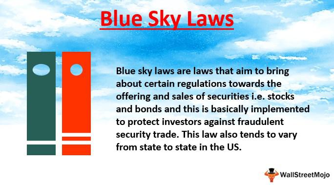

Securities investment encompasses a broad and complex domain, governed by numerous regulations aimed at safeguarding investor interests. Among such regulations, Blue Sky Laws hold a significant place. These are state-level statutes designed specifically to curb securities fraud, providing an additional layer of protection to investors. Blue Sky Laws require transparency from securities sellers, mandating them to register their offerings and disclose necessary financial details, thereby creating an informed marketplace.

The regulatory framework consisting of Blue Sky Laws intersects crucially with several facets of investment, including investment protection, securities regulation, and algorithmic trading. With the rapid advancement of technological tools like algorithmic trading, the financial landscape is evolving, presenting both opportunities and challenges. The role of Blue Sky Laws in this context cannot be understated as they ensure the integrity and fairness of the market by setting stringent standards for securities offerings and trading practices.

Investors equipped with knowledge of these components can significantly reduce their exposure to financial fraud and speculative risks. Such awareness fosters informed decision-making, empowering investors to navigate the complexities of the market prudently. In essence, a thorough comprehension of Blue Sky Laws alongside securities regulation and advanced trading mechanisms is crucial for protecting investor interests and maintaining a healthy financial ecosystem.

## Table of Contents

## What Are Blue Sky Laws?

Blue Sky Laws are state-level regulations designed to prevent securities fraud and protect investors. Each U.S. state enacts its own version of these laws, though they share common goals and structures. The primary requirement of Blue Sky Laws is the registration of securities offerings. This process involves sellers providing comprehensive financial details that outline the nature and risks associated with the investment. By mandating this transparency, Blue Sky Laws enable investors to access reliable and verifiable information about securities offerings, fostering a more informed decision-making process.

The nomenclature "Blue Sky Laws" is emblematic of their purpose—protecting investors from speculative schemes that promise returns no more substantive than a "patch of blue sky." These laws were initially enacted in the early 20th century in response to rampant speculation and fraudulent securities schemes. The first Blue Sky Law was enacted in Kansas in 1911, and its success led other states to adopt similar legislation. These state laws aim to prevent the offering and sale of dubious securities and ensure that investment opportunities are legitimate and transparent.

While each state can have variations in these laws, they typically require securities issuers to register with the state's securities administrator. This registration process includes providing detailed disclosures about the financial status and business operations of the company offering the securities. These disclosures serve not only as a preventive measure against fraud but also as a way to hold issuers accountable for the information they present to potential investors.

In summary, Blue Sky Laws are crucial in maintaining market integrity by obligating sellers of securities to disclose necessary information, protecting investors from fraudulent activities, and ensuring a transparent investment environment. By doing so, they help ingrain trust in the financial markets and uphold the protection of investors against unwarranted financial risks.

## The Role of Blue Sky Laws in Investment Protection

Blue Sky Laws play a pivotal role in investment protection by mandating that issuers disclose essential information about their securities offerings. This requirement ensures that potential investors have access to reliable and comprehensive data, facilitating informed decision-making. Informed investors are less susceptible to fraud, as they can critically evaluate the viability and risks of an investment, thereby avoiding overly speculative ventures.

The primary mechanism by which Blue Sky Laws protect investors is through the enforcement of disclosure requirements. These laws obligate issuers to provide detailed information about their business operations, financial conditions, and the terms of their securities. Such transparency enables investors to assess the true value and potential risks associated with a security, preventing deceitful practices where issuers might otherwise obscure significant negative factors.

Additionally, Blue Sky Laws are designed to safeguard inexperienced investors, who may lack the expertise to identify fraudulent schemes. By requiring full and accurate disclosures, these laws create a barrier against manipulation, helping to level the playing field between seasoned and novice investors. State regulatory bodies play a crucial role in monitoring compliance with these laws, thereby enhancing the protective framework for all investors.

Furthermore, Blue Sky Laws are instrumental in mitigating the risk associated with speculative investments. Speculative investments are inherently high-risk, often promising substantial returns without a solid foundation of evidence or financial backing. By requiring issuers to substantiate their claims with factual data, Blue Sky Laws help prevent investments based solely on conjecture or, metaphorically speaking, promises as insubstantial as a "patch of blue sky."

In essence, the enforcement of Blue Sky Laws serves as a deterrent against fraudulent and speculative securities practices, fostering a more transparent and trustworthy investment environment. Through rigorous disclosure standards and regulatory oversight, these laws aim to maintain the integrity of the securities markets and protect the financial interests of investors.

## Securities Regulation and Blue Sky Laws

Blue Sky Laws, integral components of state securities regulation, work in conjunction with federal securities laws to create a comprehensive framework aimed at investor protection. These state-level laws mandate that securities offerings undergo thorough scrutiny and require issuers to disclose critical financial details as part of the registration process. By providing transparency, Blue Sky Laws facilitate informed investment decisions and help protect against fraud.

The collaboration between federal and state regulations is streamlined by the Uniform Securities Act, which serves as a model law to bring consistency across states. Initially conceived to harmonize the anti-fraud provisions and registration processes among states, the Uniform Securities Act facilitates the protection of investors while promoting fair securities markets. It enables states to adopt a similar legal framework, thus reducing the complexity for issuers who operate in multiple jurisdictions.

However, this regulatory framework also imposes certain liabilities on issuers. Issuers must ensure the accuracy and completeness of disclosures, as any fraudulent statements can lead to legal consequences. Under these regulations, if an issuer provides misleading information or fails to comply with the disclosure requirements, they may face significant penalties, including fines and the invalidation of securities offerings. Such liabilities incentivize issuers to maintain transparency and uphold integrity in their communications with investors.

This dual layer of regulation—federal and state—aims not only to enhance investor protection but also to maintain the credibility and stability of the securities markets. Through compliance with Blue Sky Laws and federal securities regulations, issuers contribute to a trustworthy financial ecosystem, where investors can rely on the integrity of information provided to them when making investment decisions.

## Algorithmic Trading and Its Regulatory Challenges

Algorithmic trading, often referred to as algo trading, leverages sophisticated algorithms to automate investment decisions in financial markets. This method enables traders to execute orders with heightened speed and efficiency by minimizing human intervention. Despite its advantages, [algorithmic trading](/wiki/algorithmic-trading) introduces a set of unique regulatory challenges that raise concerns about market manipulation and fairness.

One primary concern associated with algorithmic trading is the potential for market manipulation. High-frequency trading ([HFT](/wiki/high-frequency-trading-strategies)), a subset of algorithmic trading, can lead to practices such as spoofing, where rapid orders are placed with the intent to cancel them before execution, thus misleading other market participants about supply and demand. This can artificially influence the market prices and disrupt fair trading practices. Regulators, therefore, closely monitor such activities to prevent and penalize manipulative trading behaviors.

Additionally, algorithmic trading can exacerbate market [volatility](/wiki/volatility-trading-strategies). The "flash crash" of May 6, 2010, serves as a notable example, where the U.S. stock market experienced a rapid and unanticipated plunge within minutes, attributed in part to high-frequency trading algorithms. Such incidents illustrate the potential systemic risks that algorithmic trading can pose to market stability.

Blue Sky Laws, together with federal securities regulations like the Securities Exchange Act of 1934, provide a framework to address these challenges. While these regulations primarily serve to protect investors from fraud, they also contribute to maintaining market integrity by ensuring that algorithmic trading operations comply with existing laws. For instance, firms engaged in algorithmic trading are often required to register with regulatory authorities, disclose their trading methods, and comply with audit trails to demonstrate transparency and accountability.

In response to the proliferation of algorithmic trading, regulators are continuously adapting rules to curb excesses and prevent fraud. This may include implementing measures such as circuit breakers to halt trading temporarily in response to extraordinary market movements or requiring the disclosure of algorithms to ensure compliance with anti-manipulation statutes.

The regulatory landscape surrounding algorithmic trading remains complex due to the rapid technological advancements in the field. However, the core objective remains: to ensure that automated trading adheres to ethical standards and legal norms, thereby safeguarding investors and promoting a stable and fair market environment. As such, both market participants and regulatory bodies must remain vigilant and proactive in addressing the evolving challenges posed by algorithmic trading.

## Exemptions and Compliance

Not all securities offerings are subject to mandatory registration under Blue Sky Laws, primarily due to specific exemptions designed to facilitate [capital raising](/wiki/hedge-fund-capital-raising) without excessive regulatory burden. One of the most significant exemptions is found under Regulation D of the Securities Act of 1933. Regulation D offers a series of rules—namely Rules 504, 505, and 506—that provide exemptions based on the amount of money being raised and the type of investor involved. 

Rule 506(b) allows an unlimited amount of money to be raised from an unlimited number of accredited investors and up to 35 non-accredited investors. Accredited investors are typically individuals or entities that meet specific financial criteria, such as having a net worth exceeding $1 million (excluding their principal residence) or an annual income of $200,000 ($300,000 with a spouse) in each of the last two years, with the expectation of the same income level in the current year. Rule 506(c) permits general solicitation and advertising to attract investors, provided that all participating investors are accredited.

To ensure compliance with these exemptions, firms need to carefully assess their eligibility and adhere to disclosure obligations that may still apply. For instance, they may be required to provide detailed information about the offering to prospective investors and file Form D with the U.S. Securities and Exchange Commission (SEC) within 15 days of the first sale of securities. This filing informs the SEC and state securities regulators about the offering, allowing them to monitor for fraudulent activities.

Understanding state-specific exemptions is equally crucial, as Blue Sky Laws are state-level regulations and may vary significantly across jurisdictions. Firms must be diligent in identifying the exemptions applicable in each state where they plan to offer securities. Failure to comply with these regulations can lead to severe penalties, including rescission offers to investors or legal actions by state regulators.

Besides eligibility and registration considerations, continuous reporting obligations are often integral to maintaining compliance. This includes periodic updates to regulatory bodies and investors about the financial status and operations of the issuer, thereby preserving transparency and protecting investor interests. These measures, collectively, establish a balance between facilitating capital formation and safeguarding the financial system's integrity.

## Conclusion

Blue Sky Laws are crucial in safeguarding investor interests by ensuring transparency and holding securities issuers accountable. These state-level regulations require comprehensive disclosure of significant information, providing investors with the necessary tools to make informed decisions and protect themselves from fraudulent activities. This transparency curbs overly speculative investments and mitigates risks associated with securities fraud.

As trading mechanisms such as algorithmic trading become increasingly sophisticated, Blue Sky Laws are evolving to address new regulatory challenges, including concerns about market manipulation and the maintenance of market integrity. By setting rigorous standards for disclosure and accountability, these laws play a pivotal role in maintaining fair and just financial markets. 

Investors and issuers benefit from understanding and complying with Blue Sky Laws. For investors, it ensures a protective layer against deceitful practices, while for issuers, it demands a commitment to ethical practices and transparency. This mutual adherence promotes a robust financial ecosystem, fostering trust and stability in the securities market. Thus, Blue Sky Laws continue to serve as a fundamental pillar in the ever-evolving landscape of investment protection and securities regulation.

## References & Further Reading

[1]: Palmiter, A. R. (2005). ["Blue Sky Laws"](https://books.google.com/books/about/Securities_Regulation.html?id=5hhRD7xeEn4C), Wake Forest Law Review. Available at SSRN.

[2]: Macey, J. R. (1994). ["Blue Sky Laws and the Recent Reforms in the Regulation of Securities Offerings"](https://www.jstor.org/stable/10.1086/345580), Yale Law School Legal Scholarship Repository.

[3]: Loss, L., Seligman, J., & Paredes, T. A. (2006). ["Securities Regulation"](https://archive.org/details/fundamentalsofse0000loss), Aspen Publishers.

[4]: The North American Securities Administrators Association (NASAA). ["Blue Sky Regulation and the Uniform Securities Act"](https://www.nasaa.org/).

[5]: Securities and Exchange Commission (SEC). ["Regulation of the Securities Market"](https://www.sec.gov/rules-regulations/statutes-regulations/rules-regulations-securities-exchange-commission-major-securities-laws), U.S. Securities and Exchange Commission.

[6]: Jones, C. M. (2013). ["What Do We Know About High-Frequency Trading?"](https://papers.ssrn.com/sol3/papers.cfm?abstract_id=2236201), Journal of Economic Perspectives, 27(2), 191-210.

[7]: Fabozzi, F. J. (2017). ["Handbook of Blockchain, Digital Finance, and Inclusion, Volume 1"](https://www.sciencedirect.com/book/9780128104415/handbook-of-blockchain-digital-finance-and-inclusion-volume-1), Academic Press.

[8]: Securities Industry and Financial Markets Association (SIFMA). ["An Introduction to Algorithmic Trading"](https://www.sifma.org/), SIFMA.