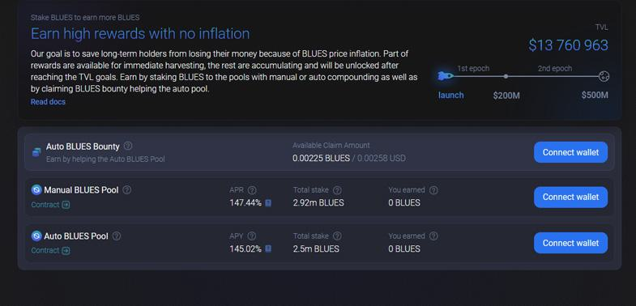

Blueshift Asset Management, established in 2017, is a distinguished player in the field of alternative investment management. The firm specializes in leveraging systematic investing strategies, prominently utilizing equity market-neutral strategies coupled with algorithmic and high-frequency trading. This investment methodology emphasizes the use of advanced computer algorithms to analyze vast sets of financial data, enabling rapid and precise trade execution with minimal human intervention. 

Located in Red Bank, New Jersey, Blueshift benefits from its proximity to major financial hubs such as New York and Philadelphia. This strategic location not only facilitates professional networking and growth opportunities but also enhances lifestyle benefits for its team. As a firm committed to the forefront of quantitative finance, Blueshift fosters a collaborative and innovative work environment. This setting encourages team members to engage with complex challenges, promoting the exchange of ideas and the development of cutting-edge trading models.



The firm is recognized for its multi-disciplinary approach and the robust academic backgrounds of its team members. Such diversity in expertise allows Blueshift to approach financial challenges from a holistic perspective, integrating insights from various fields to optimize investment strategies. The combination of a strategic location, a collaborative culture, and a commitment to innovation positions Blueshift Asset Management as a leading option for professionals seeking to engage with advanced financial solutions and contribute to the evolution of quantitative finance.

## Table of Contents

## What is Algorithmic Trading?

Algorithmic trading involves the use of computer programs that follow a defined set of instructions or algorithms to place trades. These algorithms can be based on timing, price, quantity, or any mathematical model. One of the significant advantages of this method is its ability to process trades with high speed and precision, enabling the execution of large orders without human intervention. By utilizing complex calculations and statistical models, algorithmic trading reduces transaction costs and enhances market efficiency.

In an algorithmic trading system, specific conditions trigger the execution of trades. For example, an algorithm might be programmed to sell a stock if its price falls below a certain threshold or buy when specific indicators align. A simple algorithm for trading a moving average crossover strategy might look like this in Python:

```python
fast_window = 10
slow_window = 50

def moving_average(prices, window):
    return sum(prices[-window:]) / window

def strategy(prices):
    fast_ma = moving_average(prices, fast_window)
    slow_ma = moving_average(prices, slow_window)
    if fast_ma > slow_ma:
        return "Buy"
    elif fast_ma < slow_ma:
        return "Sell"
    return "Hold"
```

Algorithmic trading strategies can encompass a range of financial instruments, such as equities, futures, options, and other asset classes. These strategies are integral to quantitative investment firms like Blueshift, which leverage [algorithmic trading](/wiki/algorithmic-trading) to maintain efficiency and competitiveness in the financial markets. Notably, algorithmic trading facilitates significant advantages, such as increased execution speed, minimized market impact, and improved trade accuracy.

Furthermore, the use of algorithms allows firms to approach trading from a data-driven perspective, with decisions being made based on comprehensive statistical analysis and historical data. This approach helps in identifying patterns and trends that may not be immediately evident to human traders, granting firms the opportunity to capitalize on subtle market inefficiencies.

## Blueshift's Approach to Trading

Blueshift Asset Management prioritizes systematic and quantitative investment strategies that are market-neutral, aiming to minimize risk while optimizing returns. Market-neutral strategies typically involve constructing a portfolio that is designed to be indifferent to market fluctuations. This often involves holding long and short positions of equal value, thereby reducing exposure to market moves.

The firm's approach encompasses both statistical [arbitrage](/wiki/arbitrage) and high-frequency trading. Statistical arbitrage involves exploiting market inefficiencies through the analysis of price deviations, which requires advanced statistical methods and data mining techniques. High-frequency trading, on the other hand, capitalizes on executing a large number of orders at very fast speeds, which demands sophisticated data analysis, ultra-low latency systems, and robust algorithm design.

A core aspect of Blueshift’s strategy is the integration of advanced technology and data analysis techniques to develop competitive trading models. By leveraging vast datasets and [machine learning](/wiki/machine-learning) algorithms, the firm creates predictive models that identify lucrative trading opportunities and adjust quickly to market changes. Python, with its rich libraries and frameworks for data science and machine learning, is often employed for developing these trading algorithms. For instance, libraries like NumPy for numerical computations, Pandas for data manipulation, and Sci-kit Learn for building predictive models are critical components of the strategy execution framework.

```python
import numpy as np
import pandas as pd
from sklearn.linear_model import LinearRegression

# Generate synthetic data
np.random.seed(42)
price_data = np.random.normal(loc=100, scale=10, size=1000)

# Calculating moving average and standard deviation
window = 20
rolling_mean = pd.Series(price_data).rolling(window).mean()
rolling_std = pd.Series(price_data).rolling(window).std()

# Constructing a basic statistical arbitrage model
z_score = (price_data - rolling_mean) / rolling_std

# Simulating a simple long/short strategy based on z-score
signals = np.where(z_score > 1, -1, np.where(z_score < -1, 1, 0))
```

Blueshift fosters a culture that emphasizes open knowledge sharing, creativity, and transparency. Collaborative efforts are encouraged across various disciplines, allowing teams to bring diverse perspectives to solve complex financial problems. This collaborative environment supports the continuous development and refinement of innovative trading models. By promoting a platform where ideas can be freely exchanged and tested, Blueshift enhances its capability to remain agile and responsive to the ever-changing market landscape.

## Blueshift's Automated Trading Platform

Blueshift Asset Management offers a versatile automated trading platform designed to meet the needs of both institutional and individual users. This platform supports event-driven trading, allowing users to deploy strategies that react to market events with minimal latency. The inclusion of high-quality, bias-free datasets spanning various asset classes ensures that traders have access to comprehensive market information crucial for informed decision-making.

The platform is built on a cloud-based infrastructure, making it accessible from any location with internet connectivity. This setup not only provides convenience but also ensures scalability and reliability for users managing significant trading volumes. To cater to different levels of technical proficiency, Blueshift's platform features interfaces that support both Python and no-code environments. This flexibility means that users with sophisticated programming skills can write custom algorithms in Python, while those less familiar with coding can still develop and execute trading strategies using intuitive drag-and-drop tools.

Compliance and security are fundamental components of Blueshift's trading platform. It emphasizes adherence to industry standards and regulatory requirements, offering a secure environment for conducting trading operations. Users can be confident that their trading activities are protected by robust security measures, ensuring the integrity and confidentiality of their financial data. By combining these features, Blueshift's automated trading platform provides a comprehensive solution that addresses the diverse needs of modern traders.

## Career Opportunities at Blueshift

Blueshift Asset Management is dedicated to attracting and cultivating top talent in the field of quantitative finance. The firm actively seeks professionals who hold advanced degrees and possess robust programming skills, particularly for positions such as Quantitative Analyst. Candidates are expected to have a strong foundation in subjects like mathematics, [statistics](/wiki/bayesian-statistics), computer science, or related fields. These skills are crucial for developing and implementing sophisticated trading algorithms that define Blueshift's market approach.

The ability to solve complex problems using analytical and quantitative methods is highly valued at Blueshift. The firm emphasizes a multi-disciplinary environment where collaboration among team members is key to driving innovation and achieving strategic objectives. Therefore, professionals at Blueshift are encouraged to engage in continuous learning and knowledge sharing, which are central to the firm's culture.

Blueshift also places a strong emphasis on diversity and inclusion within its workforce. It is committed to ensuring an employment environment free from discrimination, offering equal opportunities to all individuals, regardless of background. This commitment extends to gender, race, ethnicity, religion, sexual orientation, and other individual differences, aiming to foster a diverse workplace that reflects a variety of perspectives and ideas.

In summary, career opportunities at Blueshift are well-suited for individuals who thrive in a dynamic, challenging, and collaborative setting, where cutting-edge financial technologies meet a supportive and inclusive work environment.

## Conclusion

Blueshift Asset Management is recognized as a leading entity in the field of algorithmic trading, characterized by its commitment to innovation and a culture that encourages collaborative excellence. Leveraging systematic investment strategies, the firm has distinguished itself by minimizing risks and maximizing potential returns through market-neutral approaches. Their advanced trading technologies, which integrate high-frequency and algorithmic trading methods, offer traders precision and efficiency across various asset classes.

The firm's automated trading platform enhances these capabilities, catering to a broad range of users through cloud-based infrastructure and offering features such as event-driven trading and comprehensive datasets. This focus on technological advancement aligns with Blueshift’s goal of maintaining a secure and effective trading environment. Moreover, the platform’s accessibility via Python and no-code interfaces ensures its usability across different expertise levels, supporting both institutional and individual users.

For traders and financial professionals seeking involvement with leading-edge financial solutions, Blueshift Asset Management stands out as a valuable partner. The firm's dedication to developing innovative trading models not only provides an exciting workplace for professionals interested in quantitative finance but also fosters an environment of continuous learning and adaptation to new financial challenges. This makes Blueshift not just a workplace, but a breeding ground for future financial leaders and innovations in algorithmic trading.


## References & Further Reading

[1]: Lo, Andrew W. (2004). ["The Efficient Market Hypothesis and Its Critics."](https://papers.ssrn.com/sol3/papers.cfm?abstract_id=602222) Journal of Economic Perspectives, 18(1), 25-46.

[2]: ["Algorithmic Trading: Winning Strategies and Their Rationale"](https://www.amazon.com/Algorithmic-Trading-Winning-Strategies-Rationale-ebook/dp/B00CY5HC0U) by Ernest P. Chan

[3]: Aldridge, Irene. (2013). ["High-Frequency Trading: A Practical Guide to Algorithmic Strategies and Trading Systems."](https://www.amazon.com/High-Frequency-Trading-Practical-Algorithmic-Strategies/dp/1118343506) Wiley.

[4]: Narang, Rishi K. (2013). ["Inside the Black Box: A Simple Guide to Quantitative and High-Frequency Trading."](https://onlinelibrary.wiley.com/doi/book/10.1002/9781118662717) Wiley.

[5]: Fabozzi, Frank J., Focardi, Sergio M., Kolm, Petter N. (2010). ["Quantitative Equity Investing: Techniques and Strategies."](https://www.amazon.com/Quantitative-Equity-Investing-Techniques-Strategies/dp/0470262478) Wiley.