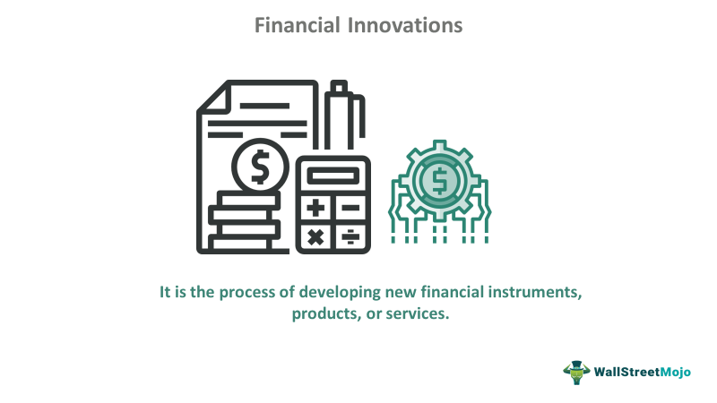

Blythe Masters has established herself as a pivotal figure in financial innovation, particularly through her impactful work on blockchain technology and algorithmic trading. Her career reflects a series of notable achievements and significant contributions to the advancement of transformative financial technologies. As the finance industry evolves, Masters’ influence is evident in how these technologies have been integrated into mainstream financial operations. Her efforts in blockchain and algorithmic trading have not only enhanced the efficiency and security of financial transactions but have also paved the way for new paradigms in market infrastructures. This article will explore Masters’ contributions to these fields and consider the broader implications of these innovations on the global financial industry.

## Table of Contents



## Blythe Masters: A Financial Innovator

Blythe Masters began her illustrious career at JP Morgan, a tenure notable for her rapid advancement through the ranks, driven by her exceptional understanding and strategic insights into complex financial products. One of her most significant contributions during her time at JP Morgan was the development of credit default swaps (CDS). These financial instruments have had a lasting impact on risk management and banking, offering institutions a method to hedge against the default risk associated with various credit products. The creation and popularization of CDS effectively transformed risk assessment and mitigation strategies within financial markets, allowing institutions to manage and distribute risk more efficiently.

In recent years, Masters has shifted her focus towards blockchain technology, becoming one of its most prominent advocates. She has recognized blockchain's potential to fundamentally alter financial transactions and market infrastructures. The distributed ledger technology that underpins blockchain allows for greater transparency, efficiency, and security in transactional processes, addressing longstanding issues within traditional financial systems. Masters' advocacy for blockchain highlights its capability to enhance the integrity and operability of financial markets, paving the way for a new era of secure, streamlined financial services. Her ongoing efforts in this domain demonstrate her commitment to pioneering financial innovation and her influence in guiding the sector towards embracing cutting-edge technological advancements.

## Masters’ Engagement with Blockchain Technology

Blythe Masters, a notable figure in financial innovation, took a pivotal step by joining Digital Asset Holdings as CEO in 2015. Her tenure marked a significant push towards the integration of blockchain technology into financial services. Digital Asset Holdings, a startup focused on improving post-trade processing across financial services, saw an alignment of its vision with Masters' belief in blockchain's transformative capabilities.

Masters identified blockchain as a powerful tool capable of enhancing transparency, efficiency, and security in financial transactions. This technology, fundamentally a decentralized ledger mechanism, offers a way to record transactions across multiple computers to ensure that the record cannot be altered retroactively. Such a system offers considerable advantages over traditional centralized record-keeping systems, particularly in enhancing trust and reducing the potential for fraud.

Under Masters' leadership, Digital Asset Holdings worked on creating tools and solutions to allow financial institutions to improve their existing frameworks by integrating blockchain. This included developing a smart contract modeling language called DAML (Digital Asset Modeling Language), which facilitates the representation of complex financial instruments and transactions in a clear and unambiguous way. DAML is designed to be agnostic and interoperable, allowing for seamless integration with existing systems and improving the reliability and speed of financial operations.

Masters' efforts have been instrumental in bridging the gap between traditional financial systems and emerging digital technologies. Her approach involves collaborating with financial institutions to ensure blockchain's adoption is seamless and beneficial, overcoming the initial skepticism and resistance seen in the industry. By emphasizing blockchain's potential to streamline processes such as settlement and clearing, Masters has showcased how the technology can reduce operational costs and increase the speed of financial transactions.

Furthermore, Masters has highlighted blockchain's role in enhancing data security and privacy. By employing cryptographic techniques, blockchain provides a secure way to record and verify transactions without the need for a central authority. This decentralization is key to reducing the risk of data breaches and ensuring that sensitive financial information is protected from unauthorized access.

Overall, Blythe Masters' engagement with blockchain technology at Digital Asset Holdings has laid the groundwork for a future where blockchain is an integral part of financial infrastructures worldwide. Her vision and leadership continue to inspire innovation and adoption in a sector that is increasingly leaning toward embracing digital transformation.

## Algorithmic Trading and Technological Advancements

Algorithmic trading represents a significant advancement in the financial sector, employing complex mathematical models and algorithms to optimize trading processes. These technologies facilitate rapid decision-making, enabling traders to execute orders at speeds and volumes unattainable by manual trading. Blythe Masters’ influence in this field is noteworthy, as her insights have helped shape modern strategies and enhance the trading capabilities of financial institutions.

Algorithmic trading involves the use of algorithms—sets of rules or instructions—to automate financial transactions. The core objective is to leverage computational power to analyze market data quickly and execute trades at optimal prices. This approach allows for the incorporation of various factors such as market trends, historical data, and news feeds into trading strategies, enabling traders to compete effectively in volatile markets.

Masters' contributions to [algorithmic trading](/wiki/algorithmic-trading) are underscored by her deep understanding of financial markets and her ability to identify opportunities for technological integration. Her experience in developing complex financial products, such as credit default swaps, provided her with insights into how technology could streamline trading operations. In particular, her advocacy for the adoption of algorithmic trading techniques has prompted many financial institutions to invest in technology infrastructure and analytics tools that improve trading efficiency.

A typical algorithmic trading strategy might involve the following steps:

1. **Market Data Collection**: Gather real-time and historical data from multiple financial sources.

   ```python
   import pandas as pd
   data = pd.read_csv('market_data.csv')
   ```

2. **Signal Generation**: Use statistical models to identify trading signals or patterns.

   ```python
   signals = data['price'].rolling(window=20).mean() - data['price'].rolling(window=50).mean()
   ```

3. **Order Execution**: Automatically execute trades based on the signals generated.

   ```python
   if signals[-1] > 0:
       execute_buy_order()
   elif signals[-1] < 0:
       execute_sell_order()
   ```

Masters’ encouragement of these technological advancements is aligned with ongoing trends in the financial industry. Her vision has helped financial institutions transition towards more automated, data-driven approaches, thereby enhancing market [liquidity](/wiki/liquidity-risk-premium), reducing transaction costs, and minimizing human error. These improvements have not only optimized trading strategies but also increased accessibility to financial markets for a broader range of participants.

Overall, Masters’ role in promoting algorithmic trading signifies her broader commitment to leveraging innovative technologies to advance the capabilities of the financial sector. Her work continues to influence how institutions implement cutting-edge technologies to remain competitive in a rapidly evolving landscape.

## The Future of Financial Services

The integration of blockchain and algorithmic trading is anticipated to continue reshaping the global financial landscape significantly. Blythe Masters, a visionary in financial technology, forecasts a 'tsunami of change' propelled by advancements in [artificial intelligence](/wiki/ai-artificial-intelligence) (AI), digital payments, and decentralized finance (DeFi). These innovations promise to enhance both financial inclusion and operational efficiency across the industry.

Blockchain technology, with its decentralized and immutable ledger system, provides unprecedented opportunities for secure and transparent financial transactions. Its adoption in financial services can reduce fraud, minimize transaction costs, and improve the speed of financial operations. Furthermore, the integration of smart contracts, which are self-executing contracts with terms directly written into code, can automate and streamline complex financial agreements. For example, an insurance payout could be automated based on predefined criteria checked against data sources without human intervention.

Algorithmic trading, on the other hand, employs sophisticated mathematical models and algorithms to make trading decisions at speeds and efficiencies that are impossible for human traders. These algorithms analyze vast amounts of data to predict price movements, optimize portfolios, and execute trades at optimal price points, thereby increasing the profitability of market participants. The evolution of AI further enriches these algorithms with better pattern recognition capabilities, enabling more predictive analytics and improving decision-making processes.

The synergy between blockchain and algorithmic trading is particularly potent in the sphere of DeFi. DeFi platforms leverage blockchain technology to create financial instruments and services without traditional intermediaries such as banks. This democratizes access to financial services, offering high-yielding opportunities and unfettered access to individuals around the globe, fostering not just financial inclusion but also innovation.

Digital payments have also seen rapid advancements, bolstered by blockchain technologies and innovations in mobile and online payment systems. These improvements pave the way for faster, cheaper, and more efficient domestic and international transfers. Moreover, the integration of central bank digital currencies (CBDCs) into financial systems is being explored, promising to combine the advantages of both traditional fiat currency and digital assets.

In summary, the intersections of blockchain, algorithmic trading, AI, and digital payments are poised to transform financial services profoundly. These technologies not only increase the operational efficiency and effectiveness of financial services but also broaden access to these services, catering to a wider audience and promoting a more inclusive financial ecosystem.

## Conclusion

Blythe Masters remains a pivotal figure in the transformation of the financial industry, utilizing her profound expertise to spearhead the adoption of innovative technologies. Her work highlights the necessity for financial entities to adapt to technological advancements to maintain competitiveness in an ever-evolving market. As the architect of the credit default swaps and a prominent advocate for blockchain technology, Masters' contributions to modern finance have underscored the critical role of embracing change and innovation.

The financial sector's trajectory suggests that future developments in both blockchain and algorithmic trading will build upon the robust foundation established by Masters and her peers. These technologies, which emphasize improved efficiency, transparency, and security, are poised to further revolutionize how financial transactions are conducted and managed. For instance, blockchain's decentralized ledger system offers an unparalleled level of trust and accuracy in record-keeping, which traditional systems struggle to achieve.

Additionally, algorithmic trading, characterized by the use of sophisticated mathematical models and algorithms, exemplifies how technological enhancement can optimize trading processes by increasing speed and reducing human error. The groundwork laid by Masters in this field ensures that financial institutions can harness these innovations effectively.

As the landscape of financial services continues to evolve, embracing new technologies such as artificial intelligence, digital payments, and decentralized finance (DeFi) will be crucial. These advancements hold the promise of not only enhancing operational efficiencies but also expanding financial inclusion. Innovators like Blythe Masters have set the stage for these changes, and their legacies will continue to influence the direction of financial technology developments for years to come.

## References & Further Reading

[1]: ["The Blockchain Revolution in Financial Services: A Review."](https://www.researchgate.net/publication/350220060_Blockchain_technology_in_financial_services_a_comprehensive_review_of_the_literature) by Christopher L. Culp and Theodore S. Krumel Jr. Financial Markets and Portfolio Management.

[2]: ["Mastering Bitcoin: Unlocking Digital Cryptocurrencies"](https://books.google.com/books/about/Mastering_Bitcoin.html?id=IXmrBQAAQBAJ) by Andreas M. Antonopoulos

[3]: Popper, N. (2016). ["Digital Gold: Bitcoin and the Inside Story of the Misfits and Millionaires Trying to Reinvent Money."](https://www.amazon.com/Digital-Gold-Bitcoin-Millionaires-Reinvent/dp/006236250X)

[4]: ["Algorithmic and High-Frequency Trading"](https://www.amazon.com/Algorithmic-High-Frequency-Trading-Mathematics-Finance/dp/1107091144) by Álvaro Cartea, Sebastian Jaimungal, and José Penalva

[5]: Masters, B. (2015). ["Blockchain: A View from the Economic Trenches."](https://www.sciencedirect.com/science/article/pii/S0268401219306024) Bush Center Report.