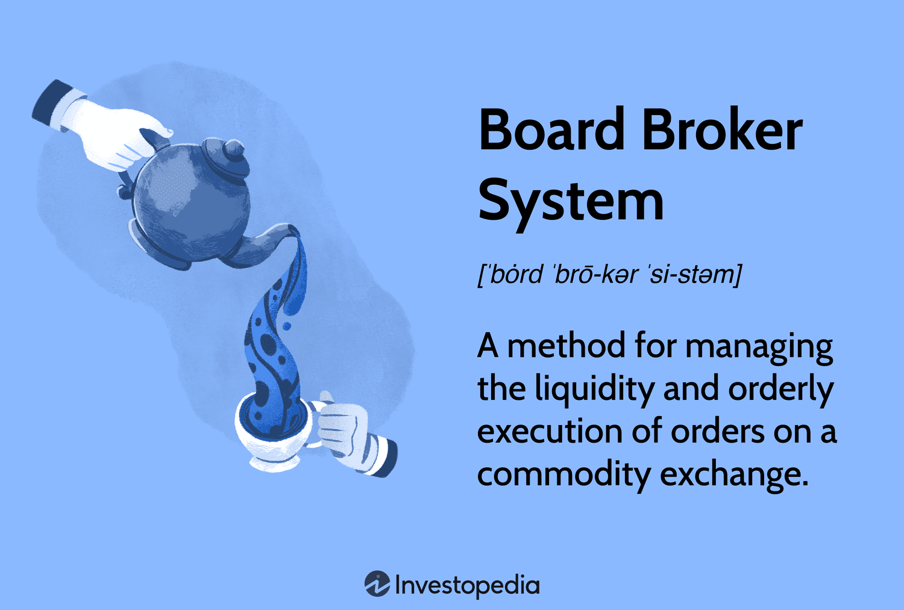

## Table of Contents

## What is a Board Broker System?

A Board Broker System is a way for people to buy and sell stocks without using a traditional stock exchange. Instead, they use a network of brokers who work together to match buyers and sellers. This system is often used for trading stocks that are not listed on major stock exchanges, like penny stocks or stocks of small companies.

In a Board Broker System, the brokers post buy and sell orders on a board, which can be physical or electronic. Other brokers can see these orders and try to match them. When a match is found, the trade is completed. This system can be faster and more flexible than trading on a big stock exchange, but it can also be riskier because there is less regulation and oversight.

## How does a Board Broker System work?

A Board Broker System is like a special club where brokers help people buy and sell stocks that aren't on big stock exchanges. Imagine a big board where brokers write down what they want to buy or sell. This board can be a real one on a wall or a computer screen. When a broker sees an order on the board that matches what their client wants, they can make a deal happen right away.

It's a bit like a game of matching. If someone wants to sell 100 shares of a small company's stock, a broker writes that on the board. Another broker, whose client wants to buy those exact shares, sees the order and says, "I'll take it!" Then, they complete the trade. This way, stocks can be traded quickly and easily, but it's important to be careful because there are fewer rules than on big stock exchanges.

## What are the main components of a Board Broker System?

A Board Broker System has a few main parts that make it work. The first part is the board itself, where brokers write down their buy and sell orders. This board can be a physical one in a room or an electronic one on a computer. It's like a big list that everyone can see, showing what stocks people want to trade.

The second part is the brokers who use the system. These brokers are the ones who write the orders on the board and look for matches. They work for clients who want to buy or sell stocks, and their job is to find the best deals for them. The brokers talk to each other and make trades happen when they find matching orders.

The last part is the rules that keep the system fair. Even though a Board Broker System isn't as strict as a big stock exchange, it still needs some rules to make sure everyone plays by the same guidelines. These rules help prevent cheating and make sure trades are done honestly.

## What are the benefits of using a Board Broker System?

One of the main benefits of using a Board Broker System is that it can be faster and more flexible than trading on a big stock exchange. Because the brokers can see all the buy and sell orders on the board, they can quickly find matches and make trades happen. This can be really helpful if you want to buy or sell stocks that aren't listed on the big exchanges, like penny stocks or stocks from small companies. The system also lets you trade during times when the big exchanges are closed, which can give you more chances to make good deals.

Another benefit is that a Board Broker System can be less expensive. Since it doesn't have all the big rules and costs of a big stock exchange, the fees for trading can be lower. This can save you money, especially if you're trading a lot of stocks. Plus, because the system is smaller and simpler, it might be easier to understand and use, especially if you're new to trading stocks.

## Who typically uses a Board Broker System?

People who usually use a Board Broker System are often those looking to trade stocks that aren't on the big stock exchanges. These might be investors interested in penny stocks or stocks from small companies that aren't listed on places like the New York Stock Exchange or NASDAQ. They use the system because it's easier and faster to trade these kinds of stocks through a network of brokers who can quickly match buy and sell orders.

Another group that uses a Board Broker System includes traders who want to save money on fees. Since trading on a Board Broker System can be less expensive than using a big stock exchange, it's attractive to people who trade a lot and want to keep their costs down. These traders might also like the flexibility of being able to trade outside of the normal hours of the big exchanges, giving them more opportunities to buy and sell stocks when it suits them.

## How can a Board Broker System improve operational efficiency?

A Board Broker System can make things run smoother and faster. Imagine a big board where all the buy and sell orders are posted. Brokers can see this board and quickly find matches for their clients. This means trades can happen faster than on a big stock exchange, where there are more steps and rules to follow. The system also lets people trade at any time, not just during the hours when big exchanges are open. This can help get deals done quicker and make the whole process more efficient.

Another way a Board Broker System helps is by cutting down on costs. Because it's simpler and has fewer rules than a big stock exchange, the fees for trading can be lower. This means brokers and their clients can save money, which can make trading more efficient. When people don't have to worry about high fees, they might trade more often and get better deals, making the whole system work better.

## What are the common challenges faced when implementing a Board Broker System?

One of the big challenges when setting up a Board Broker System is making sure it follows the rules. Even though it's not as strict as a big stock exchange, there still need to be some rules to keep things fair and stop cheating. Figuring out what rules to use and making sure everyone follows them can be hard. Also, since the system is smaller, there might not be as many people using it, which can make it harder to find matches for buy and sell orders.

Another challenge is keeping the system safe and secure. Because it's often used for trading stocks that aren't on big exchanges, there can be more risks. Hackers might try to get into the system and mess things up, so it's important to have good security to protect everyone's information and money. Plus, since the system is less regulated, it can be harder to trust that all the trades are done honestly and fairly.

## Can you compare a Board Broker System with other similar systems?

A Board Broker System is like a smaller, more flexible version of a big stock exchange. In a big stock exchange, there are lots of rules and it can take longer to match buy and sell orders because there are so many people trading. But in a Board Broker System, brokers can see all the orders on a board and quickly find matches, making trades happen faster. This system is often used for trading stocks that aren't listed on big exchanges, like penny stocks or stocks from small companies. It can be cheaper too, since there are fewer fees and costs involved.

Another similar system is an Over-the-Counter (OTC) market, where stocks are also traded outside of the big exchanges. In an OTC market, dealers quote prices at which they are willing to buy or sell a stock, and trades happen when buyers and sellers agree on a price. Like a Board Broker System, an OTC market can be used for trading stocks that aren't on big exchanges. The main difference is that in an OTC market, dealers set the prices, while in a Board Broker System, brokers match orders based on what's written on the board. Both systems offer more flexibility and lower costs than big stock exchanges, but they also come with more risks because there's less regulation.

## What are the latest technological advancements in Board Broker Systems?

The latest tech improvements in Board Broker Systems have made them faster and easier to use. Now, instead of a big physical board, many systems use electronic boards on computers or smartphones. This means brokers can see buy and sell orders from anywhere, not just in one room. They can match orders and make trades happen much quicker. Also, new software helps keep track of all the orders and trades, making the whole process smoother and less likely to have mistakes.

Another big change is better security. Because Board Broker Systems deal with money and important information, keeping everything safe is very important. New technology helps protect against hackers and makes sure all the trades are done honestly. There are also new tools that help brokers find the best deals for their clients, using things like smart algorithms. These tools can look at lots of data and help make smarter trading choices.

## How do you select the right Board Broker System for your organization?

Choosing the right Board Broker System for your organization starts with understanding what you need. Think about the kinds of stocks you want to trade, like penny stocks or stocks from small companies. You'll also want to consider how fast you need to make trades and how much you want to spend on fees. Some systems are better for quick trades, while others might be cheaper but take a bit longer. It's also important to think about how easy the system is to use. If your team is new to trading, you might want a system that's simple and has good support to help you learn.

Once you know what you need, look at different Board Broker Systems and see which ones fit best. Check if they have good security to keep your trades safe from hackers. Also, see if they use new technology that can help you make better trading decisions, like smart algorithms. Talk to other people who use these systems and see what they think. They can tell you about any problems they've had and if the system really works well for them. By comparing all these things, you can pick the Board Broker System that will help your organization trade stocks the best way possible.

## What kind of training is required to effectively use a Board Broker System?

To use a Board Broker System well, you need to learn how it works. This means understanding how to read the board where all the buy and sell orders are shown. You'll need to know how to put your own orders on the board and how to find matches for them. Training usually includes learning about the rules of the system, so you know how to trade fairly and avoid mistakes. It's also important to get comfortable with any software or tools that the system uses, so you can use them quickly and correctly.

Besides the basics, you might need some extra training depending on your job. If you're a broker, you'll need to learn how to find the best deals for your clients and how to talk to other brokers to make trades happen. If you're new to trading, you might want some classes or workshops to help you understand the stock market better. The good news is that many Board Broker Systems offer training and support to help you learn, so you can ask questions and get help when you need it.

## What future trends are expected in the development of Board Broker Systems?

In the future, Board Broker Systems are expected to become even more high-tech and easy to use. They will likely use more smart technology, like [artificial intelligence](/wiki/ai-artificial-intelligence), to help brokers find the best deals faster. This means the systems will be able to look at a lot of information and make quick decisions, making trading smoother and more efficient. Also, the boards where orders are posted will probably become more advanced, with features that let brokers see more details and make better choices. This could make the whole process of buying and selling stocks quicker and easier.

Another trend we might see is more focus on safety and security. As more people use these systems, keeping them safe from hackers will be very important. New technology will help protect the systems and make sure all trades are done honestly. There might also be more rules to make sure everyone follows the same guidelines, which can help keep the system fair and trustworthy. Overall, these changes will help Board Broker Systems keep up with the fast-paced world of trading and make them even better for people who use them.

## References & Further Reading

[1]: Bergstra, J., Bardenet, R., Bengio, Y., & Kégl, B. (2011). ["Algorithms for Hyper-Parameter Optimization."](https://proceedings.neurips.cc/paper/2011/file/86e8f7ab32cfd12577bc2619bc635690-Paper.pdf) Advances in Neural Information Processing Systems 24.

[2]: ["Advances in Financial Machine Learning"](https://www.amazon.com/Advances-Financial-Machine-Learning-Marcos/dp/1119482089) by Marcos Lopez de Prado

[3]: ["Evidence-Based Technical Analysis: Applying the Scientific Method and Statistical Inference to Trading Signals"](https://www.amazon.com/Evidence-Based-Technical-Analysis-Scientific-Statistical/dp/0470008741) by David Aronson

[4]: ["Machine Learning for Algorithmic Trading"](https://github.com/stefan-jansen/machine-learning-for-trading) by Stefan Jansen

[5]: ["Quantitative Trading: How to Build Your Own Algorithmic Trading Business"](https://books.google.com/books/about/Quantitative_Trading.html?id=j70yEAAAQBAJ) by Ernest P. Chan