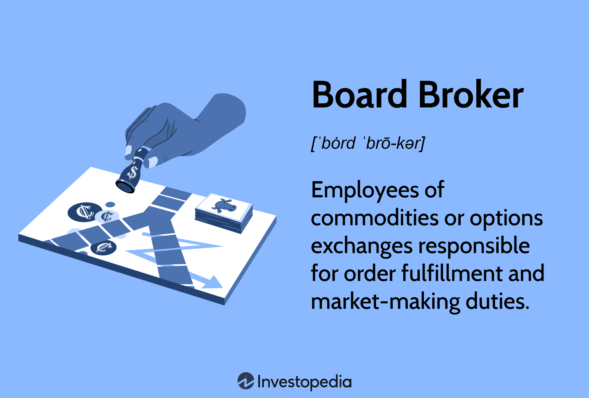

## Table of Contents

## What is a Board Broker?

A Board Broker is a person or company that helps people buy and sell shares of a company that is not listed on a big stock market. They work with smaller companies that are not on places like the New York Stock Exchange. Instead, these companies are traded on what is called an over-the-counter (OTC) market.

The main job of a Board Broker is to match buyers and sellers of these shares. They make sure that the trades happen smoothly and fairly. They also help with the paperwork and make sure everything follows the rules. This is important because trading shares of smaller companies can be more complicated than trading shares of big companies on a stock exchange.

## How does a Board Broker differ from a traditional broker?

A Board Broker mainly works with shares of smaller companies that are not listed on big stock markets like the New York Stock Exchange. These shares are traded on what's called an over-the-counter (OTC) market. The job of a Board Broker is to help people buy and sell these shares by matching buyers with sellers. They also handle the paperwork and make sure everything is done correctly and follows the rules.

On the other hand, a traditional broker usually works with shares of bigger companies that are listed on major stock exchanges. These brokers can help you buy and sell shares more easily because the companies are well-known and the trading happens on organized stock markets. Traditional brokers might offer more services like investment advice, managing your portfolio, and helping you with other financial products like mutual funds or bonds. So, while a Board Broker focuses on smaller, less-known companies, a traditional broker deals with bigger, more established companies and often provides a wider range of services.

## What are the main services offered by a Board Broker?

A Board Broker helps people buy and sell shares of small companies that are not on big stock markets. They work on what is called the over-the-counter (OTC) market. Their main job is to find someone who wants to buy the shares and someone who wants to sell them, and then they help make the trade happen. They make sure the trade is fair and that both the buyer and seller are happy with the deal.

Another important service that a Board Broker offers is handling all the paperwork that comes with trading shares. This can be tricky because the rules for trading on the OTC market can be different from the big stock markets. The Board Broker makes sure everything is done right and follows the rules. This helps keep the trading process smooth and helps avoid any problems that might come up.

## Who typically uses the services of a Board Broker?

People who want to invest in smaller companies that are not on big stock markets often use the services of a Board Broker. These investors might be looking for new opportunities that they can't find on the big stock exchanges. They might believe that these smaller companies have a lot of potential to grow and make money in the future.

Sometimes, people who already own shares in these smaller companies also use Board Brokers. They might want to sell their shares to someone else. A Board Broker helps them find a buyer and makes sure the trade happens smoothly. This can be really helpful because trading shares of smaller companies can be more complicated than trading shares of big companies on well-known stock markets.

## How does one become a Board Broker?

To become a Board Broker, you usually need to know a lot about the financial world, especially about the over-the-counter (OTC) market where smaller companies' shares are traded. You might need a degree in finance, business, or something similar. It's also really helpful to have some experience working in the stock market or in a job that deals with buying and selling shares.

Once you have the right education and experience, you can start working for a company that deals with OTC trading. You might start as an assistant or in a lower position and work your way up to becoming a Board Broker. You'll need to learn how to match buyers and sellers, handle all the paperwork, and make sure everything follows the rules. It can take time and hard work, but if you're good at it, you can help people invest in smaller companies and make their trades happen smoothly.

## What qualifications are necessary to be a successful Board Broker?

To be a successful Board Broker, you need to know a lot about the financial world, especially the over-the-counter (OTC) market. This means you should have a degree in finance, business, or a related field. It's also important to have some experience working in the stock market or in a job that involves buying and selling shares. This experience helps you understand how to match buyers and sellers, handle all the paperwork, and make sure everything follows the rules.

Being good at talking to people and solving problems is also really important. As a Board Broker, you'll need to talk to buyers and sellers to make sure they're happy with their trades. You'll also need to solve any problems that come up during the trading process. If you can do all these things well, you can help people invest in smaller companies and make their trades happen smoothly.

## What are the legal and ethical considerations for Board Brokers?

Board Brokers have to follow many rules and laws when they help people buy and sell shares of smaller companies. These rules are there to make sure that the trading is fair and honest. For example, Board Brokers need to make sure they tell the truth about the shares they are trading. They can't lie or hide important information from buyers or sellers. They also need to keep good records of all the trades they help with, so they can show that everything was done correctly. If they don't follow these rules, they could get in big trouble, like losing their job or even facing legal action.

Besides following the law, Board Brokers also need to think about what is right and wrong. This means they should always try to be fair to both buyers and sellers. They should not favor one side over the other just to make more money. They also need to keep any private information they learn about their clients secret. It's important for Board Brokers to always act in a way that people can trust them. By doing what is right, they help keep the OTC market a fair and honest place for everyone.

## How do Board Brokers facilitate transactions between buyers and sellers?

Board Brokers help people buy and sell shares of smaller companies that are not on big stock markets. They work on what is called the over-the-counter (OTC) market. Their main job is to find someone who wants to buy the shares and someone who wants to sell them. Once they find these people, the Board Broker helps them agree on a price and make the trade happen. They make sure the trade is fair and that both the buyer and seller are happy with the deal.

Another important way Board Brokers help is by handling all the paperwork that comes with trading shares. This can be tricky because the rules for trading on the OTC market can be different from the big stock markets. The Board Broker makes sure everything is done right and follows the rules. This helps keep the trading process smooth and helps avoid any problems that might come up. By doing this, Board Brokers make it easier for people to invest in smaller companies and feel confident that their trades are safe and fair.

## What are the common challenges faced by Board Brokers?

Board Brokers often face challenges because they work with smaller companies that are not on big stock markets. One big challenge is finding enough buyers and sellers. Since these companies are not as well-known, it can be hard to match people who want to buy shares with people who want to sell them. This means Board Brokers have to work hard to find the right people and make sure they are happy with the trade.

Another challenge is dealing with all the rules and paperwork. The over-the-counter (OTC) market has different rules than big stock markets, and it can be tricky to make sure everything is done correctly. Board Brokers need to keep good records and follow all the rules to avoid getting in trouble. This can take a lot of time and effort, but it's important to make sure the trades are fair and honest.

## How has technology impacted the role of Board Brokers?

Technology has changed the way Board Brokers work a lot. Now, they can use computers and the internet to find buyers and sellers more easily. They can use special software to keep track of all the trades and make sure everything is done right. This helps them work faster and make fewer mistakes. They can also talk to people all over the world quickly, which makes it easier to find someone who wants to buy or sell shares.

Even though technology helps a lot, it also brings new challenges. Board Brokers need to learn how to use new tools and keep up with changes in technology. They also need to be careful about keeping information safe online. Even with these challenges, technology makes their job easier and helps them serve their clients better.

## Can you discuss a case study where a Board Broker played a pivotal role?

In a small town, there was a company called GreenTech that made eco-friendly products. GreenTech wasn't big enough to be on a big stock market, so they used a Board Broker named Sarah to help people buy and sell their shares. Sarah worked hard to find people who wanted to invest in GreenTech because they believed in its mission to help the environment. She matched these buyers with people who already owned shares and wanted to sell them. Thanks to Sarah's efforts, GreenTech was able to grow and hire more people in the town.

One day, a big investor found out about GreenTech and wanted to buy a lot of shares. Sarah had to make sure the trade was fair and that all the paperwork was done right. She talked to both the buyer and the sellers to make sure everyone was happy with the deal. The big investor ended up buying a lot of shares, which helped GreenTech get more money to make even better products. Sarah's work as a Board Broker was really important for GreenTech's success, and the town was proud of how she helped the company grow.

## What future trends are expected to influence the Board Broker industry?

In the future, technology will keep changing how Board Brokers work. They will use more and more computer programs to find buyers and sellers quickly. These programs will help them keep track of all the trades and make sure everything is done right. This will make their job easier and help them serve their clients better. But they will also need to learn how to use new tools and keep up with changes in technology. They will need to be careful about keeping information safe online, too.

Another trend that will affect Board Brokers is more rules and laws. Governments might make new rules to make sure trading is fair and honest. Board Brokers will need to follow these rules carefully. This might mean more paperwork and more work to make sure everything is done right. But it will also help keep the over-the-counter market a safe place for people to invest in smaller companies. Board Brokers who can handle these changes well will be very important in helping smaller companies grow and succeed.

## References & Further Reading

[1]: Bergstra, J., Bardenet, R., Bengio, Y., & Kégl, B. (2011). ["Algorithms for Hyper-Parameter Optimization."](https://dl.acm.org/doi/10.5555/2986459.2986743) Advances in Neural Information Processing Systems 24.

[2]: ["Advances in Financial Machine Learning"](https://www.amazon.com/Advances-Financial-Machine-Learning-Marcos/dp/1119482089) by Marcos Lopez de Prado.

[3]: ["Evidence-Based Technical Analysis: Applying the Scientific Method and Statistical Inference to Trading Signals"](https://www.amazon.com/Evidence-Based-Technical-Analysis-Scientific-Statistical/dp/0470008741) by David Aronson.

[4]: ["Machine Learning for Algorithmic Trading"](https://github.com/stefan-jansen/machine-learning-for-trading) by Stefan Jansen.

[5]: ["Quantitative Trading: How to Build Your Own Algorithmic Trading Business"](https://www.amazon.com/Quantitative-Trading-Build-Algorithmic-Business/dp/1119800064) by Ernest P. Chan.