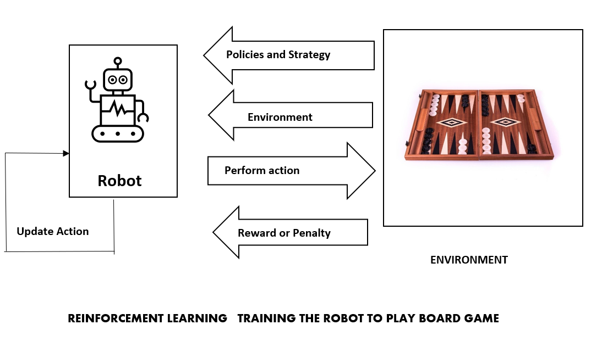

## Table of Contents

## What is a board game model in the context of machine learning?

In machine learning, a board game model refers to a type of simulation or environment where algorithms can learn to make decisions by playing a game. This model mimics the rules and dynamics of a traditional board game, allowing the machine learning system to explore different strategies, learn from outcomes, and improve its performance over time. The goal is often to train an AI to play the game at a high level, much like a human player would, by understanding the game's rules, predicting opponents' moves, and optimizing its own strategy.

These models are particularly useful because they provide a controlled and well-defined environment for testing and developing machine learning algorithms. For instance, researchers might use a board game model to study reinforcement learning, where an AI agent learns to take actions based on feedback from its environment. By playing thousands or even millions of games, the AI can refine its decision-making process, learning which moves lead to wins and which lead to losses. This approach not only helps in developing smarter AI systems but also offers insights into how learning and decision-making processes can be optimized in more complex real-world scenarios.

## How does a basic board game model differ from advanced ones?

A basic board game model is simple and focuses on the main rules of the game. It usually has a small number of moves and players. The game state can be easily understood and the AI learns from simple wins and losses. For example, a basic model for Tic-Tac-Toe would include the board layout and rules for winning. The AI would learn to place its 'X' or 'O' to block the opponent and aim for three in a row. The focus is on quick learning and understanding basic strategies.

Advanced board game models are more complex and detailed. They include many rules, different types of moves, and sometimes multiple players or teams. These models can simulate real-life board games like Chess or Monopoly, where the AI must consider many possible moves and their outcomes. For example, in an advanced Chess model, the AI needs to understand piece movements, special moves like castling, and long-term strategy. The AI learns not just from wins and losses but from the value of each move, using algorithms like [reinforcement learning](/wiki/reinforcement-learning) to improve over time. These models are used to train AI to play at a high level, similar to expert human players.

## What are the key components of a board game model?

A board game model in [machine learning](/wiki/machine-learning) includes a few main parts. First, there is the game state, which is like a snapshot of the game at any moment. It shows where all the pieces are, whose turn it is, and any other important details. The game state helps the AI understand what is happening and decide what to do next. Then, there are the rules, which tell the AI what moves are allowed and how to win or lose. These rules make sure the AI plays the game correctly.

Next, there are the actions, which are all the possible moves the AI can make. The AI chooses an action based on the current game state and the rules. It might use a strategy to pick the best move. Finally, there is the reward system, which gives the AI feedback on its choices. If the AI makes a good move, it gets a positive reward. If it makes a bad move, it gets a negative reward. This helps the AI learn and get better over time. Together, these parts make up a board game model that the AI can use to learn and play the game.

## How does AlphaZero approach learning to play board games?

AlphaZero learns to play board games by starting from scratch, without any pre-existing knowledge of the game. It uses a method called reinforcement learning, where it plays many games against itself. Each game helps AlphaZero learn what works and what doesn't. It does this by using a [neural network](/wiki/neural-network) to predict the best moves and the likely outcome of the game. The neural network gets better over time as AlphaZero plays more games and sees more examples of good and bad moves.

AlphaZero's learning process involves two main steps: playing games and updating its neural network. When AlphaZero plays a game, it uses the current version of its neural network to decide on moves. After each game, it looks at the results and updates the neural network to make better predictions next time. This cycle repeats over and over, with AlphaZero getting better with each game it plays. This approach allows AlphaZero to master complex games like Chess, Go, and Shogi by learning from its own experience, without needing any human guidance or example games.

## What makes MuZero different from AlphaZero in terms of board game modeling?

MuZero is different from AlphaZero because it doesn't need to know all the rules of the game to start learning. AlphaZero needs to know the full game state and all possible moves from the beginning. But MuZero can learn a game by just seeing the results of its actions. It figures out the rules and the best moves by playing and getting feedback, without needing to know everything at the start.

This makes MuZero more flexible and able to handle games where the rules are not fully known or are very complex. For example, if a game has hidden information or changes over time, MuZero can still learn to play well. It does this by building a model of the game in its mind and updating it as it plays more games. This approach lets MuZero learn and play games that might be too hard for AlphaZero to handle right away.

## Can you explain the concept of reinforcement learning as used in TD-Gammon?

TD-Gammon is a famous example of using reinforcement learning to teach a computer how to play backgammon. In reinforcement learning, the computer learns by playing the game many times and getting feedback on its moves. For TD-Gammon, the computer starts by playing random moves and then slowly learns which moves are good and which are bad. It does this by looking at the difference between what it expected to happen and what actually happened after each move. This difference helps the computer adjust its strategy to make better moves in the future.

The key idea in TD-Gammon is called temporal difference learning, or TD learning for short. TD learning helps the computer learn from the game as it goes along, without needing to wait until the end of the game to know if it did well. The computer uses a neural network to guess how good a position is and then updates its guess based on the next move's outcome. This way, it can learn from every move, not just from winning or losing the whole game. Over time, TD-Gammon got really good at backgammon, even beating top human players, showing how powerful reinforcement learning can be.

## How do board game models like AlphaZero and MuZero handle the exploration-exploitation trade-off?

AlphaZero and MuZero both use a method called Monte Carlo Tree Search (MCTS) to handle the exploration-exploitation trade-off. This means they need to decide between trying new moves to learn more about the game (exploration) and using moves they already know work well (exploitation). In MCTS, they play out many possible future moves in their minds, like imagining different ways the game could go. They use a formula called the Upper Confidence Bound for Trees (UCT) to help them decide which moves to explore. The UCT formula balances the value of a move (how good it seems) with how much it has been tried before. This helps AlphaZero and MuZero find a good mix of exploring new moves and sticking with moves that have worked well in the past.

For AlphaZero, the UCT formula is used directly in the MCTS to guide the search. It looks at how many times a move has been tried and how well it has done, helping AlphaZero decide if it should try a new move or stick with a known good one. MuZero takes this a step further by not needing to know all the game rules at the start. It learns the game as it goes, using the same MCTS and UCT approach but also building its own model of the game. This means MuZero can explore and exploit in games where the rules are not fully known, making it more flexible than AlphaZero. Both methods help these AI systems get better at playing games by finding the right balance between trying new things and using what they already know.

## What role does Monte Carlo Tree Search play in board game models?

Monte Carlo Tree Search (MCTS) helps AI systems like AlphaZero and MuZero make smart choices when playing board games. It works by imagining lots of different ways the game could go from the current position. The AI tries out many possible moves in its mind, like playing out mini-games. This helps the AI see which moves might lead to a win and which might lead to a loss. MCTS uses a special formula called Upper Confidence Bound for Trees (UCT) to decide which moves to explore more. The formula looks at how good a move seems and how often it has been tried before, helping the AI balance trying new moves with using moves that have worked well in the past.

In the UCT formula, the AI calculates a score for each possible move. The score is based on how well the move has done in past simulations and how often it has been tried. The formula is $$UCT = \frac{w_i}{n_i} + C \sqrt{\frac{\ln N}{n_i}}$$, where $$w_i$$ is the total reward for the move, $$n_i$$ is the number of times the move has been tried, $$N$$ is the total number of simulations, and $$C$$ is a constant that controls how much the AI should explore new moves. By using this formula, MCTS helps the AI find the best balance between exploring new moves and sticking with moves that have worked well before. This makes the AI better at playing board games over time.

## How can the performance of a board game model be evaluated?

The performance of a board game model can be evaluated by looking at how well it plays the game. One way to do this is by having the AI play against other AI systems or human players. If the AI wins more games than it loses, that's a good sign it's performing well. Another way is to use a rating system, like Elo ratings, which give a number to show how strong a player is. The higher the Elo rating, the better the AI is at the game. For example, if an AI's Elo rating goes up after playing many games, it means the AI is getting better.

Another important way to evaluate the performance is by looking at how the AI makes its decisions. This can be done by checking how often the AI picks the best move, which is called move accuracy. If the AI often chooses the best move, it shows that the model is working well. Researchers can also use metrics like the average reward the AI gets during games. If the average reward goes up over time, it means the AI is learning and improving. These methods help us understand how good the board game model is and how it can be made even better.

## What are some challenges faced when scaling board game models to more complex games?

When scaling board game models to more complex games, one major challenge is the increase in the number of possible moves and game states. In simpler games like Tic-Tac-Toe, there are only a few moves to consider, but in games like Chess or Go, the number of possible moves grows very large. This makes it harder for the AI to explore all the possible outcomes. The AI needs more time and computing power to think through all the possibilities, which can slow down the learning process. If the AI can't look far enough ahead, it might miss important moves and strategies, making it less effective at playing the game.

Another challenge is dealing with hidden information and complex rules. In games like Poker or Settlers of Catan, players might not know everything that's happening, which makes it harder for the AI to make good decisions. The AI needs to learn how to guess what other players might do and how to react to surprises. Also, if the game has many special rules or changes over time, the AI needs to keep learning and adapting. This can be tricky because the AI might need to use more advanced techniques like those used by MuZero, which learns the rules as it goes along. These challenges make it harder to build a board game model that can handle more complex games well.

## How do advanced board game models incorporate domain knowledge to improve performance?

Advanced board game models often use domain knowledge to get better at playing games. Domain knowledge is information about the game that experts know, like special moves or strategies. For example, in Chess, knowing that controlling the center of the board is important can help the AI play better. By adding this kind of knowledge to the model, the AI can make smarter choices faster. It doesn't have to learn everything from scratch, which saves time and makes the AI stronger from the start.

One way to add domain knowledge is by tweaking the reward system in reinforcement learning. The AI can be given extra points for doing things that experts know are good, like capturing a key piece in Chess or building a strong defense in Go. This helps the AI focus on what really matters in the game. Another way is by using special rules or heuristics in the search algorithms, like Monte Carlo Tree Search (MCTS). For example, the AI might be told to look at certain moves first because they are known to be important. This can be done by adjusting the Upper Confidence Bound for Trees (UCT) formula to give more weight to moves with domain knowledge, like $$UCT = \frac{w_i}{n_i} + C \sqrt{\frac{\ln N}{n_i}} + \text{domain\_bonus}$$. By using domain knowledge, advanced board game models can play at a higher level and learn more efficiently.

## What future developments can we expect in the field of board game modeling with machine learning?

In the future, we can expect board game models to get even better at playing games by using new machine learning techniques. One big area of growth will be in using more advanced reinforcement learning methods, like those used by AlphaZero and MuZero. These methods help the AI learn faster and handle more complex games. Researchers might also find ways to make the AI learn from fewer games, which would save time and computer power. Another exciting development could be the use of more domain knowledge. By adding what experts know about games, like special strategies or important moves, the AI can start playing at a high level right away. This could make the AI even stronger and more efficient.

Another future trend might be in making board game models more flexible. Right now, models like AlphaZero need to know all the rules of a game before they start learning. But models like MuZero can learn the rules as they go, which is a big step forward. In the future, we might see even more models that can handle games with hidden information or changing rules. This would make the AI better at games like Poker or Settlers of Catan, where players don't know everything that's happening. By using techniques like $$UCT = \frac{w_i}{n_i} + C \sqrt{\frac{\ln N}{n_i}} + \text{domain\_bonus}$$ and other new ideas, board game models could become even smarter and more adaptable.

## References & Further Reading

[1]: Silver, D., Huang, A., Maddison, C. J., Guez, A., Sifre, L., van den Driessche, G., ... & Hassabis, D. (2016). ["Mastering the game of Go with deep neural networks and tree search."](https://www.nature.com/articles/nature16961) Nature, 529(7587), 484-489.

[2]: Schrittwieser, J., Antonoglou, I., Hubert, T., Simonyan, K., Sifre, L., Schmitt, S., ... & Silver, D. (2020). ["Mastering Atari, Go, Chess and Shogi by Planning with a Learned Model."](https://arxiv.org/abs/1911.08265) Nature, 588(7839), 604-609.

[3]: ["DeepMind AlphaZero: Video Series on How AlphaZero Learns to Play Chess, Shogi, and Go."](https://deepmind.google/discover/blog/alphazero-shedding-new-light-on-chess-shogi-and-go/) DeepMind.

[4]: Sutton, R. S., & Barto, A. G. (2018). ["Reinforcement Learning: An Introduction."](https://web.stanford.edu/class/psych209/Readings/SuttonBartoIPRLBook2ndEd.pdf) MIT press.

[5]: Tesauro, G. (1995). ["Temporal Difference Learning and TD-Gammon."](https://dl.acm.org/doi/10.1145/203330.203343) Communications of the ACM, 38(3), 58-68.

[6]: Browne, C. B., Powley, E., Whitehouse, D., Lucas, S. M., Cowling, P. I., Rohlfshagen, P., ... & Colton, S. (2012). ["A Survey of Monte Carlo Tree Search Methods."](https://ieeexplore.ieee.org/abstract/document/6145622) Journal of Artificial Intelligence Research, 40, 663-704.