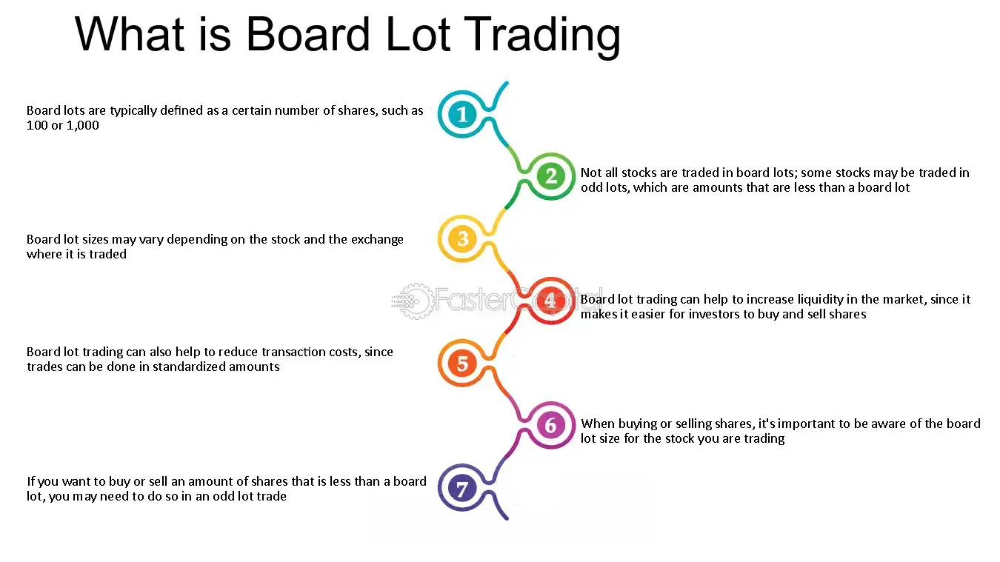

## Table of Contents

## What is a board lot in the context of stock trading?

A board lot is a standard number of shares that you can buy or sell on a stock exchange. It's like buying things in bulk; for example, if you want to buy apples, you might have to buy them in bags of 10. In the stock market, a board lot helps keep trading organized. The size of a board lot can change depending on the price of the stock. For stocks that cost less, you might need to buy more shares at once, while for expensive stocks, you might buy fewer shares.

Understanding board lots is important because if you want to buy or sell stocks, you need to do it in these set amounts. If you want to buy a number of shares that isn't a board lot, you might have to pay extra fees. This rule helps keep the stock market running smoothly and makes it easier for everyone to trade.

## Why are board lots important for investors?

Board lots are important for investors because they help make trading easier and more organized. When you want to buy or sell stocks, you have to do it in these set amounts, called board lots. This rule helps keep the stock market running smoothly. It's like when you buy things in a store; if you want to buy apples, you might have to buy them in bags of 10. In the same way, if you want to buy stocks, you have to buy them in the board lot size set by the stock exchange.

If you want to buy or sell a number of shares that isn't a board lot, you might have to pay extra fees. This can make trading more expensive. By sticking to board lots, investors can save money and avoid these extra costs. It also makes it easier for everyone to trade because they know exactly how many shares they need to buy or sell at one time. This helps keep the market fair and efficient for all investors.

## How does the size of a board lot affect trading?

The size of a board lot can make a big difference in how you trade stocks. If the board lot is big, you have to buy or sell more shares at once. This can be good if you want to buy a lot of stocks, but it can be hard if you only want a few shares. For example, if a board lot is 100 shares and you only want to buy 50, you might have to pay extra fees to buy less than the board lot size.

On the other hand, if the board lot is small, you can buy or sell fewer shares at a time. This can be helpful if you don't have a lot of money to spend or if you want to slowly build up your stock holdings. Smaller board lots can make trading easier and cheaper for small investors. So, the size of a board lot can affect how much you can trade and how much it costs you.

## What is the standard board lot size for stocks?

The standard board lot size for stocks depends on the price of the stock. In many stock markets, if a stock costs less than $1, you usually have to buy it in board lots of 1,000 shares. This means if you want to buy that stock, you have to buy at least 1,000 shares at once.

For stocks that cost between $1 and $10, the board lot size is usually 500 shares. If the stock costs more than $10, you typically have to buy it in board lots of 100 shares. These rules help keep trading organized and make it easier for everyone to buy and sell stocks.

## Can the board lot size vary between different stock exchanges?

Yes, the board lot size can be different between different stock exchanges. Each stock exchange has its own rules about how many shares you need to buy or sell at one time. For example, the New York Stock Exchange might have different board lot sizes than the Toronto Stock Exchange. This means that if you want to buy stocks on different exchanges, you might have to buy different amounts of shares each time.

These differences can affect how you trade. If you are used to buying stocks on one exchange where the board lot size is 100 shares, you might be surprised to find out that on another exchange, you need to buy 500 shares at once. It's important to know the board lot size for each exchange you trade on, so you can plan your buying and selling better and avoid any extra fees.

## How do board lots impact the liquidity of a stock?

Board lots can affect how easy it is to buy or sell a stock, which we call [liquidity](/wiki/liquidity-risk-premium). If the board lot size is big, it might be harder to find someone who wants to buy or sell the same number of shares as you. For example, if you want to sell 100 shares but the board lot size is 500 shares, it might take longer to find someone who wants to buy 500 shares all at once. This can make the stock less liquid because it's harder to trade quickly.

On the other hand, if the board lot size is small, it can make the stock more liquid. When the board lot size is smaller, more people can buy or sell the stock easily because they don't need to buy a lot of shares at once. This means more people can trade the stock, and it's easier to find someone to buy or sell with. So, smaller board lot sizes can help make a stock more liquid and easier to trade.

## What are the rules for trading odd lots versus board lots?

When you trade stocks, you usually have to buy or sell them in board lots, which is a set number of shares. But sometimes, you might want to buy or sell a different number of shares, which is called an odd lot. Trading odd lots can be more complicated and might cost you more money. Most stock exchanges have special rules for trading odd lots. For example, you might have to pay extra fees, and it might take longer to find someone to trade with because fewer people trade odd lots.

The rules for trading odd lots can be different depending on the stock exchange. Some exchanges might let you trade odd lots more easily than others. If you want to trade an odd lot, you need to check the rules of the exchange where you want to trade. This way, you can know if you'll have to pay extra fees and how long it might take to complete your trade. Understanding these rules can help you decide if trading an odd lot is worth it for you.

## How do changes in board lot sizes influence market dynamics?

When the board lot size changes, it can make a big difference in how people trade stocks. If the board lot size gets smaller, more people might start trading because they can buy or sell smaller amounts of shares. This can make the stock market busier and more liquid, which means it's easier for people to buy and sell stocks quickly. Smaller board lots can also help small investors who don't have a lot of money to spend, because they can buy fewer shares at once.

On the other hand, if the board lot size gets bigger, it might make trading harder for some people. They might need to buy or sell more shares at once, which can be tough if they don't have enough money or if they just want to trade a small number of shares. This can make the market less liquid because fewer people might want to trade. Big board lots can also lead to more odd lot trading, which can be more expensive and take longer to complete. So, changes in board lot sizes can really change how the stock market works.

## What strategies can traders use to optimize trading around board lot sizes?

Traders can optimize their trading around board lot sizes by planning their trades carefully. If they know the board lot size for the stock they want to buy or sell, they can make sure their orders match that size. This can help them avoid extra fees for trading odd lots. For example, if the board lot size is 100 shares, a trader might decide to buy or sell in multiples of 100 to keep things simple and cost-effective. They can also look at the price of the stock to see if it might be better to wait for a change in the board lot size, which could make trading easier or cheaper.

Another strategy is to use limit orders, which let traders set a specific price at which they want to buy or sell a stock. This can be helpful when trading around board lot sizes because it gives traders more control over their trades. They can set their limit orders to match the board lot size and their desired price, making it easier to get the best deal. By being patient and flexible, traders can take advantage of changes in board lot sizes and improve their chances of successful trading.

## How do board lots affect the pricing and transaction costs for investors?

Board lots can affect how much investors pay for stocks and how much they spend on trading. When you buy or sell stocks, you usually have to do it in board lots, which is a set number of shares. If you want to buy or sell a different number of shares, called an odd lot, you might have to pay extra fees. These extra fees can make trading more expensive. So, if you stick to buying and selling in board lots, you can save money and keep your trading costs down.

The size of the board lot can also change how much you pay for stocks. If the board lot size is big, you have to buy more shares at once, which can be hard if you don't have a lot of money. But if the board lot size is small, you can buy fewer shares, which can be easier and cheaper. Knowing the board lot size can help you plan your trades better and find the best prices for the stocks you want to buy or sell.

## What are some historical examples of board lot size changes and their market impacts?

In the past, stock exchanges have changed board lot sizes to make trading easier for investors. One big example happened in 2005 when the Toronto Stock Exchange (TSX) changed the board lot size for stocks that cost more than $1. Before 2005, you had to buy or sell these stocks in lots of 100 shares. But after the change, you could buy or sell them in lots of just 1 share. This made it a lot easier for small investors to buy stocks because they didn't need to buy as many shares at once. It also made the market more liquid because more people could trade.

Another example is from the New York Stock Exchange (NYSE). In 2010, they changed the rules for board lots to make trading more flexible. They started letting investors buy or sell stocks in any number of shares, not just in set board lots. This change helped make the market more active because it was easier for people to trade the exact number of shares they wanted. It also helped small investors who might not have had enough money to buy a whole board lot. These changes showed how important board lot sizes can be for making the stock market work better for everyone.

## How do electronic trading platforms handle board lots compared to traditional trading floors?

Electronic trading platforms make it easier to handle board lots compared to traditional trading floors. On electronic platforms, you can see the board lot size for each stock right on your computer or phone. This helps you know exactly how many shares you need to buy or sell at one time. If you want to trade an odd lot, the platform can show you any extra fees you might have to pay. This makes it simpler for you to plan your trades and keep your costs down.

On traditional trading floors, it can be harder to keep track of board lot sizes. You have to talk to a broker or a trader on the floor to find out the board lot size for the stock you want to trade. This can take more time and might be more confusing. Also, if you want to trade an odd lot, you might have to wait longer to find someone to trade with, and you might have to pay more in fees. So, electronic trading platforms make trading board lots easier and more efficient for everyone.

## What is Algorithmic Trading: An Overview?

Algorithmic trading represents a significant advancement in the execution of trading strategies, leveraging computational algorithms to automate the process of buying and selling securities. By utilizing sophisticated software, [algorithmic trading](/wiki/algorithmic-trading) executes trades at speeds and prices unattainable by human traders alone. This automation mitigates the influence of human emotions and errors, thereby enhancing operational efficiency and consistency in decision-making processes.

At the core of algorithmic trading are quantitative models and algorithms that identify trading opportunities, generate buy or sell signals, and manage order execution. These algorithms can process vast data sets and perform complex calculations rapidly, enabling traders to capitalize on fleeting market opportunities.

Key strategies employed in algorithmic trading include:

1. **Moving Averages**: Trading algorithms often utilize moving averages to identify trends and potential entry or exit points. A moving average is a calculation to analyze data points by creating a series of averages of different subsets. For instance, a simple moving average (SMA) can be defined as:
$$
   SMA = \frac{P_{t-n+1} + P_{t-n+2} + \ldots + P_{t}}{n}

$$
   where $P$ represents the price points and $n$ is the number of periods over which the average is calculated. Algorithms interpret crossovers between short-term and long-term moving averages as potential buy or sell signals.

2. **Arbitrage Opportunities**: Algorithms can identify price discrepancies between different markets or financial instruments. By simultaneously buying and selling these instruments, traders can exploit the price differential, effectively achieving risk-free profit. Arbitrage strategies require high-speed execution and precision, making them ideal for algorithmic trading.

3. **Mean Reversion**: This strategy is predicated on the belief that asset prices will revert to their historical average over time. Algorithms monitor deviation from established norms and execute trades when prices are perceived to have diverged significantly, anticipating a return to the mean. The mathematical model may be based on the z-score:
$$
   z = \frac{X - \mu}{\sigma}

$$
   where $X$ is the current price, $\mu$ is the mean price, and $\sigma$ is the standard deviation.

The impact of algorithmic trading on financial markets is profound. By facilitating continuous and instantaneous trade execution, it significantly increases liquidity, reduces bid-ask spreads, and enhances market efficiency. Furthermore, algorithmic trading can improve price discovery, allowing for more accurate assessments of an asset's intrinsic value.

However, the rapid pace and large [volume](/wiki/volume-trading-strategy) of trades executed by algorithms also pose challenges, such as exacerbating market [volatility](/wiki/volatility-trading-strategies) and contributing to events like the 2010 Flash Crash. Regulatory bodies continue to adapt to ensure markets remain fair and stable amid these technological advances. As algorithmic trading evolves, the integration of [artificial intelligence](/wiki/ai-artificial-intelligence) and [machine learning](/wiki/machine-learning) promises to further transform trading methodologies and market landscapes.

## References & Further Reading

[1]: Bergstra, J., Bardenet, R., Bengio, Y., & Kégl, B. (2011). ["Algorithms for Hyper-Parameter Optimization."](https://papers.nips.cc/paper/4443-algorithms-for-hyper-parameter-optimization) Advances in Neural Information Processing Systems 24.

[2]: ["Advances in Financial Machine Learning"](https://www.amazon.com/Advances-Financial-Machine-Learning-Marcos/dp/1119482089) by Marcos Lopez de Prado

[3]: ["Evidence-Based Technical Analysis: Applying the Scientific Method and Statistical Inference to Trading Signals"](https://books.google.com/books/about/Evidence_Based_Technical_Analysis.html?id=MeoJAQAAMAAJ) by David Aronson

[4]: ["Machine Learning for Algorithmic Trading"](https://github.com/stefan-jansen/machine-learning-for-trading) by Stefan Jansen

[5]: ["Quantitative Trading: How to Build Your Own Algorithmic Trading Business"](https://www.amazon.com/Quantitative-Trading-Build-Algorithmic-Business/dp/1119800064) by Ernest P. Chan