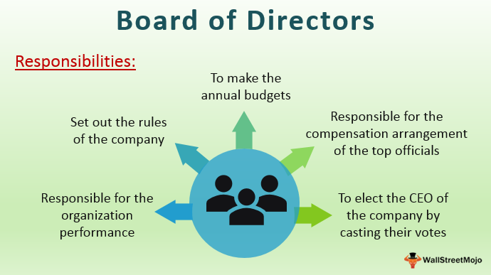

Evaluating the board of directors is a critical component of corporate governance, ensuring that a company's strategic objectives align with shareholder interests while maintaining accountability and transparency. The board plays a pivotal role in guiding corporate strategy, overseeing management, and safeguarding shareholder interests. With the rapid evolution of financial markets, propelled by technological advancements, the importance of robust corporate governance practices has become increasingly evident.

Algorithmic trading, which utilizes computer algorithms to automate trading decisions and execute orders, has transformed the financial landscape. This approach enhances trading efficiency, reduces transaction costs, and increases market liquidity. However, it also introduces risks, such as system failures and potential market manipulation. In this context, the board's role in corporate governance becomes crucial, as it ensures the necessary checks and balances to manage these risks effectively.

Effective board evaluations are key to maintaining high governance standards. They provide an opportunity to assess the board's composition, competencies, and decision-making processes. By identifying areas for improvement, board evaluations help fortify governance structures, indirectly supporting more responsible algorithmic trading practices. Board evaluations can reveal issues such as potential conflicts of interest or gaps in expertise, which, if left unaddressed, could negatively impact a company's operational and financial outcomes.

As we explore the interplay between board evaluations and corporate governance, it becomes clear that these assessments are instrumental in enhancing the board's effectiveness and, by extension, in stabilizing algorithmic trading operations. This nexus underscores the necessity for ongoing evaluation and adaptation within both domains, aimed at fostering sustainable business practices and financial market integrity.

## Table of Contents

## Understanding Board Evaluation

Board evaluation is a systematic process aimed at assessing the effectiveness, structure, and dynamics of a company's board of directors. Its primary objectives are to enhance board performance, ensure accountability, and align the board’s activities with the organization’s strategic goals. Effective board evaluations serve to identify strengths and areas for improvement, fostering a culture of continuous improvement and proactive governance.

Several factors underscore the need for regular board evaluations. Corporate scandals, such as those involving financial misreporting or executive misconduct, often highlight governance deficiencies, spurring regulatory bodies to mandate stricter oversight and frequent board assessments. Regulatory requirements, like those imposed by the Securities and Exchange Commission (SEC) or the Sarbanes-Oxley Act in the United States, necessitate that companies conduct periodic board evaluations to maintain compliance and uphold investor confidence.

Best practices in board evaluation processes are crucial for achieving meaningful outcomes. These include establishing clear evaluation criteria tailored to the specific context of the organization, as well as utilizing a comprehensive approach that encompasses self-assessments, peer reviews, and sometimes third-party evaluations. Engaging third-party evaluators can offer objective insights and enhance the credibility of the evaluation, as these external parties can identify issues that internal members might overlook due to proximity or bias.

Furthermore, implementing regular feedback mechanisms allows boards to address issues promptly and adjust strategies as necessary. Innovative techniques, such as real-time feedback systems and digital surveys, can facilitate a more dynamic evaluation process, enabling boards to maintain agility in responding to governance challenges.

In summary, board evaluations are a vital component of corporate governance, driven by the need for accountability, regulatory obligations, and the pursuit of excellence. By adhering to best practices, companies can leverage these evaluations to reinforce their governance frameworks, ultimately contributing to sustainable success and resilience in an ever-evolving business landscape.

## Role of the Board of Directors in Corporate Governance

The board of directors plays a crucial role in corporate governance, overseeing the management and ensuring that the company adheres to its defined strategic objectives while maintaining accountability to shareholders. The primary responsibilities of the board encompass setting corporate strategies, evaluating management performance, and making high-level decisions about the company's financial affairs, all aimed at promoting the long-term success of the corporation.

**Responsibilities of the Board of Directors**

Firstly, the board is responsible for defining the company's mission and vision, which includes strategic planning and goal setting. This strategic oversight ensures that the company is aligned with its long-term objectives and can adapt to market changes. In addition to strategic oversight, the board is accountable for appointing and, if necessary, dismissing executive leadership, ensuring that the company is managed effectively at the highest levels.

Furthermore, the board ensures compliance with relevant laws, regulations, and ethical standards. This involves establishing internal controls and robust risk management strategies. Financial oversight is another critical function, as the board must review and approve major financial decisions, including budgets, financial statements, and capital expenditures.

**Board Composition and Governance Quality**

The composition of the board significantly affects governance quality. A well-composed board typically includes a diverse mix of skills, experiences, and perspectives, which contributes to well-rounded decision-making and problem-solving. Diversity in board composition not only encompasses professional expertise but also gender, ethnicity, and age diversity, fostering a broader understanding of market dynamics and stakeholder needs.

Effective boards exhibit a balance between executive and non-executive directors, emphasizing the importance of independent directors. Independent directors, who are not involved in the day-to-day operations of the company, bring impartiality and objectivity to board deliberations. They serve as a check on management actions and ensure that the interests of shareholders are prioritized. The presence of independent directors mitigates the risk of conflicts of interest and promotes transparency and accountability within the corporation.

According to a study published in the Journal of Finance, firms with a higher proportion of independent directors often report better performance metrics, attributing this to enhanced accountability and oversight. This underscores the role that independent directors play in strengthening corporate governance frameworks and contributing to overall corporate performance.

In essence, the board of directors is central to ensuring robust corporate governance by managing strategic direction, executive oversight, compliance, and financial stewardship. A well-composed board, with a significant representation of independent directors, is pivotal in achieving high governance standards and ensuring that the corporation operates with integrity and efficiency.

## Benchmarking Effective Board Evaluation Practices

Board evaluation practices are crucial for ensuring effective corporate governance and enhancing the overall functioning of a company's board of directors. Recent studies and empirical data underline the importance of these evaluations in improving board dynamics, decision-making processes, and strategic oversight.

Effective board evaluation typically involves a rigorous assessment of board performance, focusing on factors such as the quality of discussions, decision-making effectiveness, and the board's ability to respond to dynamic business challenges. A study published in the "Journal of Business Ethics" highlights that companies with robust board evaluation frameworks tend to exhibit stronger governance practices and superior financial performance (source: [SpringerLink](https://link.springer.com/journal/10551)).

Third-party evaluators play a significant role in ensuring the objectivity of board evaluations. By bringing an external perspective, these evaluators help identify areas for improvement that insiders might overlook due to familiarity or potential biases. Their impartiality facilitates a more candid appraisal of board dynamics and individual director contributions, which is crucial for implementing meaningful improvements. According to a report by PwC, nearly half of the surveyed boards employ third-party firms to enhance the credibility and usefulness of their evaluations (source: [PwC.com](https://www.pwc.com)).

Innovative board evaluation techniques are increasingly incorporating real-time feedback mechanisms and peer reviews to foster continuous improvement. Real-time feedback enables directors to receive immediate insights on their performance, facilitating a more dynamic and responsive governance approach. Such mechanisms are supported by digital tools that allow for anonymous feedback, encouraging more honest and constructive criticism.

Peer reviews, another innovative practice, involve directors evaluating each other to provide mutual feedback on their contributions and areas for improvement. This approach not only cultivates a culture of accountability but also strengthens collegial relationships among board members. A survey by the National Association of Corporate Directors (NACD) indicates that peer reviews are correlated with improved board engagement and enhanced strategic oversight capabilities (source: [NACD Board Leadership](https://www.nacdonline.org)).

In conclusion, benchmarking effective board evaluation practices involves adopting comprehensive methodologies that incorporate objective third-party assessments, real-time feedback, and peer review mechanisms. These practices are instrumental in refining board performance and driving robust corporate governance, ultimately contributing to the long-term success of the organization.

## Impact of Corporate Governance on Algorithmic Trading

Corporate governance plays a pivotal role in the performance of [algorithmic trading](/wiki/algorithmic-trading) platforms, primarily through risk minimization, compliance assurance, and enhanced decision-making. Strong governance practices provide a framework that ensures efficient and ethical trading operations, which is essential in the high-frequency domain of algorithmic trading.

The connection between corporate governance and algorithmic trading begins with risk management. Robust corporate governance structures mandate the establishment of comprehensive risk management policies. These policies are critical in algorithmic trading, where microsecond delays or erroneous algorithms can lead to significant financial losses. By instituting thorough risk assessment and monitoring mechanisms, boards can oversee the creation and deployment of trading algorithms that adhere to specified risk parameters and comply with market regulations. Moreover, effective governance requires ongoing evaluations and updates to these algorithms in response to evolving market conditions, thereby reducing the potential for catastrophic failures.

Compliance is another area where corporate governance significantly impacts algorithmic trading. Regulatory bodies around the world have stringent requirements for algorithmic trading to prevent market manipulation and ensure transparency. A strong governance framework ensures that companies not only comply with these regulations but also foster a culture of ethical trading practices. This commitment to compliance not only helps in avoiding legal penalties but also enhances the company’s reputation and trustworthiness in the financial market.

Decision-making in algorithmic trading benefits greatly from the strategic oversight provided by a well-functioning board of directors. Boards are responsible for setting the strategic direction and ensuring that trading strategies align with the company’s risk appetite and long-term objectives. For instance, the inclusion of independent directors, as highlighted in prior sections, allows for impartial assessments of algorithmic strategies, challenging assumptions and promoting strategies that are both innovative and aligned with the company's goals. The presence of directors with diverse expertise, including financial technology, can further bolster informed decision-making and propel competitive advantage through technologically advanced trading strategies.

Examples of companies where board oversight has improved trading operations are instructive. Consider financial institutions like Goldman Sachs and JPMorgan Chase, which have integrated strong corporate governance cultures deeply into their trading operations. These firms have rigorous board-level committees dedicated to overseeing the technology and operations of algorithmic trading. Their proactive governance practices have led to sophisticated risk management frameworks and compliance systems, enabling them to operate effectively in volatile markets.

In conclusion, the intersection of corporate governance and algorithmic trading enhances operational efficiency by embedding risk management, compliance, and strategic decision-making into the very fabric of trading operations. The role of corporate governance here is not peripheral but central to sustaining the long-term viability and success of algorithmic trading initiatives.

## Challenges and Opportunities

Board evaluations present several challenges, most notably conflicts of interest and time constraints. Conflicts of interest often arise when board members are involved in evaluating their peers or themselves, leading to biased assessments that can undermine the evaluation’s effectiveness. To mitigate this issue, boards can engage external evaluators, who provide an independent perspective, ensuring objectivity and reducing partiality. Time constraints also hamper board evaluations, as directors often prioritize immediate operational concerns over long-term governance practices. This can lead to rushed evaluations that fail to provide meaningful insights. To address this, companies can incorporate evaluations as part of their regular board meetings and strategic planning sessions, creating a structured timeline that integrates evaluation into the board’s routine activities.

Despite these challenges, board evaluations offer substantial opportunities to enhance governance and operational efficiency. By systematically identifying weaknesses and areas for improvement, evaluations serve as a catalyst for strategic realignment and skill enhancement. Boards can leverage evaluations to foster more dynamic and responsive governance structures, potentially reshaping their agenda-setting, risk management, and decision-making processes. Furthermore, evaluations can provide crucial feedback on board composition and dynamics, aiding in the recruitment and retention of diverse, skilled, and independent directors who can lead the company toward sustainable growth.

Trends in corporate governance are shaping board evaluation practices as well. There is an increasing emphasis on stakeholder engagement, transparency, and accountability, driving boards to adopt more comprehensive and inclusive evaluation frameworks. With the growing focus on environmental, social, and governance ([ESG](/wiki/esg-investing)) issues, boards are now required to evaluate their performance in these areas, ensuring that they align corporate strategies with broader societal goals. Additionally, technological advancements, particularly in data analytics and digital communication tools, are enabling more granular and continuous evaluation processes. These technologies facilitate the collection and analysis of vast amounts of performance data, offering boards real-time insights into their effectiveness and impact.

Overall, overcoming the challenges of board evaluations and seizing the opportunities they present can significantly improve corporate governance. As global business environments evolve, boards that commit to rigorous, objective evaluations stand to gain a competitive advantage, ensuring their companies are well-positioned to navigate future challenges and capitalize on emerging opportunities.

## Future Outlook

As technological advancements continue to shape the corporate landscape, board evaluation processes are anticipated to undergo significant transformations. Emerging technologies, particularly [artificial intelligence](/wiki/ai-artificial-intelligence) (AI) and [machine learning](/wiki/machine-learning), are poised to enhance both the effectiveness and efficiency of board oversight and algorithmic trading.

AI and machine learning offer powerful tools for data analysis and decision-making, both of which are crucial in board evaluations and corporate governance. For instance, AI can be employed to analyze vast amounts of data related to board performance, enabling the identification of patterns and trends that might not be apparent through traditional evaluation methods. Machine learning algorithms can assess historical performance data to predict future governance outcomes, helping boards to pre-empt potential governance failures.

These technologies can also improve algorithmic trading platforms by optimizing decision-making processes. Machine learning models can be used to refine trading algorithms by continuously learning from new data inputs, thereby enhancing trading strategies and increasing profitability. Moreover, by integrating AI-driven insights into corporate governance practices, boards can better oversee these trading platforms, ensuring compliance with regulations and minimizing operational risks.

The regulatory landscape is also evolving, potentially reshaping corporate governance practices. Regulators are increasingly focusing on transparency and accountability, which could lead to more stringent governance requirements. Boards might need to leverage new technologies to comply with these regulations, using AI tools to ensure adherence to evolving standards. Furthermore, regulatory bodies are beginning to recognize the value of AI in promoting good governance, possibly integrating AI-driven assessments into legal frameworks.

In summary, the future will likely see board evaluations becoming more technologically advanced, with AI and machine learning providing enhanced insights and predictive capabilities. These advancements, coupled with changing regulatory demands, will drive the evolution of corporate governance practices, ensuring that boards remain effective stewards of their organizations in a rapidly changing business environment.

## Conclusion

Board evaluations serve as a cornerstone for maintaining effective corporate governance. By rigorously assessing the board of directors, organizations can ensure accountability, transparency, and strategic alignment with long-term objectives. Regular evaluations provide insights into the performance and composition of the board, enabling corrective actions that are crucial for sustaining robust governance frameworks.

Strong corporate governance, as reinforced through board evaluations, directly influences the efficiency and reliability of algorithmic trading systems. Effective oversight leads to enhanced risk management practices, compliance with regulatory standards, and optimized decision-making processes, all of which are vital for the success of algorithmic trading platforms. For example, a well-functioning board can guide the development of sophisticated trading algorithms that comply with market regulations and ethical standards, thereby reducing the risks of financial misconduct and enhancing market confidence.

Given the interconnectedness of board performance and corporate outcomes, stakeholders are encouraged to prioritize comprehensive board evaluations. This approach not only strengthens governance but also supports sustainable business performance by aligning corporate strategies with evolving market dynamics. As organizations face increasing scrutiny from investors and regulators, adopting systematic evaluation processes is paramount for maintaining credibility and competitive advantage in the financial markets.

In conclusion, the dedication to consistent board evaluations is indispensable for fostering a culture of excellence and resilience within corporations. Stakeholders must recognize the invaluable impact of sound governance practices on both operational efficacy and financial innovation, particularly in the era of algorithmic trading. Prioritizing these evaluations will not only enhance corporate governance but also set a foundation for sustainable growth and success in an ever-evolving financial landscape.

## References & Further Reading

[1]: ["Journal of Finance"](https://onlinelibrary.wiley.com/journal/15406261) - Features studies on the role of independent directors and corporate governance. 

[2]: Leblanc, R., & Gillies, J. (2005). ["Inside the Boardroom: How Boards Really Work and the Coming Revolution in Corporate Governance."](https://archive.org/details/insideboardroomh0000lebl) John Wiley & Sons.

[3]: Brown, G., & Steenbeek, O. W. (2004). ["The Role of Risk Management in Corporate Governance."](https://onlinelibrary.wiley.com/doi/abs/10.1111/j.1467-8683.2009.00763.x) European Corporate Governance Institute (ECGI) - Finance Working Paper No. 47/2004.

[4]: Prado, M. L. (2018). ["Advances in Financial Machine Learning."](https://www.amazon.com/Advances-Financial-Machine-Learning-Marcos/dp/1119482089) John Wiley & Sons.

[5]: PwC. ["Annual Corporate Directors Survey."](https://www.pwc.com/us/en/services/governance-insights-center/library/annual-corporate-directors-survey.html)

[6]: NACD Board Leadership. ["Board Evaluation: Improving Director Effectiveness and Strategic Insight."](https://www.nacdonline.org/all-governance/governance-resources/committees-and-roles/full-board-leadership/)

[7]: Fermín, M. (Ed.). (2020). ["Machine Learning for Financial Risk Management with Python."](https://www.oreilly.com/library/view/machine-learning-for/9781492085249/) Springer International Publishing.

[8]: SEC Official Website. ["Sarbanes-Oxley Act of 2002."](https://www.sec.gov/rules-regulations/staff-guidance/compliance-disclosure-interpretations/division-corporation-finance-sarbanes-oxley-act-2002-frequently-asked-questions)