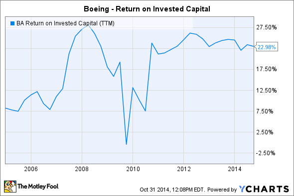

## Table of Contents

## What is Return on Equity (ROE) and why is it important?

Return on Equity (ROE) is a financial ratio that shows how well a company is using the money that shareholders have invested in it. It is calculated by dividing the company's net income by the shareholders' equity. In simple terms, ROE tells you how much profit a company makes with the money shareholders have put into it. For example, if a company has an ROE of 15%, it means that for every dollar of shareholders' equity, the company generates 15 cents in profit.

ROE is important because it helps investors understand how efficiently a company is managing its equity to generate profits. A higher ROE indicates that the company is using the shareholders' money effectively to grow and make more money. This can be attractive to investors looking for companies that can provide good returns on their investments. On the other hand, a low ROE might suggest that the company is not using the shareholders' money well, which could be a red flag for potential investors. By comparing the ROE of different companies, investors can make better decisions about where to invest their money.

## How is ROE calculated?

ROE is calculated by dividing a company's net income by its shareholders' equity. Net income is the profit a company makes after paying all its expenses. Shareholders' equity is the amount of money that shareholders have invested in the company, plus any profits that have been kept in the company instead of being paid out as dividends. To find ROE, you take the net income number and divide it by the shareholders' equity number. The result is usually shown as a percentage.

For example, if a company has a net income of $10 million and shareholders' equity of $50 million, you would divide $10 million by $50 million. This gives you an ROE of 0.20, or 20%. This means that for every dollar of shareholders' equity, the company is making 20 cents in profit. It's a simple way to see how well a company is using the money its shareholders have given it.

## What is Boeing's current ROE?

Boeing's current Return on Equity (ROE) can change from one quarter to another. As of the most recent financial data available, Boeing's ROE is around -30%. This means that for every dollar of shareholders' equity, Boeing is losing about 30 cents. ROE is calculated by dividing the company's net income by its shareholders' equity. A negative ROE like Boeing's shows that the company is not making a profit and is instead losing money.

It's important to understand that a negative ROE doesn't always mean a company is in trouble. For Boeing, the negative ROE could be due to big costs from things like the 737 MAX issues or the impact of the global health crisis on the airline industry. Investors look at ROE to see how well a company is using the money shareholders have invested. Even though Boeing's ROE is negative right now, it's just one piece of information. Investors also look at other things like the company's plans for the future and how it's doing compared to other companies in the same industry.

## How has Boeing's ROE changed over the past five years?

Over the past five years, Boeing's ROE has gone down a lot. In 2019, Boeing had an ROE of around 500%, which was very high. But then, because of problems with the 737 MAX and the global health crisis, their ROE started to drop fast. By 2020, it was already negative at around -40%. This means that for every dollar shareholders put in, Boeing was losing 40 cents that year.

In the years after 2020, Boeing's ROE stayed negative. In 2021, it was about -20%, and in 2022, it got a little worse at around -30%. By 2023, it was still around -30%. This shows that Boeing has been losing money for shareholders for several years now. Even though the ROE is negative, it's important to know that Boeing is working on fixing these problems and trying to get back to making money for its shareholders.

## What factors influence Boeing's ROE?

Boeing's ROE is influenced by many things. One big thing is how much money the company makes or loses. If Boeing sells a lot of planes and makes a lot of money, its ROE goes up. But if it has problems like the 737 MAX issues or if fewer people are flying because of a global health crisis, it can lose money and its ROE goes down. Another thing that affects ROE is how much money shareholders have put into the company. If shareholders invest more money, the equity part of the ROE formula gets bigger, which can make the ROE smaller if the net income stays the same.

Also, how well Boeing manages its costs can change its ROE. If the company can make planes cheaper or find other ways to save money, it can make more profit and boost its ROE. But if costs go up, like if they have to pay a lot for fixing problems or if materials get more expensive, it can hurt the company's profits and lower its ROE. So, Boeing's ROE depends on how much money it makes, how much shareholders have invested, and how well it controls its costs.

## How does Boeing's ROE compare to the industry average?

Boeing's ROE is a lot lower than the average for companies that make airplanes. Right now, Boeing's ROE is about -30%, which means it's losing money. But other airplane companies are doing better. Their average ROE is around 10% to 15%. This shows that while Boeing is losing money for its shareholders, other companies in the same business are making money.

There are good reasons why Boeing's ROE is so different from the industry average. Boeing has had some big problems like the 737 MAX issues and the global health crisis that made fewer people fly. These problems made Boeing lose a lot of money. Other airplane companies didn't have these same problems, so they could keep making money. Even though Boeing's ROE is lower than the industry average right now, it's working on fixing its problems and trying to get back to making money for its shareholders.

## What are the main components of Boeing's equity?

Boeing's equity is made up of different parts. One big part is the money that shareholders put into the company when they buy its stock. This is called "common stock." Another part is the money that Boeing has made over the years but hasn't given back to shareholders as dividends. This is called "retained earnings." If Boeing makes a profit, it can keep some of that money to use for growing the business or paying for other things.

There's also something called "additional paid-in capital." This is extra money that shareholders pay when they buy Boeing's stock for more than its basic value. Sometimes, Boeing's equity can also include "accumulated other comprehensive income." This is money that comes from things like changes in the value of foreign currencies or investments that aren't shown in the regular profit and loss statement. All these parts together make up Boeing's total equity, which is what shareholders own in the company.

## How do Boeing's operational efficiencies impact its ROE?

Boeing's operational efficiencies play a big role in its ROE. When Boeing makes planes more efficiently, it can save money on costs like materials and labor. If it can make planes cheaper, it can sell them for a profit and that profit goes into the net income part of the ROE formula. So, if Boeing gets better at making planes, its net income goes up and that can make its ROE higher. But if Boeing has problems and can't make planes efficiently, like if it has to spend a lot of money fixing issues or if it takes longer to make planes, its costs go up and its net income goes down. This makes its ROE lower because it's not making as much money for shareholders.

Another way operational efficiencies affect Boeing's ROE is through how well it manages its money. If Boeing can use its money wisely to make planes faster and better, it can turn that money into more profits. This means more money in the net income part of the ROE formula, which can boost its ROE. But if Boeing isn't good at managing its money and ends up wasting it or spending it on things that don't help make more planes, its profits won't go up as much. This can keep its ROE low because it's not using the money shareholders gave it to make as much profit as it could. So, being efficient in how it makes planes and manages money is really important for Boeing's ROE.

## What strategic decisions has Boeing made that affect its ROE?

Boeing made some big choices that changed its ROE. One big choice was to keep making the 737 MAX even after it had problems. This cost a lot of money to fix and made Boeing lose money, which made its ROE go down a lot. Another choice was to spend a lot on new planes like the 787 Dreamliner. This cost a lot upfront, but it was meant to make money in the future. But because it took a long time to make these planes and they had some issues, it didn't help Boeing's ROE right away.

Boeing also decided to buy other companies, like when it bought Embraer's commercial plane business. This was meant to help Boeing make more money in the future, but it cost a lot of money right away. This made Boeing's equity bigger but didn't help its profits right away, which made its ROE go down. Also, Boeing chose to give money back to shareholders through buying back its own stock. This made its equity smaller, which can make ROE go up if profits stay the same. But if the company loses money, like Boeing did, this can make ROE even worse. So, these choices had a big effect on Boeing's ROE, sometimes making it go down and sometimes trying to make it go up in the future.

## How does Boeing's debt level influence its ROE?

Boeing's debt level can change its ROE a lot. When Boeing borrows money, it has to pay it back with interest. If the company uses this borrowed money to make more planes and sell them for a profit, it can help its ROE go up. But if Boeing can't make enough money to pay back the debt and the interest, it can lose money. This makes its net income go down, which can make its ROE lower because it's not making as much money for shareholders.

Boeing has a lot of debt right now. This big debt can make its ROE go down even more if it can't make enough money to cover the costs of borrowing. When a company has a lot of debt, it can be risky because it has to pay back that money no matter what. If Boeing can't make enough money from selling planes, the debt can make its problems even worse and push its ROE down. So, how much debt Boeing has is really important for its ROE.

## What are the potential risks and limitations of using ROE as a performance metric for Boeing?

Using ROE to measure how well Boeing is doing has some risks and limits. One big risk is that ROE can be affected a lot by how much debt a company has. If Boeing borrows a lot of money, it can make its equity smaller and its ROE look better, even if it's not making more money. But if Boeing can't pay back that debt, it can lose a lot of money and its ROE can go down fast. So, looking at ROE alone might not show the whole picture of how well Boeing is doing because it doesn't tell you about the risks from having a lot of debt.

Another limit of using ROE for Boeing is that it doesn't show everything about the company's performance. ROE is just one number that looks at how much profit Boeing makes compared to the money shareholders put in. But it doesn't tell you about other important things like how well Boeing is making planes, how happy its customers are, or if it's doing better than other airplane companies. Also, ROE can change a lot from one year to the next because of things like the 737 MAX problems or the global health crisis. So, while ROE can be a helpful number to look at, it's important to use it with other information to really understand how Boeing is doing.

## How can Boeing improve its ROE in the future?

Boeing can improve its ROE by making more money and managing its costs better. If Boeing can sell more planes and make them cheaper, it will have more profit. This profit is the net income part of the ROE formula. So, if Boeing can make its net income bigger, its ROE will go up. Boeing can do this by fixing the problems with the 737 MAX and making sure its new planes like the 787 Dreamliner work well. Also, if Boeing can find ways to save money, like making planes faster or using less expensive materials, it can make more profit and boost its ROE.

Another way Boeing can improve its ROE is by managing its money better. If Boeing has less debt, it won't have to pay as much interest, which can help its profits go up. Also, if Boeing uses the money it has more wisely, like investing in things that will make more planes and more money in the future, it can make its ROE better. Boeing can also think about not giving as much money back to shareholders through buying back its own stock until it's making more profit. By focusing on making more money and managing its costs and debt better, Boeing can work on making its ROE go up in the future.

## What is Return on Equity (ROE) and how can it be understood?

Return on Equity (ROE) is a fundamental financial metric used to evaluate a company's ability to generate profit relative to shareholders' equity. It provides insights into how effectively a company uses the invested capital from its shareholders to produce earnings. The formula for calculating ROE is expressed as:

$$
\text{ROE} = \left( \frac{\text{Net Income}}{\text{Shareholders' Equity}} \right) \times 100
$$

Where:
- **Net Income** represents the total earnings after all expenses, taxes, and costs have been deducted from revenue.
- **Shareholders' Equity** is the residual interest in the assets of a company after deducting liabilities, often including common and preferred stock, retained earnings, and additional paid-in capital.

A high ROE value typically signifies that a company is proficiently managing its equity base to generate substantial profits, reflecting robust financial health. Conversely, a low ROE may indicate inefficiencies in utilizing shareholders' investment to drive earnings.

ROE is particularly useful when compared to the broader industry benchmarks. For example, a tech company with a ROE surpassing the average for the technology sector suggests superior management and profit-making strategies in that company. However, context is important; an industry plagued by high leverage may naturally exhibit higher average ROEs, as companies may achieve higher returns on a smaller equity base due to substantial debt.

Effective management is often deemed responsible for high ROE levels, as it reflects their capability to maximize returns for shareholders through strategic decisions, operational efficiency, and financial acumen. Furthermore, consistent ROE performance, when analyzed over multiple periods, can indicate stability and reliability in a company's profit-generating mechanisms, offering long-term investment appeal to stakeholders.

In summary, ROE serves as a critical indicator of profitability and managerial effectiveness, acting as a valuable benchmark for comparing companies within the same sector and guiding investment decisions.

## How does Boeing compare to its competitors?

Boeing, a leading aerospace manufacturer, frequently exhibits higher financial leverage compared to its industry counterparts like Airbus and Lockheed Martin. Financial leverage, a ratio of a company's debt in relation to its equity, can amplify both potential returns and risks for investors. Boeing's heavy reliance on debt financing often results in a more pronounced Return on Equity (ROE) when the company experiences favorable financial periods. This leverage allows Boeing to boost its ROE, as long as the company's earnings sufficiently cover the cost of debt.

However, an examination of net profit margins reveals a different story. Boeing's net profit margins tend to be lower than those of many of its competitors, which can offset the benefits derived from high leverage. Net profit margin, calculated as:

$$
\text{Net Profit Margin} = \left( \frac{\text{Net Income}}{\text{Revenue}} \right) \times 100
$$

serves as a critical indicator of a company's profitability independent of its capital structure. Airbus and Lockheed Martin often report more stable and higher profit margins, indicative of efficient cost management and competitive revenue generation.

For investors, analyzing ROE alongside net profit margins and other financial metrics is crucial for understanding a company's market position. A comprehensive examination of these factors allows investors to ascertain how well a company manages its resources to generate profits compared to its peers. While Boeing's strategy of leveraging debt can offer substantial returns in prosperous times, it may also pose significant risks during financial downturns, highlighting the importance of careful risk assessment and diversification. 

Such peer comparisons play a vital role in making informed investment decisions, helping investors weigh the potential risks and rewards associated with investing in a high-leverage company like Boeing against its more consistently profitable rivals.

## How does financial leverage impact Return on Equity (ROE)?

Boeing's financial leverage plays a crucial role in shaping its Return on Equity (ROE), a financial metric that signifies the company's ability to generate profits from shareholders' investments. Financial leverage refers to the use of debt in a company's capital structure, and a high level of leverage indicates that Boeing heavily relies on borrowed funds. This reliance on debt can amplify both the potential returns and the associated risks, thereby leading to pronounced fluctuations in ROE depending on Boeing's operational performance and prevailing market conditions.

To better understand how financial leverage impacts Boeing's ROE, one can apply the DuPont analysis. This analytical method breaks down ROE into three distinct components: net profit margin, asset turnover, and equity multiplier. The formula is as follows:

$$

\text{ROE} = \text{Net Profit Margin} \times \text{Asset Turnover} \times \text{Equity Multiplier} 
$$

1. **Net Profit Margin**: This component measures how much profit Boeing earns from each dollar of revenue. A high net profit margin indicates efficient cost management and strong profitability. However, if Boeing's margin is overshadowed by interest expenses from its debts, this can affect overall ROE.

2. **Asset Turnover**: This component assesses how efficiently Boeing uses its assets to generate sales. High debt levels can increase asset turnover if the company uses borrowed funds to acquire additional assets that boost sales. However, if debt servicing becomes burdensome, it might not translate into proportional gains in revenue, thus impacting ROE negatively.

3. **Equity Multiplier**: The equity multiplier is directly related to financial leverage. It is defined as the ratio of total assets to shareholders' equity. A higher equity multiplier indicates that a significant portion of assets is financed through debt. For Boeing, this can lead to increased ROE when times are favorable since the company is effectively using borrowed funds to generate higher returns. Conversely, during adverse conditions, high leverage can exacerbate financial losses, shrinking ROE.

In summary, Boeing's reliance on financial leverage is a double-edged sword, magnifying its profitability in thriving markets while posing substantial risks during downturns. Investors and analysts often scrutinize these components through the DuPont framework to gain insights into Boeing's strategic financial decisions and their implications on ROE. By isolating the factors driving ROE, they can better anticipate potential outcomes and assess the company's financial trajectory.

## References & Further Reading

[1]: ["Financial Intelligence for Entrepreneurs: What You Really Need to Know About the Numbers"](https://www.amazon.com/Financial-Intelligence-Entrepreneurs-Really-Numbers/dp/1422119157) by Karen Berman and Joe Knight

[2]: ["Return on Equity (ROE): A Detailed Guide"](https://www.investopedia.com/terms/r/returnonequity.asp) on Investopedia

[3]: ["The Lean Startup: How Today's Entrepreneurs Use Continuous Innovation to Create Radically Successful Businesses"](https://www.amazon.com/Lean-Startup-Entrepreneurs-Continuous-Innovation/dp/0307887898) by Eric Ries

[4]: ["Corporate Finance"](https://www.investopedia.com/terms/c/corporatefinance.asp) by Jonathan Berk and Peter DeMarzo

[5]: ["Aircraft Industry Report"](https://www.mordorintelligence.com/market-analysis/aircrafts) by Deloitte (2023)

[6]: ["Algorithmic Trading: Winning Strategies and Their Rationale"](https://www.amazon.com/Algorithmic-Trading-Winning-Strategies-Rationale-ebook/dp/B00CY5HC0U) by Ernie Chan