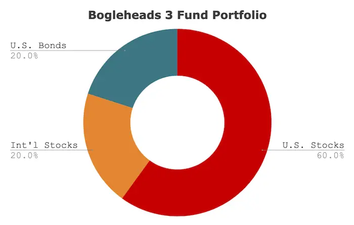

## Table of Contents

## What is a Bogleheads portfolio?

A Bogleheads portfolio is a simple and low-cost way to invest money, inspired by the ideas of John Bogle, the founder of Vanguard. The main idea is to use low-cost index funds to build a diversified investment portfolio. This approach focuses on long-term investing and keeping fees as low as possible, which can help your money grow more over time.

The most common Bogleheads portfolio is the three-fund portfolio. This includes a total stock market index fund, a total international stock index fund, and a total bond market index fund. By investing in these three funds, you can spread your money across many different companies and countries, which reduces risk. The exact mix of these funds depends on your age, how much risk you're willing to take, and when you'll need the money.

## What are the main components of a 3-Fund Portfolio?

A 3-Fund Portfolio is made up of three main parts: a total stock market index fund, a total international stock index fund, and a total bond market index fund. The total stock market index fund includes stocks from many different companies in the United States. This helps you own a little bit of almost every big and small company, which can help your money grow over time.

The total international stock index fund is important because it includes stocks from companies all over the world, not just the U.S. This helps spread your risk because if the U.S. market has a bad year, the international market might do better. The total bond market index fund adds stability to your portfolio. Bonds are generally safer than stocks and can help protect your money when the stock market goes down.

By mixing these three funds, you can create a balanced investment plan that fits your needs. How much you put into each fund depends on things like how old you are, how much risk you're okay with, and when you'll need the money. This simple approach makes it easier to manage your investments and keep costs low.

## How does a 4-Fund Portfolio differ from a 3-Fund Portfolio?

A 4-Fund Portfolio adds one more fund to the mix compared to a 3-Fund Portfolio. The extra fund is usually a real estate investment trust (REIT) index fund. This fund focuses on companies that own and manage properties like apartments, shopping centers, and office buildings. Adding a REIT fund can help spread your investments even more because real estate can behave differently from stocks and bonds. This might lower your risk and give you a chance to earn money in different ways.

Just like with a 3-Fund Portfolio, the mix of the funds in a 4-Fund Portfolio depends on your age, how much risk you're willing to take, and when you'll need the money. For example, a younger person might put more money into stocks and REITs, while someone closer to retirement might put more into bonds. The main idea is still the same: keep costs low and spread your investments across different types of assets. By adding a REIT fund, you're trying to make your portfolio a bit more diverse and possibly more stable over the long run.

## Why are these portfolios recommended for long-term investing?

These portfolios are recommended for long-term investing because they are simple, low-cost, and help spread your money across many different types of investments. By using low-cost index funds, you don't pay a lot of fees, which means more of your money stays in your pocket and can grow over time. These portfolios include a mix of stocks, bonds, and sometimes real estate, which helps reduce risk. If one part of the market goes down, other parts might go up, which can protect your money.

Another reason these portfolios are good for long-term investing is that they are easy to manage. You don't need to spend a lot of time [picking](/wiki/asset-class-picking) individual stocks or trying to guess which parts of the market will do well. Instead, you can set up your portfolio and let it grow over many years. This approach works well for people who want to invest for goals like retirement or saving for a big purchase in the future. By sticking with these portfolios and not trying to time the market, you can build wealth slowly and steadily over time.

## How do you allocate assets in a 3-Fund Portfolio?

Allocating assets in a 3-Fund Portfolio means deciding how much money to put into each of the three funds: a total stock market index fund, a total international stock index fund, and a total bond market index fund. The right mix depends on things like your age, how much risk you're okay with, and when you'll need the money. A younger person might put more money into stocks because they have a long time before they need the money, so they can handle more ups and downs in the market. Someone closer to retirement might put more into bonds because they want their money to be safer and more stable.

A common way to start is to use a rule called the "age in bonds" rule. This means you take your age and put that percentage of your money into bonds. For example, if you're 30 years old, you might put 30% into the bond fund and the rest into stocks. You could split the stock part between the total stock market fund and the total international stock fund. As you get older, you can move more money into bonds to make your portfolio safer. But remember, this is just a starting point. You can change the mix to fit your own needs and how much risk you're willing to take.

## What are the benefits of including an international stock fund in a 4-Fund Portfolio?

Including an international stock fund in a 4-Fund Portfolio helps spread your money across many different countries and companies. This can lower your risk because if the U.S. market has a bad year, the international market might do better. By having some of your money in other countries, you're not putting all your eggs in one basket. This can make your investments more stable over time.

Another benefit is that you can take advantage of growth in other parts of the world. Some countries might be growing faster than the U.S., so by investing in an international stock fund, you can get a piece of that growth. This can help your money grow more over the long term. Overall, adding an international stock fund can make your portfolio more diverse and possibly more rewarding.

## How should one rebalance their Bogleheads portfolio?

Rebalancing your Bogleheads portfolio means adjusting your investments to keep the mix of funds the way you want it. Over time, some parts of your portfolio might grow faster than others. This can change the balance of your funds. For example, if your stock funds do well, they might become a bigger part of your portfolio than you planned. To rebalance, you sell some of the funds that have grown too big and buy more of the funds that have gotten smaller. This keeps your investments lined up with your goals and risk level.

You can rebalance your portfolio once a year, or whenever your mix gets too far off from what you want. A common rule is to rebalance if any part of your portfolio is more than 5% away from your target. For example, if you want 60% in stocks but they've grown to 66%, it's time to sell some stocks and buy more bonds or international funds. Rebalancing helps you stick to your plan and can even help you buy low and sell high, which is good for growing your money over time.

## What are the tax implications of investing in these portfolios?

When you invest in a Bogleheads portfolio, you need to think about taxes. If you invest in a regular taxable account, you might have to pay taxes on the money you make from your investments. This can happen when you get dividends from your funds or when you sell your investments for more than you paid for them. The good news is that index funds, which are a big part of Bogleheads portfolios, often have lower taxes than other types of funds because they don't trade as much. This means they might not have as many capital gains, which can save you money on taxes.

You can also invest in a Bogleheads portfolio through tax-advantaged accounts like an IRA or a 401(k). In these accounts, you don't have to pay taxes on your investment earnings until you take the money out. This can help your money grow faster over time because you're not losing any to taxes each year. If you're saving for retirement, using these accounts can be a smart way to lower your tax bill. Just remember, when you do take money out of these accounts, you'll have to pay taxes on it, so it's good to plan for that too.

## How can one customize a Bogleheads portfolio to meet specific financial goals?

Customizing a Bogleheads portfolio to meet specific financial goals starts with understanding what you want to achieve. If you're saving for a long-term goal like retirement, you might want to put more money into stocks because they can grow a lot over many years. But if you need the money sooner, like for buying a house in a few years, you might want to put more into bonds because they're safer and less likely to lose value quickly. You can also adjust the mix of your funds based on how much risk you're okay with. If you don't like big ups and downs in your money, you might want to have more bonds and less stocks.

Another way to customize your Bogleheads portfolio is by using different types of accounts. For example, if you want to save on taxes, you can put some of your money into a tax-advantaged account like an IRA or a 401(k). These accounts can help your money grow faster because you don't have to pay taxes on your earnings each year. You can also use a regular taxable account for money you might need sooner or for money that's already been taxed. By mixing these accounts and adjusting the funds inside them, you can create a plan that fits your specific financial goals and helps you reach them.

## What are the potential risks and drawbacks of using a Bogleheads portfolio?

Using a Bogleheads portfolio can be a simple and low-cost way to invest, but it does come with some risks and drawbacks. One risk is that you might not earn as much money as you could with other types of investments. Since Bogleheads portfolios use index funds, they follow the market instead of trying to beat it. This means if the market doesn't do well, your portfolio won't do well either. Another risk is that your portfolio might be too simple for some people. If you want to invest in specific companies or industries, a Bogleheads portfolio might not give you that chance.

Another drawback is that you might not be able to react quickly to changes in the market. Because Bogleheads portfolios are meant for long-term investing, you're not supposed to buy and sell funds often. This can be hard if you see the market going down and want to do something about it. Also, if you have a lot of money in one type of fund, like stocks, and that part of the market does badly, your whole portfolio could lose a lot of value. It's important to keep your mix of funds balanced and rebalance regularly to help manage this risk.

## How have Bogleheads portfolios performed historically compared to other investment strategies?

Bogleheads portfolios, which use low-cost index funds, have done pretty well over the years when you compare them to other ways of investing. They often beat actively managed funds, where someone picks stocks and tries to do better than the market. This is because index funds have lower fees, which means more of your money stays in your pocket and can grow over time. Studies have shown that most actively managed funds don't do better than the market after you take out the fees. So, if you're looking for a simple way to invest that doesn't cost a lot, a Bogleheads portfolio can be a good choice.

But it's not always the best for everyone. Sometimes, other investment strategies can do better, especially in the short term. For example, if you pick the right stocks or invest in a hot industry, you might make more money quickly. But this can be risky because it's hard to guess what will happen in the market. Bogleheads portfolios are meant for long-term investing, so they might not grow as fast as some other strategies, but they're usually more stable and less likely to lose a lot of money all at once. So, if you're okay with steady growth over many years and want to keep things simple, a Bogleheads portfolio can be a good fit.

## What advanced strategies can be applied to optimize a Bogleheads 3- or 4-Fund Portfolio?

One way to optimize a Bogleheads 3- or 4-Fund Portfolio is by using tax-efficient strategies. This means putting your money into different types of accounts to save on taxes. For example, you can put money that you won't need for a long time into a tax-advantaged account like an IRA or a 401(k). These accounts let your money grow without being taxed each year, which can help it grow faster. You can put money you might need sooner into a regular taxable account. Also, you can put funds that give out a lot of dividends, like bond funds, into tax-advantaged accounts to avoid paying taxes on those dividends every year. This way, you can keep more of your money and let it grow over time.

Another way to optimize your portfolio is by adjusting your asset allocation based on market conditions and your changing needs. While the Bogleheads approach is meant to be simple, you can still make small changes to improve your returns. For example, if you think stocks are going to do well, you might want to put a bit more money into your stock funds. But be careful not to change your plan too much, because trying to guess the market can be risky. Also, as you get closer to when you need the money, you can move more into bonds to make your portfolio safer. By making these small tweaks, you can try to get a bit more out of your investments without losing the simplicity and low cost that make Bogleheads portfolios so good.

## References & Further Reading

[1]: ["Common Sense on Mutual Funds: New Imperatives for the Intelligent Investor"](https://www.amazon.com/Common-Sense-Mutual-Funds-Imperatives/dp/0471392286) by John C. Bogle

[2]: ["The Bogleheads' Guide to Investing"](https://www.amazon.com/Bogleheads-Guide-Investing-Taylor-Larimore/dp/0470067365) by Taylor Larimore, Mel Lindauer, and Michael LeBoeuf

[3]: ["Algorithmic Trading: Winning Strategies and Their Rationale"](https://www.wiley.com/en-us/Algorithmic+Trading%3A+Winning+Strategies+and+Their+Rationale-p-9781118460146) by Ernie Chan

[4]: ["A Random Walk Down Wall Street: The Time-Tested Strategy for Successful Investing"](https://www.amazon.com/Random-Walk-Down-Wall-Street/dp/0393358380) by Burton G. Malkiel

[5]: ["The Intelligent Investor: The Definitive Book on Value Investing"](https://www.amazon.com/Intelligent-Investor-Definitive-Investing-Essentials/dp/0060555661) by Benjamin Graham