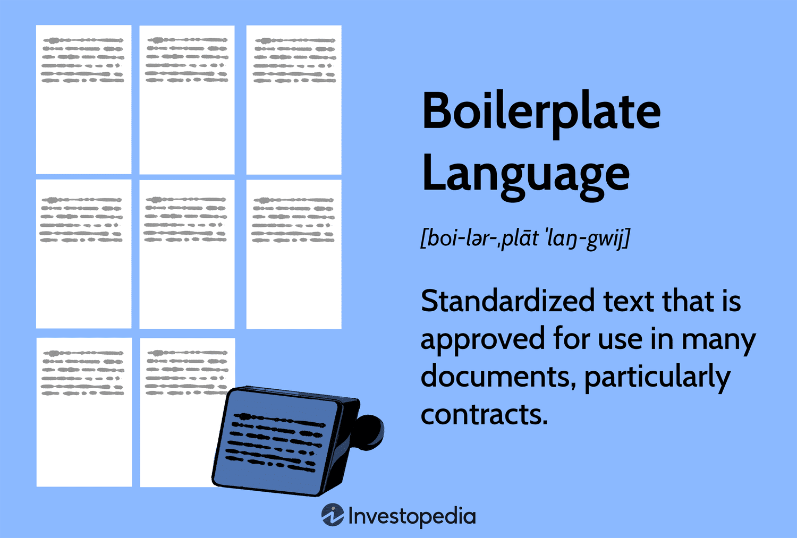

In the rapidly evolving world of finance, algorithmic trading has become a cornerstone of modern-day investing. The use of algorithms to execute trades at high speed and scale has transformed markets, providing unparalleled opportunities for efficiency and precision. At the heart of this technological shift is boilerplate language, a vital tool in the creation and automation of trading strategies. Boilerplate language consists of standardized code templates that simplify complex programming tasks, allowing traders and developers to focus on strategy rather than coding minutiae.

Understanding the history and utilization of boilerplate language in algorithmic trading offers valuable insights for both traders and developers. As algorithmic trading continues to grow, the role of such standardized language becomes ever more significant. It provides a robust foundation that supports the development of sophisticated trading systems, promoting consistency and reducing the likelihood of errors.



This article explores the development, application, and impact of standardized programming language in algorithmic trading. From historical milestones that marked the evolution of algorithmic practices to modern-day applications that demonstrate their efficiency, understanding this relationship is crucial. We will also look into the advantages and disadvantages of using boilerplate language and anticipate future trends that may shape its further integration in trading.

Join us as we explore the fascinating intersection of technology and finance, uncovering how boilerplate language is not just a tool, but an essential element driving the innovation and effectiveness of algorithmic trading within the global financial landscape.

## Table of Contents

## What is Boilerplate Language in Algo Trading?

Boilerplate language in algorithmic trading refers to standardized code snippets or templates that are repeatedly used to streamline the development of algorithms. In programming, boilerplate code serves as a foundational structure that helps in automating repetitive tasks and minimizing errors, thereby promoting efficiency and consistency. In the specific context of algorithmic trading, this standardized code is crucial for building reliable trading systems that can operate at high frequencies and execute trades based on predefined criteria.

At its core, boilerplate code in algorithmic trading systems typically includes essential components such as data retrieval functions, order execution modules, error handling mechanisms, and logging routines. These elements serve as the backbone of any trading algorithm, allowing developers to focus on crafting the unique strategic elements that define their trading approach, rather than re-writing basic operational code with each new algorithm.

For instance, consider a simple Python-based [algorithmic trading](/wiki/algorithmic-trading) framework. The boilerplate code might look like this:

```python
import pandas as pd
import numpy as np

def get_market_data(symbol):
    # Simulated function to retrieve market data
    return pd.DataFrame()

def execute_trade(order_type, quantity, price):
    # Simulated function to execute a trade
    pass

def main():
    symbols = ['AAPL', 'GOOGL', 'MSFT']
    for symbol in symbols:
        data = get_market_data(symbol)
        # Strategy logic goes here
        price = np.random.random()
        execute_trade('buy', 100, price)
```

In this example, `get_market_data()` and `execute_trade()` are boilerplate functions that provide essential functionality required for any trading strategy. They allow the trader to divert attention to creating robust strategy logic, enhancing the efficiency of the development cycle and reducing the likelihood of errors.

Boilerplate language contributes significantly to reducing the developmental overhead as it encapsulates repetitive tasks and complex computations, maintaining a high degree of code reliability. This foundational structure enables the rapid prototyping and deployment of algorithmic strategies, as traders can quickly iterate over trading ideas without getting bogged down by the repetitive aspects of coding. Moreover, using standardized boilerplate code facilitates better collaboration among developers, ensuring that different team members can easily understand and iterate over the codebase. 

Thus, boilerplate language not only supports the technical machinery behind algorithm trading but also empowers traders and developers to innovate and refine their strategies in a more time-efficient and error-free manner.

## Historical Development of Boilerplate Language

The origins of boilerplate language in algorithmic trading can be traced back to the fundamental ethos of early programming practices, where efficiency and error reduction were paramount. Boilerplate language, consisting of standardized code snippets or templates, emerged as a natural evolution from repetitive coding tasks that plagued early developers. As programmers sought more efficient ways to write code, reusable templates became a staple in software development. 

Algorithmic trading harnessed these principles to automate trading strategies, particularly during the rise of high-frequency trading ([HFT](/wiki/high-frequency-trading-strategies)) in the late 20th and early 21st centuries. HFT necessitated rapid transaction speeds, often executing trades within microseconds. As such, minimizing coding errors and streamlining the development of trading algorithms became essential. Boilerplate code facilitated this by allowing developers to focus on specific trading strategies without reinventing fundamental components. 

Significant historical milestones in boilerplate language's integration into algorithmic trading can be linked to technological advancements and the democratization of trading tools. The late 1990s and early 2000s saw a surge in computational power and the proliferation of internet access, which democratized access to financial markets. Trading platforms and tools became more accessible to retail investors, resulting in an increased demand for user-friendly trading software development kits (SDKs) and programming environments that incorporated boilerplate language to expedite coding processes.

Technological innovations like the development of open-source libraries and frameworks also played a crucial role. For example, Python, with its rich ecosystem of libraries such as NumPy, Pandas, and SciPy, provided a fertile ground for developing algorithmic trading solutions. These libraries often include boilerplate code structures that simplify complex mathematical operations and data analysis tasks integral to trading.

Additionally, the advancement of integrated development environments (IDEs) and source control systems enabled better management and deployment of boilerplate code. This helped traders and developers maintain consistency and efficiency across various trading applications and strategies.

In conclusion, the evolution of boilerplate language within algorithmic trading is a testament to its utility in addressing the challenges of efficiency and error reduction. From its roots in early programming to its vital role in facilitating high-frequency trading and democratizing trading tools, boilerplate language continues to shape the development of modern trading algorithms.

## Usage of Boilerplate Language in Modern Algo Trading

Boilerplate language plays a crucial role in the creation and execution of trading algorithms, predominantly by offering a standardized template that simplifies and expedites the coding process. These code snippets are fundamental, especially in the context of designing and implementing trading strategies where speed and precision are vital. 

One primary application of boilerplate code is in setting up the basic framework of a trading algorithm. This includes routines for data retrieval, signal processing, order handling, and the implementation of risk management protocols. By using standardized templates, developers can bypass the minutiae of writing repetitive code blocks, allowing them to concentrate on refining trading strategies. For instance, acquiring historical market data or real-time feeds typically follows a set sequence of actions. With boilerplate code, these steps are pre-coded, ensuring consistency and reducing the likelihood of errors.

Moreover, boilerplate language contributes significantly to code maintainability. By relying on standardized templates, the time required for debugging is decreased, as common functionalities have been tested extensively and debugged. Consequently, this approach fosters code consistency, which is indispensable in collaborative environments where multiple developers might work on the same codebase. For instance, if a trading firm changes its data provider, the boilerplate code handling data acquisition can be modified once, and the updated version propagates throughout any algorithm that depends on it, saving time and mitigating errors.

Scalability and efficiency are other domains where boilerplate language exhibits considerable impact. In algorithmic trading, systems must often scale to handle large volumes of data in real time. A well-structured code foundation, provided by boilerplate templates, enables systems to process this data efficiently. Efficient memory management and optimized execution paths within the boilerplate code help in handling increased load without degradation in performance, which is crucial for maintaining competitive edge in high-frequency trading environments.

Several case studies highlight the efficacy of boilerplate language in trading algorithms. A notable example is the use of an open-source Python library such as QuantConnect or Zipline, which offers extensive boilerplate functionalities out-of-the-box. These platforms provide pre-built modules for data handling, scheduling trades, and executing orders, which traders can leverage to develop sophisticated algorithms with minimal overhead. As a result, traders can test and deploy strategies with greater alacrity, facilitating a quicker turnaround from strategy conception to live trading.

In summary, boilerplate language in algorithmic trading systems epitomizes the balance between automation and customization, thereby enhancing the development, maintenance, and execution of trading strategies. Its consistent application leads to reduced development time, improved code quality, and robust system performance, underscoring its indispensability in modern trading systems.

## Advantages and Disadvantages of Boilerplate in Algo Trading

Boilerplate language in algorithmic trading provides substantial benefits, primarily by streamlining and enhancing the development process. The foremost advantage is time-saving. By utilizing pre-written code snippets or templates, traders and developers can rapidly construct foundational components of trading algorithms. This efficiency allows them to focus more on refining and optimizing trading strategies instead of getting bogged down in coding repetitive tasks.

Further, boilerplate language greatly contributes to error reduction. Standardized code minimizes the likelihood of syntax and logic errors, especially in the context of complex trading algorithms where precision is paramount. Developers can rely on these proven templates to ensure their code adheres to best practices, which enhances reliability and performance. Error reduction is critical given the fast-paced nature of financial markets, where even minor mistakes can lead to significant financial losses.

Code consistency is another key benefit of boilerplate language. Utilizing uniform templates ensures that codebases maintain a consistent structure, which simplifies maintenance and collaboration among teams. Consistent coding practices are crucial in larger projects involving multiple developers, as they facilitate easier debugging, code reviews, and future upgrades.

However, while the advantages are clear, there are inherent disadvantages associated with an over-reliance on boilerplate language. The primary drawback is reduced code customization. Since boilerplate code is generic by nature, it may not cater to the specific needs of custom trading strategies. Traders who rely heavily on these templates might find their algorithms lacking in nuance and unable to exploit unique market opportunities. 

Moreover, the use of boilerplate code can lead to complacency, where developers might lean too much on templates rather than engaging in critical problem-solving. This dependency may stifle creativity and innovation, which are vital in developing competitive and adaptive trading strategies.

In conclusion, while boilerplate language streamlines and enhances the process of algorithmic trading development through time-saving, error reduction, and code consistency, caution must be exercised to avoid the pitfall of over-reliance. Traders and developers should strike a balance between utilizing standardized templates and customizing code to meet specific trading strategy goals. This balanced approach will ensure efficient development while also fostering innovation and adaptability in algorithmic trading.

## Future Trends in Boilerplate Language and Algo Trading

The future of boilerplate language in algorithmic trading is intimately linked with rapid advancements in technology and shifts within financial markets. Central to this evolution is the integration of [artificial intelligence](/wiki/ai-artificial-intelligence) (AI), which is increasingly refining how traders create and utilize boilerplate code. AI tools facilitate the generation of more sophisticated code templates by predicting coding patterns and automating the drafting process. For instance, [machine learning](/wiki/machine-learning) algorithms can analyze vast amounts of historical trading data to identify patterns and suggest optimized code snippets that improve trading strategies.

One emerging trend is the use of advanced analytics to enhance the functionality and efficiency of boilerplate code. Advanced analytics provide deeper insights into market behaviors, allowing developers to create more adaptive trading algorithms. Such analytics can process real-time data streams, enabling algorithms to react promptly to market changes, thus ensuring the boilerplate code remains relevant and effective.

Another significant development is the growing accessibility of trading platforms. Traditionally limited to institutional investors, access to sophisticated trading platforms is now expanding to individual traders and small firms thanks to digitalization and cloud technologies. As platforms become more user-friendly and accessible, boilerplate language evolves to accommodate a broader user base, simplifying the creation of trading models. This democratization of trading technology fosters innovation, allowing a wider pool of talent to contribute to the field.

Forecasting the impact of these innovations, we can expect boilerplate language to become more intuitive and powerful. Tools leveraging AI and advanced analytics will not only suggest code improvements but also facilitate real-time code refinement based on changing market conditions. For example, Python-based libraries, enhanced with AI capabilities, could automatically update boilerplate scripts to incorporate the latest analytical methods or emerging trading patterns.

To remain competitive, both traders and algorithm developers need to keep abreast of these trends. By integrating cutting-edge technologies into their workflows, they can create more robust and agile trading strategies. Innovations such as AI-driven code suggestions and analytics-powered insights offer opportunities to enhance the capability and flexibility of algorithmic trading systems.

In summary, as technology continues to advance, the landscape of boilerplate language in algorithmic trading will undoubtedly transform. Embracing these trends will equip traders and developers with the tools necessary to capitalize on new opportunities and meet the demands of evolving financial markets.

## Conclusion

Boilerplate language is an essential component of the algorithmic trading landscape. It provides a standardized foundation that is integral to developing effective and efficient trading algorithms. Its historical evolution from early programming practices to contemporary automated systems underscores its growing significance in financial markets. As today's traders navigate an increasingly digital world, the consistency and reliability offered by boilerplate code allow them to focus on strategic development rather than technical nuances.

The challenges of boilerplate language, such as over-reliance on pre-existing templates, are acknowledged. However, the benefits related to time savings, error reduction, and enhanced maintainability continue to drive its widespread use. In particular, the efficiency gain from utilizing boilerplate code cannot be overstated, as it facilitates quicker deployment and testing of trading strategies.

As technology advances, integrating artificial intelligence (AI) and machine learning with boilerplate language could revolutionize how trading algorithms are crafted and executed. Emerging trends like advanced analytics and the democratization of trading platforms present new opportunities for innovation within this space. By embracing these advancements, traders and developers can ensure that boilerplate language continues to play a pivotal role in algorithmic trading.

This article has provided a comprehensive overview to equip readers with the knowledge needed to harness the power of boilerplate language effectively. Moving forward, understanding and adapting to these technological advancements will be paramount to maintaining a competitive edge in the ever-evolving financial markets.

## References & Further Reading

[1]: Bergstra, J., Bardenet, R., Bengio, Y., & Kégl, B. (2011). ["Algorithms for Hyper-Parameter Optimization."](https://papers.nips.cc/paper/4443-algorithms-for-hyper-parameter-optimization) Advances in Neural Information Processing Systems 24.

[2]: ["Advances in Financial Machine Learning"](https://www.amazon.com/Advances-Financial-Machine-Learning-Marcos/dp/1119482089) by Marcos Lopez de Prado

[3]: ["Evidence-Based Technical Analysis: Applying the Scientific Method and Statistical Inference to Trading Signals"](https://www.amazon.com/Evidence-Based-Technical-Analysis-Scientific-Statistical/dp/0470008741) by David Aronson

[4]: ["Machine Learning for Algorithmic Trading"](https://github.com/stefan-jansen/machine-learning-for-trading) by Stefan Jansen

[5]: ["Quantitative Trading: How to Build Your Own Algorithmic Trading Business"](https://www.amazon.com/Quantitative-Trading-Build-Algorithmic-Business/dp/1119800064) by Ernest P. Chan