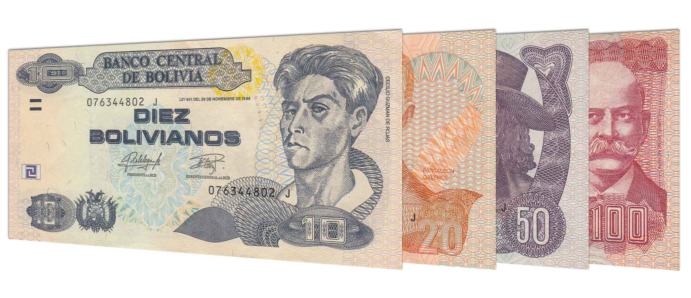

## Table of Contents

## What is the Bolivian Boliviano?

The Bolivian Boliviano is the official money used in Bolivia, a country in South America. It is often just called the Boliviano. The symbol for the Boliviano is Bs, and its international code is BOB. The Boliviano is divided into 100 centavos, but because of inflation, centavos are not used much anymore.

The Boliviano has been used in Bolivia since 1987. Before that, Bolivia used different types of money. The government of Bolivia controls how many Bolivianos are made and used. People in Bolivia use Bolivianos to buy things like food, clothes, and other things they need. Tourists visiting Bolivia can exchange their money for Bolivianos to use while they are there.

## When was the Bolivian Boliviano first introduced?

The Bolivian Boliviano was first introduced in 1864. Before that, Bolivia used different kinds of money. The first Boliviano was made of silver and was worth a lot. People used it to buy things they needed every day.

In 1987, Bolivia introduced a new version of the Boliviano. This happened because the old Boliviano lost its value because of inflation. The new Boliviano is the one used today in Bolivia. It helps people buy things and keeps the economy working.

## What is the symbol and ISO code for the Bolivian Boliviano?

The symbol for the Bolivian Boliviano is Bs. This symbol is used on money and in shops in Bolivia to show prices. When people see Bs, they know the price is in Bolivianos.

The ISO code for the Bolivian Boliviano is BOB. This code is used around the world to talk about the Boliviano in banks and on computers. It helps people know which money they are talking about, no matter where they are.

## How is the Bolivian Boliviano used in everyday transactions in Bolivia?

In Bolivia, people use the Bolivian Boliviano to buy things they need every day, like food, clothes, and other items. When someone goes to a store, they might see prices written with the symbol Bs. For example, if a banana costs Bs 2, they will give the shopkeeper two Bolivianos to buy it. People also use Bolivianos to pay for services, like taking a bus or eating at a restaurant. If they need to pay a bill, like for electricity or water, they use Bolivianos too.

Sometimes, people in Bolivia use banks to handle their money. They can put their Bolivianos in a bank account and use a debit card to pay for things. This card takes money directly from their account. Bolivianos can also be used in ATMs to get cash. When someone travels to another country, they might need to change their Bolivianos into another type of money, like dollars or euros, but while in Bolivia, the Boliviano is the main money they use every day.

## What are the denominations of the Bolivian Boliviano in both coins and banknotes?

In Bolivia, the Boliviano comes in different amounts for coins and banknotes. The coins you can find are 10, 20, and 50 centavos, and 1, 2, and 5 Bolivianos. Even though centavos are not used much because of inflation, you might still see them sometimes. The 1, 2, and 5 Boliviano coins are more common and used every day.

The banknotes in Bolivia come in bigger amounts. You can find banknotes of 10, 20, 50, 100, and 200 Bolivianos. These banknotes are used for bigger purchases or when people need more money. They show pictures of important people or places in Bolivia and help people buy things they need every day.

## How does the Bolivian Boliviano function within Bolivia's economy?

The Bolivian Boliviano is the main money used in Bolivia's economy. People use it to buy things they need every day, like food and clothes. Businesses use Bolivianos to sell their products and services. The government controls how many Bolivianos are made and used to keep the economy working smoothly. When people earn money, they get paid in Bolivianos, and they use this money to pay for things like rent, bills, and other needs.

The value of the Boliviano can change because of things like inflation, which is when prices go up. The government tries to manage inflation to keep the Boliviano stable. Banks in Bolivia help people save and spend their Bolivianos. People can put their money in a bank account, use debit cards, or take out cash from ATMs. When Bolivians travel to other countries, they might need to change their Bolivianos into another type of money, but within Bolivia, the Boliviano is the main currency used for all kinds of transactions.

## What is the historical context behind the introduction of the Bolivian Boliviano?

The Bolivian Boliviano was first introduced in 1864 during a time when Bolivia needed a stable currency. Before that, Bolivia used different kinds of money, like the Spanish real and the Peruvian sol. The first Boliviano was made of silver and was worth a lot. It helped people buy things they needed every day. The government wanted a currency that would make trading easier and help the economy grow.

Over the years, the value of the Boliviano changed because of inflation. By the 1980s, inflation was very high, and the old Boliviano lost a lot of its value. This made it hard for people to buy things they needed. In 1987, Bolivia introduced a new version of the Boliviano to fix this problem. The new Boliviano was more stable and helped the economy get better. Today, the new Boliviano is still used in Bolivia and helps people buy things they need every day.

## How has the value of the Bolivian Boliviano changed over time relative to major world currencies?

The value of the Bolivian Boliviano has changed a lot over time compared to big world currencies like the US dollar, the euro, and the British pound. When the Boliviano was first used in 1864, it was made of silver and was worth a lot. But over time, the value of the Boliviano went down because of inflation. By the 1980s, the old Boliviano was not worth much anymore. This made it hard for people in Bolivia to buy things they needed. In 1987, Bolivia made a new Boliviano to fix this problem. The new Boliviano was more stable and helped the economy get better.

Since the new Boliviano was introduced in 1987, its value has been more stable but still changes compared to big world currencies. For example, in the early 2000s, one US dollar was worth about 7 Bolivianos. By 2023, one US dollar was worth about 6.9 Bolivianos. This shows that the Boliviano has stayed pretty stable against the dollar over the last few years. But compared to the euro and the British pound, the value of the Boliviano can change more because these currencies can be stronger or weaker against the dollar. Overall, the Boliviano's value can go up and down, but it helps people in Bolivia buy things they need every day.

## What are the key factors that influence the exchange rate of the Bolivian Boliviano?

The exchange rate of the Bolivian Boliviano can change because of many things. One big thing is inflation. If prices in Bolivia go up a lot, the Boliviano can lose value compared to other money. Another thing is the economy of Bolivia. If Bolivia is making and selling a lot of things, the Boliviano can get stronger. But if the economy is not doing well, the Boliviano can get weaker. The price of things Bolivia sells to other countries, like gas and minerals, also matters. If these prices go up, the Boliviano can get stronger.

Another important thing is what the government does. The government can try to keep the Boliviano stable by making rules about how much money is in the country. They can also use money they have saved to buy or sell Bolivianos and keep the exchange rate steady. What happens in other countries can affect the Boliviano too. If the US dollar or other big currencies change a lot, this can make the Boliviano change too. All these things together decide how much the Boliviano is worth compared to other money.

## How does the Central Bank of Bolivia manage the monetary policy related to the Bolivian Boliviano?

The Central Bank of Bolivia is in charge of managing the money in Bolivia, including the Boliviano. They do this by setting rules and making decisions about how much money should be in the country. One way they manage the money is by controlling interest rates. If they want to slow down the economy and stop prices from going up too fast, they might make interest rates higher. This makes it more expensive for people and businesses to borrow money, so they spend less. If they want to help the economy grow, they might make interest rates lower, so it's easier for people to borrow and spend money.

The Central Bank also buys and sells Bolivianos to keep the exchange rate stable. If the Boliviano is getting weaker compared to other money, the Central Bank might use the money they have saved to buy Bolivianos. This can make the Boliviano stronger. They also watch how much money banks have and make rules about how much they need to keep in their vaults. This helps make sure there is enough money for people to use but not too much, which could make prices go up too fast. By doing all these things, the Central Bank tries to keep the economy of Bolivia working well and the Boliviano stable.

## What role does the Bolivian Boliviano play in Bolivia's international trade?

The Bolivian Boliviano is important for Bolivia's international trade. When Bolivian businesses want to buy things from other countries, they need to change their Bolivianos into the money used in those countries, like dollars or euros. This helps them pay for the things they need. When Bolivia sells things to other countries, like gas and minerals, they get paid in other countries' money. Then, they change this money back into Bolivianos to use at home. This exchange of money helps Bolivia trade with the rest of the world.

The value of the Boliviano can affect how much Bolivia can buy and sell in international trade. If the Boliviano is strong, it can buy more things from other countries. But if it is weak, it can buy less. The same goes for selling things. A strong Boliviano means Bolivia might get less money when they sell their products to other countries. The Central Bank of Bolivia tries to keep the Boliviano stable to help with trading. By making sure the Boliviano does not change too much, it helps Bolivia trade more easily with other countries.

## What are the future prospects and potential reforms regarding the Bolivian Boliviano?

The future of the Bolivian Boliviano depends on many things like the economy of Bolivia and what the government does. If Bolivia keeps selling a lot of gas and minerals to other countries, the Boliviano might stay stable or even get stronger. The government and the Central Bank will keep trying to control inflation and make sure there is not too much money in the country. They might also make new rules about how banks work to help keep the economy stable. If they do these things well, the Boliviano could be a strong and useful money for people in Bolivia.

There might also be some changes or reforms to the Boliviano in the future. The government could decide to make new coins or banknotes if they think it will help the economy. They might also change the rules about how people can use the Boliviano, like making it easier to use online or with phones. If the Boliviano gets too weak, the government might think about making a new version of the money, like they did in 1987. But these changes would take a lot of planning and would need to be done carefully to make sure they help the people of Bolivia.

## References & Further Reading

[1]: Bergstra, J., Bardenet, R., Bengio, Y., & Kégl, B. (2011). ["Algorithms for Hyper-Parameter Optimization."](https://dl.acm.org/doi/10.5555/2986459.2986743) Advances in Neural Information Processing Systems 24.

[2]: ["Advances in Financial Machine Learning"](https://www.amazon.com/Advances-Financial-Machine-Learning-Marcos/dp/1119482089) by Marcos Lopez de Prado

[3]: ["Evidence-Based Technical Analysis: Applying the Scientific Method and Statistical Inference to Trading Signals"](https://www.amazon.com/Evidence-Based-Technical-Analysis-Scientific-Statistical/dp/0470008741) by David Aronson

[4]: ["Machine Learning for Algorithmic Trading"](https://github.com/stefan-jansen/machine-learning-for-trading) by Stefan Jansen

[5]: ["Quantitative Trading: How to Build Your Own Algorithmic Trading Business"](https://www.amazon.com/Quantitative-Trading-Build-Algorithmic-Business/dp/1119800064) by Ernest P. Chan