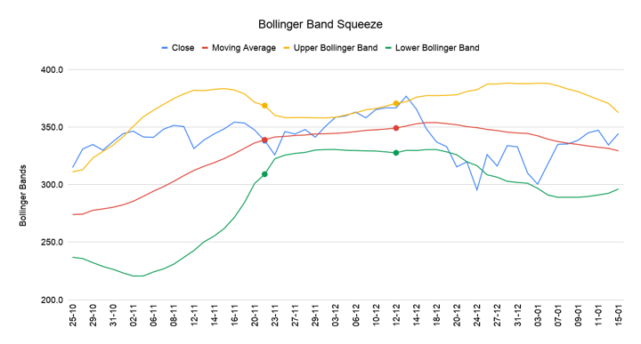

## Table of Contents

## What is a Bollinger Band and how is it calculated?

A Bollinger Band is a tool used in trading to help understand how a stock or other financial item is moving. It was created by John Bollinger. The tool shows three lines on a chart. The middle line is the average price of the item over a certain time, usually 20 days. The other two lines are above and below this middle line. They show how much the price can change, or how "volatile" it is.

To calculate Bollinger Bands, you start with the middle line, which is the simple moving average (SMA) of the item's price over a set number of days, often 20. Then, you find out how much the price typically varies from this average. This is called the standard deviation. The top line of the Bollinger Band is the middle line plus two times the standard deviation. The bottom line is the middle line minus two times the standard deviation. These lines help traders see if a price is high or low compared to what is normal for that item.

## What does a Bollinger Band Squeeze indicate in the market?

A Bollinger Band Squeeze happens when the top and bottom lines of the Bollinger Bands come closer together. This means the price of the item is not moving much and is staying close to the middle line. It shows that the market is calm and not changing a lot. Traders watch for this because it can mean that a big move in the price might be coming soon.

When the Bollinger Bands start to spread out after being squeezed, it often means the price is about to make a big move. This move can go up or down, so traders need to be ready for both. Watching for a Bollinger Band Squeeze can help traders guess when the market might start to change and move more.

## How can beginners identify a Bollinger Band Squeeze on a chart?

To spot a Bollinger Band Squeeze on a chart, beginners should first look at the two outer lines of the Bollinger Bands. These lines show how much the price of a stock or other item is moving around. When these lines start to come closer together, it means the price isn't changing much and is staying close to the middle line. This is what a Bollinger Band Squeeze looks like on the chart.

Once you see the lines getting closer, keep watching the chart. If the lines start to move apart again after being squeezed, it might mean the price is about to make a big move. This move could go up or down, so it's important to be ready for either direction. By looking for these squeezes, beginners can start to understand when the market might be getting ready for a big change.

## What are the basic steps to implement the Bollinger Band Squeeze strategy?

To use the Bollinger Band Squeeze strategy, first, you need to find a chart that shows the Bollinger Bands. Look for times when the top and bottom lines of the Bollinger Bands start to come closer together. This means the price isn't moving much and is staying close to the middle line. This is called a Bollinger Band Squeeze. When you see this happening, it's a sign that the market might be getting ready for a big move.

After you spot a Bollinger Band Squeeze, keep watching the chart. If the lines start to move apart again, it might mean the price is about to make a big move. This move could go up or down, so you need to be ready for either direction. If the price breaks out above the top line, it might be a good time to buy. If it breaks out below the bottom line, it might be a good time to sell. By watching for these squeezes and the moves that follow, you can start to use the Bollinger Band Squeeze strategy to make trading decisions.

## What are the common time frames used for the Bollinger Band Squeeze strategy?

The Bollinger Band Squeeze strategy can be used on different time frames, but some are more common than others. A lot of traders like to use the daily chart, which shows how the price moves over days. This time frame is good because it helps you see bigger trends without getting caught up in small, quick changes in the price. Another popular choice is the weekly chart, which shows how the price moves over weeks. This is useful for people who want to see even bigger trends and make longer-term trading decisions.

Some traders also use shorter time frames like the hourly or 15-minute chart. These are good for people who want to make quick trades and catch smaller moves in the price. But, using shorter time frames can be riskier because the market can change a lot in a short time. No matter which time frame you choose, the key is to watch for when the Bollinger Bands squeeze together and then start to move apart again. This can help you guess when the price might make a big move.

## How does volatility affect the effectiveness of the Bollinger Band Squeeze?

Volatility is really important for the Bollinger Band Squeeze strategy. It's all about how much the price of a stock or other item is moving around. When the price isn't moving much, the Bollinger Bands come closer together, showing low volatility. This is when a Bollinger Band Squeeze happens. Traders watch for this because it can mean that the market is getting ready for a big move. If the market is always moving a lot, it's harder to spot these squeezes because the bands are usually farther apart.

When the market has been calm and then starts to get more volatile, the Bollinger Bands will start to spread out after being squeezed. This can be a sign that a big price move is coming. If the market is too volatile all the time, the squeezes might not be as clear or useful. So, the best times for the Bollinger Band Squeeze strategy are when the market goes from being calm to more active. This helps traders see the squeezes more clearly and make better guesses about when big price moves might happen.

## What are some common entry and exit signals used with the Bollinger Band Squeeze?

When using the Bollinger Band Squeeze strategy, a common entry signal is when the price breaks out of the Bollinger Bands after a squeeze. If the price moves above the top line, it might be a good time to buy. This means the price is starting to go up after being calm. If the price moves below the bottom line, it might be a good time to sell or short sell. This means the price is starting to go down after being calm. Another entry signal some traders use is when the price moves back inside the Bollinger Bands after breaking out. This can mean the price might keep moving in the same direction it started.

For [exit](/wiki/exit-strategy) signals, traders often look at the opposite of the entry signals. If you bought when the price broke above the top line, you might sell when the price falls back below the top line. This means the price might be done going up. If you sold or short sold when the price broke below the bottom line, you might buy back when the price moves back above the bottom line. This means the price might be done going down. Some traders also use other tools like the Relative Strength Index (RSI) or moving averages to help decide when to exit a trade. These tools can give more signs that the price might be changing direction.

## How can traders combine the Bollinger Band Squeeze with other indicators for better results?

Traders can make the Bollinger Band Squeeze strategy work better by using it with other tools like the Relative Strength Index (RSI) and moving averages. The RSI helps show if a stock is getting too expensive or too cheap. If the RSI is over 70, it might mean the stock is too expensive and could go down soon. If it's under 30, it might mean the stock is too cheap and could go up. When you see a Bollinger Band Squeeze and the RSI is at one of these levels, it can give you a stronger sign that a big price move is coming. This can help you decide if you should buy or sell.

Moving averages are another tool that can help. They show the average price of a stock over time, like 50 days or 200 days. If the price breaks out of the Bollinger Bands and also moves above or below a moving average, it can make the signal stronger. For example, if the price breaks above the top Bollinger Band and also moves above the 50-day moving average, it might be a good time to buy. By using these other tools with the Bollinger Band Squeeze, traders can get more signs that help them make better trading choices.

## What are the potential risks and limitations of using the Bollinger Band Squeeze strategy?

Using the Bollinger Band Squeeze strategy can be risky because it doesn't always work. Sometimes, the price might not move much after a squeeze, or it might move in a way you didn't expect. This means you could lose money if you buy or sell based on the squeeze and the price doesn't go the way you thought it would. Another risk is that the market can be unpredictable. Even if you see a clear squeeze, other things like news or big events can change how the price moves and make your trading plan not work out.

There are also some limits to this strategy. It's hard to know for sure when a squeeze will happen or how long it will last. This makes it tricky to use the strategy all the time. Also, the Bollinger Band Squeeze works best in markets that have clear periods of calm and then big moves. If the market is always moving a lot or not moving at all, the squeezes might not be as useful. Traders need to remember these risks and limits and maybe use other tools along with the Bollinger Band Squeeze to help make better trading choices.

## How can an advanced trader adjust Bollinger Band settings to optimize the strategy?

An advanced trader can adjust the Bollinger Band settings to better fit their trading style and the market they are watching. One way to do this is by changing the number of periods used for the moving average. The standard setting is 20 periods, but a trader might use a shorter period like 10 for faster signals or a longer period like 50 for slower, more reliable signals. Another setting to adjust is the number of standard deviations used for the upper and lower bands. The usual setting is 2 standard deviations, but using 1.5 might catch smaller price moves, while using 2.5 could help filter out false signals and focus on bigger moves.

Another important adjustment is choosing the right time frame for the chart. Different time frames can show different kinds of squeezes and price moves. For example, using a daily chart might be good for seeing bigger trends, while an hourly chart could be better for catching smaller, quicker moves. By playing with these settings, an advanced trader can make the Bollinger Band Squeeze strategy work better for their specific goals and the market conditions they are trading in.

## Can the Bollinger Band Squeeze strategy be automated, and if so, how?

Yes, the Bollinger Band Squeeze strategy can be automated using trading software or programming languages like Python. To do this, you need to write code that can read price data, calculate the Bollinger Bands, and spot when a squeeze happens. The code can then watch for the price to break out of the bands after a squeeze and make trades based on these signals. This means the computer can do the trading for you, following the rules you set up in the code.

Automating the strategy can save time and help you stick to your trading plan without letting emotions get in the way. But, you need to be careful because the market can change, and what worked before might not work the same way in the future. You should keep an eye on how the automated system is doing and be ready to make changes if needed. Also, remember that even with automation, there are risks, and you could still lose money if the market doesn't move the way you expect.

## What are some real-world examples of successful trades using the Bollinger Band Squeeze strategy?

One real-world example of a successful trade using the Bollinger Band Squeeze strategy happened with a stock called Apple (AAPL). A trader was watching the daily chart and noticed the Bollinger Bands starting to squeeze together. This meant the price wasn't moving much and was staying close to the middle line. After a few days, the bands started to spread out, and the price broke above the top line. The trader took this as a buy signal and bought the stock. Over the next few weeks, the price kept going up, and the trader sold the stock for a nice profit.

Another example involves a trader using the Bollinger Band Squeeze strategy on a forex pair, EUR/USD. The trader was looking at an hourly chart and saw the Bollinger Bands squeeze together. After the squeeze, the price broke below the bottom line, signaling a potential downward move. The trader decided to short sell the EUR/USD pair. The price did indeed drop over the next few hours, and the trader closed the position for a profit. Both of these examples show how watching for a Bollinger Band Squeeze and acting on the [breakout](/wiki/breakout-trading) can lead to successful trades.

## What are Bollinger Bands and how do they work?

Bollinger Bands are a technical analysis tool developed by financial analyst John Bollinger in the early 1980s. They are designed to provide information about the volatility and price level of a financial instrument relative to past trades. The indicator comprises three lines: a Simple Moving Average (SMA) at the center, flanked by two bands that are plotted at levels of standard deviation away from the SMA.

### Structure of Bollinger Bands

1. **Simple Moving Average (SMA):**
   The SMA forms the core of the Bollinger Bands. It is an average of an asset's price over a specific number of periods. Mathematically, the SMA is calculated as:
$$
   \text{SMA} = \frac{\sum_{i=1}^{n} P_i}{n}

$$

   where $P_i$ represents the price at each period $i$, and $n$ is the number of periods over which the average is calculated.

2. **Upper and Lower Bands:**
   The upper and lower bands are set at a certain number of standard deviations above and below the SMA. The standard deviation is a measure of [volatility](/wiki/volatility-trading-strategies), representing how spread out the prices are from the SMA. The formulas for the upper and lower bands are:
$$
   \text{Upper Band} = \text{SMA} + (k \times \text{SD})

$$
$$
   \text{Lower Band} = \text{SMA} - (k \times \text{SD})

$$

   where the constant $k$ is usually set to 2, and $\text{SD}$ denotes the standard deviation of the asset's price over the same period.

### Implications of Band Width

The distance between the upper and lower bands is indicative of market volatility. When the bands are wide, it suggests high volatility and potentially a highly active market. Conversely, when the bands are narrow, it implies low volatility and a market in consolidation. The expansion and contraction of the bands provide critical insights into market dynamics and potential future movements.

### Trading Applications

Bollinger Bands are primarily used to assess oversold or overbought conditions in the market. Traders interpret prices that are close to the upper band as overbought and those near the lower band as oversold. These conditions can signal potential price reversals. Pairing Bollinger Bands with other indicators can strengthen trading decisions, allowing for a more comprehensive analysis of the market conditions.

Overall, understanding Bollinger Bands facilitates a nuanced approach to analyzing market behavior, particularly regarding price volatility and potential trend reversals. This versatile indicator is widely employed in various financial markets, including stocks, [forex](/wiki/forex-system), and commodities, enhancing traders' ability to gauge market conditions and make informed trading decisions.

## Have you backtested the strategy?

Backtesting the Bollinger Band Squeeze strategy is a crucial step to evaluate its effectiveness and adaptability across different market environments. This process involves simulating the trading strategy on historical data to understand how it might perform in live markets. By using historical price movements, traders can assess how well the strategy identifies breakout opportunities following periods of low volatility.

One of the primary considerations when [backtesting](/wiki/backtesting) is the selection of data across various asset classes such as stocks, forex, and commodities. Each asset class exhibits unique price characteristics and levels of volatility, which can affect the performance of the Bollinger Band Squeeze strategy. For example, some stocks might have volatility patterns that differ significantly from those typically seen in forex markets, potentially necessitating adjustments in the strategy's parameters, such as the standard deviation multiplier used in the Bollinger Bands calculation.

When conducting backtests, traders often need to adapt trading rules to account for an asset's inherent volatility. For instance, if the band squeeze tends to occur more frequently in a particular asset, the criteria for defining a squeeze and subsequent breakout may require tightening or loosening to avoid false signals. 

To quantitatively backtest this strategy, one might use Python, leveraging libraries like `pandas` for managing time-series data and `matplotlib` for visualization. A preliminary backtest setup could involve the following steps:

1. **Data Collection:** Obtain historical price data for the selected asset.
2. **Indicator Calculation:** Use the Bollinger Bands formula to calculate the bands around a simple moving average (SMA). The typical formula for Bollinger Bands is:  
$$
   \text{Upper Band} = \text{SMA}(n) + k \times \sigma

$$
$$
   \text{Lower Band} = \text{SMA}(n) - k \times \sigma

$$
   where $n$ is the period, $k$ is the standard deviation multiplier, and $\sigma$ is the standard deviation of prices over $n$ periods.
3. **Detecting Squeezes:** Identify periods where the bandwidth (distance between the upper and lower bands) is at a historical minimum.
4. **Trading Simulation:** Implement trading signals based on breakout detection following a squeeze and simulate trade execution.
5. **Performance Evaluation:** Assess metrics like profit and loss, win/loss ratio, and maximum drawdown to determine strategy efficiency.

Here is a simple Python script outline for backtesting the Bollinger Band Squeeze:

```python
import pandas as pd
import numpy as np
import matplotlib.pyplot as plt

# Load historical price data
data = pd.read_csv('historical_prices.csv', parse_dates=True, index_col='Date')

# Calculate Bollinger Bands
def bollinger_bands(df, n, k):
    SMA = df['Close'].rolling(n).mean()
    std_dev = df['Close'].rolling(n).std()
    upper_band = SMA + (std_dev * k)
    lower_band = SMA - (std_dev * k)
    return upper_band, lower_band

n = 20  # period for SMA
k = 2   # standard deviation coefficient

data['Upper Band'], data['Lower Band'] = bollinger_bands(data, n, k)

# Detect squeeze
band_width = data['Upper Band'] - data['Lower Band']
squeeze_threshold = band_width.rolling(252).min()  # 252 trading days in a year
data['Squeeze'] = band_width <= squeeze_threshold

# Plotting
plt.figure(figsize=(14, 7))
plt.plot(data['Close'], label='Close Price')
plt.plot(data['Upper Band'], label='Upper Band', linestyle='--')
plt.plot(data['Lower Band'], label='Lower Band', linestyle='--')
plt.fill_between(data.index, data['Upper Band'], data['Lower Band'], 
                 color='grey', alpha=0.3, label='Bollinger Bands')
plt.scatter(data.index, data['Close'], where=data['Squeeze'], color='red', 
            marker='x', s=30, label='Squeeze Points')
plt.title('Bollinger Band Squeeze Backtest')
plt.legend()
plt.show()
```

This code provides a basic framework for identifying squeezes and visualizing potential trade signals. As traders refine their strategies, they may also consider incorporating additional indicators for confirming breakout directions and optimizing parameter values based on backtest results. By continuously evaluating and adjusting the strategy to align with market conditions, traders can enhance the probability of achieving successful outcomes.

## References & Further Reading

[1]: Bollinger, J. (2001). ["Bollinger on Bollinger Bands."](https://www.amazon.com/Bollinger-Bands-John/dp/0071373683) McGraw-Hill Education.

[2]: Aronson, D. R. (2006). ["Evidence-Based Technical Analysis: Applying the Scientific Method and Statistical Inference to Trading Signals."](https://www.amazon.com/Evidence-Based-Technical-Analysis-Scientific-Statistical/dp/0470008741) Wiley.

[3]: Murphy, J. J. (1999). ["Technical Analysis of the Financial Markets: A Comprehensive Guide to Trading Methods and Applications."](https://www.amazon.com/Technical-Analysis-Financial-Markets-Comprehensive/dp/0735200661) New York Institute of Finance.

[4]: Jansen, S. (2020). ["Machine Learning for Algorithmic Trading."](https://github.com/stefan-jansen/machine-learning-for-trading) Packt Publishing.

[5]: Chan, E. P. (2009). ["Quantitative Trading: How to Build Your Own Algorithmic Trading Business."](https://github.com/ftvision/quant_trading_echan_book) John Wiley & Sons.

[6]: Castañeda, J. E. (2010). ["Algorithmic Trading and DMA: An introduction to direct access trading strategies."](https://www.amazon.com/Algorithmic-Trading-DMA-introduction-strategies/dp/0956399207) Harriman House.

[7]: Lopez de Prado, M. (2018). ["Advances in Financial Machine Learning."](https://www.amazon.com/Advances-Financial-Machine-Learning-Marcos/dp/1119482089) Wiley.