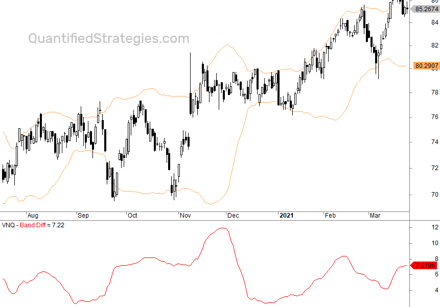

Bollinger Bands are a widely-recognized technical analysis tool in financial markets, developed by John Bollinger in the 1980s. These bands consist of three lines that correspond to different price levels of a security over a specific time period. The middle band is typically a simple moving average (SMA), most commonly set at 20 periods. The upper and lower bands are calculated as two standard deviations above and below this moving average, respectively. Mathematically, the bands are defined as follows:

- Middle Band (MB) = Simple Moving Average (SMA)
- Upper Band (UB) = MB + (k * σ)
- Lower Band (LB) = MB - (k * σ)



where $k$ is typically set to 2, and $σ$ represents the standard deviation of the price over the same period as the moving average.

Bollinger Bands provide valuable insights into market dynamics by outlining overbought and oversold conditions. When prices consistently touch or move beyond the upper band, it suggests that the market may be overbought. Conversely, interactions with the lower band could indicate oversold conditions. These characteristics are harnessed by traders to identify potential entry and exit points, helping them to optimize their trading decisions.

In this article, various strategies will be explored for using Bollinger Bands in both manual and automated trading systems. Notably, combining Bollinger Bands with other technical indicators can enhance the efficacy of trading strategies. The ability to resonate with market volatility through their expansion and contraction makes Bollinger Bands a versatile tool for traders seeking to better understand market behavior and potential price movements.

## Table of Contents

## Understanding Bollinger Bands

Bollinger Bands are a technical analysis tool that serves as a measure of market [volatility](/wiki/volatility-trading-strategies) and helps traders identify potential opportunities by observing price patterns. Created by John Bollinger in the 1980s, Bollinger Bands consist of three distinct lines plotted relative to the price of a security: a middle band and two surrounding bands, often referred to as the upper and lower bands.

The middle band is typically a simple moving average (SMA) calculated over a specified period, traditionally set to 20 periods. This SMA provides a smoothed average of the price, offering a benchmark to compare current and historical prices. The formula for the simple moving average is:

$$
\text{SMA} = \frac{P_1 + P_2 + ... + P_n}{n}
$$

where $P_i$ represents the price at each period $i$ and $n$ is the number of periods considered.

The upper and lower bands are calculated by adding and subtracting a multiple of the standard deviation from the middle band, typically set at two standard deviations. This method captures approximately 95% of the price movements if the price distribution resembles a normal distribution. The formulas for the upper and lower bands are:

$$
\text{Upper Band} = \text{SMA} + (K \times \sigma)
$$
$$
\text{Lower Band} = \text{SMA} - (K \times \sigma)
$$

where $\sigma$ represents the standard deviation of the price over the same period $n$, and $K$ is the number of standard deviations, usually set at 2.

The utility of Bollinger Bands lies in their ability to dynamically adjust to market conditions. During periods of high market volatility, the bands widen, showcasing increased standard deviations as prices swing more dramatically. Conversely, during periods of low volatility, the bands contract, reflecting tighter price movements.

Traders utilize Bollinger Bands to gain insights into potential price action. For instance, when prices consistently touch the upper band, it may indicate an overbought condition, suggesting a potential reversal or pullback. Similarly, prices touching the lower band might hint at an oversold condition, signaling a possible upward reversal. In addition to reversals, Bollinger Bands help traders to recognize [breakout](/wiki/breakout-trading) conditions; when the bands constrict tightly, it often indicates a buildup in price tension leading to a breakout. Traders might also identify trends using Bollinger Bands, as prices tend to "ride the bands" during strong market trends, especially when combined with other indicators for confirmation.

In essence, the adaptability of Bollinger Bands to different market environments makes them a valuable tool for traders seeking to understand price movements and volatility.

## Core Strategies Using Bollinger Bands

The Bollinger Bands technical analysis tool provides traders with several core strategies that can be applied to various market conditions. These strategies are based on the interaction of price movements with the upper, middle, and lower Bollinger Bands. Understanding these strategies can help traders identify potential buying or selling opportunities.

### Double Bottom Strategy

The Double Bottom strategy seeks potential reversal points by analyzing two distinct low points in the price movement of a security. The first low typically reaches or breaches the lower Bollinger Band, indicating an oversold condition. The second low, however, stays within the bands, forming a higher low compared to the first. This pattern suggests that selling pressure may be waning and a reversal to the upside is possible. Traders often look for confirmation through additional technical indicators or increased buying [volume](/wiki/volume-trading-strategy) before entering a trade.

### Reversals Strategy

Reversal strategies focus on identifying possible price corrections at the Bollinger Bands using candlestick patterns. When the price touches or crosses the upper or lower bands, it indicates potential overbought or oversold conditions. Traders look for reversal candlestick patterns, such as "Doji" or "Engulfing" candles, which may signal a reversal in trend direction. These patterns, combined with the location of the price relative to the bands, offer valuable insights into possible market corrections.

### Riding the Bands

The "Riding the Bands" strategy comes into play during strong trends. When a security is in a robust uptrend, the price often touches or moves alongside the upper Bollinger Band. This behavior indicates sustained [momentum](/wiki/momentum) and a continued increase in the security's price. Rather than assuming a reversal, traders using this strategy look for opportunities to enter long positions during minor pullbacks, provided that the uptrend remains intact.

### Bollinger Band Squeeze

The Bollinger Band Squeeze signals impending breakouts by highlighting periods of low market volatility. When the bands contract significantly, it suggests that a strong price movement may occur soon, although the direction of the breakout is not predetermined by the squeeze itself. Traders often wait for a decisive move outside the bands to signal the breakout direction, and subsequently enter trades based on additional confirmation signals or volume analysis.

### Snap Back to the Middle Strategy

The Snap Back to the Middle strategy involves trading towards the middle band, often a 20-period simple moving average, after the price has reached the outer bands. When prices deviate significantly from the mean, they tend to revert to the average, driven by market forces seeking equilibrium. Traders exploit this mean-reversion tendency by entering trades expecting the price to return to the middle band. This strategy is particularly useful in range-bound or mean-reverting markets and is often coupled with tight stop-loss orders to manage risk effectively.

By employing these strategies, traders can utilize Bollinger Bands to identify entry and [exit](/wiki/exit-strategy) points, manage risk, and optimize their trading performance. Each strategy addresses different market conditions, underscoring the importance of selecting the right approach for the prevailing market dynamics.

## Incorporating Bollinger Bands in Algorithmic Trading

Algorithmic trading systems leverage Bollinger Bands to capitalize on their ability to signify potential market movements efficiently and swiftly. By utilizing these bands, traders can automate their operations, setting predefined rules for buying and selling based on signals generated by Bollinger Bands. For instance, when the price crosses the upper band, a system might be programmed to sell, anticipating a potential price drop. Conversely, when the price dips below the lower band, a buy signal could be activated, expecting the price to rise.

Enhancing these strategies involves integrating Bollinger Bands with other technical indicators such as the Relative Strength Index (RSI) and the Moving Average Convergence Divergence (MACD). The RSI, which measures the speed and change of price movements, can help confirm signals from Bollinger Bands. For example, if the RSI indicates that a stock is overbought while the price touches the upper Bollinger Band, it reinforces the sell signal. Similarly, MACD can aid in detecting changes in trend momentum, complementing the signals generated by Bollinger Bands and providing a more robust strategy framework.

Backtesting and optimization processes are fundamental to refining trading algorithms that use Bollinger Bands. Backtesting involves running a trading strategy using historical data to assess its effectiveness and profitability. This process helps traders identify any flaws or areas of improvement within their strategies. Given the dynamic nature of financial markets, optimization is crucial, allowing traders to adjust parameters and strategies to enhance performance and manage risk more effectively.

In practice, a simple Python script can be created to automate a Bollinger Bands strategy. Below is a basic outline for implementing a strategy that buys when the price is below the lower band and sells when it is above the upper band:

```python
import pandas as pd
import numpy as np

def calculate_bollinger_bands(prices, window=20, num_std_dev=2):
    rolling_mean = prices.rolling(window=window).mean()
    rolling_std = prices.rolling(window=window).std()
    upper_band = rolling_mean + (rolling_std * num_std_dev)
    lower_band = rolling_mean - (rolling_std * num_std_dev)
    return rolling_mean, upper_band, lower_band

def bollinger_band_strategy(prices):
    mean, upper_band, lower_band = calculate_bollinger_bands(prices)
    buy_signals = []
    sell_signals = []

    for i in range(len(prices)):
        if prices[i] < lower_band[i]:
            buy_signals.append(prices[i])
            sell_signals.append(np.nan)
        elif prices[i] > upper_band[i]:
            buy_signals.append(np.nan)
            sell_signals.append(prices[i])
        else:
            buy_signals.append(np.nan)
            sell_signals.append(np.nan)

    return buy_signals, sell_signals

# Example usage with price data
price_data = pd.Series([/* price data here */])
buy_signals, sell_signals = bollinger_band_strategy(price_data)
```

Incorporating Bollinger Bands within [algorithmic trading](/wiki/algorithmic-trading) not only streamlines the trading process but also enhances decision-making capabilities through systematic and data-driven methodologies.

## Challenges and Considerations

Bollinger Bands, despite their widespread use, present several challenges that traders need to consider carefully. One major limitation of Bollinger Bands is their performance during trending markets. In such conditions, the price may remain at the upper or lower band for extended periods, leading to false signals. This occurs because Bollinger Bands are designed to measure volatility and inherently incorporate mean-reversion characteristics. When a market trends, the mean-reversion principle may not hold, causing traders to misinterpret signals. 

To mitigate this issue, it's crucial to incorporate risk management strategies such as stop-loss orders. A stop-loss order is a predetermined point at which a trader exits a losing position, helping to prevent substantial losses. This strategy is particularly vital when using Bollinger Bands, as they do not inherently account for stop losses or other risk measures.

Additionally, while Bollinger Bands provide a dynamic range for price movement, relying solely on them without additional analysis can lead to inaccuracies. Traders are encouraged to combine Bollinger Bands with other technical indicators to validate signals and reduce the likelihood of erroneous trades. For example, the Relative Strength Index (RSI) or Moving Average Convergence Divergence (MACD) can be employed alongside Bollinger Bands to provide a more comprehensive market analysis. These indicators can help confirm whether a price movement signifying overbought or oversold conditions aligns with broader market sentiment and trends.

By integrating multiple analytical tools, traders can enhance the robustness of their strategies and potentially achieve better trading outcomes. This comprehensive approach helps offset the limitations of Bollinger Bands, addressing their tendency to generate false signals during trending markets and improving overall trading accuracy.

## Conclusion: Optimizing Bollinger Bands for Your Trading Style

Bollinger Bands offer traders a versatile and flexible approach for analyzing price movements and volatility in the financial markets. Their effectiveness is highly dependent on the choice of strategies and the prevailing market conditions. Employing the right combination of strategies, alongside suitable indicators, can significantly enhance the utility of Bollinger Bands in your trading toolkit.

To optimize the use of Bollinger Bands, traders should consider integrating other technical indicators to complement the signals provided by the bands. For instance, combining Bollinger Bands with the Relative Strength Index (RSI) can offer insights into whether a security is overbought or oversold, allowing for more informed trading decisions. Additionally, the Moving Average Convergence Divergence (MACD) can be used alongside Bollinger Bands to confirm trend directions and potential reversals.

Regularly reviewing and adjusting strategies is key to adapting to ever-evolving market conditions. Markets can shift between phases of high and low volatility, and strategies that work well in one environment may not be as effective in another. Therefore, it is essential to continually assess the performance of your strategies and make necessary adjustments to align with current market trends.

Incorporating Bollinger Bands into algorithmic trading systems provides a way to execute trades with consistency and speed. Algorithmic trading allows for the automation of predefined rules based on Bollinger Band signals, enabling traders to capitalize on opportunities quickly and without emotional interference. The efficiency gained through algorithmic trading can be crucial, particularly in fast-paced markets where timing is critical.

Moreover, employing [backtesting](/wiki/backtesting) and optimization techniques can further refine trading algorithms that utilize Bollinger Bands. This approach helps in evaluating the performance and risk management of trading strategies under various market scenarios, ensuring that traders can maintain an edge over time.

In conclusion, Bollinger Bands can be an integral part of a comprehensive trading strategy when used thoughtfully and in conjunction with other indicators. By continuously evaluating strategies and leveraging the capabilities of algorithmic trading, traders can effectively harness the power of Bollinger Bands to achieve consistent and efficient trading outcomes.

## References & Further Reading

[1]: Bollinger, J. (2002). ["Bollinger on Bollinger Bands."](https://archive.org/download/BollingerOnBollingerBands/Bollinger%20On%20Bollinger%20Bands.pdf) McGraw-Hill.

[2]: Chan, E. P. (2008). ["Quantitative Trading: How to Build Your Own Algorithmic Trading Business."](https://github.com/ftvision/quant_trading_echan_book) Wiley.

[3]: Harris, L. (2003). ["Trading & Exchanges: Market Microstructure for Practitioners."](https://academic.oup.com/book/52292) Oxford University Press.

[4]: Aronson, D. R. (2007). ["Evidence-Based Technical Analysis: Applying the Scientific Method and Statistical Inference to Trading Signals."](https://onlinelibrary.wiley.com/doi/book/10.1002/9781118268315) Wiley.

[5]: Lopez de Prado, M. (2018). ["Advances in Financial Machine Learning."](https://www.amazon.com/Advances-Financial-Machine-Learning-Marcos/dp/1119482089) Wiley.