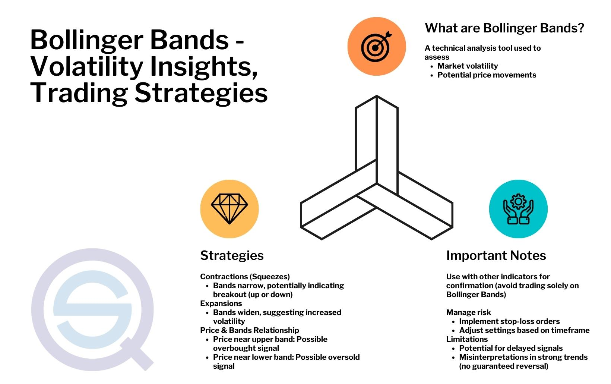

## Table of Contents

## What are Bollinger Bands and how are they calculated?

Bollinger Bands are a tool used in trading to help understand how a stock or asset is moving. They were created by a man named John Bollinger. The bands are made up of three lines: the middle line is the average price of the stock over a certain number of days, usually 20 days. The other two lines are drawn above and below the middle line. These lines show how much the price can change, or how "volatile" it is.

To calculate Bollinger Bands, you start with the middle line, which is called the Simple Moving Average (SMA). You take the closing prices of the stock for the last 20 days and find their average. This average is the middle line. Then, you figure out how much the price has moved away from this average, which is called the standard deviation. The top line is the middle line plus two standard deviations, and the bottom line is the middle line minus two standard deviations. These lines help traders see if a stock's price is too high or too low compared to what it usually does.

## How do Bollinger Bands help in identifying market volatility?

Bollinger Bands help traders understand market volatility by showing how much a stock's price moves away from its average. The bands get wider when the price is moving a lot, which means the market is more volatile. When the bands are closer together, it means the price isn't moving as much, so the market is less volatile. By looking at how wide the bands are, traders can see if the market is calm or if it's going through big changes.

Traders use Bollinger Bands to make decisions about buying or selling stocks. If the bands are wide, it might be a good time to sell because the price could be about to drop. If the bands are narrow, it might be a good time to buy because the price could be about to go up. The bands help traders see these patterns and make smarter choices based on how much the market is moving.

## What is the basic Bollinger Band trading strategy for beginners?

A simple Bollinger Band trading strategy for beginners involves looking at where the price of a stock is compared to the upper and lower bands. When the price touches or goes above the upper band, it might mean the stock is overbought, which means it could be a good time to sell. On the other hand, if the price touches or goes below the lower band, it might mean the stock is oversold, and it could be a good time to buy. This strategy is based on the idea that prices tend to return to the middle band, or the average price, over time.

Another part of this strategy is to watch for the bands getting closer together or further apart. When the bands are close together, it means the market is calm and not moving much. This could be a sign that a big move is coming soon, so you might want to get ready to buy or sell. When the bands are far apart, it means the market is moving a lot and might be getting ready to calm down. By paying attention to these changes, beginners can start to understand when to make their moves in the market.

## How can Bollinger Bands be used to identify overbought and oversold conditions?

Bollinger Bands help traders see if a stock is overbought or oversold by showing where the price is compared to the bands. If the price goes up and touches or goes past the top band, it might mean the stock is overbought. This means a lot of people have bought the stock and the price might be too high. It could be a good time to sell because the price might go down soon.

On the other hand, if the price goes down and touches or goes below the bottom band, it might mean the stock is oversold. This means a lot of people have sold the stock and the price might be too low. It could be a good time to buy because the price might go up soon. By watching where the price is compared to the bands, traders can decide when to buy or sell.

## What are the common time frames used for Bollinger Band analysis?

When using Bollinger Bands, traders often look at different time frames depending on their trading style. Short-term traders, like day traders, might use very short time frames, such as 5-minute or 15-minute charts. This helps them make quick decisions and take advantage of small price movements during the day. For these traders, watching the bands on these short time frames can give them signals about when to buy or sell within a few minutes or hours.

On the other hand, longer-term traders, like swing traders or investors, might look at daily or weekly charts. These time frames help them see bigger trends and make decisions that they can hold onto for days, weeks, or even months. By using Bollinger Bands on these longer time frames, they can better understand the overall direction of the market and make more informed choices about when to enter or exit a position.

## How do you adjust Bollinger Band settings for different trading styles?

To adjust Bollinger Band settings for different trading styles, you need to think about how quickly you want to make trading decisions. If you're a day trader who makes quick trades, you might want to use a shorter period for the moving average, like 10 or 20 days, and maybe even a shorter time frame like 5 or 15 minutes. This helps you see fast changes in the market and react quickly. You might also want to change the number of standard deviations to 1 or 1.5 instead of the usual 2, so the bands are closer to the price and give you more signals.

For swing traders or investors who hold onto their trades for longer, you might want to use a longer period for the moving average, like 50 or 100 days, and look at daily or weekly charts. This helps you see bigger trends over time and make decisions that you can stick with for days or weeks. Keeping the standard deviations at 2 is usually fine for these longer time frames because it helps you see if the price is really far from the average, which can be a good sign of when to buy or sell.

## What are the limitations and potential pitfalls of using Bollinger Bands?

Bollinger Bands are a helpful tool, but they have some limits. One big problem is that they can give you false signals. Sometimes, the price might touch the top or bottom band, but it doesn't mean the stock is overbought or oversold. It might just keep going in the same direction. This can trick you into making a bad trade. Also, Bollinger Bands work best in markets that move a lot. If the market is calm and not moving much, the bands might not give you good signals.

Another thing to watch out for is that Bollinger Bands don't tell you everything about the market. They just show you how much the price is moving away from the average. You need to use other tools and information to make good trading decisions. If you only use Bollinger Bands, you might miss important signs that the market is changing. So, it's smart to use them with other tools like moving averages, RSI, or MACD to get a better picture of what's happening.

## How can Bollinger Bands be combined with other technical indicators for better results?

Bollinger Bands can be used with other technical indicators to get better trading signals. One popular way is to use them with the Relative Strength Index (RSI). The RSI helps you see if a stock is overbought or oversold. When the price touches the top Bollinger Band and the RSI is above 70, it's a strong sign that the stock might be overbought and could go down soon. On the other hand, if the price touches the bottom Bollinger Band and the RSI is below 30, it's a good sign that the stock might be oversold and could go up soon. By using both tools together, you get a clearer picture of when to buy or sell.

Another way to combine Bollinger Bands with other tools is to use them with Moving Average Convergence Divergence (MACD). The MACD helps you see the strength and direction of a trend. When the price is near the top Bollinger Band and the MACD line crosses above the signal line, it's a strong sign that the stock might keep going up. If the price is near the bottom Bollinger Band and the MACD line crosses below the signal line, it's a good sign that the stock might keep going down. By looking at both the Bollinger Bands and the MACD, you can make better decisions about when to enter or exit a trade.

## What are some advanced Bollinger Band strategies used by experienced traders?

Experienced traders often use a strategy called Bollinger Band Squeeze. This happens when the bands get very close together, which means the market isn't moving much. Traders watch for this because it can mean a big move is coming soon. When they see the bands start to widen again, they might buy or sell depending on which way the price is moving. They use other tools like the RSI or MACD to help them decide if the move will be up or down. This strategy helps them get ready for big changes in the market and make smart trades.

Another advanced strategy is called Bollinger Band Breakouts. Traders look for times when the price moves outside the bands, either above the top band or below the bottom band. If the price breaks out above the top band, it might be a good time to buy because the price could keep going up. If the price breaks out below the bottom band, it might be a good time to sell because the price could keep going down. Experienced traders often use other indicators like volume to confirm these breakouts. They want to make sure the move is strong and not just a quick change that won't last. By combining Bollinger Bands with other tools, they can make better trading decisions.

## How do you backtest a Bollinger Band strategy to assess its effectiveness?

To backtest a Bollinger Band strategy, you need to use past data to see how well the strategy would have worked. You can do this by using a trading platform or software that lets you look at old stock prices and apply your Bollinger Band rules to them. For example, you might set up rules like buying when the price touches the bottom band and selling when it touches the top band. Then, you run the test over a long period, like a few years, to see how many times your strategy would have made money and how many times it would have lost money. This helps you understand if your strategy is good or if it needs changes.

When you backtest, it's important to look at more than just how much money you would have made. You should also check how often your strategy would have been right or wrong, and how big the wins and losses would have been. This gives you a full picture of how the strategy works. Sometimes, a strategy might make money overall but have a few big losses that could be risky. By looking at all these things, you can decide if the Bollinger Band strategy is worth using in real trading or if you need to adjust it to make it better.

## What are the psychological aspects to consider when trading with Bollinger Bands?

When you trade using Bollinger Bands, it's important to think about your feelings. Sometimes, the bands might tell you to buy or sell, but you might feel scared or too excited. If you see the price touching the top band and think it's time to sell, you might feel worried that the price will keep going up instead. This can make you wait too long to sell, and you might lose money. On the other hand, if you see the price touching the bottom band and think it's time to buy, you might feel too excited and buy too much, which can also be risky.

It's also important to stay calm and not let your feelings control your trades. When the bands get close together and you think a big move is coming, it can be hard to wait for the right time to buy or sell. You might feel impatient and make a quick decision that isn't good. To be a good trader, you need to follow your plan and not let your feelings make you do something different. Using Bollinger Bands with other tools can help you feel more sure about your choices and keep your feelings in check.

## How have Bollinger Bands been adapted for use in algorithmic trading?

In algorithmic trading, Bollinger Bands are used to make trading decisions automatically. Traders write computer programs that look at the price of a stock and the Bollinger Bands to decide when to buy or sell. For example, the program might be set to buy a stock when the price touches the bottom band and sell when it touches the top band. These programs can look at a lot of data very quickly and make trades without waiting for a person to decide. This can help traders take advantage of small changes in the market that they might miss if they were trading by hand.

To make these programs work better, traders often mix Bollinger Bands with other tools like RSI or MACD. This helps the computer see more about what's happening in the market and make smarter choices. The program can be set up to look for special patterns, like when the bands get close together and then start to move apart, which might mean a big price change is coming. By using these patterns and other tools, the computer can trade more effectively and help traders make more money.

## What are Bollinger Bands and how do they work?

Bollinger Bands are a technical analysis tool that serves as a measure of market [volatility](/wiki/volatility-trading-strategies) and helps traders identify potential opportunities by observing price patterns. Created by John Bollinger in the 1980s, Bollinger Bands consist of three distinct lines plotted relative to the price of a security: a middle band and two surrounding bands, often referred to as the upper and lower bands.

The middle band is typically a simple moving average (SMA) calculated over a specified period, traditionally set to 20 periods. This SMA provides a smoothed average of the price, offering a benchmark to compare current and historical prices. The formula for the simple moving average is:

$$
\text{SMA} = \frac{P_1 + P_2 + ... + P_n}{n}
$$

where $P_i$ represents the price at each period $i$ and $n$ is the number of periods considered.

The upper and lower bands are calculated by adding and subtracting a multiple of the standard deviation from the middle band, typically set at two standard deviations. This method captures approximately 95% of the price movements if the price distribution resembles a normal distribution. The formulas for the upper and lower bands are:

$$
\text{Upper Band} = \text{SMA} + (K \times \sigma)
$$
$$
\text{Lower Band} = \text{SMA} - (K \times \sigma)
$$

where $\sigma$ represents the standard deviation of the price over the same period $n$, and $K$ is the number of standard deviations, usually set at 2.

The utility of Bollinger Bands lies in their ability to dynamically adjust to market conditions. During periods of high market volatility, the bands widen, showcasing increased standard deviations as prices swing more dramatically. Conversely, during periods of low volatility, the bands contract, reflecting tighter price movements.

Traders utilize Bollinger Bands to gain insights into potential price action. For instance, when prices consistently touch the upper band, it may indicate an overbought condition, suggesting a potential reversal or pullback. Similarly, prices touching the lower band might hint at an oversold condition, signaling a possible upward reversal. In addition to reversals, Bollinger Bands help traders to recognize [breakout](/wiki/breakout-trading) conditions; when the bands constrict tightly, it often indicates a buildup in price tension leading to a breakout. Traders might also identify trends using Bollinger Bands, as prices tend to "ride the bands" during strong market trends, especially when combined with other indicators for confirmation.

In essence, the adaptability of Bollinger Bands to different market environments makes them a valuable tool for traders seeking to understand price movements and volatility.

## References & Further Reading

[1]: Bollinger, J. (2002). ["Bollinger on Bollinger Bands."](https://archive.org/download/BollingerOnBollingerBands/Bollinger%20On%20Bollinger%20Bands.pdf) McGraw-Hill.

[2]: Chan, E. P. (2008). ["Quantitative Trading: How to Build Your Own Algorithmic Trading Business."](https://github.com/ftvision/quant_trading_echan_book) Wiley.

[3]: Harris, L. (2003). ["Trading & Exchanges: Market Microstructure for Practitioners."](https://academic.oup.com/book/52292) Oxford University Press.

[4]: Aronson, D. R. (2007). ["Evidence-Based Technical Analysis: Applying the Scientific Method and Statistical Inference to Trading Signals."](https://onlinelibrary.wiley.com/doi/book/10.1002/9781118268315) Wiley.

[5]: Lopez de Prado, M. (2018). ["Advances in Financial Machine Learning."](https://www.amazon.com/Advances-Financial-Machine-Learning-Marcos/dp/1119482089) Wiley.