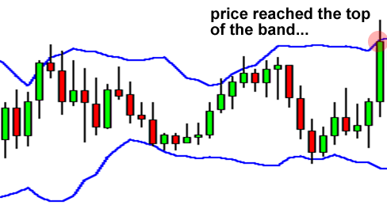

## Table of Contents

## What are Bollinger Bands and how are they used in Forex trading?

Bollinger Bands are a technical analysis tool used in Forex trading to measure market volatility and identify potential price trends. They consist of three lines: a middle line, which is a simple moving average (SMA) of a currency pair's price, and two outer bands that are typically set two standard deviations away from the SMA. The upper band represents the highest expected price, while the lower band represents the lowest expected price within a given period.

In Forex trading, Bollinger Bands are used to help traders make decisions about when to buy or sell a currency pair. When the price of a currency pair moves close to the upper band, it may be considered overbought, suggesting that it might be a good time to sell. Conversely, when the price moves close to the lower band, it may be considered oversold, indicating a potential buying opportunity. Traders also watch for the bands to narrow or widen, as this can signal a decrease or increase in market volatility, respectively. By understanding these signals, traders can better time their trades to potentially increase their profits.

## How do you calculate Bollinger Bands?

To calculate Bollinger Bands, you first need to find the middle band, which is just a simple moving average (SMA) of the price of the currency pair over a certain number of periods, usually 20. You take the closing prices of the last 20 periods, add them up, and then divide by 20 to get the average. This average is your middle band and it moves as new prices come in and old prices drop out of the calculation.

Next, you calculate the upper and lower bands. To do this, you need to find the standard deviation of the same 20 periods. The standard deviation shows how much the prices vary from the average. Once you have the standard deviation, you add it to the middle band to get the upper band, and subtract it from the middle band to get the lower band. Usually, you multiply the standard deviation by 2 before adding or subtracting it, but you can use different numbers if you want the bands to be closer or farther from the middle band. This way, the bands adjust to how much the price is moving around.

## What do the upper, middle, and lower bands of Bollinger Bands represent?

The middle band of Bollinger Bands is like a line that shows the average price of a currency pair over a certain time, usually 20 days. It helps traders see where the price has been, and it moves up or down as new prices come in and old prices are dropped from the calculation.

The upper and lower bands show how much the price can go up or down from the average. The upper band is the highest price the currency pair might reach, and the lower band is the lowest price it might reach. These bands are set a certain distance away from the middle band, usually two times the standard deviation, which measures how much the prices change. When the price gets close to the upper band, it might mean the price is too high and could go down soon. When it gets close to the lower band, it might mean the price is too low and could go up soon.

## How can Bollinger Bands help identify overbought and oversold conditions in the Forex market?

Bollinger Bands help traders see when a currency pair might be overbought or oversold in the Forex market. When the price of a currency pair gets close to the upper band, it might mean the price is too high and could go down soon. This is called being overbought. Traders might think about selling the currency pair at this time because they expect the price to drop.

On the other hand, when the price gets close to the lower band, it might mean the price is too low and could go up soon. This is called being oversold. Traders might think about buying the currency pair at this time because they expect the price to rise. By watching where the price is in relation to the upper and lower bands, traders can make better decisions about when to buy or sell.

## What is the significance of the Bollinger Bandwidth, and how is it used?

The Bollinger Bandwidth is a measure of how far apart the upper and lower Bollinger Bands are from each other. It shows how much the price of a currency pair is moving around. When the bandwidth is small, it means the price isn't moving much, and the market might be calm or getting ready for a big move. When the bandwidth is large, it means the price is moving a lot, and the market might be more exciting or risky.

Traders use the Bollinger Bandwidth to understand when the market might change. If the bandwidth gets really small, traders might get ready for a big price move because the market could be about to break out. On the other hand, if the bandwidth gets really big, traders might think the market is getting too wild and could calm down soon. By watching the bandwidth, traders can try to guess what the market will do next and make better trading decisions.

## Can you explain the concept of Bollinger Band Squeezes and their importance in trading?

A Bollinger Band Squeeze happens when the upper and lower Bollinger Bands come very close together. This means the price of a currency pair isn't moving much, and the market is getting quiet. Traders pay attention to this because it often means the market is getting ready for a big move. It's like the calm before the storm. When the bands are squeezed together, it's a signal to traders to be on the lookout for a big change in price.

The importance of a Bollinger Band Squeeze in trading is that it can help traders get ready for when the market might start moving a lot. When the bands start to spread out after being squeezed, it's a sign that the price could go up or down a lot. Traders use this information to decide when to buy or sell. By watching for these squeezes, traders can try to make better decisions and maybe make more money when the market starts moving again.

## How do traders use Bollinger Bands to set stop-loss and take-profit levels?

Traders use Bollinger Bands to help them decide where to put their stop-loss and take-profit levels. A stop-loss is like a safety net that stops a trade from losing too much money if the price moves the wrong way. Traders often set their stop-loss just outside the Bollinger Bands. For example, if they're buying a currency pair, they might put the stop-loss a bit below the lower band. If they're selling, they might put it a bit above the upper band. This way, they're protected if the price goes too far in the wrong direction.

Take-profit levels are where traders decide to close a trade and take their profits. When using Bollinger Bands, traders might set their take-profit near the opposite band from where they started the trade. So, if they bought when the price was near the lower band, they might aim to sell and take profits near the upper band. This method helps traders catch a good part of the price move without being too greedy. By using Bollinger Bands this way, traders can set clear goals for their trades and manage their risks better.

## What are some common trading strategies involving Bollinger Bands?

One common trading strategy using Bollinger Bands is called the Bollinger Band Squeeze strategy. Traders look for times when the bands come very close together, which means the price isn't moving much. This is called a squeeze. When the bands start to spread out after a squeeze, it's a sign that the price might move a lot. Traders then decide to buy if the price breaks above the upper band or sell if it breaks below the lower band. They hope to catch a big move in the price and make a profit.

Another strategy is the Bollinger Band Reversal strategy. Traders use this when the price touches or goes beyond the upper or lower band. If the price touches the upper band and starts to go down, traders might think it's a good time to sell because the price might be too high. If the price touches the lower band and starts to go up, traders might think it's a good time to buy because the price might be too low. This strategy helps traders catch price movements when the market might be turning around.

A third strategy is using Bollinger Bands to set stop-loss and take-profit levels. Traders set their stop-loss just outside the bands to protect their trades from big losses. For example, if they're buying, they put the stop-loss below the lower band. If they're selling, it goes above the upper band. For take-profit, traders aim for the opposite band. So, if they bought near the lower band, they might sell and take profits near the upper band. This helps traders manage their trades and know when to get out with profits or cut losses.

## How can Bollinger Bands be combined with other technical indicators to improve trading decisions?

Traders often use Bollinger Bands along with other technical indicators to make better trading choices. One popular combination is using Bollinger Bands with the Relative Strength Index (RSI). The RSI helps show if a currency pair is overbought or oversold. When the price touches the upper Bollinger Band and the RSI is above 70, it might be a good time to sell because the price could be too high. If the price touches the lower Bollinger Band and the RSI is below 30, it might be a good time to buy because the price could be too low. By using both indicators together, traders can get a clearer picture of when to enter or exit a trade.

Another useful combination is Bollinger Bands with the Moving Average Convergence Divergence (MACD). The MACD helps traders see the direction of the trend and possible changes in it. When the price breaks above the upper Bollinger Band and the MACD line crosses above the signal line, it might be a good sign to buy because it shows the price might keep going up. If the price breaks below the lower Bollinger Band and the MACD line crosses below the signal line, it might be a good sign to sell because it shows the price might keep going down. Using Bollinger Bands with the MACD can help traders catch strong trends and make more confident trading decisions.

## What are the limitations and potential pitfalls of using Bollinger Bands in Forex trading?

Using Bollinger Bands in Forex trading has some limitations that traders should be aware of. One big problem is that Bollinger Bands can give false signals. Sometimes the price might touch the upper or lower band, but it doesn't mean the price will keep going in that direction. This can trick traders into making bad trades. Also, Bollinger Bands work best in markets that move a lot, but they might not be as helpful in markets that don't move much. If the market is very calm, the bands might stay close together for a long time without any big price moves happening.

Another pitfall is that Bollinger Bands don't tell you everything about the market. They show you how much the price is moving around and where it might be overbought or oversold, but they don't tell you why the price is moving. Traders need to use other tools and information to understand the bigger picture. Relying only on Bollinger Bands can lead to missing out on important details that could affect trading decisions. So, it's smart to use Bollinger Bands along with other indicators and analysis to get a fuller view of the market.

## How do different market conditions affect the effectiveness of Bollinger Bands?

Different market conditions can change how well Bollinger Bands work. In markets that move a lot, Bollinger Bands are really helpful. When the price is going up and down a lot, the bands spread out and show traders where the price might go next. This can help traders see when the price might be too high or too low and make good trading choices. But in markets that don't move much, Bollinger Bands might not be as useful. If the price stays the same for a long time, the bands stay close together and don't give clear signals about what the price might do next.

Also, during times when the market is very calm, Bollinger Bands might squeeze together, which can trick traders into thinking a big move is coming. But sometimes the big move doesn't happen right away, and traders might make trades too early. On the other hand, in markets that are moving wildly, Bollinger Bands can help traders see when the price might be getting too crazy and could calm down soon. So, traders need to think about what the market is doing and use other tools along with Bollinger Bands to make the best trading decisions.

## What advanced techniques can be applied to Bollinger Bands for expert-level Forex trading?

One advanced technique for using Bollinger Bands in Forex trading is to combine them with other indicators to create a more robust trading strategy. For example, traders might use Bollinger Bands along with the Average True Range (ATR) to better understand market volatility. The ATR helps measure how much the price moves, and when it's used with Bollinger Bands, traders can see if the market is really getting more volatile or if it's just a temporary spike. This can help traders avoid false signals and make better decisions about when to enter or exit trades. Another advanced approach is to use multiple timeframes with Bollinger Bands. By looking at the bands on different timeframes, like daily and hourly charts, traders can get a clearer picture of the overall trend and short-term movements, helping them make more informed trading choices.

Another advanced technique is to use Bollinger Bands to identify patterns like the M and W formations. These patterns can signal potential trend reversals. For example, an M formation happens when the price touches the upper band twice and then falls below the middle band, suggesting a bearish reversal. On the other hand, a W formation occurs when the price touches the lower band twice and then rises above the middle band, indicating a bullish reversal. By watching for these patterns, traders can anticipate when the price might change direction and adjust their trades accordingly. Using these advanced techniques, expert traders can improve their use of Bollinger Bands and make more accurate trading decisions in the Forex market.

## What are Bollinger Bands and how do they work?

Bollinger Bands, introduced by financial analyst John Bollinger in the 1980s, remain a fundamental tool for technical analysis in financial markets. They consist of three distinct lines plotted in relation to a financial instrument's price chart. 

The central element of Bollinger Bands is the simple moving average (SMA), typically set over a 20-day period, acting as the baseline or centerline. This SMA is calculated by taking the average of the instrument's closing prices over the specified period. The mathematical formula for the SMA is:

$$
SMA = \frac{P_1 + P_2 + ... + P_n}{n}
$$

where $P$ represents the closing prices, and $n$ is the number of periods.

Flanking the SMA are two standard deviation lines, which adjust dynamically based on market [volatility](/wiki/volatility-trading-strategies). These bands are calculated by adding and subtracting a standard deviation value from the SMA. The number of standard deviations is generally set to 2, capturing approximately 95% of price action within the bands assuming a normal distribution.

The upper band (UB) and lower band (LB) are determined as follows:

$$
UB = SMA + (k \times \sigma)
$$

$$
LB = SMA - (k \times \sigma)
$$

where $\sigma$ is the standard deviation of the price over the same period, and $k$ is usually set to 2.

The Bollinger Bands form a volatility channel, which expands and contracts in response to market volatility, offering traders visual cues about market conditions. A widening channel indicates increased volatility, while a contracting channel suggests reduced volatility.

These bands serve as a crucial analytical tool for identifying potential overbought or oversold conditions. When the price touches or moves outside the bands, it can signal that the asset is experiencing either extreme strength or weakness, prompting traders to consider potential reversal or continuation patterns. As such, Bollinger Bands are instrumental in optimizing trade entry and [exit](/wiki/exit-strategy) points, providing valuable insights into market dynamics.

## How can Bollinger Bands be implemented in algorithmic trading?

Algorithmic trading leverages technical indicators such as Bollinger Bands to enhance and automate trading strategies, optimizing the timing and execution of trades. Bollinger Bands are particularly useful in identifying market conditions, such as periods of low volatility that may precede significant price movements. One of the key patterns used by traders is the Bollinger Band Squeeze, which indicates low volatility and can signal an impending [breakout](/wiki/breakout-trading). 

The Bollinger Band Squeeze occurs when the distance between the upper and lower bands is narrower than usual, suggesting consolidation and potential for a breakout in either direction. A breakout strategy can be programmed into an algorithm to automate the detection of these conditions and execute trades accordingly. 

Algorithms that implement this strategy are typically written in programming languages such as MetaQuotes Language 4 (MQL4), a specialized language used for creating trading robots and scripts on the MetaTrader 4 platform. The automation process involves setting predefined conditions that trigger buy or sell orders. For instance, the algorithm may be instructed to initiate a buy order if the price breaks above the upper band, or conversely, a sell order if it breaks below the lower band.

The mathematical foundation of Bollinger Bands is critical in their algorithmic implementation. The bands are typically set at ±2 standard deviations around a simple moving average (SMA) of period $\text{N}$. This is expressed in the following equations:

$$
\text{Upper Band} = SMA(N) + (K \times \text{Standard Deviation})
$$

$$
\text{Lower Band} = SMA(N) - (K \times \text{Standard Deviation})
$$

where $K$ is the number of standard deviations, usually set at 2.

Programming these strategies involves using technical analysis libraries and financial data handling in Python, such as `pandas` for data manipulation and `ta` for technical indicators. Here is a basic example of a Bollinger Band implementation in Python:

```python
import pandas as pd
import numpy as np

# Assuming 'data' contains your historical price data with a 'Close' column
data['SMA'] = data['Close'].rolling(window=N).mean()
data['STD'] = data['Close'].rolling(window=N).std()

# Calculate the Bollinger Bands
data['Upper Band'] = data['SMA'] + (K * data['STD'])
data['Lower Band'] = data['SMA'] - (K * data['STD'])

# Example of a simple breakout strategy
def breakout_strategy(row):
    if row['Close'] > row['Upper Band']:
        return 'Buy'
    elif row['Close'] < row['Lower Band']:
        return 'Sell'
    else:
        return 'Hold'

data['Signal'] = data.apply(breakout_strategy, axis=1)
```

This script demonstrates a straightforward approach to detecting and acting on breakout signals, a crucial aspect of [algorithmic trading](/wiki/algorithmic-trading) strategies using Bollinger Bands. While effective under certain conditions, these algorithms should be tested thoroughly using historical data to ensure reliability and profitability in live market conditions.

## References & Further Reading

[1]: Bollinger, J. (2002). ["Bollinger on Bollinger Bands"](https://archive.org/download/BollingerOnBollingerBands/Bollinger%20On%20Bollinger%20Bands.pdf). McGraw-Hill.

[2]: Murphy, J. J. (1999). ["Technical Analysis of the Financial Markets: A Comprehensive Guide to Trading Methods and Applications"](https://archive.org/details/technicalanalysi0000murp). New York Institute of Finance.

[3]: Jansen, S. (2020). ["Machine Learning for Algorithmic Trading"](https://github.com/stefan-jansen/machine-learning-for-trading). Packt Publishing.

[4]: Chan, E. P. (2008). ["Quantitative Trading: How to Build Your Own Algorithmic Trading Business"](https://github.com/egorpe/EPChan-QuantitativeTrading/blob/master/example7_6.m). Wiley.

[5]: Aronson, D. (2007). ["Evidence-Based Technical Analysis: Applying the Scientific Method and Statistical Inference to Trading Signals"](https://www.amazon.com/Evidence-Based-Technical-Analysis-Scientific-Statistical/dp/0470008741). Wiley.