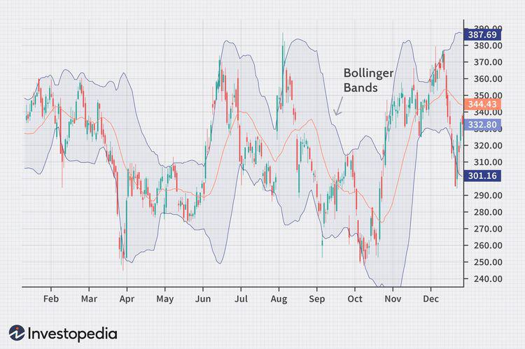

## Table of Contents

## What are Bollinger Bands?

Bollinger Bands are a tool used in trading to help people understand how prices of things like stocks or currencies might move. They were created by a man named John Bollinger. The tool consists of three lines on a chart: a middle line, which is usually the average price over a certain time, and two outer lines that are set above and below the middle line. These outer lines move further apart or closer together depending on how much the price is changing.

When the price of something gets close to or touches the top or bottom line, it might mean that the price could soon start moving in the opposite direction. For example, if the price touches the top line, it might start to go down soon. Traders use this information to decide when to buy or sell. But, it's important to remember that Bollinger Bands are just one tool and should be used with other information to make the best decisions.

## Who created Bollinger Bands and when?

John Bollinger created Bollinger Bands. He is a famous person in the world of trading and finance. He wanted to help traders understand how prices move, so he invented this tool.

Bollinger Bands became popular in the 1980s. This was when John Bollinger started using them and sharing them with others. Since then, many traders have used Bollinger Bands to make decisions about buying and selling stocks, currencies, and other things.

## How are Bollinger Bands calculated?

Bollinger Bands are made up of three lines on a chart. The middle line is the simple moving average (SMA) of the price over a certain number of days, usually 20 days. This means you add up the closing prices for the last 20 days and divide by 20 to find the average. This middle line shows the average price over that time.

The top and bottom lines are called the upper and lower bands. To calculate these, you first need to find the standard deviation of the price over those 20 days. The standard deviation is a way to measure how much the prices have been moving around. Once you have the standard deviation, you add it to the middle line to get the upper band, and subtract it from the middle line to get the lower band. Usually, people use two times the standard deviation for these calculations, but you can change this number if you want.

So, the upper band is the middle line plus two times the standard deviation, and the lower band is the middle line minus two times the standard deviation. These bands move with the price and help traders see when the price might be too high or too low compared to its recent average.

## What do the different components of Bollinger Bands represent?

The middle line of Bollinger Bands is the simple moving average (SMA) of the price over a certain number of days, usually 20 days. This line shows the average price during that time. It helps traders see where the price has been and gives them a reference point to compare with the current price. If the current price is above the middle line, it might mean the price is going up. If it's below, it might mean the price is going down.

The upper and lower bands are calculated using the standard deviation of the price over those 20 days. The upper band is the middle line plus two times the standard deviation, and the lower band is the middle line minus two times the standard deviation. These bands show how much the price has been moving around. When the price gets close to or touches the upper band, it might mean the price is too high and could start to go down soon. When it gets close to or touches the lower band, it might mean the price is too low and could start to go up soon.

## How can beginners use Bollinger Bands to identify market trends?

Beginners can use Bollinger Bands to identify market trends by looking at how the price moves in relation to the middle line and the upper and lower bands. If the price stays above the middle line and keeps touching or getting close to the upper band, it might mean the market is in an uptrend. This means the price is generally going up over time. On the other hand, if the price stays below the middle line and keeps touching or getting close to the lower band, it might mean the market is in a downtrend. This means the price is generally going down over time.

Another way beginners can use Bollinger Bands is to watch for the bands getting wider or narrower. When the bands are getting wider, it means the price is moving a lot and the market might be getting more volatile. This can happen at the start of a new trend. When the bands are getting narrower, it means the price is not moving as much and the market might be getting quieter. This can happen when a trend is about to change or when the market is taking a break. By paying attention to these signs, beginners can get a better idea of what the market might do next.

## What is the significance of the upper and lower bands in trading?

The upper and lower bands in Bollinger Bands are important because they help traders see when a price might be too high or too low. When the price touches or gets close to the upper band, it means the price is high compared to its recent average. This could be a sign that the price might start to go down soon. Traders might think about selling when they see this happen. On the other hand, when the price touches or gets close to the lower band, it means the price is low compared to its recent average. This could be a sign that the price might start to go up soon. Traders might think about buying when they see this happen.

The upper and lower bands also help traders understand how much the price is moving around. When the bands are far apart, it means the price is moving a lot and the market is more volatile. This can be a sign that a big change in the price might be coming. When the bands are close together, it means the price is not moving as much and the market is quieter. This can be a sign that the price might be getting ready to make a big move in one direction or the other. By watching the upper and lower bands, traders can get a better idea of what the market might do next.

## How can Bollinger Bands help in identifying overbought and oversold conditions?

Bollinger Bands can help traders spot when a price might be overbought or oversold. Overbought means the price is too high and might start to go down soon. Oversold means the price is too low and might start to go up soon. When the price touches or gets close to the upper band, it can be a sign that the price is overbought. This happens because the price is much higher than its recent average, and it might be time for it to come back down. Traders might think about selling when they see this happen.

On the other hand, when the price touches or gets close to the lower band, it can be a sign that the price is oversold. This happens because the price is much lower than its recent average, and it might be time for it to go back up. Traders might think about buying when they see this happen. By watching where the price is in relation to the upper and lower bands, traders can get a better idea of when the price might be ready to change direction.

## What are some common trading strategies that use Bollinger Bands?

One common trading strategy that uses Bollinger Bands is called the Bollinger Band Squeeze. This strategy looks for times when the upper and lower bands are close together. When the bands are close, it means the price isn't moving much and the market might be getting ready for a big move. Traders watch for this and then wait for the price to break out of the bands. If the price breaks above the upper band, they might buy, thinking the price will keep going up. If the price breaks below the lower band, they might sell, thinking the price will keep going down.

Another strategy is the Bollinger Band Reversal. This strategy focuses on when the price touches the upper or lower band. When the price touches the upper band, it might be overbought, and traders might sell, expecting the price to go down. When the price touches the lower band, it might be oversold, and traders might buy, expecting the price to go up. This strategy works well when combined with other indicators to confirm the reversal.

A third strategy is the Bollinger Band Breakout. This strategy looks for the price to move outside the bands. When the price breaks above the upper band, it might be a sign of a strong uptrend, and traders might buy. When the price breaks below the lower band, it might be a sign of a strong downtrend, and traders might sell. This strategy can help traders catch big moves in the market, but it's important to use other tools to make sure the [breakout](/wiki/breakout-trading) is real and not just a short-term spike.

## How can investors combine Bollinger Bands with other technical indicators for better results?

Investors can improve their trading decisions by using Bollinger Bands together with other technical indicators. One common combination is using Bollinger Bands with the Relative Strength Index (RSI). The RSI helps show if a price is overbought or oversold. When the price touches the upper Bollinger Band and the RSI is above 70, it might be a strong sign that the price is overbought and could go down soon. On the other hand, if the price touches the lower Bollinger Band and the RSI is below 30, it might be a strong sign that the price is oversold and could go up soon. By using both indicators together, investors can get a better idea of when to buy or sell.

Another useful combination is Bollinger Bands with the Moving Average Convergence Divergence (MACD). The MACD helps show the strength and direction of a trend. When the price breaks above the upper Bollinger Band and the MACD line crosses above the signal line, it might be a good time to buy because it shows a strong uptrend. If the price breaks below the lower Bollinger Band and the MACD line crosses below the signal line, it might be a good time to sell because it shows a strong downtrend. Using Bollinger Bands with the MACD can help investors confirm trends and make more confident trading decisions.

## What are the limitations and potential pitfalls of using Bollinger Bands?

Using Bollinger Bands can be helpful, but they have some limitations. One big problem is that they can give false signals. Sometimes, the price might touch the upper or lower band, but it doesn't mean the price will go the other way. This can trick traders into making bad decisions. Another issue is that Bollinger Bands work best in markets that move a lot. If the market is not moving much, the bands might not be as useful. Also, they don't tell you why the price is moving. They just show you what the price is doing, not why it's doing it.

Another potential pitfall is that Bollinger Bands are based on past data, so they can't predict the future perfectly. They can help you understand what the price has been doing, but they can't tell you exactly what will happen next. Traders need to use other tools and information along with Bollinger Bands to make the best choices. Relying only on Bollinger Bands might lead to missing important details or making mistakes.

## How do experienced traders adjust Bollinger Bands settings for different market conditions?

Experienced traders often change the settings of Bollinger Bands to fit different market conditions. They might change how many days are used to calculate the middle line, which is usually set at 20 days. In a market that moves a lot, traders might use fewer days, like 10 days, to make the bands react faster to price changes. In a market that doesn't move much, they might use more days, like 50 days, to smooth out the bands and get a clearer picture of the trend. By adjusting the number of days, traders can make Bollinger Bands work better for the specific market they're trading in.

Another thing traders might change is the number of standard deviations used for the upper and lower bands. Usually, this is set at two standard deviations, but traders can change it to one or three depending on how much risk they want to take. Using a smaller number, like one standard deviation, makes the bands closer together, which can give more signals but also more false ones. Using a larger number, like three standard deviations, makes the bands farther apart, which can give fewer signals but they might be more reliable. By tweaking these settings, experienced traders can use Bollinger Bands more effectively in different market conditions.

## Can Bollinger Bands be effectively used in different financial markets, and if so, how?

Bollinger Bands can be used in many different financial markets like stocks, [forex](/wiki/forex-system), and commodities. They work the same way in all these markets. The middle line shows the average price over a certain time, and the upper and lower bands show how much the price is moving around. Traders look at where the price is compared to these bands to decide if the price is too high or too low and might change direction soon. For example, in the stock market, if a stock's price touches the upper band, traders might think it's time to sell because the price might go down soon. In the forex market, if a currency pair's price touches the lower band, traders might think it's time to buy because the price might go up soon.

The key to using Bollinger Bands well in different markets is to adjust the settings to fit the market's behavior. In markets that move a lot, like some forex pairs, traders might use fewer days to calculate the middle line so the bands react faster to price changes. In markets that don't move as much, like some commodities, traders might use more days to smooth out the bands and get a clearer picture of the trend. By changing the number of days and the number of standard deviations, traders can make Bollinger Bands work better for the specific market they're trading in. This way, they can use the same tool across different markets but still get useful information.

## What are Bollinger Bands and how do they work?

Bollinger Bands are a statistical charting tool used in technical analysis to assess the volatility and price levels of a financial instrument. They consist of three components plotted on a price chart: a simple moving average (SMA), an upper band, and a lower band. 

The center of the Bollinger Bands is the SMA, which is typically calculated over a 20-day period. This moving average represents an average closing price calculation for the specified number of days and serves as the midpoint of the bands.

The upper and lower bands are positioned at equal distances from the SMA, determined by the volatility of the price data as expressed by standard deviation. The standard deviation is a measure of how much the price deviates from the average price, representing the level of volatility.

Mathematically, Bollinger Bands can be expressed as:

$$
\text{Upper Band} = \text{SMA} + (k \times \text{Standard Deviation})
$$

$$
\text{Lower Band} = \text{SMA} - (k \times \text{Standard Deviation})
$$

Where $k$ is typically set to 2, indicating that the bands are placed two standard deviations away from the SMA. This default setting of a 20-day SMA with bands set at two standard deviations provides a range that captures approximately 95% of price movement, assuming a normal distribution of price changes. This setup is intended to forecast a high-probability range of price fluctuation.

In practice, when the price of a security approaches the upper band, it may signal that the market is becoming overbought, suggesting that the price could be due for a pullback or consolidation. Conversely, when the price moves toward the lower band, it may indicate an oversold condition, potentially leading to a price bounce or upward correction.

The dynamic nature of Bollinger Bands means they expand and contract based on market [volatility](/wiki/volatility-trading-strategies). Wider bands reflect higher volatility, while narrower bands indicate reduced volatility. This feature assists traders in anticipating potential market changes based on the contraction and expansion of the bands.

## How do you construct Bollinger Bands?

Constructing Bollinger Bands involves two primary calculations: first, determining a security's simple moving average (SMA) over a predetermined period, and second, calculating the standard deviation of the price over the same time frame. 

The typical approach is to use a 20-day SMA. The SMA is calculated by summing the closing prices of a security for the last 20 days and then dividing by 20:

$$
\text{SMA}_{20} = \frac{P_1 + P_2 + \ldots + P_{20}}{20}
$$

where $P_1, P_2, \ldots, P_{20}$ are the closing prices for the 20-day period.

Next, the standard deviation, which measures the amount of variation or [dispersion](/wiki/dispersion-trading) of prices, is calculated. This provides an insight into the volatility over the same period. The standard deviation ($\sigma$) formula is:

$$
\sigma = \sqrt{\frac{1}{N} \sum_{i=1}^{N} (P_i - \text{SMA}_{20})^2}
$$

where $N$ is the number of periods in the moving average, typically 20.

To construct the Bollinger Bands, you apply the following formulas:

- **Upper Band**: $\text{Upper Band} = \text{SMA}_{20} + (2 \times \sigma)$

- **Lower Band**: $\text{Lower Band} = \text{SMA}_{20} - (2 \times \sigma)$

These calculations result in the Bollinger Bands enveloping the price chart with two lines (upper and lower bands) along with the SMA in the middle, providing a range within which prices are likely to oscillate.

Modern trading platforms such as TradingView offer built-in functionalities that simplify the overlay of Bollinger Bands onto price charts. This allows traders to analyze market data visually and make informed decisions without manually computing the necessary [statistics](/wiki/bayesian-statistics). By inputting the desired parameters, such as the period length and the standard deviation [factor](/wiki/factor-investing), the platform automatically sets up the bands, providing a clear view of potential market conditions characterized by overbought or oversold signals.

## References & Further Reading

[1]: Bollinger, J. (1992). [Bollinger on Bollinger Bands](https://www.amazon.com/Bollinger-Bands-John/dp/0071373683). McGraw-Hill Education.

[2]: Brock, W., Lakonishok, J., & LeBaron, B. (1992). ["Simple technical trading rules and the stochastic properties of stock returns."](https://www.jstor.org/stable/2328994) Journal of Finance, 47(5), 1731-1764.

[3]: Lo, A. W., Mamaysky, H., & Wang, J. (2000). ["Foundations of Technical Analysis: Computational Algorithms, Statistical Inference, and Empirical Implementation."](https://www.nber.org/system/files/working_papers/w7613/w7613.pdf) The Journal of Finance, 55(4), 1705-1765.

[4]: Pring, M. J. (2002). [Technical Analysis Explained: The Successful Investor's Guide to Spotting Investment Trends and Turning Points](https://www.amazon.com/Technical-Analysis-Explained-Fifth-Successful/dp/0071825177). McGraw-Hill. 

[5]: Murphy, J. J. (1999). [Technical Analysis of the Financial Markets: A Comprehensive Guide to Trading Methods and Applications](https://archive.org/details/technicalanalysi0000murp). New York Institute of Finance.

[6]: Elder, A. (1993). [Trading for a Living: Psychology, Trading Tactics, Money Management](https://www.amazon.com/Trading-Living-Psychology-Tactics-Management/dp/0471592242). John Wiley & Sons.

[7]: Chan, E. (2009). [Quantitative Trading: How to Build Your Own Algorithmic Trading Business](https://github.com/ftvision/quant_trading_echan_book). Wiley. 

[8]: Holzrichter, K. J., & Osten, B. (2012). ["Algorithmic Trading for Financial Investing"](https://www.cambridge.org/core/journals/journal-of-financial-and-quantitative-analysis/article/abs/algorithmic-trading-and-market-quality-international-evidence/4B96E916E3E13AFF1DF9B5FCC188F4E0). In Computational Intelligence and Financial Markets, Springer.