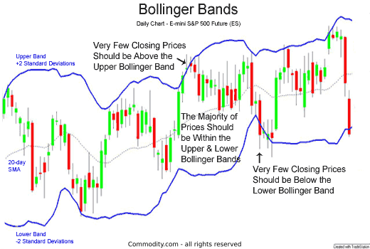

## Table of Contents

## What are Bollinger Bands and who developed them?

Bollinger Bands are a tool used in trading to help understand how a stock or other financial thing is moving. They were created by a man named John Bollinger in the 1980s. The tool consists of three lines: the middle line is a moving average, usually of the last 20 days of a stock's price. The other two lines are set above and below this middle line. These outer lines are called bands, and they move further apart or closer together depending on how much the stock's price is changing.

The bands help traders see if a stock's price is high or low compared to what it has been doing recently. When the price touches the top band, it might mean the stock is getting too expensive and could go down soon. When it touches the bottom band, it might mean the stock is getting too cheap and could go up. Traders use this information to decide when to buy or sell. Bollinger Bands are popular because they give a clear picture of how much a stock's price is moving around, which can help make better trading choices.

## How are Bollinger Bands calculated?

Bollinger Bands are made up of three lines drawn on a chart. The middle line is called the moving average. To find this, you take the average price of a stock over the last 20 days. This line shows the typical price of the stock over that time. The other two lines are called the upper and lower bands. They are set above and below the moving average.

To calculate the upper and lower bands, you first need to figure out something called the standard deviation. This tells you how much the stock's price has been moving around. You take the standard deviation of the stock's price over the same 20 days. Then, to get the upper band, you add two times the standard deviation to the moving average. To get the lower band, you subtract two times the standard deviation from the moving average. These bands move wider apart when the stock's price is changing a lot and closer together when it's not changing much.

## What do the upper, middle, and lower bands represent?

The middle band of Bollinger Bands is a simple moving average, usually calculated over the last 20 days of a stock's price. It represents the average price of the stock during that period. This line helps traders see the typical price of the stock and acts as a reference point for the upper and lower bands.

The upper band is calculated by adding two times the standard deviation of the stock's price to the middle band. It shows the highest point where the stock's price is considered normal based on recent changes. When the stock's price touches or goes above this band, it might mean the stock is getting too expensive and could go down soon.

The lower band is found by subtracting two times the standard deviation from the middle band. It represents the lowest point where the stock's price is still considered normal. If the stock's price touches or goes below this band, it might mean the stock is getting too cheap and could go up soon. These bands help traders understand if a stock's price is unusually high or low compared to its recent behavior.

## How can Bollinger Bands be used to identify market trends?

Bollinger Bands can help traders see if a stock is going up, down, or staying the same. When the price of a stock keeps touching the upper band and the bands are getting wider, it might mean the stock is starting a strong upward trend. On the other hand, if the price keeps touching the lower band and the bands are spreading out, it could mean the stock is starting a strong downward trend. Traders look at these patterns to decide if they should buy or sell the stock.

If the price of a stock stays close to the middle band and the bands are not moving much, it might mean the stock is not trending and is just moving sideways. This can be a sign that the market is calm and not changing much. Traders might wait for a new trend to start before making big moves. By watching how the price interacts with the Bollinger Bands, traders can get a better idea of what the market might do next.

## What is the significance of the band width in Bollinger Bands?

The width of the Bollinger Bands tells you how much a stock's price is moving around. When the bands are wide, it means the price is changing a lot and the market might be excited or worried about the stock. This can be a sign that a big move in the stock's price is happening or about to happen. Traders watch for these wide bands because they might mean a strong trend is starting.

When the bands are narrow, it means the stock's price is not changing much and the market is calm. This can be a time when not much is happening with the stock. Traders might see narrow bands as a sign that the market is waiting for something new to happen. They might wait for the bands to start getting wider again before making big trading decisions.

## How do traders use Bollinger Bands to determine overbought and oversold conditions?

Traders use Bollinger Bands to figure out when a stock might be overbought or oversold. When the price of a stock touches or goes above the upper band, it might mean the stock is overbought. This means the price has gone up a lot and could be too high. Traders might see this as a sign that the price could go down soon, so they might think about selling the stock.

On the other hand, when the price touches or goes below the lower band, it might mean the stock is oversold. This means the price has gone down a lot and could be too low. Traders might see this as a sign that the price could go up soon, so they might think about buying the stock. By watching where the price is compared to the bands, traders can make decisions about when to buy or sell.

## Can Bollinger Bands predict market volatility, and if so, how?

Bollinger Bands can help predict market volatility by showing how much a stock's price is moving around. When the bands are wide, it means the price is changing a lot, which shows that the market is more volatile. This could be because people are excited or worried about the stock. Traders use this information to guess that big price changes might be coming soon. They watch for the bands to get wider as a sign that the market is getting more active and unpredictable.

When the bands are narrow, it means the stock's price is not moving much, which shows that the market is calm and less volatile. This could mean that not much is happening with the stock, and the market is waiting for something new. Traders might see narrow bands as a time to be patient and wait for the bands to start getting wider again before making big moves. By watching the width of the Bollinger Bands, traders can get a better idea of when the market might be more or less volatile.

## What are some common trading strategies that incorporate Bollinger Bands?

One common trading strategy using Bollinger Bands is the Bollinger Band Squeeze. This strategy looks for times when the bands are very close together, which means the stock's price isn't moving much. Traders watch for this because it often means that a big move in the stock's price is about to happen. When the bands start to get wider, traders might buy or sell the stock, expecting a big change in its price. This strategy helps traders catch the start of new trends.

Another strategy is the Bollinger Band Breakout. Traders using this strategy watch for the stock's price to move outside the upper or lower band. When the price goes above the upper band, traders might think the stock is overbought and could go down soon, so they might sell. If the price goes below the lower band, traders might think the stock is oversold and could go up soon, so they might buy. This strategy helps traders make quick decisions based on where the price is compared to the bands.

A third strategy is the Bollinger Band Reversal. This strategy looks for times when the stock's price touches one of the bands and then starts moving back towards the middle band. If the price touches the upper band and then starts going down, traders might see this as a sign that the price could keep falling, so they might sell. If the price touches the lower band and then starts going up, traders might see this as a sign that the price could keep rising, so they might buy. This strategy helps traders find good times to buy or sell based on the price moving away from the bands.

## How should Bollinger Bands be adjusted for different time frames and assets?

When using Bollinger Bands, you might need to change how you set them up depending on the time frame you're looking at and the kind of asset you're trading. For shorter time frames like minutes or hours, traders often use a smaller number of days for the moving average, maybe 10 or 15 days instead of the usual 20. This helps them catch quicker changes in the price. For longer time frames like days or weeks, sticking with the standard 20-day moving average is usually fine because it gives a good view of the bigger trends.

The type of asset you're trading can also change how you set up Bollinger Bands. Stocks that move a lot might need wider bands, so you might use a bigger number for the standard deviation, like 2.5 or 3 instead of the usual 2. This makes the bands spread out more, which fits better with how much the stock's price is moving. For assets that don't move as much, like some bonds or commodities, you might use a smaller number for the standard deviation, like 1.5, to make the bands closer together. This helps show smaller changes in the price more clearly.

## What are the limitations and potential pitfalls of using Bollinger Bands?

Using Bollinger Bands can help traders understand how a stock's price is moving, but they have some limits. One big problem is that Bollinger Bands can give wrong signals sometimes. Just because a stock's price touches the top or bottom band doesn't always mean it will go back to the middle band. The price might keep going up or down, and traders who rely too much on the bands might make bad choices. Also, Bollinger Bands work best when the market is moving a lot, but they might not be as helpful when the market is calm and not changing much.

Another thing to watch out for is that Bollinger Bands are just one tool. Traders shouldn't use them alone to make decisions. It's important to look at other things like what's happening in the news, how the whole market is doing, and other trading tools like moving averages or the Relative Strength Index (RSI). If traders only use Bollinger Bands, they might miss important information that could change their minds about buying or selling. So, it's good to use Bollinger Bands along with other tools to get a fuller picture of what's going on in the market.

## How can Bollinger Bands be combined with other technical indicators for better analysis?

Bollinger Bands can be used with other tools like the Relative Strength Index (RSI) to help traders make better choices. The RSI shows if a stock might be overbought or oversold by looking at how fast the price is changing. When the RSI is above 70, it means the stock might be overbought, and when it's below 30, it might be oversold. Traders can use this with Bollinger Bands by waiting for the price to touch the top band and the RSI to be over 70 before selling, or for the price to touch the bottom band and the RSI to be under 30 before buying. This can help traders be more sure about their decisions.

Another way to use Bollinger Bands with other tools is with moving averages. A moving average is a line that shows the average price of a stock over time. Traders might use a shorter moving average, like a 10-day one, along with Bollinger Bands. When the shorter moving average crosses above the middle band of the Bollinger Bands, it might mean the stock's price is starting to go up. If it crosses below the middle band, it might mean the price is starting to go down. By looking at both the moving average and the Bollinger Bands, traders can get a better idea of when to buy or sell.

## What advanced techniques can be applied to Bollinger Bands for expert-level trading?

One advanced technique for using Bollinger Bands is called the Bollinger Band Width. This measures how wide the bands are at any time. When the bands get very narrow, it might mean the stock's price isn't moving much, and a big move could be coming soon. Traders can use this to get ready for a big change in the price. They might also use other tools like the Relative Strength Index (RSI) or the Moving Average Convergence Divergence (MACD) to confirm when the price is about to move. This helps traders be more sure about when to buy or sell.

Another advanced technique is using Bollinger Bands with multiple time frames. Traders can look at the bands on a daily chart, a weekly chart, and even a monthly chart to see different trends. If the price is touching the lower band on all three time frames, it might be a strong sign that the stock is oversold and could go up soon. Traders can use this to find the best times to buy or sell by looking at the bigger picture. This way, they can make decisions based on more than just one time frame, which can lead to better trading results.

## What are Bollinger Bands and how do they work?

Bollinger Bands are a technical analysis tool designed to provide a relative definition of high and low prices of a commodity or stock over a specific period. At their core, Bollinger Bands consist of a simple moving average (SMA) and two standard deviation lines plotted symmetrically above and below this average. These components work together to present a picture of market volatility and potential price movements.

The simple moving average is central to Bollinger Bands, serving as the baseline around which the bands are constructed. The moving average is typically set over a 20-period window, but this can be adjusted based on the trader's preference and the specific asset being analyzed. The calculation for a simple moving average over $n$ periods is given by:

$$
\text{SMA} = \frac{1}{n} \sum_{i=1}^{n} P_i
$$

where $P_i$ represents the price at each period.

Flanking the simple moving average are the two standard deviation lines. These lines, known as the upper and lower Bollinger Bands, are determined by calculating the standard deviation of the same number of periods used in the moving average. The upper band is set two standard deviations above the moving average, while the lower band is set two standard deviations below it. The formula for the standard deviation $\sigma$ of these price points is:

$$
\sigma = \sqrt{\frac{1}{n} \sum_{i=1}^{n} (P_i - \text{SMA})^2}
$$

Using these calculations, the Bollinger Bands are defined as:

- Upper Band = SMA + (2 \times \sigma)
- Lower Band = SMA - (2 \times \sigma)

The primary benefit of using standard deviation as a measure is its ability to dynamically adjust the bandwidth of the envelope in response to market [volatility](/wiki/volatility-trading-strategies). When an asset experiences heightened volatility, the bands naturally widen, indicating increased market instability. Conversely, the bands contract during periods of low volatility, suggesting a potential buildup before significant price movement.

John Bollinger introduced this method in the 1980s, aiming to provide traders with a more adaptive measure of market volatility. This adaptability allows traders to visually assess whether prices are relatively high or low, which can inform their trading decisions.

By reflecting both the trend and the volatility, Bollinger Bands serve as a comprehensive tool for gauging market conditions, highlighting overbought or oversold scenarios when prices approach or exceed the bands. This dynamic response to market conditions makes Bollinger Bands a widely respected indicator among traders seeking to capitalize on price variations.

## References & Further Reading

[1]: Bollinger, J. (2002). ["Bollinger on Bollinger Bands"](https://www.amazon.com/Bollinger-Bands-John/dp/0071373683) by John Bollinger

[2]: Aronson, D. R. (2006). ["Evidence-Based Technical Analysis: Applying the Scientific Method and Statistical Inference to Trading Signals"](https://www.amazon.com/Evidence-Based-Technical-Analysis-Scientific-Statistical/dp/0470008741) by David Aronson

[3]: Chan, E. (2008). ["Quantitative Trading: How to Build Your Own Algorithmic Trading Business"](https://github.com/ftvision/quant_trading_echan_book) by Ernest P. Chan

[4]: Pring, M. J. (2002). ["Technical Analysis Explained: The Successful Investor's Guide to Spotting Investment Trends and Turning Points"](https://www.amazon.com/Technical-Analysis-Explained-Fifth-Successful/dp/0071825177) by Martin J. Pring

[5]: Jansen, S. (2020). ["Machine Learning for Algorithmic Trading: Predictive Models to Extract Signals from Market and Alternative Data for Systematic Trading Strategies with Python (2nd Edition)"](https://www.amazon.com/Machine-Learning-Algorithmic-Trading-alternative/dp/1839217715) by Stefan Jansen