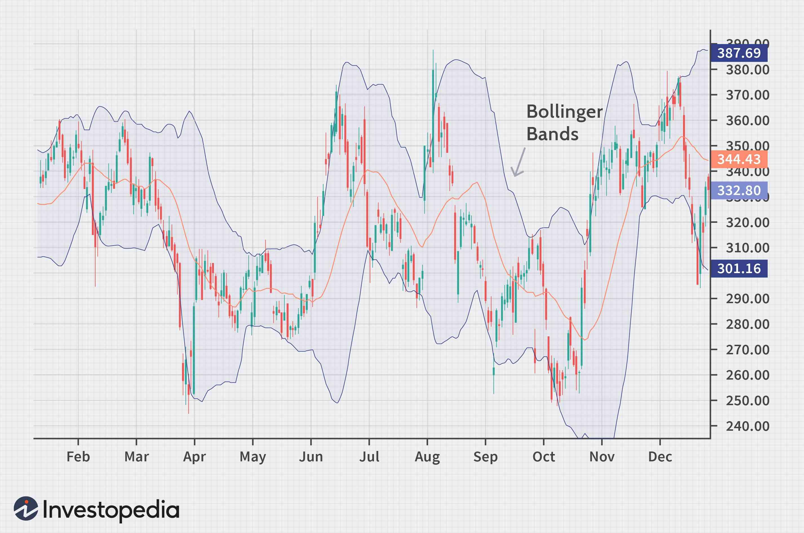

Technical analysis is an essential approach for traders keen on deciphering market trends and making informed trading decisions. At the center of this analytical framework lies a variety of financial indicators, with Bollinger Bands standing out as one of the most recognized and widely used tools in the trader’s toolkit. Developed by John Bollinger in the 1980s, Bollinger Bands provide critical insights into market volatility and are instrumental in identifying potential trading opportunities through their unique construct.

Bollinger Bands operate by visualizing price action within the context of historical price data, allowing traders to assess whether market conditions are overbought or oversold. This is achieved through a simple yet effective methodology involving a simple moving average (SMA), flanked by two standard deviation lines. These lines adapt dynamically to changing market conditions, contracting during periods of low volatility and expanding when volatility increases. Such an adaptable structure affords traders a graphical representation of volatility and helps in delineating the probable highs and lows of a given financial instrument.



Moreover, the application of Bollinger Bands extends beyond traditional trading strategies. In the ever-evolving landscape of algorithmic trading, Bollinger Bands serve as vital components within automated systems. These systems capitalize on mathematical precision and predefined criteria dictated by Bollinger Bands to execute trades, thereby optimizing trade execution in response to the continuously fluctuating dynamics of the market. The flexibility and adaptability of Bollinger Bands render them a suitable choice for developing dynamic strategies that adjust to shifting market volatility.

In summary, this article explores the utility of Bollinger Bands within the sphere of technical trading. It examines their broader applications, particularly in algorithmic trading, while highlighting their effectiveness as a financial indicator for market analysis. By understanding the functions and intricacies of Bollinger Bands, traders can enhance their analytical capabilities, thus supporting a more informed and robust decision-making process in financial markets.

## Table of Contents

## Understanding Bollinger Bands

Bollinger Bands are a technical analysis tool designed to provide a relative definition of high and low prices of a commodity or stock over a specific period. At their core, Bollinger Bands consist of a simple moving average (SMA) and two standard deviation lines plotted symmetrically above and below this average. These components work together to present a picture of market volatility and potential price movements.

The simple moving average is central to Bollinger Bands, serving as the baseline around which the bands are constructed. The moving average is typically set over a 20-period window, but this can be adjusted based on the trader's preference and the specific asset being analyzed. The calculation for a simple moving average over $n$ periods is given by:

$$
\text{SMA} = \frac{1}{n} \sum_{i=1}^{n} P_i
$$

where $P_i$ represents the price at each period.

Flanking the simple moving average are the two standard deviation lines. These lines, known as the upper and lower Bollinger Bands, are determined by calculating the standard deviation of the same number of periods used in the moving average. The upper band is set two standard deviations above the moving average, while the lower band is set two standard deviations below it. The formula for the standard deviation $\sigma$ of these price points is:

$$
\sigma = \sqrt{\frac{1}{n} \sum_{i=1}^{n} (P_i - \text{SMA})^2}
$$

Using these calculations, the Bollinger Bands are defined as:

- Upper Band = SMA + (2 \times \sigma)
- Lower Band = SMA - (2 \times \sigma)

The primary benefit of using standard deviation as a measure is its ability to dynamically adjust the bandwidth of the envelope in response to market [volatility](/wiki/volatility-trading-strategies). When an asset experiences heightened volatility, the bands naturally widen, indicating increased market instability. Conversely, the bands contract during periods of low volatility, suggesting a potential buildup before significant price movement.

John Bollinger introduced this method in the 1980s, aiming to provide traders with a more adaptive measure of market volatility. This adaptability allows traders to visually assess whether prices are relatively high or low, which can inform their trading decisions.

By reflecting both the trend and the volatility, Bollinger Bands serve as a comprehensive tool for gauging market conditions, highlighting overbought or oversold scenarios when prices approach or exceed the bands. This dynamic response to market conditions makes Bollinger Bands a widely respected indicator among traders seeking to capitalize on price variations.

## How Bollinger Bands Work

Bollinger Bands are a technical analysis tool used by traders to evaluate potential overbought or oversold conditions in market prices. They consist of three lines: a Simple Moving Average (SMA), an upper band, and a lower band. The upper and lower bands are typically plotted at two standard deviations away from the SMA of the price, thus adjusting to the market's volatility.

The core principle of Bollinger Bands is that the price of an asset is likely to revert to the mean over time. Thus, when prices frequently touch or exceed the upper band, it may indicate that the asset is overbought, prompting potential buy signals for traders contemplating a sell-off or a trend reversal. Conversely, prices reaching or dipping below the lower band might suggest that the asset is oversold, possibly presenting buying opportunities as expectations of price correction emerge. 

The formula for calculating the Bollinger Bands is as follows:
- **Middle Band** (SMA): $\text{SMA} = \frac{(P_1 + P_2 + \ldots + P_n)}{n}$, where $P$ represents the price and $n$ is the number of periods.
- **Upper Band**: $\text{Upper Band} = \text{SMA} + (k \times \sigma)$
- **Lower Band**: $\text{Lower Band} = \text{SMA} - (k \times \sigma)$
  where $\sigma$ is the standard deviation of the price over the same period, and $k$ is typically set to 2.

Despite their straightforward nature, Bollinger Bands provide technical analysts with rich insights into market behavior, showing how expansive or contractive the market is at any moment. Analyzing how the bands react to price movements can also help in gauging the strength and direction of market trends. Additionally, traders often observe Bollinger Band 'squeezes', periods where the bands narrow sharply, signifying a potential increase in volatility and a consequent [breakout](/wiki/breakout-trading) of price. 

Bollinger Bands are thus an invaluable tool, providing traders with visible cues to act upon based on statistical tendencies of reversion and divergence of price movements.

## Bollinger Bands in Algorithmic Trading

Algorithmic trading, characterized by the use of algorithms to execute trades at optimal times, has seen significant growth and adoption in financial markets. Among the various strategies employed in [algorithmic trading](/wiki/algorithmic-trading), the use of Bollinger Bands has become particularly prevalent due to their ability to analyze and respond to market volatility effectively.

Bollinger Bands are integrated into algorithmic trading systems to automate the decision-making process by establishing rule-based frameworks. These frameworks allow algorithms to interpret market data and execute trades based on predefined conditions. For example, a trading algorithm might be programmed to buy an asset when its price approaches the lower Bollinger Band, suggesting it may be oversold, and sell when the price nears the upper band, indicating potential overbought conditions.

A key advantage of Bollinger Bands in this automated setting is their adaptability to changing market conditions. As volatility increases or decreases, the bands widen or narrow, thus altering the triggers for buy or sell signals dynamically. This adaptability ensures that the trading strategy remains relevant in different market environments, providing more reliable signals based on current market dynamics rather than static thresholds.

The implementation of Bollinger Bands in algorithmic systems can be illustrated using a simple Python example with the help of libraries like Pandas and NumPy for data handling, and Matplotlib for visualization:

```python
import pandas as pd
import numpy as np
import matplotlib.pyplot as plt

# Assume 'data' is a Pandas DataFrame with a 'Close' column for the closing prices

def calculate_bollinger_bands(data, window=20, num_std_dev=2):
    rolling_mean = data['Close'].rolling(window=window).mean()
    rolling_std = data['Close'].rolling(window=window).std()
    upper_band = rolling_mean + (rolling_std * num_std_dev)
    lower_band = rolling_mean - (rolling_std * num_std_dev)
    return rolling_mean, upper_band, lower_band

# Calculate Bollinger Bands
mean, upper_band, lower_band = calculate_bollinger_bands(data)

# Plotting
plt.figure(figsize=(12, 6))
plt.plot(data['Close'], label='Close Price')
plt.plot(mean, label='Rolling Mean', color='orange')
plt.plot(upper_band, label='Upper Band', color='red')
plt.plot(lower_band, label='Lower Band', color='green')
plt.fill_between(data.index, lower_band, upper_band, color='grey', alpha=0.1)
plt.legend(loc='best')
plt.title('Bollinger Bands')
plt.show()
```

This code calculates and plots Bollinger Bands, illustrating how they adjust based on the specified window size and number of standard deviations. Algorithmic traders can employ such methods to backtest their strategies, ensuring that the algorithms generate profitable signals over historical data. The dynamic nature of Bollinger Bands in algorithmic trading helps optimize trade execution while adapting to continually evolving market conditions, thereby enhancing the potential for successful trading strategies.

## Advantages and Limitations of Bollinger Bands

Bollinger Bands offer several advantages to traders by adapting to market volatility and providing real-time insights. A primary strength of Bollinger Bands lies in their ability to automatically adjust as market conditions change. This adaptiveness allows traders to observe and interpret price movements within the context of historical volatility. The bands expand and contract based on the standard deviation of prices, making them an effective tool for identifying periods of high and low volatility. 

However, their simplicity can also present certain limitations. Bollinger Bands primarily serve as a measure of volatility, indicating overbought or oversold market conditions based on price interactions with the bands. This limitation means that relying solely on Bollinger Bands could lead to false signals. For instance, a price touching the upper band does not inherently indicate an impending price drop; instead, it may simply reflect increased volatility.

To mitigate the risk of false signals and enhance their accuracy, Bollinger Bands should be used in conjunction with other technical indicators. By integrating additional tools, traders can derive more reliable insights. For example, combining Bollinger Bands with the Relative Strength Index (RSI) can help confirm overbought or oversold conditions by cross-verifying [momentum](/wiki/momentum) with price volatility. Similarly, the Moving Average Convergence Divergence (MACD) can provide additional confirmation of trends when used alongside Bollinger Bands. 

Using Bollinger Bands effectively involves recognizing that they are one piece of a more comprehensive analysis toolkit. Traders can improve their decision-making by combining Bollinger Bands with other indicators, thus creating a more nuanced strategy that accounts for various market dynamics. This integrative approach helps in filtering out noise and developing a more robust trading plan.

## Implementing Bollinger Bands in Your Strategy

To effectively utilize Bollinger Bands in a trading strategy, it is crucial for traders to understand the settings that determine the bands' configuration and how these settings can be adjusted for different asset classes. The standard configuration for Bollinger Bands involves a 20-period simple moving average (SMA) with bands set two standard deviations away. However, these parameters can be modified based on the specific characteristics of the asset being traded and the trader's objectives. 

Backtesting is a valuable method to assess the performance of different Bollinger Bands settings and their combinations with other indicators. By simulating trades using historical data, traders can identify which configurations are most effective for various market conditions and asset classes. Here's a basic example of how you might perform a backtest using Python:

```python
import pandas as pd
import numpy as np

def bollinger_bands(data, window=20, num_sd=2):
    rolling_mean = data['Close'].rolling(window=window).mean()
    rolling_std = data['Close'].rolling(window=window).std()
    data['Upper Band'] = rolling_mean + (rolling_std * num_sd)
    data['Lower Band'] = rolling_mean - (rolling_std * num_sd)
    return data

# Example usage with hypothetical historical data
data = pd.read_csv('historical_data.csv')
data = bollinger_bands(data)

# Basic signal generation
data['Signal'] = 0
data.loc[data['Close'] < data['Lower Band'], 'Signal'] = 1  # buy
data.loc[data['Close'] > data['Upper Band'], 'Signal'] = -1 # sell

# Evaluate strategy
# ...

```

Integrating Bollinger Bands into a disciplined trading plan can significantly mitigate risks and enhance trade outcomes. This involves not only selecting the optimal parameters through [backtesting](/wiki/backtesting) but also employing risk management practices such as setting stop-loss orders and defining clear entry and [exit](/wiki/exit-strategy) points. A well-defined strategy incorporating Bollinger Bands will address both the identification of trading opportunities and the management of potential losses.

Furthermore, combining Bollinger Bands with other technical indicators like the Relative Strength Index (RSI) or the Moving Average Convergence Divergence (MACD) can provide additional confirmation for trading signals. This multi-faceted approach reduces the probability of false signals, improving both the reliability and profitability of trades.

By methodically adjusting settings and rigorously backtesting strategies, traders can harness the full potential of Bollinger Bands and enhance their technical analysis toolkit, ultimately contributing to more robust and informed trading decisions.

## Conclusion

Bollinger Bands are an essential tool for traders looking to navigate the complexities of financial markets. They offer insights into market volatility and price trends, providing a structured approach to understanding market dynamics. At their core, Bollinger Bands are designed to capture the majority of price action, making them instrumental in identifying potential trading opportunities and alerting traders to changing market conditions.

Incorporating Bollinger Bands into trading strategies enables traders to gauge whether markets are experiencing high or low volatility. This understanding is critical as it helps traders make informed predictions about potential price movements. By adapting to these fluctuations, Bollinger Bands form the foundation for a wide array of trading strategies, from identifying breakout opportunities to setting stop-loss levels.

The effective implementation of Bollinger Bands enhances technical analysis by offering a clearer view of market conditions. This can be achieved through customization of their parameters—such as the moving average period and the number of standard deviations—which can be tailored to suit different asset classes and market environments. By combining Bollinger Bands with other technical indicators like the Relative Strength Index (RSI) or Moving Average Convergence Divergence (MACD), traders can confirm trading signals and reduce the likelihood of false signals.

For those seeking to improve their trading outcomes, Bollinger Bands serve as a critical component of a disciplined trading plan. When employed judiciously alongside rigorous risk management practices and algorithmic trading frameworks, Bollinger Bands can significantly bolster the robustness of trading decisions, leading to more consistent and profitable outcomes in a fluctuating financial landscape.

## References & Further Reading

[1]: Bollinger, J. (2002). ["Bollinger on Bollinger Bands"](https://www.amazon.com/Bollinger-Bands-John/dp/0071373683) by John Bollinger

[2]: Aronson, D. R. (2006). ["Evidence-Based Technical Analysis: Applying the Scientific Method and Statistical Inference to Trading Signals"](https://www.amazon.com/Evidence-Based-Technical-Analysis-Scientific-Statistical/dp/0470008741) by David Aronson

[3]: Chan, E. (2008). ["Quantitative Trading: How to Build Your Own Algorithmic Trading Business"](https://github.com/ftvision/quant_trading_echan_book) by Ernest P. Chan

[4]: Pring, M. J. (2002). ["Technical Analysis Explained: The Successful Investor's Guide to Spotting Investment Trends and Turning Points"](https://www.amazon.com/Technical-Analysis-Explained-Fifth-Successful/dp/0071825177) by Martin J. Pring

[5]: Jansen, S. (2020). ["Machine Learning for Algorithmic Trading: Predictive Models to Extract Signals from Market and Alternative Data for Systematic Trading Strategies with Python (2nd Edition)"](https://www.amazon.com/Machine-Learning-Algorithmic-Trading-alternative/dp/1839217715) by Stefan Jansen