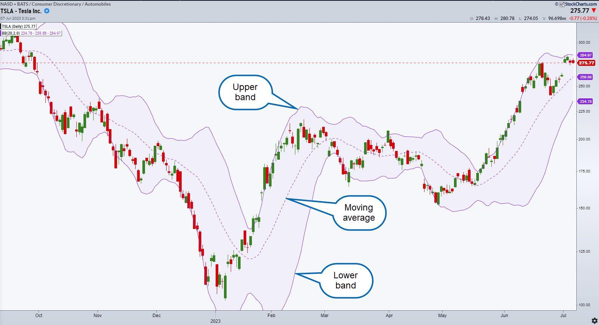

Bollinger Bands are a significant tool in technical analysis, often used in algorithmic trading to predict market volatility and price movements. These bands, developed by John Bollinger in the 1980s, consist of an upper band, a lower band, and a middle band, which is typically a simple moving average (SMA) of the asset's price. The width between the upper and lower bands is determined by the standard deviation of the asset's price, reflecting market volatility. When market conditions become more volatile, the bands widen, whereas they contract during periods of lower volatility.

The primary utility of Bollinger Bands lies in their ability to highlight potential price reversals and identify overbought or oversold market conditions. This makes them an invaluable resource for traders looking to optimize their entry and exit points in various trading scenarios. Their adaptive nature allows them to be useful across different asset classes and market conditions.



This article discusses how Bollinger Bands can be used in algorithmic trading, focusing on their importance, calculation, and application in developing automated trading strategies. It also explores how traders can utilize programming languages like Python to implement these strategies and analyze their effectiveness through backtesting. This understanding can equip traders to make informed decisions, maximizing their potential for successful trades in evolving market conditions.

## Table of Contents

## Understanding Bollinger Bands

Bollinger Bands are a technical analysis tool that consists of three components: a Simple Moving Average (SMA) and two standard deviation lines placed above and below the SMA. These components work together to offer insights into market behavior and price dynamics.

The central line of Bollinger Bands is the SMA, typically set to a 20-day moving average of the asset's price. This moving average acts as a baseline, smoothing out price fluctuations to reveal the underlying trend. The calculation of the SMA involves summing the closing prices over a specified period and dividing by the total number of days within that period.

$$
\text{SMA}_{20} = \frac{\sum_{i=1}^{20} \text{Price}_i}{20}
$$

The Upper and Lower Bands are calculated by adding and subtracting standard deviations from the SMA, respectively. Normally, the bands are set two standard deviations away from the SMA, but traders can adjust this multiplier according to their strategy.

$$
\text{Upper Band} = \text{SMA}_{20} + (2 \times \text{Standard Deviation})
$$

$$
\text{Lower Band} = \text{SMA}_{20} - (2 \times \text{Standard Deviation})
$$

The expansion and contraction of these bands are indicative of market [volatility](/wiki/volatility-trading-strategies). When the bands widen, it signals increased volatility, while narrowing bands denote decreased volatility. This property can help traders identify potential price reversal points or conditions where the market may be overbought or oversold.

John Bollinger developed this indicator in the 1980s, with the goal of providing a relative definition of high and low prices. Since its inception, Bollinger Bands have become a standard tool for market trend assessment and volatility analysis, widely adopted by traders and analysts alike. The bands' ability to adapt to market conditions makes them a versatile addition to any trading strategy.

## Calculating Bollinger Bands

Bollinger Bands are a well-regarded tool in technical analysis, widely used to gauge market volatility and identify potential price movements. Calculating Bollinger Bands involves three primary components: the Middle Band, the Upper Band, and the Lower Band.

The Middle Band represents a Simple Moving Average (SMA) of the asset's price, typically calculated over 20 days. The SMA helps to smooth out price data, providing a clearer view of price trends by averaging the closing prices over the specified period. Mathematically, it is expressed as:

$$
\text{SMA} = \frac{\sum_{i=1}^{n} P_i}{n}
$$

where $P_i$ is the closing price at day $i$ and $n$ is the number of days (usually 20).

The Upper Band is set two standard deviations above the Middle Band, while the Lower Band is two standard deviations below the Middle Band. This measure captures the degree of price [dispersion](/wiki/dispersion-trading), reflecting market volatility. The formulae are:

$$
\text{Upper Band} = \text{SMA} + (k \times \sigma)
$$

$$
\text{Lower Band} = \text{SMA} - (k \times \sigma)
$$

Here, $k$ is the number of standard deviations (commonly set to 2), and $\sigma$ represents the standard deviation of the asset's price over the same period as the SMA.

Traders have the flexibility to adjust these parameters according to specific asset characteristics or trading strategies. For instance, varying the number of days in the SMA or the number of standard deviations can tailor the sensitivity of the bands to align with different trading styles or market conditions. This adaptability makes Bollinger Bands a versatile tool in the trader's arsenal, allowing them to customize the indicator to better suit their analysis and decision-making processes.

## Importance of Bollinger Bands in Trading

Bollinger Bands are a crucial tool for traders aiming to comprehend market volatility and identify potential price reversals effectively. By providing a graphical representation of price fluctuation, these bands assist traders in making strategic decisions regarding entry and [exit](/wiki/exit-strategy) points.

The structure of Bollinger Bands inherently captures market volatility trends. This is achieved through the expansion and contraction of the bands based on price movements relative to a moving average. During periods of high volatility, the bands widen, signaling increased uncertainty and potential volatility spikes. Conversely, when the market exhibits low volatility, the bands contract, indicating a more stable pricing environment.

One of the core applications of Bollinger Bands lies in identifying overbought and oversold conditions. When the price of an asset touches the Upper Band, it may suggest that the asset is overbought, potentially signaling a reversal or pullback is imminent. In contrast, contact with the Lower Band could indicate that the asset is oversold and might experience upward price movement. However, these interpretations should not be used as standalone signals but rather in conjunction with other indicators to confirm potential trends.

Bollinger Bands also serve as a tool to predict [breakout](/wiki/breakout-trading) opportunities. A squeeze, where the bands are tightly constricted, often precedes significant price movement in either direction. Traders can monitor these constrictions as precursors to trading opportunities, betting on potential breakouts that follow periods of low volatility.

Overall, Bollinger Bands provide traders with essential insights that aid in navigating volatile markets. By incorporating these bands into comprehensive trading strategies, traders can enhance their ability to foresee and react to market movements effectively, positioning themselves advantageously in both bullish and bearish conditions.

## Implementing Bollinger Bands in Algorithmic Trading

Algorithmic trading incorporates Bollinger Bands to automate buy and sell decisions guided by predefined criteria. This approach enables traders to exploit market opportunities based on statistical analysis rather than intuition. The core idea is to leverage the volatility information provided by Bollinger Bands to set appropriate entry and exit points for trades.

Python is a popular programming language used in [algorithmic trading](/wiki/algorithmic-trading) due to its extensive range of libraries for data analysis and visualization. To implement a Bollinger Bands strategy in Python, traders can use libraries such as NumPy for efficient numerical computations, pandas for data manipulation, and matplotlib or Plotly for charting.

### Basic Strategy Setup
A basic algorithmic strategy using Bollinger Bands can be established by coding specific trading conditions. Here is a simplified framework for implementing such a strategy in Python:

1. **Data Retrieval and Preparation**:
   Load historical price data of the asset of interest. This typically involves using libraries like pandas to read data from CSV files or directly from financial data providers via APIs.

2. **Indicator Calculation**:
   Calculate the Bollinger Bands using the historical data. The typical calculation involves:

   - **Middle Band (MB)**: Calculated as the moving average `(MA)` of the asset. A 20-day moving average is common:
$$
     MB_t = \frac{1}{n} \sum_{i=t-n+1}^{t} P_i

$$
     where $P_i$ is the price at day $i$ and $n$ is the number of days.

   - **Upper Band (UB)** and **Lower Band (LB)**: Calculated based on standard deviation `(σ)` levels:
$$
     UB_t = MB_t + k \times \sigma_t

$$
$$
     LB_t = MB_t - k \times \sigma_t

$$
     Typically, $k = 2$.

3. **Trading Logic**:
   Develop trading signals based on the relationship between the asset's current price and the bands:

   ```python
   def generate_signals(data, upper_band, lower_band):
       data['signal'] = 0  # No position
       data['signal'][data['Close'] > upper_band] = -1  # Sell signal
       data['signal'][data['Close'] < lower_band] = 1   # Buy signal
       return data
   ```

4. **Backtesting**:
   Evaluate the strategy by applying the trading rules to historical data to simulate how the strategy would have performed. This involves calculating key performance metrics to assess viability.

5. **Execution**:
   Set up a system to execute trades in a live environment using brokerage APIs, automating the buy and sell orders based on the signals generated.

Setting up these trading strategies involves not only coding but also rigorous [backtesting](/wiki/backtesting) to ensure robustness. The strategy needs continuous monitoring and adjustment to account for changing market conditions and to incorporate improvements discovered through further research and analysis.

## Backtesting Strategies with Bollinger Bands in Python

Backtesting is an essential part of developing a successful trading strategy, allowing traders to evaluate the effectiveness of their ideas using historical data. When deploying Bollinger Bands in algorithmic trading, backtesting helps assess how a strategy would have performed in the past, thereby providing insight into its potential future performance.

Python is a powerful tool for backtesting strategies due to its robust ecosystem of libraries, such as pandas for data manipulation and matplotlib for data visualization. To calculate Bollinger Bands in Python, traders typically use the Simple Moving Average (SMA) and standard deviation functions available within the pandas library. The Bollinger Bands are computed by setting the middle band as the 20-day SMA, with the upper and lower bands being two standard deviations above and below this SMA, respectively. Below is a basic implementation of Bollinger Bands using Python:

```python
import pandas as pd
import numpy as np
import matplotlib.pyplot as plt

# Load historical data into a DataFrame
data = pd.read_csv('historical_data.csv', parse_dates=['Date'], index_col='Date')

# Calculate the 20-day Simple Moving Average (SMA)
data['SMA'] = data['Close'].rolling(window=20).mean()

# Calculate the standard deviation
data['STD'] = data['Close'].rolling(window=20).std()

# Calculate the Upper and Lower Bollinger Bands
data['Upper Band'] = data['SMA'] + (data['STD'] * 2)
data['Lower Band'] = data['SMA'] - (data['STD'] * 2)

# Plotting
plt.figure(figsize=(12,6))
plt.plot(data.index, data['Close'], label='Close Price')
plt.plot(data.index, data['Upper Band'], label='Upper Bollinger Band', linestyle='--')
plt.plot(data.index, data['Lower Band'], label='Lower Bollinger Band', linestyle='--')
plt.plot(data.index, data['SMA'], label='SMA', color='k', linestyle='-')
plt.fill_between(data.index, data['Upper Band'], data['Lower Band'], color='grey', alpha=0.1)
plt.title('Bollinger Bands')
plt.legend(loc='best')
plt.show()
```

After implementing Bollinger Bands, traders evaluate strategy performance using key performance metrics. Cumulative returns give a clear picture of the total return of a strategy over a specific period. Another important measure is the Sharpe Ratio, which assesses risk-adjusted return. It calculates the average return earned in excess of the risk-free rate per unit of volatility or total risk. The formula for the Sharpe Ratio is:

$$
\text{Sharpe Ratio} = \frac{E[R] - R_f}{\sigma}
$$

where $E[R]$ is the expected return, $R_f$ is the risk-free rate, and $\sigma$ is the standard deviation of the excess return. A higher Sharpe Ratio indicates better risk-adjusted performance.

By employing these methodologies, traders can test various strategies and assumptions about market behavior, refining their approaches based on the results. This data-driven method helps in designing robust trading strategies that can withstand different market conditions.

## Common Mistakes and Limitations

Bollinger Bands are a widely used technical analysis tool, but they have limitations and should not be relied upon in isolation when making trading decisions. Traders often make the mistake of using Bollinger Bands as the sole indicator for executing trades. This can lead to inaccurate predictions, as Bollinger Bands primarily reflect market volatility and do not provide information about the direction of the price movement. Relying solely on Bollinger Bands can result in missed signals or false positives. 

It's crucial to integrate Bollinger Bands into a wider trading system that includes other technical indicators or [fundamental analysis](/wiki/fundamental-analysis) to confirm signals. For instance, combining Bollinger Bands with the Relative Strength Index (RSI) or Moving Average Convergence Divergence (MACD) can help traders identify more reliable entry and exit points by confirming overbought or oversold conditions.

Another common oversight is ignoring broader market contexts. Different market environments such as trending, range-bound, or volatile conditions can affect the effectiveness of Bollinger Bands. Traders should be prepared to adjust the standard deviation and period settings of the Bollinger Bands according to the prevailing market conditions. For example, in a highly volatile market, widening the standard deviation can prevent premature signals.

Lastly, Bollinger Bands do not inherently provide predictive accuracy regarding price movement direction. They indicate periods of high and low volatility and possible market turns, but they do not predict which direction the price will move post-breakout. Therefore, using Bollinger Bands alongside other indicators and understanding the market context is essential for crafting a more accurate and robust trading strategy.

## Conclusion

Bollinger Bands serve as a crucial instrument in algorithmic trading, offering valuable insights into market volatility and potential pricing shifts. By understanding and accurately implementing Bollinger Bands, traders can construct effective trading strategies that capitalize on the dynamic nature of financial markets. Given their ability to reflect underlying market conditions through the contraction and expansion of the bands, traders are equipped to anticipate periods of heightened activity and potential price reversals. This proactive approach allows for the development of strategies finely tuned to market nuances.

However, successful utilization of Bollinger Bands extends beyond initial understanding to include an ongoing commitment to learning and adaptation. Market conditions are consistently shifting, and strategies that may have been effective in one market environment might require recalibration as conditions evolve. Therefore, continuous assessment and refinement of trading strategies are imperative to maintain their effectiveness. Employing Bollinger Bands in combination with other technical indicators and contextual market analysis further enhances predictive capabilities, enabling traders to make more informed decisions.

In summary, while Bollinger Bands offer significant advantages in identifying market trends and potential entry and exit points, their true strength lies in their adaptable application within a broader trading framework. Traders who remain vigilant and responsive to market changes are best positioned to harness the full potential of Bollinger Bands in their algorithmic trading endeavors.

## References & Further Reading

[1]: Bollinger, J. (2001). ["Bollinger on Bollinger Bands."](https://www.amazon.com/Bollinger-Bands-John/dp/0071373683) McGraw-Hill.

[2]: Aronson, D. (2006). ["Evidence-Based Technical Analysis: Applying the Scientific Method and Statistical Inference to Trading Signals."](https://www.amazon.com/Evidence-Based-Technical-Analysis-Scientific-Statistical/dp/0470008741) Wiley.

[3]: Pring, M. J. (2014). ["Technical Analysis Explained: The Successful Investor's Guide to Spotting Investment Trends and Turning Points."](https://www.amazon.com/Technical-Analysis-Explained-Fifth-Successful/dp/0071825177) McGraw-Hill Education.

[4]: Jansen, S. (2018). ["Hands-On Machine Learning for Algorithmic Trading."](https://www.amazon.com/Hands-Machine-Learning-Algorithmic-Trading/dp/178934641X) Packt Publishing.

[5]: Chan, E. P. (2009). ["Quantitative Trading: How to Build Your Own Algorithmic Trading Business."](https://github.com/ftvision/quant_trading_echan_book) Wiley.

[6]: Lopez de Prado, M. (2018). ["Advances in Financial Machine Learning."](https://www.amazon.com/Advances-Financial-Machine-Learning-Marcos/dp/1119482089) Wiley.

[7]: Murphy, J. (1999). ["Technical Analysis of the Financial Markets: A Comprehensive Guide to Trading Methods and Applications."](https://www.amazon.com/Technical-Analysis-Financial-Markets-Comprehensive/dp/0735200661) New York Institute of Finance.