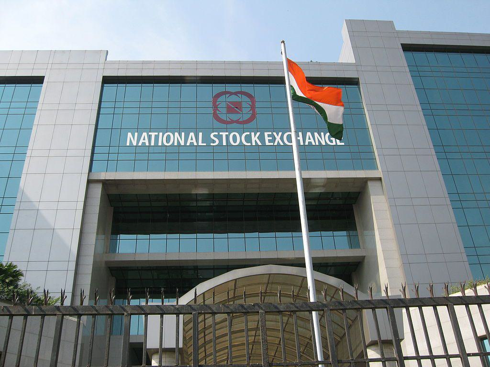

## Table of Contents

## What is the Bombay Stock Exchange (BSE)?

The Bombay Stock Exchange, or BSE, is a place where people buy and sell shares of companies in India. It started in 1875 and is one of the oldest stock exchanges in Asia. The BSE is located in Mumbai, which used to be called Bombay. When people want to own a part of a company, they can buy its shares on the BSE. The price of these shares can go up or down depending on how well the company is doing and what people think about it.

The BSE uses something called the S&P BSE Sensex to show how the overall market is doing. The Sensex is like a scorecard made up of the 30 biggest and most important companies on the BSE. If the Sensex goes up, it usually means that the market is doing well, and if it goes down, it might mean that the market is not doing so well. The BSE helps companies get money they need to grow by letting them sell shares to the public, and it helps people invest their money in these companies.

## When was the Bombay Stock Exchange established?

The Bombay Stock Exchange, or BSE, was established in 1875. It is one of the oldest stock exchanges in Asia. The BSE is located in Mumbai, which was known as Bombay at the time the exchange was founded.

The BSE is a place where people can buy and sell shares of companies. This helps companies get money to grow and helps people invest their money. The BSE is very important for the Indian economy because it helps businesses and investors come together.

## What is the significance of the BSE in the Indian economy?

The Bombay Stock Exchange (BSE) plays a very important role in the Indian economy. It is a place where people can buy and sell shares of companies. This helps companies get the money they need to grow their businesses. When a company sells shares on the BSE, it can use the money to build new factories, create new products, or expand to new markets. This growth helps the whole economy because it creates jobs and increases the amount of goods and services available.

The BSE also helps people invest their money. When people buy shares, they are investing in the future of the company. If the company does well, the value of the shares can go up, and people can make money. This encourages people to save and invest, which is good for the economy. The BSE also gives important information about how the economy is doing through the S&P BSE Sensex, which tracks the performance of 30 major companies. If the Sensex goes up, it usually means the economy is doing well, and if it goes down, it might mean the economy is not doing so well.

## How does one trade on the Bombay Stock Exchange?

Trading on the Bombay Stock Exchange, or BSE, involves buying and selling shares of companies. To start, you need to open a trading account with a broker, which is a company that helps you buy and sell shares. Once your account is set up, you can place orders through the broker's trading platform, which is usually a website or an app. You can choose to buy shares if you think the price will go up, or sell shares if you think the price will go down. The price of shares changes all the time based on how many people want to buy or sell them.

When you decide to buy or sell shares, you place an order with your broker. There are different types of orders, like a market order, where you buy or sell at the current price, or a limit order, where you set a specific price you're willing to pay or accept. Once your order is placed, it goes to the BSE's trading system, which matches buyers and sellers. If your order matches with someone else's, the trade happens, and you either own more shares or have sold some of your shares. The whole process is electronic and happens very quickly, making it easy for you to trade on the BSE.

## What are the major indices of the BSE?

The Bombay Stock Exchange, or BSE, has several major indices that help people understand how the market is doing. The most famous one is the S&P BSE Sensex, which is like a scorecard made up of the 30 biggest and most important companies on the BSE. When people talk about the Indian stock market, they often mention the Sensex because it shows how the overall market is performing. If the Sensex goes up, it means the market is doing well, and if it goes down, it might mean the market is not doing so well.

Another important index is the S&P BSE 100, which includes the top 100 companies on the BSE. This index gives a broader view of the market because it includes more companies than the Sensex. The S&P BSE 500 is even bigger, as it includes the top 500 companies. These indices help investors see how different parts of the market are doing, from the biggest companies to a wider range of companies. By looking at these indices, people can make better decisions about buying and selling shares.

## Can foreign investors trade on the BSE?

Yes, foreign investors can trade on the Bombay Stock Exchange (BSE). To do this, they need to follow some rules set by the Indian government and the BSE. Foreign investors can be from other countries and want to buy or sell shares of Indian companies. They usually need to register with the Securities and Exchange Board of India (SEBI), which is like a watchdog for the stock market in India. Once registered, foreign investors can open a trading account with a broker who is allowed to work with them.

After setting up their account, foreign investors can trade on the BSE just like Indian investors. They can buy shares if they think the price will go up or sell shares if they think the price will go down. The BSE has a special section for foreign investors, which makes it easier for them to trade. This helps bring more money into the Indian economy and allows foreign investors to be a part of India's growth.

## What are the listing requirements for companies on the BSE?

To list on the Bombay Stock Exchange, or BSE, a company needs to meet certain requirements set by the BSE and the Securities and Exchange Board of India, or SEBI. The company needs to have a minimum amount of money, called net worth, which should be at least 3 crores if it's a new company, or 10 crores if it's an existing company. The company also needs to have made a profit in the last three years, or it should have a certain amount of money from its business activities. It needs to have at least 1,000 public shareholders after the listing, and at least 25% of its shares should be owned by the public.

The company also needs to follow rules about how it tells people about its business and financial health. It must provide a detailed report, called a prospectus, that explains everything about the company, including its financials, how it plans to use the money it gets from selling shares, and any risks involved. The company also needs to agree to follow all the rules and regulations set by the BSE and SEBI. These rules help make sure that the company is honest and open with investors, and that it follows good practices in how it runs its business.

## How does the BSE ensure market integrity and transparency?

The Bombay Stock Exchange, or BSE, works hard to keep the market fair and clear for everyone. It does this by making strict rules that companies and people who trade on the BSE have to follow. These rules are set by the Securities and Exchange Board of India, or SEBI, which is like a watchdog for the stock market. The BSE uses a system to watch trades and make sure no one is doing anything wrong, like trying to cheat or trick others. If someone breaks the rules, the BSE can punish them to keep the market honest.

The BSE also makes sure companies tell the truth about their business and money. Companies have to share a lot of information, like how much money they make and how they plan to use the money they get from selling shares. This information is shared in a report called a prospectus, which anyone can read. By making sure this information is clear and easy to understand, the BSE helps people make smart choices about buying and selling shares. This way, everyone can trust that the market is working fairly and openly.

## What role does technology play in the operations of the BSE?

Technology is very important for how the Bombay Stock Exchange, or BSE, works. It uses computers and special software to help people buy and sell shares quickly and easily. When someone wants to trade, they use a computer or a smartphone to place an order. The BSE's system then matches this order with someone else who wants to buy or sell at the same price. This all happens very fast, so people can trade whenever they want, even if they are not in the same place.

The BSE also uses technology to keep the market safe and fair. It has special software that watches all the trades to make sure no one is cheating or doing anything wrong. If something strange happens, the system can alert the people who work at the BSE, and they can check it out. Technology also helps the BSE share information with everyone. Companies can post their reports and news online, so anyone can see them and make good choices about buying and selling shares.

## How has the BSE evolved over the years?

The Bombay Stock Exchange, or BSE, started in 1875 under a banyan tree in Mumbai, which was then called Bombay. It was a simple place where people met to trade shares. Over time, the BSE grew bigger and moved into a building. It started using telephones and paper to trade, which was a big change from trading under a tree. The BSE became more organized and started making rules to make sure trading was fair.

In the 1990s, the BSE changed a lot because of technology. It started using computers to trade shares, which made everything faster and easier. People could now trade from anywhere, not just in Mumbai. The BSE also started using the S&P BSE Sensex in 1986 to show how the market was doing, which helped everyone understand the market better. Today, the BSE is one of the biggest stock exchanges in the world, using the latest technology to keep trading safe and fair for everyone.

## What are some of the major challenges faced by the BSE?

The Bombay Stock Exchange, or BSE, faces many challenges. One big challenge is keeping the market safe and fair. With so many people trading shares, it's hard to make sure no one is cheating or doing anything wrong. The BSE uses technology to watch trades, but it's still a big job to keep everything honest. Another challenge is dealing with big changes in the market. Sometimes, the price of shares can go up and down a lot very quickly, which can make people worried and unsure about trading.

Another challenge for the BSE is keeping up with new technology. The world of trading is always changing, with new ways to trade and new tools to use. The BSE has to keep updating its systems to stay ahead. It also needs to make sure these new technologies are safe and work well. Finally, the BSE has to compete with other stock exchanges, both in India and around the world. It needs to show that it's a good place for companies to list their shares and for people to trade, which can be hard when there are so many choices.

## How does the BSE compare to other major stock exchanges globally?

The Bombay Stock Exchange, or BSE, is one of the oldest stock exchanges in the world, having started in 1875. It is the biggest stock exchange in India and one of the top stock exchanges in Asia. The BSE is known for its main index, the S&P BSE Sensex, which tracks the performance of the 30 biggest and most important companies in India. Compared to other global stock exchanges like the New York Stock Exchange (NYSE) and the Tokyo Stock Exchange (TSE), the BSE is smaller in terms of the total value of shares traded, known as market capitalization. However, it plays a very important role in the Indian economy and is a key place for companies in India to raise money and for investors to buy and sell shares.

The BSE has made big changes over the years to stay competitive with other global stock exchanges. It has used new technology to make trading faster and easier, and it has strict rules to keep the market safe and fair. The BSE also offers trading in different types of financial products, like stocks, bonds, and derivatives, which helps it stay competitive. While the BSE might not be as big as some of the world's largest stock exchanges, it is still very important for investors who want to invest in India and for companies in India that want to grow.

## References & Further Reading

[1]: Securities and Exchange Board of India (SEBI). (2020). ["Annual Report 2020."](https://sebi.gov.in/sebiweb/home/HomeAction.do?doListing=yes&sid=4&ssid=80&smid=101)

[2]: Marcos Lopez de Prado. (2018). ["Advances in Financial Machine Learning."](https://www.amazon.com/Advances-Financial-Machine-Learning-Marcos/dp/1119482089) Wiley.

[3]: Ernest P. Chan. (2008). ["Quantitative Trading: How to Build Your Own Algorithmic Trading Business."](https://www.amazon.com/Quantitative-Trading-Build-Algorithmic-Business/dp/0470284889) Wiley.

[4]: Stefan Jansen. (2020). ["Machine Learning for Algorithmic Trading: Predictive Models to Live Trading Strategies."](https://github.com/stefan-jansen/machine-learning-for-trading) Packt Publishing.

[5]: David Aronson. (2006). ["Evidence-Based Technical Analysis: Applying the Scientific Method and Statistical Inference to Trading Signals."](https://www.amazon.com/Evidence-Based-Technical-Analysis-Scientific-Statistical/dp/0470008741) Wiley.