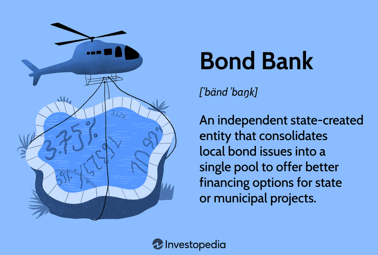

## Table of Contents

## What is a bond bank?

A bond bank is a special kind of organization that helps smaller communities and local governments borrow money more easily. It works by pooling together the borrowing needs of these smaller entities and then issuing bonds on their behalf. This way, even small towns or local agencies can access the bond market, which they might not be able to do on their own because they are too small or don't have the right resources.

By using a bond bank, these smaller groups can get better interest rates and terms than they would if they tried to borrow money by themselves. The bond bank acts like a middleman, making the process simpler and more affordable. This helps communities fund important projects like building schools, fixing roads, or improving water systems, which can make a big difference in people's lives.

## How does a bond bank function?

A bond bank functions by helping small towns and local governments borrow money more easily. It does this by gathering the borrowing needs of these small groups together and then issuing bonds for them. This way, even if a small town can't borrow money on its own because it's too small or doesn't have the right resources, the bond bank can help. The bond bank acts like a big helper that makes it possible for these small groups to get the money they need.

When the bond bank issues bonds, it can get better interest rates and terms than the small towns could get by themselves. This is because the bond bank can borrow a larger amount of money all at once, which makes it more attractive to investors. The money from the bonds is then given to the small towns and local governments, who use it to pay for important projects like building schools, fixing roads, or improving water systems. This helps these communities grow and improve without having to worry about the complicated process of borrowing money on their own.

## What are the primary services offered by bond banks?

Bond banks offer a few main services to help small towns and local governments. One big service is that they help these groups borrow money more easily. They do this by gathering the borrowing needs of many small towns together and then issuing bonds for them. This way, even if a small town can't borrow money on its own because it's too small or doesn't have the right resources, the bond bank can help. The bond bank acts like a big helper that makes it possible for these small groups to get the money they need.

Another important service is that bond banks can get better interest rates and terms than the small towns could get by themselves. This is because the bond bank can borrow a larger amount of money all at once, which makes it more attractive to investors. The money from the bonds is then given to the small towns and local governments, who use it to pay for important projects like building schools, fixing roads, or improving water systems. This helps these communities grow and improve without having to worry about the complicated process of borrowing money on their own.

## Can you explain the historical origins of bond banks?

Bond banks started in the United States in the 1970s. At that time, many small towns and local governments needed money to build things like schools and roads, but they found it hard to borrow money on their own. They were too small and didn't have the right resources. So, some smart people came up with the idea of bond banks. These banks would help small towns by gathering their borrowing needs together and then issuing bonds for them. This way, even small towns could get the money they needed to grow and improve.

The first bond bank was created in Vermont in 1970. It was called the Vermont Municipal Bond Bank. It worked so well that other states started their own bond banks too. By pooling the borrowing needs of many small towns, these bond banks could get better interest rates and terms from investors. This made it easier and cheaper for small towns to borrow money. Over time, bond banks became a popular way for small communities to fund important projects and improve their areas.

## How have bond banks evolved over time?

Since they started in the 1970s, bond banks have changed a lot. At first, they were just a way for small towns to borrow money more easily. The first bond bank was in Vermont, and it showed that this idea could work. As more states saw how helpful bond banks were, they started their own. Over time, bond banks got better at what they did. They learned how to get even better interest rates and terms for the small towns they helped. This made it easier and cheaper for these towns to borrow money.

Today, bond banks do more than just help towns borrow money. They have become important parts of how small communities grow and improve. Bond banks now offer different kinds of services to meet the changing needs of these communities. They help with things like building schools, fixing roads, and improving water systems. By doing this, bond banks make a big difference in the lives of people in small towns. They have become a key way for these communities to get the money they need to make their areas better.

## What role do bond banks play in municipal financing?

Bond banks are really important for helping small towns and local governments borrow money. They do this by gathering the borrowing needs of many small towns together and then issuing bonds for them. This way, even if a small town can't borrow money on its own because it's too small or doesn't have the right resources, the bond bank can help. The bond bank acts like a big helper that makes it possible for these small groups to get the money they need.

Another big role of bond banks in municipal financing is that they can get better interest rates and terms than the small towns could get by themselves. This is because the bond bank can borrow a larger amount of money all at once, which makes it more attractive to investors. The money from the bonds is then given to the small towns and local governments, who use it to pay for important projects like building schools, fixing roads, or improving water systems. This helps these communities grow and improve without having to worry about the complicated process of borrowing money on their own.

## How do bond banks benefit smaller municipalities?

Bond banks help smaller municipalities by making it easier for them to borrow money. When a small town needs to build a school or fix a road, it can be hard for them to get a loan on their own. They might be too small or not have the right resources. But a bond bank can gather the borrowing needs of many small towns together and then issue bonds for them. This way, even small towns can get the money they need to do important projects.

Another big benefit is that bond banks can get better interest rates and terms for these small towns. When a bond bank borrows a large amount of money all at once, it looks more attractive to investors. This means the bond bank can get a better deal than if each small town tried to borrow money by itself. So, the small towns end up paying less interest and can use the money they save to make their communities even better.

## What are the risks associated with investing through a bond bank?

Investing through a bond bank can be a bit risky. One risk is that the small towns or local governments that borrow money through the bond bank might not be able to pay it back. If they can't pay back the money, the bond bank might have trouble paying back the investors who bought the bonds. This could mean that investors lose some or all of their money.

Another risk is that interest rates might go up. If this happens, the bonds that the bond bank issued might not look as good to other investors. They might want to buy new bonds that have higher interest rates. This could make it harder for the bond bank to sell its bonds, which could affect the investors who already bought them. So, it's important for investors to think about these risks before they decide to invest through a bond bank.

## How do bond banks manage and mitigate these risks?

Bond banks manage and mitigate risks by carefully checking the small towns and local governments that want to borrow money. They make sure these places can pay back the loans. The bond bank looks at things like how much money the town makes and how well it has paid back loans before. This helps the bond bank decide if it's safe to lend money to them. If the bond bank thinks a town might not be able to pay back the money, it might not lend to them or might ask for extra promises, like having another group promise to help pay back the loan if the town can't.

Another way bond banks manage risks is by spreading out their loans. Instead of lending all their money to one town, they lend a little bit to many different towns. This way, if one town can't pay back its loan, it won't hurt the bond bank too much. It's like not putting all your eggs in one basket. Also, bond banks keep an eye on interest rates and try to plan for changes. They might choose to issue bonds when interest rates are low, so they can get a good deal. This helps them make sure they can still pay back the investors even if interest rates go up later.

## What are some notable examples of successful bond bank projects?

One great example of a successful bond bank project is the Vermont Municipal Bond Bank helping the town of St. Albans build a new wastewater treatment plant. St. Albans needed a new plant to keep their water clean, but they were too small to borrow the money on their own. The Vermont Municipal Bond Bank stepped in and issued bonds for them. This way, St. Albans got the money they needed at a good [interest rate](/wiki/interest-rate-trading-strategies), and now they have a new plant that helps keep their water clean for everyone.

Another good example is the Illinois Finance Authority helping the city of Rockford fix up their old roads. Rockford wanted to make their streets safer and smoother, but they didn't have enough money to do it all at once. The Illinois Finance Authority used a bond bank to gather money from investors and lend it to Rockford. With this help, Rockford was able to fix their roads and make their city a better place to live.

## How do bond banks compare to other financial institutions in terms of bond issuance?

Bond banks are different from other financial institutions like banks and investment firms because they focus on helping small towns and local governments borrow money. They do this by pooling the borrowing needs of many small places together and then issuing bonds for them. This way, even if a small town can't borrow money on its own, the bond bank can help. Other financial institutions might not be as interested in lending to small towns because they are too small or don't have the right resources. But bond banks are set up to help these small places get the money they need to build schools, fix roads, or improve water systems.

Compared to other financial institutions, bond banks can often get better interest rates and terms for the small towns they help. This is because they can borrow a larger amount of money all at once, which makes their bonds more attractive to investors. Banks and investment firms might offer bonds too, but they usually work with bigger clients or projects. Bond banks are special because they focus on making it easier and cheaper for small communities to borrow money. This helps these communities grow and improve without having to worry about the complicated process of borrowing money on their own.

## What future trends might impact the operations and strategies of bond banks?

In the future, bond banks might see changes because of new technology. Computers and the internet are getting better and better. This means bond banks can use new tools to help them work faster and smarter. They might use these tools to check if small towns can pay back loans even better than before. They could also use the internet to talk to investors all over the world, which could help them get even better deals on the money they borrow. So, technology could make bond banks more efficient and help them reach more people.

Another big change that might affect bond banks is climate change. More and more people are worried about the environment and want to see projects that help the planet. Bond banks might start focusing more on helping small towns build things like solar power plants or better water systems. This could make bond banks more popular with investors who care about the environment. Also, governments might start giving special help or money to projects that fight climate change, which could make it easier for bond banks to get good deals on loans for these kinds of projects.

## What is the Intersection of Bond Markets and Algorithmic Trading?

Algorithmic trading, with its origins in the equity markets, has increasingly permeated bond markets, offering distinct avenues for automating and optimizing trading strategies. The application of [algorithmic trading](/wiki/algorithmic-trading) in bond markets aims to enhance efficiency in trade execution, reduce costs, and improve [liquidity](/wiki/liquidity-risk-premium).

One of the core strategies used by algorithmic traders in the bond market is the Volume-Weighted Average Price (VWAP) strategy. The VWAP is a trading benchmark that gives the average price a security has traded at throughout the day, based on both [volume](/wiki/volume-trading-strategy) and price. The formula for VWAP is:

$$

VWAP = \frac{\sum (Price_i \times Volume_i)}{\sum Volume_i}
$$

where $Price_i$ is the price of each transaction, and $Volume_i$ is the volume of each transaction. By tracking the VWAP, traders can execute bonds at prices that reflect typical market participation, minimizing market impact and ensuring better trading execution.

Another strategy, mean reversion, is predicated on the idea that bond prices fluctuate around an intrinsic value. Algorithms identify deviations from this value and execute trades to capitalize on anticipated price corrections. This requires sophisticated predictive models that can continuously adjust to market conditions.

Algorithmic trading in bond markets offers several advantages. Increased execution speed and reduced transaction costs are primary benefits, as automated systems can process trades at scales and speeds beyond human capability, minimizing human error. Furthermore, by systematically analyzing vast data sets, algorithms provide improved pricing accuracy and market insights.

However, algorithmic trading also comes with risks. High-speed trading can exacerbate market [volatility](/wiki/volatility-trading-strategies), leading to phenomena such as flash crashes, where prices plummet unexpectedly within a very short time frame. Such occurrences highlight systemic risks inherent in automated trading systems. Regulators and financial institutions must implement robust risk management measures to mitigate these effects.

Several major financial institutions deploy algorithmic trading in their bond trading operations. For instance, JPMorgan Chase and Barclays have developed sophisticated trading platforms that incorporate algorithmic strategies to manage their bond portfolios. These platforms have shown increased efficiency in executing large-scale trades with minimized market impact, reflecting the transformative potential of algorithmic systems in bond markets.

Institutions leveraging algorithmic trading in bond markets typically observe enhanced liquidity, better price discovery, and significant cost reductions. Nonetheless, the challenge remains to balance these benefits with the control of associated risks to maintain stable and efficient markets.

## References & Further Reading

[1]: Fabozzi, F. J. (2004). ["The Handbook of Fixed Income Securities."](https://www.amazon.com/Handbook-Fixed-Income-Securities-Ninth/dp/1260473899) McGraw-Hill Education.

[2]: Merton, R. C. (1974). "On the Pricing of Corporate Debt: The Risk Structure of Interest Rates." *The Journal of Finance*, 29(2), 449-470.

[3]: Choudhry, M. (2008). ["Bond Market Securities."](https://www.amazon.com/Market-Securities-Prentice-Professional-Finance/dp/027365408X) John Wiley & Sons.

[4]: Lopez de Prado, M. (2018). ["Advances in Financial Machine Learning."](https://www.amazon.com/Advances-Financial-Machine-Learning-Marcos/dp/1119482089) Wiley.

[5]: Hendershott, T., Jones, C. M., & Menkveld, A. J. (2011). "Does Algorithmic Trading Improve Liquidity?" *The Journal of Finance*, 66(1), 1-33.