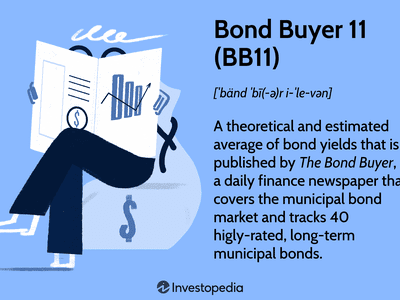

Municipal bonds, often referred to as 'munis,' represent a significant segment of fixed-income investments, primarily issued by local and state governments to secure funding for public infrastructure projects such as schools, roads, and hospitals. One of the main attractions for investors is their tax-exempt status, which generally exempts interest income from federal income tax, and sometimes state and local taxes if the investor resides in the state of issuance. This tax advantage can lead to a higher effective yield than comparable taxable bonds.

An essential tool for understanding market trends in municipal bonds is the Bond Buyer 11 (BB11) index. This index serves as a key benchmark, offering insights into the yields of high-quality municipal bonds, thereby assisting investors in making informed decisions based on market health and trajectory. The BB11 index calculates an average yield derived from 11 different municipal bonds, all selected for their high credit quality, making it a reliable indicator for assessing long-term yield expectations.



In the evolving landscape of financial markets, algorithmic trading is gaining prominence and reshaping how trades are conducted, including those in the municipal bond market. By utilizing automated systems based on pre-defined criteria, algorithmic trading can efficiently manage vast datasets, potentially increasing the efficiency, accuracy, and cost-effectiveness of transactions. The incorporation of such technology addresses some of the market's inherent challenges, such as fragmentation, improving liquidity and facilitating smoother price discovery processes.

This article aims to explore the interplay between the Bond Buyer 11, bond ratings, and algorithmic trading, highlighting how these elements collectively influence municipal bond investing and offering insights into the future trajectory of this critical investment space.

## Table of Contents

## Understanding Municipal Bonds

Municipal bonds, commonly referred to as "munis," are debt securities issued by states, municipalities, or counties to finance public projects such as schools, roads, and infrastructure development. These bonds serve as a critical tool for local governments to mobilize funds necessary for societal and economic enhancements. One of the pivotal attractions of municipal bonds for investors is their tax-exempt status. Specifically, the interest income earned from most municipal bonds is exempt from federal income tax, and in some cases, also from state and local taxes if the investor resides in the state where the bond was issued. This tax-exempt status contributes to the effective yield of these bonds, especially for investors in higher tax brackets.

Municipal bonds are generally considered to be low-risk investments with a relatively low probability of default compared to corporate bonds. This perception stems from the issuer's ability to levy taxes or cut public spending in challenging times to meet debt obligations. Historical data supports the notion of municipal bonds exhibiting lower default rates. According to the Municipal Securities Rulemaking Board (MSRB), municipal bonds have had a default rate of approximately 0.1% from 1970 to 2019, compared to more than 10% for similarly rated corporate bonds over the same period. 

Despite their advantages, the municipal bond market exhibits a fragmented character. This fragmentation arises from the lack of a centralized exchange and the heterogeneity of issuers and bond structures. Every state and local government can issue multiple types of bonds, each with distinct terms, maturities, and credit structures. This can hinder [liquidity](/wiki/liquidity-risk-premium) and make the trading process more complex, impacting price discovery and execution. As a result, secondary market trading in municipal bonds can be less efficient and transparent compared to markets with more uniform instruments.

Understanding municipal bonds is vital for investors who aim to leverage their potential within a broader investment strategy. This requires a consideration of the issuer's creditworthiness, the bond's tax status, and market conditions affecting interest rates. A keen understanding of these factors enables investors to incorporate municipal bonds optimally into a diversified portfolio, potentially enhancing risk-adjusted returns while benefiting from tax efficiencies.

## The Bond Buyer 11 Index

The Bond Buyer 11 (BB11) Index is a key tool for investors looking at the municipal bond market. It represents an average of the yields from 11 high-quality municipal bonds, providing a reliable measure of market performance. As a benchmark, BB11 helps investors assess the health and trends within the municipal bond sector. This index is particularly beneficial for projecting long-term yield expectations.

The construction of the BB11 Index is meticulous, involving the selection of municipal bonds that possess high credit ratings, thus guaranteeing their reliability and minimizing risk. These high ratings, often Aa2 by Moody's or AA by Standard & Poor’s, signify the issuer's financial stability and capacity for repayment. Consequently, BB11 serves as a crucial reference for investors, guiding their investment decisions based on the perceived safety and yield potential of municipal bonds.

## The Role of Bond Ratings

Bond ratings play a crucial role in the municipal bond market, serving as an essential tool for investors to evaluate the creditworthiness of bond issuers. These ratings are provided by credit rating agencies such as Moody's Investors Service and Standard & Poor's (S&P). They reflect the financial stability and ability of an issuer to meet its repayment obligations, impacting both investor confidence and the interest rates attached to the bonds.

The Bond Buyer 11 (BB11) index comprises municipal bonds that are considered high quality, with average ratings of Aa2 by Moody’s and AA by S&P. These ratings signify that the bonds included in the BB11 index are of high credit quality. An Aa2 rating from Moody’s indicates that the bond has a very low credit risk, although it is susceptible to long-term risks somewhat more than higher-rated bonds. Similarly, an AA rating from S&P denotes a high-grade bond with very strong capacity to meet its financial commitments.

Bond ratings are determined through a comprehensive analysis of the bond issuer’s financial health. This involves examining the issuer's fiscal management practices, overall economic environment, revenue-raising capacity, debt levels, and legal commitments. The ratings not only provide a snapshot of the issuer’s current financial situation but also offer insights into the potential risks associated with the bond over its term.

Investors use these ratings to make informed decisions, balancing the desire for higher yields with the inherent risk of potential defaults. High-rated bonds like those in the BB11 index tend to offer lower yields, compensating for their lower risk profile. Conversely, lower-rated bonds generally provide higher yields, reflecting the higher risk of default.

In essence, bond ratings serve as a benchmark that informs investor expectations and strategies, directly influencing the trading dynamics of the municipal bond market. Therefore, understanding these ratings and their implications on bond pricing and yield is vital for optimizing investment decisions.

## Algorithmic Trading in the Municipal Bond Market

Algorithmic trading uses automated systems to execute trades based on predetermined criteria. In the municipal bond market, this form of trading enhances efficiency and accuracy by systematically analyzing vast quantities of data to identify trading opportunities, price trends, and liquidity shifts. By utilizing algorithms, traders can optimize decision-making processes, thus reducing the likelihood of human error and ensuring more consistent outcomes.

One of the primary advantages of [algorithmic trading](/wiki/algorithmic-trading) in this market is the reduction of transaction costs. This is achieved through the automation of trading processes, which minimizes the need for manual interventions and mitigates the influence of emotional biases. Additionally, the speed at which algorithmic systems can operate allows traders to take advantage of even small price discrepancies, thereby enhancing profitability.

Algorithmic trading also addresses the market's fragmented nature by improving liquidity and price discovery. Given the multitude of issuers and bonds within the municipal bond market, liquidity can vary significantly. Algorithms can swiftly navigate this complexity, aggregating and analyzing data from various sources to improve the accessibility of trades. This capability ensures that traders can locate the best available prices and secure optimal execution, even in less liquid segments of the market.

The implementation of algorithmic trading within the municipal bond market typically involves the integration of advanced data analytics and [machine learning](/wiki/machine-learning) techniques. By continuously learning from market patterns and adapting to new information, these systems can refine their models to improve future performance. Consequently, traders who incorporate algorithmic strategies into their operations can achieve a competitive edge through enhanced market positioning and strategic foresight.

In summary, algorithmic trading transforms the municipal bond market by offering traders enhanced efficiency, reduced costs, and improved market insights. As this technology continues to evolve, its role in facilitating more robust and dynamic trading environments is likely to expand, benefiting participants across the bond market spectrum.

## The Benefits and Challenges of Incorporating Algo Trading

Algorithmic trading significantly enhances the efficiency and accuracy for investors in municipal bonds. The primary advantages include speed, as algorithms can execute trades in milliseconds, far surpassing human capabilities. This rapid execution allows investors to capitalize on fleeting market opportunities and optimize their trading strategies.

Accuracy is another notable benefit. Algorithmic systems can process vast datasets to identify the best trading opportunities, reducing the likelihood of human errors. By analyzing historical data and current market trends, algorithms can make informed decisions that align closely with investors' strategies. This precision enhances the reliability of municipal bond trading.

Cost savings are also a significant aspect. Automation reduces labor costs and can minimize transaction fees by optimizing the timing of trades. This cost-effectiveness is crucial in the municipal bond market, where transaction costs can impact overall returns.

Scalability is another advantage, as algorithmic systems can handle an expanding array of trades simultaneously. This scalability allows large institutional investors to efficiently manage extensive bond portfolios, promoting more dynamic trading strategies.

However, algorithmic trading faces several challenges, particularly due to market fragmentation and liquidity variations within the municipal bond market. Fragmentation, characterized by the lack of a centralized exchange, can complicate the collection and interpretation of market data. This presents challenges for algorithms that rely on comprehensive datasets to function optimally. Liquidity variations further complicate execution, as the availability of buyers and sellers can fluctuate, potentially leading to suboptimal trade outcomes or increased market impact costs.

Integrating algorithmic trading systems into existing infrastructures often requires significant investment. The development and maintenance of tailored algorithms necessitate specialized expertise and resources. Additionally, robust technological infrastructure is essential to support the high-frequency data processing required by algorithmic systems, necessitating further capital expenditure.

In summary, while algorithmic trading offers remarkable enhancements in speed, accuracy, cost efficiency, and scalability in municipal bond trading, it also introduces challenges such as market fragmentation, liquidity issues, and significant integration costs. Investors must weigh these factors when considering the adoption of algorithmic strategies in their trading operations.

## Future of Municipal Bond Trading with Algorithmic Strategies

As technology continues to advance, algorithmic trading is poised to play an increasingly significant role in the municipal bond market. Algorithmic trading, or algo trading, leverages complex algorithms and software to execute trades at high speed and high [volume](/wiki/volume-trading-strategy), based on programmed instructions. Its adoption within municipal bond trading brings a potential transformation, driven by benefits such as increased efficiency, cost reduction, and enhanced liquidity.

Traders who integrate algorithmic strategies into their operations may secure a competitive advantage over those relying on traditional methods. With the capability to process large datasets quickly, algorithms can identify trading opportunities and trends faster than human traders. This speed becomes critical in a market characterized by fragmentation and low liquidity, as it allows for the rapid execution of trades that might be missed otherwise.

One of the key factors powering the rise of algo trading in municipal bonds is improved market transparency and data availability. As data collection and dissemination technologies evolve, traders gain access to more comprehensive and timely information. This data is crucial for the development and refinement of algorithms that detect market patterns and predict future movements. For instance, machine learning models can analyze historical bond data to forecast price movements or default likelihoods. Below is an example of a simple predictive algorithm using Python:

```python
from sklearn.linear_model import LinearRegression
import numpy as np

# Sample historical data (for demonstration purposes)
historical_yields = np.array([2.5, 2.7, 2.6, 2.8, 3.0])
bond_prices = np.array([101, 103, 102, 105, 106])

# Reshape the data and fit the model
historical_yields = historical_yields.reshape(-1, 1)
model = LinearRegression().fit(historical_yields, bond_prices)

# Predict future bond price based on future yield
future_yield = np.array([[3.1]])
predicted_price = model.predict(future_yield)
print(f"Predicted Bond Price: {predicted_price[0]:.2f}")
```

As more sophisticated algorithms are developed, the accuracy and reliability of such predictions are expected to improve, further integrating algorithmic trading into municipal bond markets.

However, widespread adoption of algorithmic trading faces obstacles, primarily related to liquidity and infrastructure. The municipal bond market's inherent fragmentation poses a challenge to achieving optimal execution conditions. Despite these challenges, the trend towards greater data availability and transparency suggests a promising trajectory for algo trading. Enhanced regulatory frameworks and technological advancements will likely contribute to a more conducive environment for algorithmic trading, promoting its growth in the municipal bond sector.

In summary, the future of municipal bond trading stands to be reshaped dramatically by algorithmic strategies. As these technologies continue to evolve, market participants who adapt promptly can leverage these tools to gain a strategic edge, aligning with the broader waves of technological innovation sweeping across financial markets.

## Conclusion

Municipal bond investing is undergoing significant transformation as indices like the Bond Buyer 11 (BB11) continue to provide critical benchmarks for market evaluation while innovative trading strategies, particularly algorithmic trading, enhance market dynamics. Algorithmic trading holds the potential to revolutionize the municipal bond markets by improving both efficiency and accessibility. Automated systems allow for the execution of trades at unprecedented speeds and levels of precision, enabling investors to respond swiftly to market changes.

One of the primary benefits of algorithmic trading in this context is enhanced market efficiency. By processing vast amounts of data, algorithms can identify pricing discrepancies and market trends more accurately than manual analysis. These systems not only reduce transaction costs through minimized human intervention but also improve liquidity by facilitating more frequent trading.

Investors should thoughtfully consider how these tools align with their investment goals and strategies. While algorithmic trading offers numerous advantages, such as reduced transactional friction and the potential for better price discovery, it also requires significant initial investments in technology and expertise. This shift demands a strategic approach to balance risk and reward. By integrating these tools into their investment framework, investors can better position themselves to capitalize on the evolving municipal bond landscape.

Ultimately, as technology continues to advance, the integration of algorithmic strategies will likely enhance transparency and access to information, providing traders with a more comprehensive view of the market. This evolution signifies a promising era for municipal bond trading, offering innovative avenues for investors to optimize their portfolios.

## References & Further Reading

[1]: Municipal Securities Rulemaking Board. ["Source Information About Municipal Bonds."](https://www.msrb.org/)

[2]: Bergstresser, Daniel B. and Cohen, Robin, "The Effects of Algorithmic Trading in Municipal Bond Markets," forthcoming in *Journal of Financial Economics*.

[3]: Gomber, Peter, Arndt, Björn, Lutat, Marco and Uhle, Thomas. ["High-Frequency Trading."](https://papers.ssrn.com/sol3/papers.cfm?abstract_id=1858626) *Journal of Business Economics*, 2011.

[4]: Fabozzi, Frank J. and Peterson, Pamela M. ["Municipal Bond Portfolio Management"](https://books.google.com/books/about/Financial_Management_and_Analysis.html?id=NBeyfpHg1boC). John Wiley & Sons, 2001.

[5]: Cocris, Vasile and Iacob, Sandra Elena. ["Algorithmic Trading: A Literature Review."](https://www.feaa.uaic.ro/faculty/vasile-cocris/) *Review of Economic Studies and Research Virgil Madgearu*, 2015.