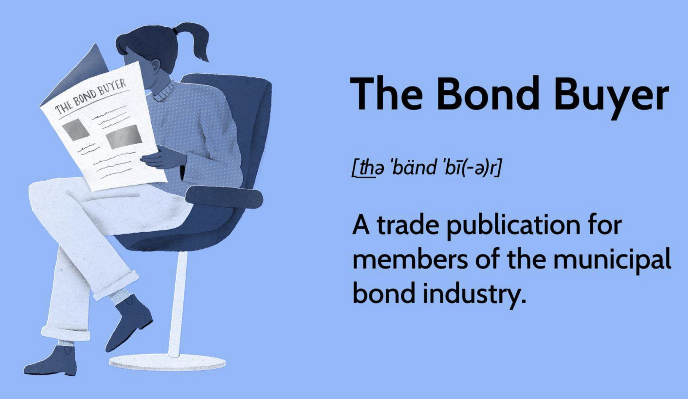

## Table of Contents

## What is The Bond Buyer?

The Bond Buyer is a daily publication that focuses on news and information about the municipal bond market. It helps people who work with bonds, like investors and financial advisors, by giving them the latest updates and data they need to make smart choices. The Bond Buyer has been around for a long time, starting in 1891, and it is considered a very important source of information in the world of municipal bonds.

The publication includes things like interest rates, bond prices, and news about new bond issues. It also has special reports and rankings, like the 20 Bond Buyer Index, which tracks the average yield of 20 specific general obligation bonds. By reading The Bond Buyer, people can stay informed about what is happening in the municipal bond market and make better decisions about buying and selling bonds.

## Who typically uses The Bond Buyer?

The Bond Buyer is mainly used by people who work in the financial world, especially those who deal with municipal bonds. This includes investors who buy and sell bonds, financial advisors who help their clients make investment decisions, and bond traders who work at banks or investment firms. These people use The Bond Buyer to get the latest news and data about the municipal bond market, which helps them make smart choices about where to put their money.

Also, government officials and people who work for cities, states, or other public agencies use The Bond Buyer. They might be in charge of issuing new bonds to raise money for public projects like schools or roads. By reading The Bond Buyer, they can see what is happening in the bond market and plan their bond issues at the best time. This helps them get the best possible terms for their bonds and save money for their communities.

## What kind of information does The Bond Buyer provide?

The Bond Buyer gives a lot of important information about the municipal bond market. It tells people about the latest news, like new bond issues and changes in interest rates. It also gives data on bond prices, so people can see if bonds are going up or down in value. This helps investors and financial advisors make smart choices about buying and selling bonds.

The publication also has special reports and rankings. One of these is the 20 Bond Buyer Index, which tracks the average yield of 20 specific general obligation bonds. This helps people understand how well the market is doing overall. The Bond Buyer also has stories about big events in the bond world, like new laws that might affect how bonds are bought and sold. This information is useful for everyone from investors to government officials who need to stay on top of what's happening in the municipal bond market.

## How can one access The Bond Buyer?

You can access The Bond Buyer in a few different ways. One way is to get a subscription to their daily newspaper. This will give you a physical copy of the paper that you can read every day. Another way is to subscribe to their online version. This lets you read the same information on your computer or phone, and it's often easier to search for specific articles or data.

If you don't want to subscribe, you can still read some of The Bond Buyer's content for free on their website. They often have free articles and reports that you can look at without paying. But if you need all of their information and data, a subscription is the best way to go. You can choose between a print subscription, an online subscription, or both, depending on what works best for you.

## What are the legal notices published in The Bond Buyer?

The Bond Buyer publishes legal notices that are important for people working with municipal bonds. These notices tell people about new bond issues, changes in bond rules, and other important legal stuff. They help keep everyone informed about what is happening in the bond market and make sure that all the rules are followed.

Government agencies and other groups use The Bond Buyer to share these legal notices. This way, investors and financial advisors can see the notices and know what's going on. It's like a big bulletin board for the bond world, making sure everyone has the information they need to make good choices about buying and selling bonds.

## Why are legal notices important in The Bond Buyer?

Legal notices in The Bond Buyer are important because they tell people about new bond issues and changes in bond rules. This information is crucial for investors and financial advisors who need to know what's happening in the bond market. By reading these notices, they can make smart choices about buying and selling bonds and follow all the rules.

Government agencies and other groups use The Bond Buyer to share these legal notices with everyone. This helps keep the bond market fair and open. When everyone has the same information, it's easier to make good decisions and trust that the market is working the right way.

## How often are new issues and legal notices updated in The Bond Buyer?

New issues and legal notices in The Bond Buyer are updated every day. The Bond Buyer comes out with a new edition each day, so people can see the latest news and information about bonds. This helps everyone stay up-to-date with what's happening in the bond market.

By having daily updates, investors and financial advisors can make quick decisions about buying and selling bonds. They can also see any new rules or changes that might affect their choices. This makes The Bond Buyer a very useful tool for anyone who works with bonds.

## Can The Bond Buyer be used for investment decisions?

Yes, The Bond Buyer can be used for making investment decisions. It gives people important information about the municipal bond market, like new bond issues, changes in interest rates, and bond prices. This helps investors and financial advisors see what's happening in the market and make smart choices about buying and selling bonds.

The Bond Buyer also has special reports and rankings, like the 20 Bond Buyer Index, which tracks the average yield of 20 specific general obligation bonds. This helps people understand how well the market is doing overall. By reading The Bond Buyer every day, investors can stay up-to-date and make better decisions about where to put their money.

## What are some advanced features of The Bond Buyer for expert users?

The Bond Buyer has some advanced features that help expert users get the most out of it. One of these features is the ability to access detailed data sets and historical bond performance. This means experts can look at past trends and see how bonds have done over time. They can use this information to make smarter guesses about what might happen in the future. The Bond Buyer also has tools that let users do their own research and analysis, like custom reports and charts. This helps experts find exactly what they need and make better investment choices.

Another advanced feature is the access to real-time market data and alerts. This means experts can see what's happening in the bond market right now and get notifications about big changes or new bond issues. This helps them react quickly to new opportunities or risks. The Bond Buyer also has a section for expert commentary and analysis, where experienced people share their thoughts on the market. This can give expert users new ideas and help them understand different points of view.

## How does The Bond Buyer ensure the accuracy of its data?

The Bond Buyer makes sure its data is correct by checking it carefully. They have a team of people who look at all the numbers and information before it goes into the paper. These people make sure everything is right by comparing it with other sources and using special tools to check for mistakes. If they find something wrong, they fix it before it gets published.

The Bond Buyer also works with other groups in the bond world to keep their information accurate. They talk to government agencies, banks, and other experts to make sure they have the latest and most correct data. By working together with these groups, The Bond Buyer can give people the best and most reliable information about the bond market.

## What are the subscription options available for The Bond Buyer?

The Bond Buyer has different ways you can subscribe to get their information. You can choose a print subscription, which means you get a physical copy of the newspaper delivered to you every day. This is good if you like reading a paper version. Another option is an online subscription, which lets you read everything on your computer or phone. This is easier if you want to look up information quickly or search for specific articles.

You can also get a combined subscription that gives you both the print and online versions. This is the best choice if you want all the information in both formats. The Bond Buyer also offers different plans depending on how long you want to subscribe, like monthly or yearly options. This way, you can pick the plan that fits your needs and budget.

## How has The Bond Buyer evolved with technology and market changes?

The Bond Buyer has changed a lot over the years to keep up with new technology and what's happening in the bond market. It started as a daily newspaper in 1891, but now you can read it online too. This means people can get the latest bond news and data on their computers or phones anytime they want. The Bond Buyer also uses special tools and software to help people do their own research and look at detailed data about bonds. This makes it easier for experts to understand the market and make smart choices.

The Bond Buyer has also added new features to help people stay up-to-date with the bond market. They give real-time alerts about important changes and new bond issues, so people can react quickly. They also have expert commentary and analysis, where experienced people share their thoughts on the market. This helps readers get different points of view and learn more about what's happening. By keeping up with technology and market changes, The Bond Buyer stays a very important tool for anyone working with bonds.

## References & Further Reading

[1]: Bergstra, J., Bardenet, R., Bengio, Y., & Kégl, B. (2011). ["Algorithms for Hyper-Parameter Optimization."](https://papers.nips.cc/paper/4443-algorithms-for-hyper-parameter-optimization) Advances in Neural Information Processing Systems 24.

[2]: ["Advances in Financial Machine Learning"](https://www.amazon.com/Advances-Financial-Machine-Learning-Marcos/dp/1119482089) by Marcos Lopez de Prado

[3]: ["Evidence-Based Technical Analysis: Applying the Scientific Method and Statistical Inference to Trading Signals"](https://books.google.com/books/about/Evidence_Based_Technical_Analysis.html?id=jbD47VkOHAEC) by David Aronson

[4]: ["Machine Learning for Algorithmic Trading"](https://github.com/stefan-jansen/machine-learning-for-trading) by Stefan Jansen

[5]: ["Quantitative Trading: How to Build Your Own Algorithmic Trading Business"](https://www.amazon.com/Quantitative-Trading-Build-Algorithmic-Business/dp/1119800064) by Ernest P. Chan