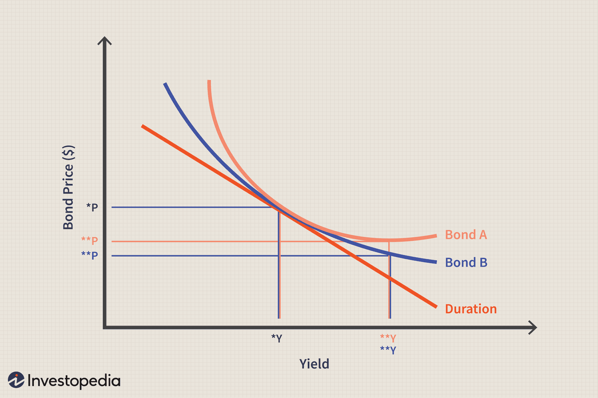

## Table of Contents

## What is bond convexity?

Bond convexity is a measure that helps investors understand how the price of a bond will change when interest rates change. It's a bit more complex than just looking at the bond's duration, which only gives a straight-line estimate of price changes. Convexity adds another layer by showing how the duration itself changes as interest rates move. This is important because it helps investors predict bond price movements more accurately, especially when interest rate changes are large.

Think of convexity like a curve. If you plot bond prices against interest rates, you get a curve, not a straight line. When interest rates go down, bond prices go up, but the increase in price is not the same for all bonds. Bonds with higher convexity will see their prices rise more than bonds with lower convexity when interest rates fall. Conversely, when interest rates rise, bonds with higher convexity will see their prices drop less than those with lower convexity. This makes convexity a valuable tool for managing risk in a bond portfolio.

## Why is bond convexity important for investors?

Bond convexity is important for investors because it helps them understand how bond prices will change when interest rates move. It's like a safety net that shows how much a bond's price might go up or down. This is really useful because it gives investors a better idea of how their bond investments might perform, especially if interest rates change a lot. Knowing about convexity can help investors pick bonds that fit their goals, whether they want to grow their money or keep it safe.

Convexity also helps investors manage risk. When interest rates drop, bonds with higher convexity will see their prices go up more than bonds with lower convexity. This means investors can make more money if they choose bonds with higher convexity. On the other hand, if interest rates go up, bonds with higher convexity won't lose as much value as those with lower convexity. This can protect investors from big losses. By understanding convexity, investors can make smarter choices about which bonds to buy and how to balance their portfolios.

## How does convexity differ from duration in bond analysis?

Duration and convexity both help investors understand how bond prices change when interest rates move, but they do it in different ways. Duration is like a straight-line guess of how much a bond's price will change for a small change in interest rates. It's a simple measure that tells you the bond's sensitivity to [interest rate](/wiki/interest-rate-trading-strategies) changes. For example, if a bond has a duration of 5 years, its price might go up or down about 5% for every 1% change in interest rates.

Convexity, on the other hand, adds more detail to this picture. It shows how the bond's duration changes as interest rates move. Think of it as a curve, not a straight line. Convexity helps investors see how bond prices might change more accurately, especially when interest rates move a lot. Bonds with higher convexity will see bigger price increases when interest rates fall and smaller price drops when interest rates rise. So, while duration gives a basic idea, convexity gives a fuller, more nuanced view of how bond prices might behave.

## Can you explain the formula for calculating bond convexity?

The formula for calculating bond convexity can look a bit complicated, but it's really about figuring out how much a bond's price changes when interest rates move. The basic formula is: Convexity = (Σ [t(t+1) * CFt] / ((1+y)^(t+2))) / (P * (1+y)^2), where t is the time until each cash flow, CFt is the cash flow at time t, y is the yield to maturity, and P is the bond's current price. This formula adds up all the future cash flows, adjusts them for the time until they're received and the interest rate, and then divides by the bond's price and the yield to maturity.

What this formula does is give you a number that shows how much the bond's price will curve when interest rates change. A higher convexity number means the bond's price will change more than a straight line would predict. This is important because it helps investors see how their bonds might react to big changes in interest rates, not just small ones. So, even though the formula might look hard, it's a useful tool for understanding how bond prices move in the real world.

## What factors affect the convexity of a bond?

Several things can change how much a bond's price will curve when interest rates move, and we call this convexity. One big thing that affects convexity is how long it takes for the bond to pay back its money, which we call the bond's maturity. If a bond takes a long time to pay back, it usually has more convexity. This means its price will go up more when interest rates go down, and it won't drop as much when interest rates go up. Another thing is the bond's coupon rate, which is how much interest the bond pays each year. Bonds with lower coupon rates tend to have more convexity because they act more like long-term bonds, and their prices change more when interest rates move.

Another factor is the bond's yield to maturity, which is the total interest rate you earn if you hold the bond until it matures. If the yield to maturity is low, the bond's convexity will be higher. This happens because low yields make the bond's price more sensitive to changes in interest rates. Also, the way the bond pays back its money can affect convexity. If a bond has a lot of its cash flows coming in the early years, it might have less convexity because it's more like a short-term bond. But if most of the cash flows come later, the bond will have more convexity, making its price more responsive to interest rate changes.

## How does bond convexity impact bond pricing?

Bond convexity helps investors understand how much a bond's price will change when interest rates move. It's like a tool that shows if the bond's price will go up a lot or a little when interest rates go down. Bonds with higher convexity will see their prices rise more when interest rates fall. This is good for investors because they can make more money if they pick bonds with high convexity. On the other hand, when interest rates go up, bonds with higher convexity won't lose as much value as those with lower convexity. This means investors can lose less money if they choose bonds with high convexity.

Understanding convexity is important because it gives investors a better idea of how their bond investments might perform, especially when interest rates change a lot. If an investor knows about convexity, they can pick bonds that fit their goals, whether they want to grow their money or keep it safe. For example, if an investor thinks interest rates will go down, they might choose bonds with high convexity to make more money. But if they think interest rates will go up, they might pick bonds with high convexity to protect their money from big losses. By understanding convexity, investors can make smarter choices about which bonds to buy and how to balance their portfolios.

## What is the relationship between yield changes and bond convexity?

When interest rates, or yields, change, bond convexity shows how much the bond's price will curve instead of moving in a straight line. If interest rates go down, bonds with higher convexity will see their prices go up more than bonds with lower convexity. This is because high convexity means the bond's price is more sensitive to changes in interest rates. So, if you're an investor and you think interest rates will drop, you might want to pick bonds with high convexity to make more money.

On the other hand, when interest rates go up, bonds with higher convexity won't lose as much value as those with lower convexity. This is good for investors because it means their money is safer if interest rates rise. So, if you're worried about interest rates going up, you might choose bonds with high convexity to protect your investment from big losses. Understanding how convexity works with yield changes helps investors make smarter choices about their bond investments.

## How can bond convexity be used to manage interest rate risk?

Bond convexity helps investors manage interest rate risk by showing how much a bond's price will change when interest rates move. If an investor thinks interest rates will go down, they can choose bonds with high convexity. These bonds will see their prices go up more than bonds with low convexity when rates fall. This means the investor can make more money because the bond's price will rise a lot. So, by [picking](/wiki/asset-class-picking) bonds with high convexity, investors can take advantage of falling interest rates and grow their money.

On the other hand, if an investor thinks interest rates will go up, they can also use convexity to protect their money. Bonds with high convexity won't lose as much value as those with low convexity when rates rise. This means the investor's money is safer because the bond's price won't drop as much. By understanding and using convexity, investors can make smarter choices about which bonds to buy, helping them manage the risk of changing interest rates and keep their investments safe.

## What are the limitations of using convexity in bond valuation?

Using convexity to value bonds has some limits. One big limit is that convexity only works well for small changes in interest rates. If interest rates change a lot, convexity can't predict how bond prices will move as accurately. This is because the relationship between bond prices and interest rates isn't always a perfect curve, especially when rates move a lot. So, investors need to be careful and not rely too much on convexity when big changes in interest rates might happen.

Another limit is that calculating convexity can be hard and time-consuming. The formula for convexity involves a lot of numbers and steps, and it can be tricky to get right. This means that investors might need special tools or help from experts to use convexity correctly. Also, because convexity is just one part of understanding bond prices, investors need to look at other things too, like duration and the bond's credit risk. So, while convexity is useful, it's not a complete solution for figuring out bond values.

## How does convexity affect the performance of a bond portfolio?

Convexity can really change how a bond portfolio does, especially when interest rates move. If interest rates go down, bonds with high convexity in the portfolio will see their prices go up a lot more than bonds with low convexity. This means that if you have a lot of high convexity bonds, your portfolio can grow faster when rates fall. It's like having a secret weapon that helps your investments do better than others when the market changes in your favor.

On the flip side, when interest rates go up, bonds with high convexity won't lose as much value as those with low convexity. This can help protect your portfolio from big losses. So, by understanding and using convexity, you can pick bonds that help your portfolio do well no matter which way interest rates move. It's like having a safety net that keeps your investments more stable and helps you make smarter choices about which bonds to buy.

## Can you discuss the convexity of callable and putable bonds?

Callable bonds have a special feature where the issuer can decide to pay back the bond before it's supposed to mature. This means the bond might not last as long as you thought, and that can change its convexity. When interest rates go down, the issuer might want to call the bond back because they can borrow money cheaper somewhere else. This makes the bond act more like a short-term bond, which usually has less convexity. So, callable bonds can have lower convexity than regular bonds because their prices might not go up as much when interest rates fall.

Putable bonds, on the other hand, let the investor decide to give the bond back to the issuer before it matures. This can make the bond act more like a short-term bond too, but in a different way. When interest rates go up, the investor might want to put the bond back because they can find better investments elsewhere. This can make the bond's price drop less than a regular bond's price would. So, putable bonds can have higher convexity than regular bonds because their prices might not go down as much when interest rates rise.

## What advanced strategies involve the use of bond convexity in fixed income markets?

In fixed income markets, bond convexity can be used in a smart way to make money and keep investments safe. One advanced strategy is called convexity trading. This is when investors buy bonds with high convexity and sell bonds with low convexity. They do this because high convexity bonds will go up more in price when interest rates fall and won't go down as much when interest rates rise. By doing this, investors can make more money when rates change and protect their investments from big losses. It's like playing both sides of the game to come out on top no matter what happens with interest rates.

Another strategy is called immunization. This is when investors use convexity to make sure their bond portfolio stays safe even if interest rates change a lot. They do this by balancing the portfolio with bonds that have different levels of convexity. This way, if interest rates move, the portfolio's value won't change too much. It's like putting on a seatbelt for your investments, making sure they stay steady and secure no matter what the road ahead looks like. By understanding and using convexity, investors can make smart choices to keep their money growing and safe.

## What is the Concept of Convexity in Bonds?

Convexity in bonds is a measure that reflects the curvature in the relationship between bond prices and interest rates, effectively capturing the non-linear behavior of bond prices as interest rates change. This is vital for investors wishing to understand and mitigate interest rate risk.

When interest rates fluctuate, the price of a bond does not respond in a straight line. Instead, the price movement can curve, and the degree of this curvature is what convexity measures. Unlike duration, which provides a linear approximation of the bond's sensitivity to interest rate changes, convexity offers a more comprehensive view by considering the rate of change of duration with respect to interest rates.

Mathematically, convexity is defined as the second derivative of the bond's price with respect to interest rates. This allows it to account for the acceleration in price movements, providing insights beyond the linear changes predicted by duration alone. The formula for convexity can be represented as:

$$
C = \frac{1}{P} \sum_{t=1}^{n} \frac{C_t \times t(t+1)}{(1 + y)^{t+2}}
$$

where:
- $P$ is the bond's price,
- $C_t$ is the cash flow at time $t$,
- $y$ is the yield to maturity,
- $n$ is the total number of periods.

An asset with higher convexity will generally have larger price increases when interest rates fall and smaller price decreases when rates rise, thus offering a cushion against interest rate [volatility](/wiki/volatility-trading-strategies). As such, convexity is a critical component for assessing a bond’s sensitivity to interest rate fluctuations, making it an invaluable measure for managing comprehensive interest rate risk effectively. In practice, when constructing a bond portfolio or implementing trading strategies, factoring in convexity helps investors anticipate the extent to which bond prices might vary, particularly during periods of volatile interest rate changes.

## What is Convexity's Role in Risk Management?

Convexity plays a vital role in managing interest rate risk within fixed income portfolios by providing a comprehensive measure of a bond's sensitivity to interest rate fluctuations. Unlike duration, which offers a linear approximation of price changes relative to interest rate moves, convexity captures the curvature resulting from large shifts in rates. This non-linear measure is crucial in assessing how bond prices adjust when interest rates rise or fall significantly.

Bonds with higher convexity exhibit a reduced sensitivity to interest rate changes, which is beneficial in minimizing potential losses during periods of heightened market volatility. These bonds often show greater price appreciation when interest rates decline and less pronounced depreciation when rates increase. The reason lies in the convex shape of the price-yield curve; as interest rates change, the slope of this curve varies, reflecting the bond's increasing or decreasing value.

For example, the price of a bond $(P)$ as a function of yield $(y)$ can be expressed and expanded using Taylor series as follows:

$$
P(y) \approx P(y_0) - \frac{dP}{dy}(y - y_0) + \frac{1}{2} \frac{d^2P}{dy^2}(y - y_0)^2
$$

Here, the second derivative $\frac{d^2P}{dy^2}$ represents convexity, adding an extra layer of precision beyond the duration approximation.

Convexity also enhances hedging strategies, ensuring portfolios are better protected against adverse movements in interest rates. By incorporating convexity into hedging tactics, investors can adjust their holdings in a manner that buffers against unpredictable swings, thus enhancing portfolio resilience. For instance, for a portfolio manager aiming to maintain immunization strategy—that ensures liability matching regardless of interest rate movements—convexity becomes a critical [factor](/wiki/factor-investing). This strategy involves balancing the portfolio's duration and convexity to prevent shifts in the yield curve from eroding expected returns.

Incorporating convexity in risk management practices allows for more refined strategies to handle interest rate changes. It helps investors and portfolio managers not only to mitigate potential losses in turbulent markets but also to seize opportunities presented by favorable rate shifts, ultimately supporting more stable and effective investment outcomes.

## References & Further Reading

[1]: Fabozzi, F. J. (2008). ["Bond Markets, Analysis, and Strategies."](https://books.google.com/books/about/Bond_Markets_Analysis_and_Strategies_ten.html?id=bQpNEAAAQBAJ) Pearson Education.

[2]: Tuckman, B., & Serrat, A. (2011). ["Fixed Income Securities: Tools for Today's Markets."](https://www.amazon.com/Fixed-Income-Securities-Todays-Markets/dp/0470891696) John Wiley & Sons.

[3]: Hull, J. C. (2018). ["Options, Futures, and Other Derivatives."](https://www.semanticscholar.org/paper/Options%2C-Futures%2C-and-Other-Derivatives-Hull/89bdee500c8623864fc9eb7a471546aa713acc44) Pearson Education.

[4]: López de Prado, M. (2018). ["Advances in Financial Machine Learning."](https://www.amazon.com/Advances-Financial-Machine-Learning-Marcos/dp/1119482089) Wiley.

[5]: Chan, E. (2008). ["Quantitative Trading: How to Build Your Own Algorithmic Trading Business."](https://github.com/ftvision/quant_trading_echan_book) Wiley Trading.

[6]: Choudhry, M. (2018). ["The Bond and Money Markets: Strategy, Trading, Analysis."](https://www.sciencedirect.com/book/9780750646772/the-bond-and-money-markets) John Wiley & Sons.

[7]: Jansen, S. (2020). ["Machine Learning for Algorithmic Trading."](https://github.com/stefan-jansen/machine-learning-for-trading) Packt Publishing.