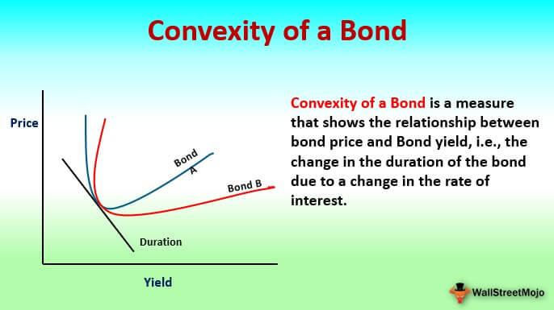

Bonds, fixed income, and convexity are integral components of the financial landscape, pivotal for shaping investment strategies and managing risk. Bonds, as debt securities, represent loans made by investors to issuers such as governments or corporations, with the issuer promising to pay back the principal along with interest over time. This forms the core of the fixed income market, characterized by its provision of regular interest payments, making it a stable and predictable investment vehicle.

Convexity emerges as a critical concept in this context, measuring the curvature in the relationship between bond prices and interest rates. Unlike duration, which captures the linear sensitivity of bond prices to interest rate changes, convexity accounts for the rate of change in duration as interest rates fluctuate. This allows investors to more accurately assess a bond's sensitivity to interest rate movements, offering a comprehensive view of interest rate risk.



This article aims to explore the intersection between these foundational concepts and algorithmic trading. Algorithmic trading employs advanced quantitative models to automate trading decisions, using data-driven insights to optimize returns and manage risks. Incorporating convexity within these models enhances the accuracy of bond pricing and risk management strategies, offering traders and investors the ability to make informed decisions and capitalize on market dynamics.

By understanding the intricacies of bonds, fixed income, and convexity, both novice and seasoned traders can effectively navigate the complexities of the fixed income market. As the financial markets evolve with technological advancements, mastering these concepts becomes crucial to managing interest rate risks and achieving long-term investment success.

## Table of Contents

## Understanding Bonds and Fixed Income

Bonds are financial instruments classified as debt securities, utilized by corporations, governments, and other entities to procure capital. When an entity issues a bond, it essentially borrows money from investors, promising to return the principal amount, known as the face value, upon the bond's maturity. Additionally, bondholders receive periodic interest payments, called coupons, over the life of the bond. This structured payment schedule makes bonds attractive to investors seeking regular income streams and capital preservation.

Fixed income investments encompass a variety of financial products that provide payments at predetermined intervals. These instruments are generally recognized for their stability and predictability relative to equities. Fixed income assets are pivotal to diversified investment portfolios, as they offer lower volatility and a measure of safety against market fluctuations.

Investors in fixed income securities focus primarily on obtaining a consistent return while protecting their capital from undue risks. The allure of fixed income products, especially bonds, lies in their capacity to provide a reliable income stream, which is particularly beneficial for risk-averse investors or those nearing retirement.

Understanding the basic components and mechanics of bonds and fixed income assets is critical for enhancing investment strategies, especially when considering the application of convexity and [algorithmic trading](/wiki/algorithmic-trading). These approaches allow for the optimization of returns and management of [interest rate](/wiki/interest-rate-trading-strategies) risks, forming an integral part of sophisticated financial strategies.

## The Concept of Convexity in Bonds

Convexity in bonds is a measure that reflects the curvature in the relationship between bond prices and interest rates, effectively capturing the non-linear behavior of bond prices as interest rates change. This is vital for investors wishing to understand and mitigate interest rate risk.

When interest rates fluctuate, the price of a bond does not respond in a straight line. Instead, the price movement can curve, and the degree of this curvature is what convexity measures. Unlike duration, which provides a linear approximation of the bond's sensitivity to interest rate changes, convexity offers a more comprehensive view by considering the rate of change of duration with respect to interest rates.

Mathematically, convexity is defined as the second derivative of the bond's price with respect to interest rates. This allows it to account for the acceleration in price movements, providing insights beyond the linear changes predicted by duration alone. The formula for convexity can be represented as:

$$
C = \frac{1}{P} \sum_{t=1}^{n} \frac{C_t \times t(t+1)}{(1 + y)^{t+2}}
$$

where:
- $P$ is the bond's price,
- $C_t$ is the cash flow at time $t$,
- $y$ is the yield to maturity,
- $n$ is the total number of periods.

An asset with higher convexity will generally have larger price increases when interest rates fall and smaller price decreases when rates rise, thus offering a cushion against interest rate [volatility](/wiki/volatility-trading-strategies). As such, convexity is a critical component for assessing a bond’s sensitivity to interest rate fluctuations, making it an invaluable measure for managing comprehensive interest rate risk effectively. In practice, when constructing a bond portfolio or implementing trading strategies, factoring in convexity helps investors anticipate the extent to which bond prices might vary, particularly during periods of volatile interest rate changes.

## Convexity’s Role in Risk Management

Convexity plays a vital role in managing interest rate risk within fixed income portfolios by providing a comprehensive measure of a bond's sensitivity to interest rate fluctuations. Unlike duration, which offers a linear approximation of price changes relative to interest rate moves, convexity captures the curvature resulting from large shifts in rates. This non-linear measure is crucial in assessing how bond prices adjust when interest rates rise or fall significantly.

Bonds with higher convexity exhibit a reduced sensitivity to interest rate changes, which is beneficial in minimizing potential losses during periods of heightened market volatility. These bonds often show greater price appreciation when interest rates decline and less pronounced depreciation when rates increase. The reason lies in the convex shape of the price-yield curve; as interest rates change, the slope of this curve varies, reflecting the bond's increasing or decreasing value.

For example, the price of a bond $(P)$ as a function of yield $(y)$ can be expressed and expanded using Taylor series as follows:

$$
P(y) \approx P(y_0) - \frac{dP}{dy}(y - y_0) + \frac{1}{2} \frac{d^2P}{dy^2}(y - y_0)^2
$$

Here, the second derivative $\frac{d^2P}{dy^2}$ represents convexity, adding an extra layer of precision beyond the duration approximation.

Convexity also enhances hedging strategies, ensuring portfolios are better protected against adverse movements in interest rates. By incorporating convexity into hedging tactics, investors can adjust their holdings in a manner that buffers against unpredictable swings, thus enhancing portfolio resilience. For instance, for a portfolio manager aiming to maintain immunization strategy—that ensures liability matching regardless of interest rate movements—convexity becomes a critical [factor](/wiki/factor-investing). This strategy involves balancing the portfolio's duration and convexity to prevent shifts in the yield curve from eroding expected returns.

Incorporating convexity in risk management practices allows for more refined strategies to handle interest rate changes. It helps investors and portfolio managers not only to mitigate potential losses in turbulent markets but also to seize opportunities presented by favorable rate shifts, ultimately supporting more stable and effective investment outcomes.

## Algorithmic Trading and Convexity

Algorithmic trading leverages quantitative models and data-driven insights to automate trading decisions, optimize returns, and manage risks efficiently. The incorporation of convexity in algorithmic models significantly enhances the accuracy of bond pricing and the robustness of risk management strategies. Convexity, which assesses the curvature or second derivative of the price-yield curve of a bond, provides a more nuanced understanding of how bond prices respond to changes in interest rates. When used in trading algorithms, convexity can lead to more precise assessments of bond fair value, taking into account the non-linear characteristics of fixed income securities.

By integrating convexity into algorithmic trading models, these systems can dynamically adjust to market conditions, effectively capturing and mitigating interest rate risk. Algorithms that incorporate convexity are capable of identifying [arbitrage](/wiki/arbitrage) opportunities by exploiting small pricing discrepancies that may arise due to the non-linear response of bond prices to interest rate shifts. For example, when interest rates are expected to shift significantly, high-convexity bonds are likely to experience less price volatility compared to low-convexity bonds, providing an opportunity for traders to optimize portfolio returns.

An important aspect of implementing convexity in algorithmic trading is the precise modeling and computation of this measure. Python, a widely used language in financial modeling, offers libraries such as NumPy and pandas that can be utilized to compute convexity and incorporate it into quantitative models. For instance:

```python
import numpy as np

# Example: Calculation of bond convexity
def convexity(cash_flows, yield_to_maturity, periods):
    # Convert yield from percentage to decimal
    ytm_decimal = yield_to_maturity / 100
    periods = np.array(periods)
    discounted_cash_flows = cash_flows / (1 + ytm_decimal) ** periods
    convexity_value = np.sum(discounted_cash_flows * (periods**2 + periods)) / (1 + ytm_decimal)**2
    return convexity_value

# Sample cash flows and periods
cash_flows = np.array([5, 5, 5, 105])  # Example bond with annual payments
periods = np.array([1, 2, 3, 4])
yield_to_maturity = 5  # 5%

# Calculate convexity
bond_convexity = convexity(cash_flows, yield_to_maturity, periods)
print("Bond Convexity:", bond_convexity)
```

In summary, the application of convexity in algorithmic trading facilitates improved bond valuation and strategic positioning within volatile markets. By adjusting trading strategies based on convexity measures, financial institutions can better navigate interest rate fluctuations, enhancing their competitive edge in identifying and capitalizing on transient arbitrage opportunities.

## Real-World Applications of Convexity in Trading Algorithms

Trading firms and financial institutions extensively utilize the concept of convexity in developing robust algorithmic trading strategies. These strategies often encompass interest rate arbitrage, hedging, and yield curve trades, leveraging convexity to enhance decision-making processes and optimize returns.

Interest rate arbitrage involves capitalizing on the differences in interest rates across various markets or instruments. Convexity plays a pivotal role here by providing a more precise understanding of how bond prices might change in response to shifting interest rates. Sophisticated algorithms can be designed to exploit these pricing anomalies. By incorporating convexity into their models, these algorithms can accurately predict bond price movements and identify arbitrage opportunities that might be missed by traditional linear models. 

Additionally, convexity aids in hedging strategies by offering a detailed insight into a bond's price stability amidst interest rate fluctuations. Algorithms that integrate convexity can better assess the risk and execute trades that minimize potential losses. For example, when hedging, understanding a bond's convexity allows a trader to select appropriate instruments that will offset potential losses due to rate changes.

In the domain of yield curve trades, convexity enables traders to manage the non-linear risk associated with different maturities and bond features. Yield curve strategies involve trading bonds with differing maturities to take advantage of the yield curve's shape and expected changes. Convexity ensures that algorithms can handle large shifts in interest rates, which may significantly impact bond prices, ensuring that the yield curve trades remain profitable.

Portfolio diversification is another area where convexity is beneficial. By including bonds with varying levels of convexity, a portfolio can achieve an optimal balance of risk and return. Bonds with high convexity are less sensitive to interest rate changes, which can mitigate risks during volatile market conditions. Conversely, including bonds with lower convexity can improve returns during stable periods. This strategic diversification helps in maintaining portfolio robustness against rate variations, which is essential for risk-averse institutional investors. 

Applications in algorithmic trading often require robust programming for implementation. Below is a simple Python pseudo-code snippet illustrating how convexity might be incorporated in an algorithmic trading model:

```python
def calculate_convexity(bond, interest_rate_change):
    # bond: a data structure holding bond details like cash flows and yield
    # interest_rate_change: hypothetical interest rate change for convexity calculation

    cash_flows = bond.cash_flows
    yield_to_maturity = bond.yield

    # Compute the convexity using a basic formula
    convexity = sum([(cf * t * (t + 1)) / ((1 + yield_to_maturity) ** (t + 2))
                     for t, cf in enumerate(cash_flows)])

    return convexity

def algorithmic_trading_strategy(bonds):
    for bond in bonds:
        # Fetch the convexity for each bond
        convexity_value = calculate_convexity(bond, interest_rate_change=0.01)

        # Arbitrage opportunity evaluation
        if convexity_value meets certain criteria:
            execute_trade(bond)

        # Hedging strategies
        else if another set of criteria is met:
            adjust_portfolio(bond)
```

This simplified code demonstrates how convexity calculations can be integrated into trading strategies, allowing traders to respond to ever-evolving market scenarios effectively.

## Challenges in Algorithmic Trading with Convexity

Algorithmic trading with convexity presents both sophisticated opportunities and significant challenges. One of the primary hurdles is the complexity that convexity introduces into trading strategies. Convexity, while providing a more accurate model of bond price sensitivity to interest rate changes, requires advanced mathematical formulations and computational techniques. This necessitates a deep understanding of both the underlying financial concepts and the computational methods used to implement them effectively.

High-quality data is indispensable for assessing convexity accurately. The precision of convexity calculations relies on granular market data, including interest rate movements, historical bond prices, and other relevant economic indicators. The availability and quality of this data directly influence the accuracy of the algorithms deployed. Moreover, the computational power required to process and analyze large datasets and execute complex mathematical models can be substantial. Modern algorithmic trading platforms must be equipped with robust computational resources to handle these requirements efficiently.

Additionally, traders and firms employing algorithmic strategies that incorporate convexity must navigate a landscape of regulatory compliance. Financial markets are subject to a wide array of regulations designed to maintain stability and protect investors. These regulations can vary significantly between jurisdictions, making compliance a complex and dynamic challenge. Algorithmic trading systems must be rigorously tested and monitored to ensure adherence to applicable financial laws and to mitigate the risk of regulatory breaches.

In conclusion, while convexity enhances the sophistication and accuracy of algorithmic trading models, it introduces computational and regulatory complexities that must be diligently managed to ensure successful implementation and operation.

## Conclusion

Understanding and utilizing convexity is essential in bond trading, particularly as algorithmic techniques advance. Convexity provides a nuanced understanding of how bond prices react to interest rate changes, accounting for non-linear price adjustments beyond what duration alone can predict. By integrating convexity into trading strategies, investors and traders can not only manage risk more precisely but also identify and exploit market opportunities that may be overlooked by more simplistic models.

Incorporating convexity ensures that investment portfolios are better equipped to withstand fluctuations in interest rates, allowing traders to optimize returns while minimizing potential downsides. As trading algorithms become more sophisticated, they demand precise data and complex models, where convexity serves as an invaluable input. For instance, bond pricing models that include convexity adjust for the curvature effect, enhancing the accuracy of predicted price movements in response to varying interest rate scenarios.

Further, as financial markets evolve with increasing complexity, mastering the nuances of convexity alongside other bond metrics will be crucial for sustained success. Strategies that effectively apply convexity not only improve day-to-[day trading](/wiki/day-trading-spy) but also contribute to long-term investment performance, supporting robust and dynamic portfolio management. Hence, a deep comprehension of convexity and its applications will be indispensable for traders and investors aiming to maintain a competitive edge in the changing landscape of financial markets.

## References & Further Reading

[1]: Fabozzi, F. J. (2008). ["Bond Markets, Analysis, and Strategies."](https://books.google.com/books/about/Bond_Markets_Analysis_and_Strategies_ten.html?id=bQpNEAAAQBAJ) Pearson Education.

[2]: Tuckman, B., & Serrat, A. (2011). ["Fixed Income Securities: Tools for Today's Markets."](https://www.amazon.com/Fixed-Income-Securities-Todays-Markets/dp/0470891696) John Wiley & Sons.

[3]: Hull, J. C. (2018). ["Options, Futures, and Other Derivatives."](https://www.semanticscholar.org/paper/Options%2C-Futures%2C-and-Other-Derivatives-Hull/89bdee500c8623864fc9eb7a471546aa713acc44) Pearson Education.

[4]: López de Prado, M. (2018). ["Advances in Financial Machine Learning."](https://www.amazon.com/Advances-Financial-Machine-Learning-Marcos/dp/1119482089) Wiley.

[5]: Chan, E. (2008). ["Quantitative Trading: How to Build Your Own Algorithmic Trading Business."](https://github.com/ftvision/quant_trading_echan_book) Wiley Trading.

[6]: Choudhry, M. (2018). ["The Bond and Money Markets: Strategy, Trading, Analysis."](https://www.sciencedirect.com/book/9780750646772/the-bond-and-money-markets) John Wiley & Sons.

[7]: Jansen, S. (2020). ["Machine Learning for Algorithmic Trading."](https://github.com/stefan-jansen/machine-learning-for-trading) Packt Publishing.