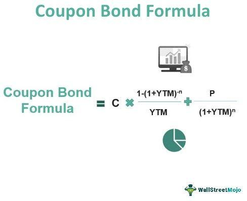

## Table of Contents

## What is a bond coupon?

A bond coupon is the interest payment that a bondholder receives from the bond issuer. When you buy a bond, you are essentially lending money to the issuer, which could be a government or a corporation. In return, the issuer promises to pay you a fixed interest rate, known as the coupon rate, at regular intervals, usually every six months, until the bond matures.

The coupon rate is expressed as a percentage of the bond's face value, also known as the par value. For example, if a bond has a face value of $1,000 and a coupon rate of 5%, the bondholder will receive $50 in interest payments each year. These payments provide a steady income stream for investors, making bonds an attractive option for those seeking predictable returns.

## How is the coupon rate of a bond determined?

The coupon rate of a bond is set when the bond is first issued. It depends on several things like how much people trust the issuer, how long the bond will last, and what other bonds are paying at that time. If people think the issuer is very safe, they might accept a lower coupon rate. But if the issuer seems risky, they'll want a higher rate to make up for the risk. Also, longer bonds usually have higher coupon rates because they tie up your money for a longer time.

The coupon rate also gets compared to other interest rates out there, like government bonds or bank savings rates. If these rates are high, new bonds will need to offer higher coupon rates to attract investors. On the other hand, if these rates are low, new bonds can have lower coupon rates and still be appealing. So, the coupon rate is a balance between what the issuer wants to pay and what investors are willing to accept based on the current economic situation.

## What is the difference between a bond's coupon rate and its yield?

The coupon rate of a bond is the [interest rate](/wiki/interest-rate-trading-strategies) that the bond issuer agrees to pay the bondholder each year, based on the bond's face value. For example, if you have a bond with a face value of $1,000 and a coupon rate of 5%, you will get $50 every year until the bond matures. The coupon rate stays the same throughout the life of the bond and is set when the bond is issued.

The yield of a bond, on the other hand, is the actual return an investor gets on the bond, which can change over time. Yield is calculated based on the bond's current market price, not just its face value. If you buy a bond for less than its face value, the yield will be higher than the coupon rate because you're getting the same interest payments but you paid less for the bond. If you buy it for more than the face value, the yield will be lower than the coupon rate. So, yield reflects what's happening in the market and can go up or down, while the coupon rate stays the same.

## How do you calculate the annual coupon payment for a bond?

To calculate the annual coupon payment for a bond, you need to know two things: the bond's face value and its coupon rate. The face value is the amount the bond will be worth when it matures, and the coupon rate is the interest rate the bond pays each year. To find the annual coupon payment, you multiply the face value by the coupon rate. For example, if a bond has a face value of $1,000 and a coupon rate of 5%, the annual coupon payment would be $1,000 times 5%, which equals $50.

Sometimes, bonds pay interest more often than once a year, like every six months. In those cases, you can still find the annual coupon payment by using the same method. If a bond pays a semi-annual coupon, you would multiply the face value by the coupon rate to get the annual payment, then divide by two to find out what you get every six months. For instance, with a $1,000 bond and a 5% coupon rate, the annual payment is $50, so each semi-annual payment would be $25.

## What is the formula for calculating the coupon payment for semi-annual bonds?

To calculate the coupon payment for a semi-annual bond, you first need to know the bond's face value and its annual coupon rate. The face value is what the bond will be worth when it matures, and the annual coupon rate is the interest rate the bond pays each year. To find the annual coupon payment, you multiply the face value by the annual coupon rate. For example, if a bond has a face value of $1,000 and an annual coupon rate of 5%, the annual coupon payment would be $1,000 times 5%, which equals $50.

Since the bond pays semi-annually, you need to divide the annual coupon payment by two to find out how much you get every six months. In the example above, the $50 annual coupon payment would be split into two payments of $25 each, paid every six months. So, for a bond with a face value of $1,000 and an annual coupon rate of 5%, you would receive $25 every six months.

## How does the frequency of coupon payments affect the bond's pricing?

The frequency of coupon payments can affect how much people are willing to pay for a bond. If a bond pays interest more often, like every month or every three months instead of just once a year, it can be more attractive to some investors. This is because they get their money back more quickly, which they can then use or reinvest. Because more people might want to buy these bonds, the price of the bond might go up.

On the other hand, if two bonds have the same total yearly interest but one pays more often, the bond that pays less often might be cheaper. This is because some investors might not mind waiting longer for their money, and they might see the bond with less frequent payments as a better deal. So, the price of a bond can change based on how often it pays out interest, as investors weigh the benefits of getting money sooner against the total amount they will earn.

## What are zero-coupon bonds and how do they differ in terms of coupon payments?

Zero-coupon bonds are a special type of bond that doesn't pay any interest during its life. Instead of getting regular payments like with normal bonds, you buy these bonds at a price lower than what they will be worth when they mature. For example, you might buy a zero-coupon bond for $800 that will be worth $1,000 when it matures in 10 years. The difference between what you pay and what you get at the end is your return on investment.

The main difference between zero-coupon bonds and regular bonds is how you get your money. With regular bonds, you get interest payments, called coupons, usually every six months or once a year. These payments give you income over time. But with zero-coupon bonds, you don't get any payments until the bond matures. This means you have to wait until the end to get all your money at once, which can be good if you want to save for a specific future goal, but it also means you don't have any income from the bond until it matures.

## How do changes in interest rates impact the coupon payments of existing bonds?

Changes in interest rates do not affect the coupon payments of existing bonds. When you buy a bond, the coupon rate is set and stays the same until the bond matures. So, if you have a bond that pays a 5% coupon, you will keep getting 5% of the bond's face value every year, no matter what happens to interest rates in the market.

However, changes in interest rates can affect the price of the bond in the market. If interest rates go up, new bonds will have higher coupon rates, making existing bonds with lower rates less attractive to buyers. This can cause the price of existing bonds to go down. If interest rates go down, new bonds will have lower coupon rates, making existing bonds with higher rates more attractive, which can cause their prices to go up. So, while the coupon payments stay the same, the bond's value in the market can change with interest rates.

## Can you explain the concept of a floating-rate bond and how its coupon is calculated?

A floating-rate bond is different from a regular bond because its coupon payment changes over time. Instead of having a fixed interest rate, the coupon rate of a floating-rate bond goes up and down based on a reference rate, like the LIBOR or the federal funds rate. This means that if the reference rate goes up, the interest payment you get from the bond will also go up. If the reference rate goes down, your interest payment will go down too.

To calculate the coupon payment for a floating-rate bond, you start with the reference rate and then add or subtract a certain number of percentage points, called the spread or margin. For example, if the reference rate is 2% and the bond's spread is +1%, the coupon rate for that period would be 3%. If the reference rate changes to 2.5%, the coupon rate would then be 3.5%. This way, the coupon payment changes with the market, giving you a payment that reflects current interest rates.

## How do you calculate the present value of future coupon payments?

To calculate the present value of future coupon payments, you need to know how much each coupon payment will be and when you will get them. You also need to know the discount rate, which is the interest rate you use to figure out how much money in the future is worth now. For each coupon payment, you take the amount of the payment and divide it by (1 + the discount rate) raised to the power of how many periods away that payment is. You do this for every coupon payment and then add all those numbers together to get the total present value of all the future coupon payments.

For example, if you have a bond that pays $50 every year for 5 years and the discount rate is 5%, you would calculate the present value of each $50 payment. The first year's payment would be $50 divided by (1 + 0.05)^1, which is about $47.62. The second year's payment would be $50 divided by (1 + 0.05)^2, which is about $45.35. You keep doing this for all five years and then add up all the values to find the total present value of the coupon payments.

## What role does the coupon rate play in the bond's duration and convexity?

The coupon rate of a bond plays a big role in its duration. Duration tells you how long it takes to get back the price you paid for the bond, considering the coupon payments you get along the way. A bond with a higher coupon rate will have a shorter duration because you're getting more money back sooner through the coupon payments. On the other hand, a bond with a lower coupon rate will have a longer duration because you're getting less money back each time, so it takes longer to get your investment back. This means that if interest rates change, the price of a bond with a lower coupon rate will change more than a bond with a higher coupon rate.

The coupon rate also affects a bond's convexity, which is a bit trickier to understand but important for figuring out how bond prices react to changes in interest rates. Convexity measures how the duration of a bond changes as interest rates change. A bond with a higher coupon rate will have lower convexity because its price is less sensitive to changes in interest rates. This is because the higher coupon payments mean you're getting more money back sooner, so the bond's value is less affected by interest rate changes. A bond with a lower coupon rate will have higher convexity, meaning its price can change more dramatically with interest rate movements.

## How do tax considerations affect the net coupon income for bondholders?

When you get coupon payments from a bond, you have to think about taxes. The money you get from coupons is usually seen as income by the government, so you have to pay taxes on it. How much tax you pay depends on your tax rate and the kind of bond you have. For example, if you have a corporate bond, the coupon payments are taxed at your regular income tax rate. But if you have a municipal bond, the coupon payments might not be taxed at all, or they might be taxed at a lower rate. This means that the actual money you keep from the coupon payments, after taxes, can be different from what you get before taxes.

The type of bond you choose can make a big difference in how much tax you have to pay. If you're in a high tax bracket, you might want to look at municipal bonds because they often have tax advantages. Even though the coupon rate on a municipal bond might be lower than on a corporate bond, after you figure in the taxes, you might end up with more money in your pocket. It's important to think about your tax situation when you're deciding which bonds to buy, because it can change how much you really earn from the coupons.

## How do you calculate bond coupons?

Calculating bond coupons is a fundamental aspect of bond investment, providing investors with an understanding of expected income streams. Here’s a comprehensive guide to understanding and calculating bond coupons.

### Step-by-Step Guide to Calculating Bond Coupons

Bond coupons are the interest payments made to the bondholder, typically paid annually or semi-annually. The calculation of the bond coupon involves understanding the coupon rate and applying it to the bond's face value. Here are the steps to calculate bond coupons:

1. **Identify the Coupon Rate and Face Value**:
   The coupon rate is usually expressed as a percentage of the bond's face value. For instance, a bond with a face value of $1,000 and a coupon rate of 5% will pay $50 annually.

2. **Choose the Coupon Payment Frequency**:
   Determine whether the coupon is paid annually, semi-annually, quarterly, etc. For example, if it’s semi-annual, the payment would be half of the annual coupon.

3. **Calculate the Coupon Payment**:
   Use the formula:
$$
   \text{Coupon Payment} = \left( \frac{\text{Coupon Rate}}{100} \right) \times \text{Face Value}

$$

4. **Adjust for Payment Frequency**:
   Divide the annual coupon payment by the number of payment periods per year. If the payment is semi-annual, divide by two:
$$
   \text{Adjusted Coupon Payment} = \frac{\text{Coupon Payment}}{\text{Payment Frequency Per Year}}

$$

### Examples of Bond Coupon Calculations

- **Annual Coupon Payment**: For a bond with a face value of $1,000 and a 5% annual coupon rate:
$$
  \text{Annual Coupon Payment} = \left( \frac{5}{100} \right) \times 1000 = \$50

$$

- **Semi-Annual Coupon Payment**: Using the same bond parameters for semi-annual payments:
$$
  \text{Semi-Annual Coupon Payment} = \frac{50}{2} = \$25

$$

### Common Mistakes to Avoid in Bond Coupon Calculations

1. **Ignoring Payment Frequency**: Always adjust the coupon payment based on how often payments are made.
2. **Mistaking Face Value for Market Value**: Coupons are calculated on the face value, not the fluctuating market value.
3. **Confusing Coupon and Yield**: The coupon rate is fixed, whereas the yield fluctuates with market conditions.

### Tools and Resources for Accurate Coupon Calculations

Several tools are available to facilitate accurate bond coupon calculations:

- **Financial Calculators**: Many calculators specifically designed for financial computations can automate these calculations.
- **Spreadsheet Software**: Programs like Microsoft Excel or Google Sheets can be used to set formulas for coupon calculations easily.
- **Programming Libraries**: Python's financial libraries (e.g., NumPy or pandas) can be used to write scripts for more complex calculations. Here is a simple Python example:

```python
def calculate_coupon_payment(face_value, coupon_rate, frequency):
    annual_coupon = (coupon_rate / 100) * face_value
    return annual_coupon / frequency

# Example calculation: $1,000 bond, 5% coupon rate, semi-annual payments
face_value = 1000
coupon_rate = 5
frequency = 2  # semi-annual

coupon_payment = calculate_coupon_payment(face_value, coupon_rate, frequency)
print(f"Semi-Annual Coupon Payment: ${coupon_payment:.2f}")
```

Bond coupon calculations are integral to assessing bond investment returns, and accuracy is paramount to ensure sound financial decision-making. Leveraging technology and financial tools can greatly enhance precision in these calculations.

 to Algorithmic Trading

Algorithmic trading, referring to the use of computer algorithms to execute trades in financial markets, has gained significant traction over the past few decades, particularly in bond markets. Its primary advantages include speed, accuracy, and the ability to process vast amounts of data, which are critical in today's fast-paced trading environments.

Technology has played a pivotal role in revolutionizing bond trading by enabling traders to derive insights and execute trades faster than manual methods. The implementation of [algorithmic trading](/wiki/algorithmic-trading) enables the execution of complex trading strategies with precision, taking into account a multitude of variables and market conditions. Automated trading systems can quickly process real-time data and make split-second decisions that would be impossible for human traders. This capability enhances market [liquidity](/wiki/liquidity-risk-premium) and often results in tighter bid-ask spreads.

Algorithms enhance trading efficiency by minimizing human error, reducing transaction costs, and ensuring the best possible execution of trades. For instance, they can be programmed to monitor market conditions continuously and execute trades when specific conditions are met, such as price thresholds or [volatility](/wiki/volatility-trading-strategies) limits. Furthermore, algorithms can handle multiple asset classes and markets simultaneously, allowing traders to diversify their strategies and exploit [arbitrage](/wiki/arbitrage) opportunities.

Several popular algorithmic trading strategies are prominent in bond markets. One such strategy is [statistical arbitrage](/wiki/statistical-arbitrage), which leverages complex mathematical models to identify price discrepancies between related bond instruments and execute trades to profit from these differences. Another common strategy is [trend following](/wiki/trend-following), where algorithms detect and exploit trends in bond prices over time, automatically executing buy or sell orders based on the identified trend directions. Market making is yet another strategy where algorithms provide liquidity by continuously buying and selling bonds, benefiting from the bid-ask spread.

However, implementing algorithmic trading comes with its own set of challenges and considerations. One major hurdle is the need for substantial technological infrastructure, including sophisticated software and reliable data feeds. Additionally, there is an inherent risk of relying on algorithmic models that may not always accurately predict market movements, especially during periods of high volatility or unexpected economic events. Regulatory considerations also play a role in algorithmic trading, as traders must ensure compliance with market regulations and reporting requirements.

In conclusion, while algorithmic trading offers numerous benefits and has transformed bond trading, it requires careful consideration of technological, risk management, and regulatory aspects for successful implementation. As technology continues to advance, algorithmic trading is poised to become even more integral to the functioning of financial markets.

## References & Further Reading

[1]: ["Interest Rate Risk Management in Banking Industry"](https://www.mckinsey.com/capabilities/risk-and-resilience/our-insights/banking-on-interest-rates-a-playbook-for-the-new-era-of-volatility) by Baraik, V.K. & Awasthy, S.K.

[2]: ["Advances in Financial Machine Learning"](https://www.amazon.com/Advances-Financial-Machine-Learning-Marcos/dp/1119482089) by Marcos Lopez de Prado

[3]: ["Quantitative Trading: How to Build Your Own Algorithmic Trading Business"](https://www.amazon.com/Quantitative-Trading-Build-Algorithmic-Business/dp/1119800064) by Ernest P. Chan

[4]: ["Machine Learning for Algorithmic Trading"](https://github.com/stefan-jansen/machine-learning-for-trading) by Stefan Jansen

[5]: ["The Handbook of Fixed Income Securities"](https://www.amazon.com/Handbook-Fixed-Income-Securities-Ninth/dp/1260473899) by Frank J. Fabozzi

[6]: ["Bond Pricing and Yield Calculation"](https://www.investopedia.com/articles/bonds/07/price_yield.asp) by Adam Hayes, Investopedia

[7]: ["Algo Bots and the Law: Technology, Automation, and the Regulation of Futures and Other Derivatives"](https://www.cambridge.org/core/books/algo-bots-and-the-law/17E016E13A7F8E15B1A07BA1F579AD5B) by Gregory Scopino