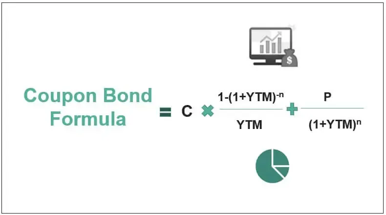

Bonds are debt securities issued by entities such as governments, municipalities, and corporations to raise capital. They serve a fundamental role in financial markets by providing a stable investment avenue and facilitating capital allocation across various sectors of the economy. Investors in bonds lend money to the issuer for a defined period at a variable or fixed interest rate. Upon maturity, the bondholder receives the principal amount back, along with periodic interest payments known as coupons.

A bond coupon represents the annual interest payment that the bondholder receives from the bond's issue date until its maturity. The coupon rate, expressed as a percentage of the bond's face value, determines the periodic interest income that investors earn on their bond investment. Coupons are critical because they influence the bond's yield, a key measure that investors use to evaluate their return on investment. Higher coupon rates typically imply greater income, making bonds with higher coupons more attractive to income-focused investors.



Algorithmic trading, defined as the use of computer algorithms to automate trading strategies, has revolutionized the bond market by enhancing trading efficiency and accuracy. By leveraging technology to process vast amounts of data rapidly, algorithmic trading can identify market trends, execute trades at optimal prices, and manage risks more effectively than traditional methods. This technological advancement is particularly relevant in bond trading, where complex and large datasets are involved.

The calculation of bond coupons is essential to developing effective trading strategies, especially in algorithmic trading. Accurate bond coupon calculations enable traders to determine the bond's yield and assess its value relative to other securities. Moreover, understanding how bond coupons influence total returns aids in crafting strategies that capitalize on interest rate movements and credit spread changes. Traders integrating precise coupon data into their algorithms can refine their decision-making processes and optimize their trading outcomes.

In this article, we will explore the importance of bonds and bond coupons, discuss how to calculate bond coupons, and examine algorithmic trading techniques in bond markets. We will look at the incorporation of coupon calculations within trading algorithms and anticipate future trends in bond trading, guiding readers on staying competitive in the evolving landscape. The comprehensive understanding provided here will assist investors and traders in leveraging technology effectively in their bond market ventures.

## Table of Contents

## Understanding Bonds and Coupons

Bonds are financial instruments that represent a loan made by an investor to a borrower, typically a corporation or government. These debt securities are used by entities to raise capital, with the issuer promising to repay the principal amount on a specified maturity date while periodically paying interest, known as the bond's coupon.

There are several types of bonds, each serving specific needs and offering distinct features. Government bonds are issued by national governments and are often considered low-risk investments due to their backing by the government. Notable examples include U.S. Treasury bonds and UK Gilts. Corporate bonds are issued by companies seeking to raise funds for business operations and may offer higher yields than government bonds, reflecting the additional credit risk. Municipal bonds are issued by state or local governments, often providing tax advantages for investors as the interest earned is sometimes exempt from federal income tax.

A bond's coupon is the interest payment made to bondholders, typically expressed as a percentage of the bond's face value. The coupon rate is determined based on factors such as prevailing market interest rates, the issuer's creditworthiness, and the bond's maturity term. For instance, a bond with a face value of $1,000 and an annual coupon rate of 5% would pay $50 annually to the bondholder.

Bond coupons significantly impact investment returns, as they represent the income generated over the bond's life. Bonds with higher coupon rates generally offer greater income but may reflect higher credit risk. Conversely, bonds with lower coupons may be regarded as safer but yield minimal returns. Investors often assess the risk-return profile of bonds by analyzing the coupon rate in conjunction with market interest rates, credit spreads, and economic conditions.

Several key factors influence bond coupon rates. Market interest rates play a crucial role; when interest rates rise, new bonds are typically issued with higher coupon rates to attract investors, causing existing bonds with lower coupons to lose value. The credit risk associated with the issuer also affects the coupon rate. Issuers with lower credit ratings must offer higher coupons to compensate investors for assuming additional risk. Moreover, macroeconomic factors, such as inflation and monetary policy, can impact coupon rates by altering the overall [interest rate](/wiki/interest-rate-trading-strategies) environment.

Understanding these elements is essential for investors seeking to optimize their bond portfolios. Accurate analysis of bond coupons and related factors can lead to informed investment decisions and effective risk management in various market scenarios.

## How to Calculate Bond Coupons

Calculating bond coupons is a fundamental aspect of bond investment, providing investors with an understanding of expected income streams. Here’s a comprehensive guide to understanding and calculating bond coupons.

### Step-by-Step Guide to Calculating Bond Coupons

Bond coupons are the interest payments made to the bondholder, typically paid annually or semi-annually. The calculation of the bond coupon involves understanding the coupon rate and applying it to the bond's face value. Here are the steps to calculate bond coupons:

1. **Identify the Coupon Rate and Face Value**:
   The coupon rate is usually expressed as a percentage of the bond's face value. For instance, a bond with a face value of $1,000 and a coupon rate of 5% will pay $50 annually.

2. **Choose the Coupon Payment Frequency**:
   Determine whether the coupon is paid annually, semi-annually, quarterly, etc. For example, if it’s semi-annual, the payment would be half of the annual coupon.

3. **Calculate the Coupon Payment**:
   Use the formula:
$$
   \text{Coupon Payment} = \left( \frac{\text{Coupon Rate}}{100} \right) \times \text{Face Value}

$$

4. **Adjust for Payment Frequency**:
   Divide the annual coupon payment by the number of payment periods per year. If the payment is semi-annual, divide by two:
$$
   \text{Adjusted Coupon Payment} = \frac{\text{Coupon Payment}}{\text{Payment Frequency Per Year}}

$$

### Examples of Bond Coupon Calculations

- **Annual Coupon Payment**: For a bond with a face value of $1,000 and a 5% annual coupon rate:
$$
  \text{Annual Coupon Payment} = \left( \frac{5}{100} \right) \times 1000 = \$50

$$

- **Semi-Annual Coupon Payment**: Using the same bond parameters for semi-annual payments:
$$
  \text{Semi-Annual Coupon Payment} = \frac{50}{2} = \$25

$$

### Common Mistakes to Avoid in Bond Coupon Calculations

1. **Ignoring Payment Frequency**: Always adjust the coupon payment based on how often payments are made.
2. **Mistaking Face Value for Market Value**: Coupons are calculated on the face value, not the fluctuating market value.
3. **Confusing Coupon and Yield**: The coupon rate is fixed, whereas the yield fluctuates with market conditions.

### Tools and Resources for Accurate Coupon Calculations

Several tools are available to facilitate accurate bond coupon calculations:

- **Financial Calculators**: Many calculators specifically designed for financial computations can automate these calculations.
- **Spreadsheet Software**: Programs like Microsoft Excel or Google Sheets can be used to set formulas for coupon calculations easily.
- **Programming Libraries**: Python's financial libraries (e.g., NumPy or pandas) can be used to write scripts for more complex calculations. Here is a simple Python example:

```python
def calculate_coupon_payment(face_value, coupon_rate, frequency):
    annual_coupon = (coupon_rate / 100) * face_value
    return annual_coupon / frequency

# Example calculation: $1,000 bond, 5% coupon rate, semi-annual payments
face_value = 1000
coupon_rate = 5
frequency = 2  # semi-annual

coupon_payment = calculate_coupon_payment(face_value, coupon_rate, frequency)
print(f"Semi-Annual Coupon Payment: ${coupon_payment:.2f}")
```

Bond coupon calculations are integral to assessing bond investment returns, and accuracy is paramount to ensure sound financial decision-making. Leveraging technology and financial tools can greatly enhance precision in these calculations.

 to Algorithmic Trading

Algorithmic trading, referring to the use of computer algorithms to execute trades in financial markets, has gained significant traction over the past few decades, particularly in bond markets. Its primary advantages include speed, accuracy, and the ability to process vast amounts of data, which are critical in today's fast-paced trading environments.

Technology has played a pivotal role in revolutionizing bond trading by enabling traders to derive insights and execute trades faster than manual methods. The implementation of [algorithmic trading](/wiki/algorithmic-trading) enables the execution of complex trading strategies with precision, taking into account a multitude of variables and market conditions. Automated trading systems can quickly process real-time data and make split-second decisions that would be impossible for human traders. This capability enhances market [liquidity](/wiki/liquidity-risk-premium) and often results in tighter bid-ask spreads.

Algorithms enhance trading efficiency by minimizing human error, reducing transaction costs, and ensuring the best possible execution of trades. For instance, they can be programmed to monitor market conditions continuously and execute trades when specific conditions are met, such as price thresholds or [volatility](/wiki/volatility-trading-strategies) limits. Furthermore, algorithms can handle multiple asset classes and markets simultaneously, allowing traders to diversify their strategies and exploit [arbitrage](/wiki/arbitrage) opportunities.

Several popular algorithmic trading strategies are prominent in bond markets. One such strategy is [statistical arbitrage](/wiki/statistical-arbitrage), which leverages complex mathematical models to identify price discrepancies between related bond instruments and execute trades to profit from these differences. Another common strategy is [trend following](/wiki/trend-following), where algorithms detect and exploit trends in bond prices over time, automatically executing buy or sell orders based on the identified trend directions. Market making is yet another strategy where algorithms provide liquidity by continuously buying and selling bonds, benefiting from the bid-ask spread.

However, implementing algorithmic trading comes with its own set of challenges and considerations. One major hurdle is the need for substantial technological infrastructure, including sophisticated software and reliable data feeds. Additionally, there is an inherent risk of relying on algorithmic models that may not always accurately predict market movements, especially during periods of high volatility or unexpected economic events. Regulatory considerations also play a role in algorithmic trading, as traders must ensure compliance with market regulations and reporting requirements.

In conclusion, while algorithmic trading offers numerous benefits and has transformed bond trading, it requires careful consideration of technological, risk management, and regulatory aspects for successful implementation. As technology continues to advance, algorithmic trading is poised to become even more integral to the functioning of financial markets.

## Incorporating Bond Coupon Calculations into Algo Trading

Accurate bond coupon calculations are crucial in forming effective algorithmic trading strategies. They directly influence pricing and yield assessments, vital components in trading decisions. The precise calculation of these coupons helps create robust models that drive profitability.

Integrating bond coupon data into trading algorithms begins with acquiring and processing accurate data feeds. These feeds should include current bond prices, yield rates, and any changes in interest rates that affect bond values. Modern trading algorithms often rely heavily on real-time data to maintain a competitive edge. This requires linking the algorithms to reliable data sources that ensure information is up-to-date and accurate.

Incorporating automation in these calculations is another critical element. Automation aids in updating bond values dynamically, taking into account market fluctuations and coupon payment schedules. This involves setting up systems that can process incoming data streams, apply the necessary computations to derive coupon information, and adjust trading strategies accordingly. Python is a preferred language for these tasks due to its robust libraries like Pandas for data manipulation and NumPy for numerical operations. Here is a simplified example of how coupon calculations might be automated:

```python
import pandas as pd

# Sample bond data
bond_data = {
    'Bond Name': ['Bond A', 'Bond B'],
    'Notional': [1000000, 500000],
    'Coupon Rate': [0.05, 0.045],
    'Payments per year': [2, 4]
}

df = pd.DataFrame(bond_data)

# Function to calculate coupon payment
def calculate_coupon(row):
    return row['Notional'] * row['Coupon Rate'] / row['Payments per year']

df['Coupon Payment'] = df.apply(calculate_coupon, axis=1)
print(df[['Bond Name', 'Coupon Payment']])
```

Analyzing the impact of bond coupon changes involves understanding that an increase in coupon rates typically makes a bond more attractive, affecting trading decisions and strategies. Conversely, a decrease might lead traders to reassess their positions, considering the bond's lowered yield relative to other instruments in the market.

Successful algorithmic trading strategies often leverage this sensitivity. One case study involves the utilization of [machine learning](/wiki/machine-learning) algorithms that continuously learn from historical and real-time coupon data to predict price movements. Such systems can adjust their exposure to bonds according to predicted changes, maximizing returns while managing risks. For example, high-frequency trading firms have used historical interest rate fluctuations and bond coupon changes to quickly recalibrate strategies, ensuring profitability amid volatile market conditions.

In conclusion, the effective integration of bond coupon calculations in algorithmic trading involves not only the accurate computation of these coupons but also the strategic use of real-time data and automation. These elements collectively enhance decision-making, ultimately contributing to more successful trading outcomes.

## Future Trends in Bond Trading and Coupon Calculations

Emerging technologies continue to transform bond trading and coupon calculations, offering new tools and methodologies to refine investment strategies and improve market efficiencies. Among these, big data and [artificial intelligence](/wiki/ai-artificial-intelligence) (AI) are at the forefront, revolutionizing bond portfolio management through advanced analytics, predictive modeling, and automation.

Big data analytics enables traders to analyze vast datasets in real-time, extracting actionable insights that can inform decisions on bond coupon investments. The use of AI further enhances this capability by applying machine learning algorithms to identify patterns, forecast market trends, and optimize portfolio performance. AI-powered systems can dynamically adjust to market changes, thus contributing to more effective risk management and strategic allocation of assets.

The integration of big data and AI in digital trading platforms is set to redefine bond coupon calculations. These platforms can automatically adjust coupon calculations based on real-time market data and issuer-specific factors, improving accuracy and efficiency. Python is often employed for such tasks due to its robust libraries, such as NumPy and Pandas, which are adept at handling financial calculations and data manipulation.

```python
import numpy as np

def calculate_coupon(payment_frequency, coupon_rate, face_value):
    return (face_value * coupon_rate) / payment_frequency

face_value = 1000  # Example face value
coupon_rate = 0.05  # Example coupon rate (5%)
payment_frequency = 2  # Semiannual payments

coupon_payment = calculate_coupon(payment_frequency, coupon_rate, face_value)
print(f"Coupon Payment: ${coupon_payment:.2f}")
```

Regulatory developments also play a crucial role in the evolution of bond trading. As technology advances, regulators are increasingly focused on ensuring transparency, security, and fairness in automated trading environments. Future regulations may impose stricter reporting standards for algorithmic trading activities, influencing how bond coupons are calculated and reported. Compliance with such regulations will be essential for market participants aiming to maintain competitiveness.

To stay ahead in the evolving market landscape, traders should leverage emerging technologies and continuously enhance their analytical capabilities. This includes adopting innovative trading platforms, investing in skills development around data science and AI, and staying informed about regulatory changes. By doing so, traders can capitalize on new opportunities and mitigate risks in bond trading, ensuring robust strategies that adapt to technological and regulatory shifts.

## Conclusion

In this article, we explored the integral role that bond coupon calculations play in the landscape of algorithmic trading. By understanding the fundamental mechanics and nuances of bond coupons, traders can enhance their trading strategies and make more informed investment decisions. This knowledge becomes especially crucial when integrated into algorithmic trading systems, where precision and efficiency are paramount.

The significance of accurate bond coupon calculations cannot be overstated in the context of algo trading. They are essential for assessing the potential returns and risks associated with bond investments. Accurate calculations ensure that trading algorithms function optimally, reflecting real-time market conditions and adapting to changes swiftly. This precision helps mitigate risks and exploit opportunities that arise in the dynamic market environment.

Leveraging technology in bond markets presents exciting opportunities for traders. As we have discussed, emerging technologies such as big data and artificial intelligence are reshaping how bond trading is conducted. These innovations offer the potential for greater accuracy, speed, and adaptability in trading strategies. Traders who embrace these technologies can gain a competitive advantage, staying ahead in an evolving marketplace.

We encourage readers to further investigate bond trading strategies, particularly those involving algorithmic elements. By understanding the mechanics of bond coupon calculations and the myriad ways in which technology can enhance trading, traders can build more robust and effective investment portfolios. As the landscape of bond trading continues to evolve, staying informed and adaptable will be key to achieving success.

We invite feedback and engagement from our readership community. Your insights and experiences are invaluable and contribute to a deeper understanding of bond trading strategies. By sharing knowledge and fostering discussion, we can collectively navigate the complexities of modern financial markets and continue advancing in the field of bond trading.

## References & Further Reading

[1]: ["Interest Rate Risk Management in Banking Industry"](https://www.mckinsey.com/capabilities/risk-and-resilience/our-insights/banking-on-interest-rates-a-playbook-for-the-new-era-of-volatility) by Baraik, V.K. & Awasthy, S.K.

[2]: ["Advances in Financial Machine Learning"](https://www.amazon.com/Advances-Financial-Machine-Learning-Marcos/dp/1119482089) by Marcos Lopez de Prado

[3]: ["Quantitative Trading: How to Build Your Own Algorithmic Trading Business"](https://www.amazon.com/Quantitative-Trading-Build-Algorithmic-Business/dp/1119800064) by Ernest P. Chan

[4]: ["Machine Learning for Algorithmic Trading"](https://github.com/stefan-jansen/machine-learning-for-trading) by Stefan Jansen

[5]: ["The Handbook of Fixed Income Securities"](https://www.amazon.com/Handbook-Fixed-Income-Securities-Ninth/dp/1260473899) by Frank J. Fabozzi

[6]: ["Bond Pricing and Yield Calculation"](https://www.investopedia.com/articles/bonds/07/price_yield.asp) by Adam Hayes, Investopedia

[7]: ["Algo Bots and the Law: Technology, Automation, and the Regulation of Futures and Other Derivatives"](https://www.cambridge.org/core/books/algo-bots-and-the-law/17E016E13A7F8E15B1A07BA1F579AD5B) by Gregory Scopino