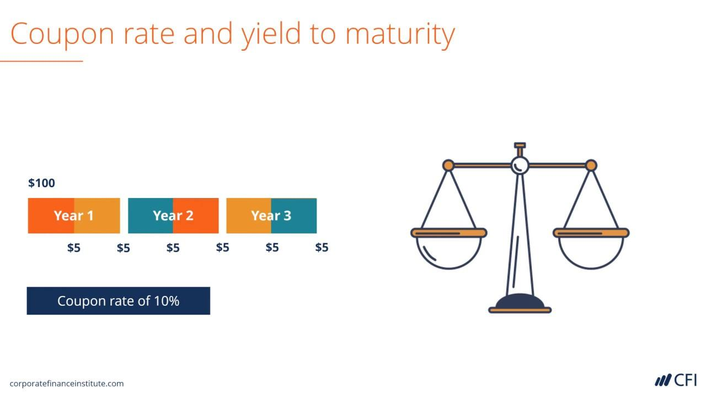

## Table of Contents

## What is a bond?

A bond is like a loan that you give to a company or the government. When you buy a bond, you are lending them money. In return, they promise to pay you back the money you lent them, plus some extra money called interest, over a certain period of time. This period can be a few years or even many years.

Bonds are often seen as a safer way to invest money compared to stocks. This is because the company or government that issued the bond has to pay you back, no matter what happens to their business or the economy. However, if the company or government runs into big trouble, there is a small chance they might not be able to pay you back. But overall, bonds can help you earn a steady income and keep your money safe.

## What is a coupon rate?

The coupon rate is like the interest rate on a bond. It tells you how much money you will get every year for each bond you own. For example, if you have a bond worth $1,000 with a coupon rate of 5%, you will get $50 every year until the bond matures.

This payment is usually made twice a year. So, in the example above, you would get $25 every six months. The coupon rate stays the same for the whole time you own the bond, which means your yearly payments won't change even if other interest rates in the economy go up or down.

## What is yield to maturity (YTM)?

Yield to maturity (YTM) is a way to figure out the total return you will get from a bond if you hold it until it matures. It takes into account the bond's current price, its face value, the coupon payments you will receive, and the time left until the bond matures. YTM is like an average rate of return that considers everything you will earn from the bond, including the interest payments and any gain or loss if you bought the bond at a price different from its face value.

For example, if you buy a bond for less than its face value, you will get a higher YTM because you will also earn from the difference between what you paid and what you get back at maturity. On the other hand, if you buy a bond for more than its face value, your YTM will be lower because you will lose money on the price difference. YTM helps you compare different bonds and see which one might be a better investment for you, considering all the money you will make over time.

## How does the coupon rate affect a bond's price?

The coupon rate of a bond affects its price because it determines how much interest the bond will pay each year. If the coupon rate is high compared to current interest rates, the bond will be more attractive to investors. They will be willing to pay more for the bond because it offers a higher return. This means the price of the bond will go up. On the other hand, if the coupon rate is low compared to current interest rates, the bond will be less attractive. Investors will not want to pay as much for it, so the price of the bond will go down.

For example, imagine there are two bonds, both with a face value of $1,000. One bond has a coupon rate of 5% and the other has a coupon rate of 3%. If the current market [interest rate](/wiki/interest-rate-trading-strategies) is 4%, the bond with the 5% coupon rate will be more valuable because it pays more interest than the market rate. Investors might be willing to pay more than $1,000 for this bond. The bond with the 3% coupon rate, however, pays less interest than the market rate, so investors might only be willing to pay less than $1,000 for it. This shows how the coupon rate directly influences the price of a bond based on how it compares to current interest rates.

## What does it mean when a bond's coupon rate equals its yield to maturity?

When a bond's coupon rate equals its yield to maturity, it means that the bond is being sold at its face value. This happens because the annual interest payments (determined by the coupon rate) exactly match what investors expect to earn from the bond if they hold it until it matures (which is the yield to maturity). So, if a bond has a face value of $1,000 and a coupon rate of 5%, and the yield to maturity is also 5%, the bond will be sold for $1,000.

This situation often occurs when a bond is first issued, and the market conditions are stable. If interest rates in the market stay the same, the bond's price will remain at its face value because the coupon payments are exactly what investors expect to earn. However, if interest rates change, the bond's price will adjust, and the coupon rate and yield to maturity will no longer be equal.

## How can you calculate the yield to maturity of a bond?

To calculate the yield to maturity (YTM) of a bond, you need to know a few things: the bond's current price, its face value, the coupon rate, and how many years are left until it matures. YTM is like a special interest rate that shows the total return you would get if you hold the bond until it matures. It takes into account all the coupon payments you will get over time, plus any gain or loss if you bought the bond for more or less than its face value. Calculating YTM exactly can be tricky because it involves solving a math problem where you need to find the rate that makes the present value of all future cash flows equal to the bond's current price.

A simple way to think about it is to use a financial calculator or a computer program. These tools can do the math for you quickly. If you want to do it by hand, you can use a trial-and-error method. Start with a guess for the YTM, then calculate the present value of all the bond's future payments using that rate. If the present value is too high, try a higher YTM. If it's too low, try a lower YTM. Keep adjusting until you find a rate that makes the present value equal to the bond's current price. This rate is the YTM.

## What are the implications of a bond's coupon rate being equal to its YTM for investors?

When a bond's coupon rate is equal to its yield to maturity, it means that the bond is being sold at its face value. This is a good thing for investors because it shows that the bond is priced fairly in the market. If you buy the bond at this point, the interest payments you get every year will be exactly what you expect to earn if you hold the bond until it matures. This makes it easier for you to plan your investments because you know what to expect from the bond.

However, this situation doesn't last forever. If interest rates in the market go up or down, the bond's price will change, and the coupon rate will no longer be equal to the yield to maturity. If you plan to sell the bond before it matures, you need to keep an eye on these changes. But if you are happy to hold the bond until it matures, then buying it when the coupon rate equals the YTM is a good choice because you will get the steady income you expected.

## How does the relationship between coupon rate and YTM impact bond valuation?

The relationship between a bond's coupon rate and its yield to maturity (YTM) plays a big role in figuring out how much the bond is worth. When the coupon rate is the same as the YTM, the bond is sold at its face value. This means that if you buy the bond at this time, the interest you get every year will be exactly what you expect to earn until the bond matures. It's like the bond is priced just right, making it easy for you to plan your investment because you know exactly what you will get.

But things can change. If interest rates in the market go up, new bonds will offer higher coupon rates, making your bond less attractive. So, its price will drop below the face value, and the YTM will go up to match the new market rates. On the other hand, if interest rates go down, new bonds will have lower coupon rates, making your bond more valuable. Its price will go above the face value, and the YTM will drop. This shows how the bond's price changes to keep the YTM in line with what's happening in the market, affecting how much the bond is worth at any given time.

## What are the market conditions under which a bond's coupon rate would typically equal its YTM?

When a bond's coupon rate equals its yield to maturity, it usually means the bond is being sold at its face value. This happens most often when the bond is first issued and the market conditions are stable. If interest rates in the market stay the same after the bond is issued, the bond's price will stay at its face value because the interest payments (coupon rate) are exactly what investors expect to earn (yield to maturity). This makes it a good time for investors to buy the bond because they know exactly what they will get until the bond matures.

However, this situation doesn't last if market conditions change. If interest rates go up, new bonds will offer higher coupon rates, making the existing bond less attractive. Its price will drop below the face value, and the yield to maturity will go up to match the new market rates. If interest rates go down, new bonds will have lower coupon rates, making the existing bond more valuable. Its price will go above the face value, and the yield to maturity will drop. So, for a bond's coupon rate to equal its yield to maturity, the market needs to be stable with no big changes in interest rates.

## How does the concept of duration relate to bonds where the coupon rate equals the YTM?

Duration is a way to measure how sensitive a bond's price is to changes in interest rates. It tells you how long it will take for you to get back the money you spent on the bond, taking into account all the interest payments you will get over time. When a bond's coupon rate equals its yield to maturity, it means the bond is sold at its face value. At this point, the duration of the bond is a good tool to use because it helps you understand how the bond's price might change if interest rates go up or down. 

If you have a bond where the coupon rate equals the YTM and you know its duration, you can predict how much the bond's price will change for a given change in interest rates. For example, if a bond has a duration of 5 years and interest rates go up by 1%, the bond's price will drop by about 5%. This is useful for investors because it helps them see how their bond will react to changes in the market, even when the bond is initially priced fairly.

## What are the risks associated with investing in bonds where the coupon rate equals the YTM?

When you invest in a bond where the coupon rate equals the yield to maturity, it means the bond is sold at its face value. This is good because you know exactly what you will earn if you hold the bond until it matures. But there are still risks. One big risk is that interest rates might change after you buy the bond. If interest rates go up, new bonds will offer higher coupon rates, making your bond less attractive. This means the price of your bond will drop if you want to sell it before it matures. If you need to sell the bond early, you might lose money because you will have to sell it for less than what you paid.

Another risk is that the company or government that issued the bond might run into financial trouble. Even if the coupon rate equals the YTM when you buy the bond, there's always a chance they might not be able to pay you back. This is called credit risk. If this happens, you could lose some or all of your money. So, even though buying a bond at a time when the coupon rate equals the YTM seems safe, you still need to think about these risks and how they might affect your investment.

## How do macroeconomic factors influence the scenario where a bond's coupon rate equals its YTM?

Macroeconomic factors like interest rates, inflation, and economic growth can change the situation where a bond's coupon rate equals its yield to maturity. If interest rates go up because the economy is growing fast, new bonds will have higher coupon rates. This makes your bond, which was bought when the coupon rate equaled the YTM, less attractive to other investors. As a result, if you want to sell your bond before it matures, you might have to do it for less than what you paid. On the other hand, if interest rates go down because the economy is slowing down, new bonds will have lower coupon rates, making your bond more valuable. In this case, if you sell your bond early, you might get more than what you paid for it.

Inflation also plays a big role. If inflation goes up, the money you get from your bond's interest payments won't buy as much as it used to. This means the real value of your investment goes down. When people expect higher inflation, they might want higher yields to make up for it, which can cause the YTM of existing bonds to go up, making their prices drop. So, even if your bond started with the coupon rate equal to the YTM, changes in inflation can affect how much your bond is worth over time.

## What is Yield to Maturity?

Yield to maturity (YTM) is a comprehensive measure of the total return an investor can expect from a bond if it is held until its maturity date. The YTM calculation encompasses all projected coupon payments, the effect of compounded interest, and any gains or losses that might result from purchasing the bond at a price other than its par value. This measure is crucial for evaluating bond investments, as it provides an overarching view of the bond’s profitability over its entire life.

To understand YTM more technically, consider a bond's price $P$, its face or par value $F$, the annual coupon payment $C$, the number of years to maturity $n$, and the yield to maturity $r$. The formula for calculating YTM, therefore, can be expressed as solving the following equation for $r$:

$$
P = \sum_{i=1}^{n} \frac{C}{(1 + r)^i} + \frac{F}{(1 + r)^n}
$$

Here, $P$ is the present value of the bond, capturing the sum of the present values of the future coupon payments and the repayment of the par value at maturity.

Practically, determining the precise YTM requires iterative methods or financial calculators since the formula is not easily translatable to an algebraic solution. Python, for instance, offers tools like the `numpy` library, which can be employed to calculate YTM using numerical methods:

```python
import numpy as np

def calculate_ytm(price, par, coupon_rate, years, frequency=1):
    coupon = (par * coupon_rate) / frequency
    periods = years * frequency

    def ytm_func(r):
        cash_flows = [coupon] * periods
        cash_flows[-1] += par
        return np.sum([cf / (1 + r/frequency)**i for i, cf in enumerate(cash_flows, 1)]) - price

    return np.irr([-price] + [coupon] * (periods - 1) + [par + coupon])

# Example usage
ytm = calculate_ytm(950, 1000, 0.05, 5)
print("YTM: ", ytm)
```

Using YTM as a tool offers investors a complete perspective on the potential returns of a bond, helping them to effectively compare different bonds, which might have variations in their coupon rates, market prices, or maturities. By incorporating various elements that affect the bond's return, YTM assists investors in making sound investment decisions.

## What is the impact of interest rate changes on bonds?

Bond prices and interest rates exhibit an inverse relationship; as interest rates rise, the prices of existing bonds generally decline, and conversely, when interest rates fall, bond prices tend to rise. This dynamic is foundational in bond investment strategies and directly affects the yield to maturity (YTM) but not the coupon rate.

The bond pricing mechanism can be illustrated by evaluating how changes in interest rates impact a bond's market value. Consider a bond that pays a fixed coupon rate; when interest rates increase, new bonds are issued with higher rates, making existing bonds with lower coupon rates less attractive. Consequently, the market price of these existing bonds decreases to make their yield competitive with newly issued bonds. Conversely, if interest rates decrease, existing bonds with higher fixed coupon rates become more valuable, leading to an increase in their market price.

Mathematically, the relationship between bond prices and interest rates can be demonstrated using the present value formula of bond cash flows:

$$
P = \sum_{t=1}^{n} \frac{C}{(1 + r)^t} + \frac{F}{(1 + r)^n}
$$

Where:
- $P$ is the current bond price.
- $C$ is the annual coupon payment.
- $F$ is the face value of the bond.
- $r$ is the market interest rate.
- $n$ is the number of years to maturity.

As $r$, or the market interest rate, changes, the present value of the bond's cash flows also changes, affecting its price.

Understanding this relationship is crucial for predicting bond price fluctuations and potential investment outcomes. It enables investors to anticipate market movements and adjust their portfolio strategies accordingly. For instance, in a rising interest rate environment, investors may choose to hold bonds to maturity to avoid potential price losses or opt for shorter-duration bonds, which are less sensitive to interest rate changes. Conversely, in a declining interest rate context, investing in long-duration bonds may be advantageous as their prices are more likely to increase, maximizing potential returns.

This interplay between interest rates and bond prices is a fundamental concept that underscores the importance of monitoring economic indicators and central bank policies, both of which influence interest rate trends. Armed with this knowledge, investors can better navigate the fixed-income market and make informed decisions about their bond portfolios.

## What is the difference between Yield to Maturity and Coupon Rate?

While the coupon rate and yield to maturity (YTM) are both essential metrics in assessing bond investments, they serve different purposes and provide unique insights. The coupon rate, a fixed annual interest percentage based on the bond's face value, offers a straightforward view of the income generated from holding the bond. Conversely, YTM offers a comprehensive estimation of the total return an investor can anticipate if the bond is held to maturity, incorporating all coupon payments, compounded interest, and the difference between purchase price and par value.

For bonds acquired at a discount (purchased below par value), the YTM will exceed the coupon rate. This is because the bondholder benefits not only from regular coupon payments but also from the appreciation of the bond's price to its face value upon maturity. Mathematically, YTM captures these aspects, accounting for both income from coupons and capital gains. It can be expressed as the internal rate of return (IRR) for the bond’s cash flows, which requires solving for $YTM$ in the present value equation:

$$
P = \sum_{t=1}^{n} \frac{C}{(1+YTM)^t} + \frac{F}{(1+YTM)^n}
$$

where $P$ is the purchase price, $C$ is the annual coupon payment, $F$ is the face value, and $n$ is the number of years to maturity.

For bonds sold at a premium (above par value), the YTM will be lower than the coupon rate because the investor faces a capital loss when the bond matures at its par value.

These calculations enable investors to gauge the attractiveness of bonds, factoring in both income and potential changes in bond value. By comparing the YTM and coupon rate, investors can evaluate whether the present trading price of a bond aligns with their investment goals, especially under varying market conditions influenced by interest rate fluctuations and economic shifts.

In summary, while the coupon rate provides a static measure of annual income, the YTM offers a dynamic evaluation of a bond's potential returns over its lifespan, guiding strategic investment decisions based on comprehensive analysis rather than mere income potential.

## References & Further Reading

[1]: Fabozzi, F. J., Mann, S. V., & Choudhry, M. (2009). ["The Handbook of Fixed Income Securities"](https://www.mhebooklibrary.com/doi/book/10.1036/9781260473902?contentTab=true). McGraw-Hill Education.

[2]: Hull, J. C. (2012). ["Options, Futures, and Other Derivatives"](https://www.semanticscholar.org/paper/Options%2C-Futures%2C-and-Other-Derivatives-Hull/89bdee500c8623864fc9eb7a471546aa713acc44). Pearson.

[3]: ["The Basics of Bonds"](https://www.investopedia.com/financial-edge/0312/the-basics-of-bonds.aspx) on Investopedia.

[4]: Lopez de Prado, M. (2018). ["Advances in Financial Machine Learning"](https://www.amazon.com/Advances-Financial-Machine-Learning-Marcos/dp/1119482089). John Wiley & Sons.

[5]: Chan, E. (2009). ["Quantitative Trading: How to Build Your Own Algorithmic Trading Business"](https://github.com/ftvision/quant_trading_echan_book). John Wiley & Sons.

[6]: Choudhry, M. (2010). ["An Introduction to Bond Markets"](https://onlinelibrary.wiley.com/doi/book/10.1002/9781118371961). Wiley.

[7]: Jansen, S. (2020). ["Machine Learning for Algorithmic Trading, Second Edition"](https://www.amazon.com/Machine-Learning-Algorithmic-Trading-alternative-ebook/dp/B08D9SP6MB). Packt Publishing.