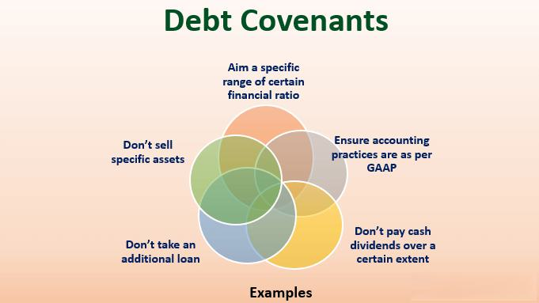

In the world of bonds and financial agreements, covenants play a crucial role. They are legally binding terms that safeguard the interests of bond issuers and holders. Essentially, bond covenants are stipulations within a bond’s indenture that ensure borrowers uphold certain financial practices and obligations, thus protecting the lenders. These covenants are key to maintaining the balance of power between issuers and investors, mitigating risks, and preserving the financial health of both parties involved.

This article focuses on the dual nature of covenants as negative and affirmative, each serving distinct functions in the realm of bond agreements. Negative covenants impose restrictions on actions that an issuer may undertake, such as incurring additional debt, which could compromise the borrower’s ability to meet financial obligations. On the other hand, affirmative covenants require issuers to engage in specific actions to maintain transparency and operational efficiency, like regularly providing audited financial statements.



Moreover, the integration of these covenants with algorithmic trading unveils new dynamics within financial markets. As digital transformation evolves, understanding the interplay between bond covenants and algorithmic trading becomes crucial. The use of advanced technologies such as artificial intelligence (AI) and machine learning in trading systems is reshaping how covenant data impacts asset valuation and risk assessment. This nexus of financial regulations and technology underscores the importance of staying informed on how these elements influence modern finance ecosystems.

This comprehensive overview aims to equip readers with valuable insights into the contemporary financial landscape. Through this article, readers will be introduced to the concept of bond covenants, followed by a detailed exploration of their types and implications, providing a thorough understanding of how these components are pivotal in today's financial markets.

## Table of Contents

## Understanding Bond Covenants

Bond covenants are vital provisions incorporated within a bond's indenture designed to safeguard the interests of both borrowers and lenders. By establishing explicit agreements regarding what bond issuers are permitted or restricted to perform, these covenants ensure the issuer's adherence to financial discipline and long-term health. The stipulations outlined in covenants often serve as a blueprint for issuer behavior, aligning the interests of the issuer with those of the bondholders by mitigating the risk of potential defaults and financial malpractices.

Affirmative and negative covenants are the two primary categories of bond covenants, each serving a distinct purpose in maintaining a bond’s integrity. Affirmative covenants, also referred to as positive covenants, require bond issuers to perform certain duties. These duties often include maintaining adequate insurance coverage, adhering to specific financial ratios, or providing regular financial disclosures like audited statements. While less restrictive in nature, non-compliance with affirmative covenants can lead to credit downgrades or defaults, impacting both the issuer's reputation and financial standing.

Conversely, negative covenants impose restrictions on the bond issuer, curtailing certain actions that could jeopardize bondholder interests. These typically include prohibitions on incurring additional debt beyond a specified limit or restrictions against making substantial capital expenditures without bondholder consent. Negative covenants ensure the issuer maintains a stable financial footing, thereby preserving the bondholders' claims in adverse situations. Non-adherence to these covenants can precipitate severe penalties, affecting the issuer’s market reputation and escalating financing costs.

The enforceability of these covenants throughout a bond's life hinges on the clarity and precision of the wording within the bond indenture. Legal enforceability ensures bondholders can take remedial actions in the event of a breach. Moreover, typical clauses found within bond agreements might include provisions on collateral maintenance, limitations on dividend payouts, or stipulations on asset sales—all designed to uphold financial prudence and transparency.

Understanding the intricacies and application of bond covenants is crucial for investors and finance professionals, as it allows them to assess the underlying risks and protective measures associated with bond investments. Insight into these terms not only aids in evaluating the creditworthiness and operational ethos of bond issuers but also in anticipating potential financial challenges that may arise during the bond's tenor.

## Affirmative Covenants

Affirmative covenants, often termed positive covenants, obligate the bond issuer to undertake specific actions to ensure the financial integrity and operational transparency of their activities. These covenants are vital in maintaining the trust and security between the issuer and the bondholders, facilitating a relationship built on legal and operational assurances.

Affirmative covenants commonly include the maintenance of adequate insurance coverage, compliance with legal and regulatory requirements, and the provision of periodic audited financial statements. For example, an issuer might be required to maintain a certain level of insurance coverage to safeguard both its assets and the interests of the bondholders. Similarly, regular financial reporting, such as providing quarterly or annual audited financial statements, helps foster transparency and keeps bondholders informed about the issuer's financial health and operational performance.

While affirmative covenants are generally less restrictive than their negative counterparts, failure to comply can trigger financial consequences, such as technical defaults. A technical default does not necessarily imply that the issuer has failed to make interest or principal payments, but it may indicate non-compliance with the less stringent, yet equally important, affirmative requirements. Such defaults can lead to negotiations for covenant waivers or amendments, potentially resulting in higher costs or more stringent terms for the issuer.

Real-world examples highlight the significance of affirmative covenants in corporate finance. For instance, a company that fails to maintain the required insurance could face severe asset losses or liabilities, affecting its ability to meet financial obligations. Conversely, consistent adherence to reporting obligations exemplifies responsible corporate governance and boosts investor confidence.

The operational impact of affirmative covenants is profound, as they demand a structured approach to compliance. Issuers must implement effective management systems to ensure they meet these obligations. This involves establishing robust internal controls, auditing processes, and compliance strategies that align with both legal requirements and covenant stipulations.

In conclusion, affirmative covenants are essential in safeguarding transparency and operational integrity within bond agreements. By mandating specific actions, they not only protect bondholders' interests but also encourage issuers to uphold sound financial practices. As financial markets evolve, the strategic implementation and management of these covenants will be crucial for sustaining corporate and investor confidence.

## Negative Covenants

Negative covenants are vital clauses within bond agreements, designed to restrict certain actions of the bond issuer to safeguard the interests of bondholders. These covenants serve as protective measures, ensuring that the issuer maintains adequate financial health and creditworthiness throughout the bond's term.

One common type of negative covenant restricts the issuer from incurring additional debt. By limiting the ability to assume new liabilities, this covenant helps ensure that current obligations to bondholders remain prioritized, reducing the risk of dilution of claims on assets. For instance, a covenant might stipulate a maximum debt-to-equity ratio, preventing the issuer from becoming over-leveraged. This can be expressed mathematically as:

$$
\text{Debt-to-Equity Ratio} = \frac{\text{Total Debt}}{\text{Total Equity}}
$$

A breach occurs if this ratio exceeds a predefined threshold, triggering possible penalties or corrective measures.

Negative covenants may also restrict issuers from engaging in significant capital expenditures or mergers and acquisitions that could impact financial stability. These restrictions ensure that cash flows remain sufficient to meet bond obligations, protecting bondholders from potential risks associated with aggressive investment strategies.

Violating negative covenants can lead to severe repercussions, both legally and financially. A common consequence is triggering a technical default, which could allow bondholders to demand immediate repayment of the principal. This can severely impact the issuer's reputation in capital markets, increasing future borrowing costs and limiting access to credit.

Examples of negative covenants include the restriction on dividend payouts, where issuers must maintain a certain level of retained earnings before distributing dividends to shareholders. For instance, a covenant might demand that dividends not exceed 50% of net earnings, preserving capital for bondholder obligations.

The strategic importance of negative covenants lies in their ability to provide a structured framework that disciplines issuer behavior, thereby reducing the probability of default. By enforcing financial prudence, these covenants help maintain the confidence of investors and the stability of financial systems. Negative covenants form an essential backbone of risk management strategies, ensuring that bondholders’ interests are consistently prioritized.

## The Role of Bond Covenants in Algorithmic Trading

Algorithmic trading systems are designed to execute trades automatically when predetermined conditions are met. The use of such systems has become increasingly prevalent due to their ability to process large volumes of data swiftly and make lightning-fast decisions. Bond covenants, whether affirmative or negative, significantly influence [algorithmic trading](/wiki/algorithmic-trading) strategies by impacting asset valuation and risk assessment.

Affirmative covenants, which mandate specific actions by the issuer, can affect the stability and predictability of cash flows, providing a basis for calculating expected returns. For instance, an algorithm might be programmed to favor bonds from issuers who are required to maintain a certain level of insurance, as this reduces the default risk. The data from these covenants can be integrated into algorithms to refine predictions about future bond performance. This allows trading systems not only to assess the validity of financial statements but also to determine the issuer's compliance with legal and fiduciary obligations.

Negative covenants, on the other hand, restrict the issuer's actions and are crucial for preserving credit quality. They can restrict issuers from taking on additional debt or making large capital expenditures without approval. In an algorithmic trading setup, these restrictions can be coded into the algorithms to assess potential violations that could affect the issuer's credit risk. Algorithms can flag bonds with relaxed negative covenants as higher risk, modifying valuations accordingly and adjusting trading strategies throughout the bond's life cycle.

The incorporation of [artificial intelligence](/wiki/ai-artificial-intelligence) (AI) and [machine learning](/wiki/machine-learning) into algorithmic trading has further elevated the significance of covenants. AI enables the creation of more sophisticated models that can dynamically take into account various covenant-related data, enhancing prediction models and decision-making processes. Machine learning algorithms can be trained using historical data on covenant compliance or breaches, allowing these systems to learn patterns that precede financial distress or changes in creditworthiness.

Consider a simple Python script leveraging machine learning to predict bond price movements based on covenant-related features:

```python
from sklearn.ensemble import RandomForestRegressor
from sklearn.model_selection import train_test_split
from sklearn.metrics import mean_squared_error

# Dummy dataset with covenant features
data = {
    'affirmative_compliance': [1, 0, 1, 1, 0],
    'negative_restriction_breaches': [0, 1, 1, 0, 1],
    'bond_value': [105, 100, 110, 108, 99]
}

X = pd.DataFrame(data[['affirmative_compliance', 'negative_restriction_breaches']])
y = pd.DataFrame(data['bond_value'])

X_train, X_test, y_train, y_test = train_test_split(X, y, test_size=0.2, random_state=42)

model = RandomForestRegressor()
model.fit(X_train, y_train.values.ravel())

predictions = model.predict(X_test)
mse = mean_squared_error(y_test, predictions)

print(f"Mean Squared Error: {mse}")
```

In this example, `affirmative_compliance` and `negative_restriction_breaches` serve as features influencing the bond's valuation algorithmically. The predictive power enhanced through such methods offers traders a competitive advantage in modern finance by allowing for a nuanced interpretation of how covenants shape the financial landscape.

Thus, understanding the integration of bond covenants and algorithmic trading remains a critical competence for professionals navigating today's complex market dynamics. As technology continues to evolve, the capability to seamlessly blend legal covenant data with advanced trading algorithms will mark a discernible edge in finance.

## Case Studies and Real-world Applications

Case studies serve as valuable resources for understanding the practical implementation and challenges associated with bond covenants. By examining these real-world applications, stakeholders can gain insights into how covenants influence corporate finance and investor decision-making processes.

One notable case involves the telecommunications giant, AT&amp;T, which was subject to negative covenants in its bond agreements following the acquisition of Time Warner. The covenants restricted AT&amp;T from incurring additional debt beyond specified limits. These restrictions aimed to protect bondholders by ensuring that AT&amp;T maintained financial stability and creditworthiness. However, following a strategic decision to restructure its portfolio and reduce its debt burden, AT&amp;T experienced challenges in adhering to these covenants, resulting in a breach. This breach led to renegotiations with creditors to temporarily amend the covenants, allowing the company more flexibility in asset management while safeguarding bondholders’ interests. The incident highlights the necessity of maintaining a balance between strategic objectives and compliance with bond covenants.

Another example is the retail company J.C. Penney, which faced covenant breaches that contributed to its bankruptcy in 2020. Under its bond agreements, J.C. Penney was required to maintain a minimum EBITDA level, a common affirmative covenant designed to ensure operational profitability. However, due to a decline in sales and increased competition, the company failed to meet these financial metrics, triggering a covenant violation. The repercussion of this breach was the acceleration of debt repayment, which significantly strained the company’s finances and contributed to its eventual bankruptcy filing. This case underscores the importance of robust financial health and market adaptability in meeting covenant obligations.

In the technology sector, Netflix provides an interesting example of strategic covenant management. During its international expansion phase, Netflix entered into agreements with covenants that limited excessive capital expenditure to avoid jeopardizing its debt equity balance. By using a data-driven approach and maintaining transparent communication with its investors, Netflix successfully navigated these covenants while continuing its growth strategy. This illustrates how a strong strategic alignment and proactive communication with stakeholders can mitigate the potential negative impact of covenant constraints.

These cases reflect the varied challenges and strategies associated with managing bond covenants. Breaches of covenants can substantially affect a company's reputation and financing costs, leading to restructuring or default. Conversely, strategic compliance and effective negotiation can enhance investor confidence and operational efficiency. Analyzing such instances offers valuable lessons in corporate finance and the critical role of covenants in shaping investor confidence and decision-making.

## Conclusion

Bond covenants, encompassing both negative and affirmative varieties, serve as vital instruments within the financial domain. These agreements are integral in safeguarding the interests of various stakeholders by mandating sound financial practices and minimizing default risks. As financial landscapes evolve, the adoption of algorithmic trading has introduced novel methodologies for evaluating the influence of covenants on market behaviour. Algorithmic systems, through sophisticated data processing and analysis, can incorporate covenant information to enhance risk assessment and valuation strategies, thus reshaping traditional finance dynamics.

The continuous development in technology suggests an increasingly intertwined future between financial agreements and digital platforms. Emerging technologies, like artificial intelligence and machine learning, promise further integration, potentially leading to more precise covenant enforcement and compliance monitoring. This technological convergence offers enhanced predictive capabilities, allowing for more nuanced financial decision-making and strategic planning.

For finance professionals and investors, maintaining an up-to-date understanding of these evolving dynamics is imperative. The ability to navigate and leverage these advancements will play a crucial role in achieving competitive advantage and ensuring informed financial stewardship. As the financial ecosystem continues to transform, adaptability and knowledge will remain key attributes for effective stakeholder engagement and risk management.

## References & Further Reading

[1]: Turner, J. A. (2015). ["Incorporating Bond Covenants into Trading Algorithms"](https://muse.jhu.edu/article/586631). SSRN Electronic Journal.

[2]: Fabozzi, F. J., & Mann, S. V. (2012). ["Handbook of Fixed Income Securities"](https://www.mhebooklibrary.com/doi/book/10.1036/9781260473902?contentTab=true). McGraw-Hill Education.

[3]: Lopez de Prado, M. (2018). ["Advances in Financial Machine Learning"](https://www.amazon.com/Advances-Financial-Machine-Learning-Marcos/dp/1119482089). Wiley.

[4]: Bodie, Z., Kane, A., & Marcus, A. J. (2017). ["Investments"](https://www.mheducation.com/highered/product/Investments-Bodie.html). McGraw-Hill Education.

[5]: Jarrow, R., & Chatterjea, A. (2018). ["An Introduction to Derivative Securities, Financial Markets, and Risk Management"](https://www.scribd.com/document/686888944/Robert-Jarrow-Arkadev-Chatterjea-An-Introduction-to-Derivative-Securities-Financial-Markets-And-Risk-Management-2nd-Edition-World-Scientific-US). W. W. Norton & Company.