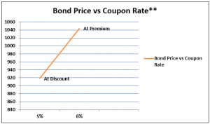

## Table of Contents

## What is a bond?

A bond is like a loan that you give to a company or the government. When you buy a bond, you are lending them money. In return, they promise to pay you back the money you lent them, plus some extra money as a thank you. This extra money is called interest. Bonds are a way for companies and governments to borrow money from people like you to help them do big projects or run their operations.

Bonds have a set time period, called the maturity date, which is when the borrower has to pay back the full amount they borrowed. Until that date, they will usually pay you interest regularly, like every year or every six months. Bonds can be safer than other types of investments because they promise to pay you back, but there is still a risk that the company or government might not be able to pay you back if they run into financial trouble.

## What is a bond discount?

A bond discount happens when a bond is sold for less than its face value. The face value is the amount of money the bond will be worth when it matures, or when the loan is due to be paid back. For example, if a bond has a face value of $1,000 but is sold for $950, it is being sold at a discount. People might buy bonds at a discount if they think the interest they will earn, plus the difference between the discounted price and the face value, will give them a good return on their investment.

Bonds can be sold at a discount for a few reasons. One reason is if the bond's interest rate is lower than what new bonds are offering. Investors might not want to buy a bond that pays less interest, so the seller has to lower the price to make it more attractive. Another reason is if there's a higher risk that the company or government might not be able to pay back the bond. To make up for this risk, investors will want to buy the bond for less than its face value.

## What is a premium bond?

A premium bond is when someone buys a bond for more than its face value. The face value is the amount of money the bond will be worth when it matures, or when the loan is due to be paid back. For example, if a bond has a face value of $1,000 but is sold for $1,050, it is being sold at a premium. People might be willing to pay more for a bond if they think the interest they will earn, even though they paid more upfront, will still give them a good return on their investment.

Bonds can be sold at a premium for a few reasons. One reason is if the bond's interest rate is higher than what new bonds are offering. Investors might be happy to pay more for a bond that pays more interest. Another reason is if the bond is seen as very safe, meaning people think the company or government is very likely to pay back the bond. When something is seen as safe, people are often willing to pay more for it.

## How is the price of a bond determined?

The price of a bond is determined by a few important things. One big thing is the interest rate, or coupon rate, that the bond offers. If a bond's interest rate is higher than what new bonds are offering, people might be willing to pay more for it, making its price go up. On the other hand, if the bond's interest rate is lower than new bonds, people might not want to buy it unless the price is lower, which means the bond's price goes down. Another thing that affects the price is how safe people think the bond is. If people believe the company or government will definitely pay back the bond, they might be willing to pay more for it, pushing the price up.

Another [factor](/wiki/factor-investing) that influences a bond's price is the time left until the bond matures. The longer the time until the bond matures, the more time there is for things to change, like interest rates or the financial health of the borrower. This uncertainty can make people want a lower price for longer-term bonds. Also, the general demand for bonds can affect their price. If a lot of people want to buy bonds, the price can go up because there are more buyers than sellers. If fewer people want to buy bonds, the price can go down because there are more sellers than buyers. All these things together help decide how much a bond is worth in the market.

## What causes a bond to be sold at a discount?

A bond is sold at a discount when it is sold for less than its face value. This happens for a few reasons. One reason is if the bond's interest rate is lower than what new bonds are offering. Imagine if a new bond pays 5% interest but an old bond only pays 3%. People might not want to buy the old bond unless they can get it for a lower price. This makes the old bond's price drop below its face value, which is a discount.

Another reason a bond might be sold at a discount is if there's a higher chance that the company or government might not be able to pay back the bond. If people think there's a risk the borrower might have money problems, they will want to buy the bond for less than its face value to make up for that risk. So, if a company is not doing well financially, its bonds might be sold at a discount because people are worried about getting their money back.

## What causes a bond to be sold at a premium?

A bond is sold at a premium when it is sold for more than its face value. This happens when the bond's interest rate is higher than what new bonds are offering. Imagine if a new bond pays 3% interest but an old bond pays 5%. People might be willing to pay more for the old bond because it gives them more interest. So, the old bond's price goes up above its face value, which is a premium.

Another reason a bond might be sold at a premium is if it is seen as very safe. If people believe the company or government will definitely pay back the bond, they might be willing to pay more for it. For example, if a government is known for always paying back its debts, its bonds might be sold at a premium because people trust that they will get their money back.

## How do bond discounts affect the yield to maturity?

When a bond is bought at a discount, it means you pay less than the bond's face value. This affects the yield to maturity, which is like the total return you get on the bond if you hold it until it matures. Because you paid less for the bond, the difference between what you paid and the face value you get back at maturity adds to your total return. So, buying a bond at a discount can increase your yield to maturity because you earn not just the interest payments but also the extra money from the discount.

For example, if you buy a bond with a face value of $1,000 for $950, you will get $1,000 back when it matures. That $50 difference is like extra money you earn on top of the interest payments. This makes the yield to maturity higher than if you had bought the bond at its full face value. So, bond discounts can make the investment more attractive because they boost the overall return you get from holding the bond until it matures.

## How do premium bonds affect the yield to maturity?

When you buy a bond at a premium, it means you pay more than the bond's face value. This can make the yield to maturity lower because you're paying more upfront. The yield to maturity is like the total return you get if you hold the bond until it matures. Since you paid more for the bond, the interest payments you get might not be enough to make up for the extra money you spent. So, the total return, or yield to maturity, ends up being less than if you had bought the bond at its face value.

For example, if you buy a bond with a face value of $1,000 for $1,050, you will only get $1,000 back when it matures. That $50 difference is like a loss because you paid more than you get back. Even though you get interest payments, the total return you get from the bond is lower because of the premium you paid. So, buying a bond at a premium can make the investment less attractive because it lowers the overall return you get from holding the bond until it matures.

## What are the tax implications of buying bonds at a discount?

When you buy a bond at a discount and hold it until it matures, you might have to pay taxes on the difference between what you paid and the face value of the bond. This difference is called the capital gain. For example, if you buy a bond for $950 and its face value is $1,000, you have a $50 capital gain when the bond matures. This gain is usually taxed as ordinary income, which means it's added to your other income and taxed at your regular income tax rate.

However, if you sell the bond before it matures, the tax rules can be a bit different. If you sell it for more than you paid but less than the face value, the gain is still taxed as ordinary income. But if you sell it for more than the face value, the part of the gain above the face value might be taxed as a capital gain, which could have a different tax rate. It's a good idea to talk to a tax professional to understand exactly how buying bonds at a discount will affect your taxes.

## What are the tax implications of buying premium bonds?

When you buy a bond at a premium, you pay more than its face value. This can affect your taxes because you might be able to take a little bit of that extra cost off your taxes each year. The part of the premium that you can take off your taxes is called amortization. You spread out the premium over the time until the bond matures, and you can subtract a bit of it from your income each year. This can help lower the taxes you pay on the interest the bond earns.

For example, if you buy a bond for $1,050 and its face value is $1,000, you paid a $50 premium. You can spread that $50 over the time until the bond matures and subtract a little bit from your income each year. This can make the interest you get from the bond less taxable. But when the bond matures and you get back only $1,000, you don't have to pay taxes on the $50 loss because you already took it off your taxes over the years. Talking to a tax professional can help you understand exactly how buying premium bonds will affect your taxes.

## How do bond discounts and premiums impact the bond's amortization schedule?

When you buy a bond at a discount, it means you paid less than its face value. This affects the bond's amortization schedule because you need to account for the difference between what you paid and what you'll get back at maturity. Over time, as you get interest payments, part of that interest is used to slowly increase the bond's value on your [books](/wiki/algo-trading-books) until it matches the face value at maturity. This process is called accretion. For example, if you bought a bond for $950 with a face value of $1,000, you would slowly increase the bond's value by $50 over its life, making it worth $1,000 by the time it matures.

If you buy a bond at a premium, you paid more than its face value. This also changes the amortization schedule because you need to account for the extra money you spent. Over time, as you get interest payments, you slowly decrease the bond's value on your books until it matches the face value at maturity. This process is called amortization. For example, if you bought a bond for $1,050 with a face value of $1,000, you would slowly decrease the bond's value by $50 over its life, making it worth $1,000 by the time it matures. Both accretion and amortization help you keep track of the bond's value and the interest you earn over time.

## What strategies should investors consider when choosing between discount and premium bonds?

When choosing between discount and premium bonds, investors should think about what they want from their investment. If an investor wants a higher yield to maturity, they might choose a discount bond. This is because buying a bond at a discount means they pay less upfront and get the full face value back at maturity, which can boost their overall return. Discount bonds can be a good choice if the investor is willing to take on more risk, like the risk that the company might not be able to pay back the bond. They should also look at the bond's interest rate compared to new bonds and see if the discount makes up for any lower interest payments.

On the other hand, if an investor wants a safer investment, they might go for a premium bond. Premium bonds often come from very safe borrowers, like stable governments or financially strong companies. Even though the yield to maturity might be lower because of the higher upfront cost, the safety can be worth it for some investors. They should think about how the premium affects their taxes too, since they can spread out the extra cost over time and reduce their taxable income from the bond's interest. In the end, it's all about balancing the potential return with the level of risk and tax considerations that fit the investor's goals.

## What is the understanding of Premium and Discount Bonds?

Premium and discount bonds represent two distinct possibilities in the bond market, primarily influenced by the relationship between coupon rates and prevailing market interest rates. A bond's coupon rate is the annual interest paid by the issuer relative to the bond's face value. When market conditions change, the desirability of the fixed coupon payments relative to prevailing interest rates can cause a bond to trade above or below its face value.

Premium bonds are characterized by trading above their face value. This situation arises when the bond's coupon rate is higher than the current market interest rates. Investors are willing to pay more for such bonds because they offer more attractive returns compared to newly issued bonds with similar credit quality but lower coupon rates. For example, if a bond has a coupon rate of 6% but current market rates for similar bonds are 4%, this bond would likely trade at a premium. The calculation for a premium can be illustrated as:

$$
\text{Premium Price} = \frac{\text{Coupon Rate} - \text{Market Rate}}{\text{Market Rate}} \times \text{Face Value}.
$$

Conversely, discount bonds are traded below their face value, often due to higher prevailing market interest rates compared to the bond's coupon rate. Investors may find these bonds less attractive because new issues may offer higher returns. For instance, if a bond has a 4% coupon rate and the current market rate is 6%, the bond would be sold at a discount to compensate for its lower yield. The discount on a bond can be calculated as:

$$
\text{Discount Price} = \frac{\text{Market Rate} - \text{Coupon Rate}}{\text{Market Rate}} \times \text{Face Value}.
$$

Market interest rates and coupon rates are instrumental in determining a bond's status as a premium or discount. When market rates rise, the present value of a bond's future cash flows decreases, leading to a potential discount. On the other hand, falling market rates generally increase a bond's present value, contributing to a premium price. Understanding these dynamics is crucial for investors making strategic decisions about buying and selling bonds in fluctuating market conditions.

## What Factors Affect Bond Prices?

Bond prices are influenced by a variety of critical factors that determine whether they are sold at a premium or discount. Understanding these factors is essential for investors to accurately assess bond value and make informed trading decisions.

**Market Interest Rates**: One of the most influential factors in bond pricing is the prevailing market interest rate. As interest rates rise, the price of existing bonds typically falls, and vice versa. This inverse relationship stems from the fixed nature of bond coupon payments. If market interest rates increase, newer bonds issued offer higher yields, making existing bonds with lower coupon rates less attractive. Consequently, these older bonds may be priced at a discount to entice buyers. Conversely, if market interest rates decline, existing bonds with higher coupon rates become more attractive, leading to premium pricing.

Mathematically, the bond price ($P$) can be calculated using the present value of its future cash flows, given by the equation:

$$
P = \sum_{t=1}^{T} \frac{C}{(1 + r)^t} + \frac{F}{(1 + r)^T}
$$

where:  
$C$ = annual coupon payment,  
$r$ = market interest rate,  
$T$ = total number of periods, and  
$F$ = face value of the bond.

**Time to Maturity**: The duration until a bond's maturity can significantly impact its price sensitivity to interest rate changes. Long-term bonds generally exhibit greater price volatility compared to short-term bonds due to their prolonged exposure to interest rate fluctuations. As a bond approaches maturity, its price converges towards its face value, reducing the influence of market interest rates.

**Credit Risk**: Credit risk refers to the likelihood that a bond issuer will default on its debt obligations. Bonds issued by entities with lower credit ratings are often considered riskier, prompting them to be offered at a discount to compensate potential buyers for the increased default risk. Conversely, bonds with high credit ratings are perceived as safer investments and may be traded at a premium. Credit rating agencies, such as Moody's, Fitch, and S&P, provide grades to help investors gauge the creditworthiness of bond issuers.

**Market Demand**: The demand for bonds is influenced by broader economic conditions and investor sentiment. Factors such as inflation expectations, economic stability, and geopolitical events can shift demand, impacting bond prices. For instance, in times of economic uncertainty, investors may flock to government bonds for safety, increasing their demand and potentially resulting in premium pricing.

Understanding how market interest rates, time-to-maturity, credit risk, and market demand affect bond prices equips investors with the insights needed to navigate the bond market effectively, assess potential returns, and manage risks appropriately.

## How do you calculate bond discounts and premiums?

Calculating bond discounts and premiums is a fundamental aspect of bond valuation, crucial for investors aiming to optimize their portfolio returns. Understanding these calculations provides clarity on how the market perceives a bond's value relative to its face value and its potential yield.

### Calculating Bond Prices

To calculate the present value of a bond, which can determine if it's trading at a premium or discount, the formula is:

$$

P = \sum_{t=1}^{n} \frac{C}{(1 + r)^t} + \frac{F}{(1 + r)^n} 
$$

Where:
- $P$ = Present value or price of the bond
- $C$ = Coupon payment
- $r$ = Market interest rate per period
- $F$ = Face value of the bond
- $n$ = Number of periods until maturity

### Premium Bonds Calculation

A bond is considered a premium bond when it is trading above its face value. This often occurs when the bond's coupon rate is higher than the prevailing market interest rates. Using the above formula, if the calculated present value $P$ is greater than the face value $F$, the bond trades at a premium.

#### Example:

Consider a bond with:
- Face value $F = 1000$
- Coupon payment $C = 50$ (assuming semi-annual payments)
- Market interest rate $r = 0.03$ (annual, thus 0.015 semi-annual)
- Maturity in 10 years (20 periods semi-annual)

Calculating the price:

```python
face_value = 1000
coupon_payment = 50
market_rate = 0.015
periods = 20

price = sum([coupon_payment / (1 + market_rate)**t for t in range(1, periods + 1)]) + face_value / (1 + market_rate)**periods
price
```

This code snippet will calculate the bond's present value. If the result is greater than $1000$, the bond is a premium bond.

### Discount Bonds Calculation

Conversely, a bond is priced at a discount if it trades below its face value, typically when market interest rates exceed the bond's coupon rate. Again using the present value formula, if $P$ is less than $F$, the bond is at a discount.

#### Example:

Using the same bond parameters but altering the market [interest rate](/wiki/interest-rate-trading-strategies) to $r = 0.06$ (annual, thus 0.03 semi-annual), recalculate:

```python
market_rate_discount = 0.03

discount_price = sum([coupon_payment / (1 + market_rate_discount)**t for t in range(1, periods + 1)]) + face_value / (1 + market_rate_discount)**periods
discount_price
```

This will determine whether the bond trades at a discount by comparing the calculated price to the face value.

### Implications on Yield and Investment Strategies

The yield to maturity (YTM) is a critical measure for investors, impacting how they perceive premium and discount bonds. A premium bond’s YTM will be lower than its coupon rate since investors pay more upfront, whereas a discount bond’s YTM will exceed the coupon rate as investors purchase it at a lower initial cost.

Understanding the calculations of bond discounts and premiums assists investors in making informed decisions, allowing them to evaluate potential returns and align investments with their financial objectives. Through meticulous analysis of these parameters, investors can strategically navigate bond markets, optimizing returns relative to their risk tolerance and market expectations.

## What is the impact of interest rates on bonds?

Interest rate changes significantly impact bond prices and yields. When interest rates rise, existing bonds with lower coupon rates become less attractive, often trading at a discount. Conversely, when interest rates fall, existing bonds with higher coupon rates may trade at a premium due to their favorable yield compared to new issues.

To understand these dynamics, consider two scenarios:

1. **Rising Interest Rates**: When the market interest rates increase, new bonds are issued with higher coupon rates to match the elevated rates. Existing bonds with lower coupon rates must decrease in price to offer a comparable yield to new bonds. This price reduction results in the bond trading at a discount. For instance, if a bond has a face value of $1,000 with a 5% coupon rate, but the market interest rate rises to 6%, the fixed payment of $50 annually becomes less desirable compared to the $60 new bonds offer. To compensate, the existing bond's price must drop to provide the same yield.

2. **Falling Interest Rates**: In this scenario, new bonds are issued with lower coupon rates. Bonds already in the market with higher coupon rates become more attractive and, therefore, trade at a premium. Using the previous example, if market rates drop from 5% to 4%, the existing bond's $50 annual coupon payments become more lucrative than the new bonds offering $40. Consequently, the bond's price increases, reflecting its higher demand and desirability.

These scenarios illustrate the inverse relationship between bond prices and interest rates. The effect of interest rate changes on bonds can be mathematically represented through the bond price formula:

$$
P = \frac{C}{(1 + r)^1} + \frac{C}{(1 + r)^2} + ... + \frac{C + F}{(1 + r)^n}
$$

Here, $P$ is the price of the bond, $C$ is the annual coupon payment, $r$ is the market interest rate, $F$ is the face value of the bond, and $n$ is the number of years until maturity. As $r$ changes, $P$ adjusts to maintain yield parity.

Understanding these relationships is crucial for predicting bond market trends and making informed investment decisions. Investors must be vigilant about interest rate forecasts, as even small changes can significantly impact bond valuation and trading strategies. This knowledge helps investors anticipate market movements and strategically adjust their portfolios to optimize returns and manage risks.

## References & Further Reading

[1]: Fabozzi, F. J. (2007). ["Fixed Income Analysis"](https://books.google.com/books/about/Fixed_Income_Analysis.html?id=lujLawVLS3YC). John Wiley & Sons.

[2]: Silva, R. D. P. (2013). ["Bond Pricing and Yield Measures."](https://library.fiveable.me/introduction-investments/unit-7/bond-pricing-yield-measures/study-guide/y0UODgPM6sTo7yj8) The Handbook of Financial Instruments.

[3]: Lopez de Prado, M. (2018). ["Advances in Financial Machine Learning."](https://www.amazon.com/Advances-Financial-Machine-Learning-Marcos/dp/1119482089) Wiley.

[4]: Choudhry, M. (2010). ["The Bond & Money Markets: Strategy, Trading, Analysis."](https://www.sciencedirect.com/book/9780750646772/the-bond-and-money-markets) Butterworth-Heinemann.

[5]: Chan, E. (2009). ["Quantitative Trading: How to Build Your Own Algorithmic Trading Business."](https://github.com/ftvision/quant_trading_echan_book) Wiley Trading.