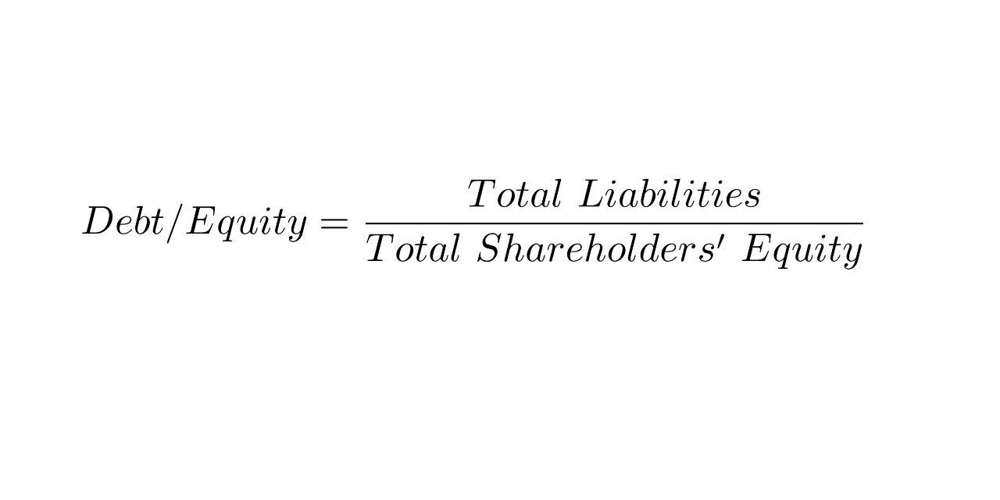

Understanding different financial metrics is fundamental for investors aiming to make well-informed investment decisions. Among these metrics, the Bond Equity Earnings Yield (BEER) ratio serves as an important tool for assessing the relationship between bond yields and stock market earnings yields. The BEER ratio allows investors to systematically evaluate whether to favor stocks or bonds based on comparative yields. 

In the context of the increasing prevalence of algorithmic trading, the BEER ratio has emerged as a crucial component for designing automatic investment strategies. Algorithms utilizing the BEER ratio can execute trades that capitalize on perceived market inefficiencies, thereby optimizing portfolio returns. 



This article offers a comprehensive analysis of the BEER ratio, exploring its calculation method and applications in financial analysis. The BEER ratio is particularly useful in assessing the comparative yields from government bonds and equities, helping investors discern market valuations and spot potential investment opportunities.

## Table of Contents

## What is the Bond Equity Earnings Yield (BEER) Ratio?

The Bond Equity Earnings Yield (BEER) Ratio is a financial metric used by investors to assess the relative valuation of stocks and bonds. It compares the yield of bonds with the earnings yield of stocks or stock indices, providing a quantitative measure to evaluate if the stock market is undervalued or overvalued compared to bond yields.

The calculation of the BEER ratio is straightforward and can be expressed using the formula:

$$
\text{BEER} = \frac{\text{Bond Yield}}{\text{Earnings Yield}}
$$

Where:
- **Bond Yield** is the return an investor expects to earn from holding a bond until maturity, usually expressed as a percentage.
- **Earnings Yield** is the inverse of the price-to-earnings (P/E) ratio, calculated as earnings per share divided by the stock price, also expressed as a percentage.

The BEER ratio provides investors with insights into market conditions by highlighting the yield differential between safer, fixed-income investments, such as government bonds, and more volatile equity investments. A BEER ratio greater than 1 suggests that stocks may be overvalued relative to bonds, indicating that bond yields offer a higher return for the given level of risk. Conversely, a ratio less than 1 points to the potential undervaluation of stocks, implying that equities could provide better returns compared to bond yields.

The BEER ratio is particularly useful in environments where investors need to make informed decisions based on current yield comparisons between different asset classes.

## Understanding the BEER Ratio

The Bond Equity Earnings Yield (BEER) ratio is a financial metric that offers insights by comparing the earnings yield of stocks or a stock index to the yield on government bonds. This ratio is instrumental in providing a perspective on current market conditions. At the core, the BEER ratio helps investors consider the potential return on equity investments versus more secure government bonds.

Earnings yield is a crucial component in this framework. It is calculated as the inverse of the price-to-earnings (P/E) ratio and is expressed as a percentage. The formula for earnings yield is:

$$
\text{Earnings Yield} = \frac{\text{Earnings Per Share (EPS)}}{\text{Market Price Per Share}} \times 100
$$

This metric indicates the percentage of earnings generated from each dollar invested in a company or market. By comparing the earnings yield of equities to the yield on government bonds, an investor can assess whether investments in the stock market could potentially offer better returns than the relatively safer option of investing in government securities.

The rationale behind the BEER ratio is tied to the relative valuation of equities and bonds. A higher earnings yield—which is an indicator of lower stock price to earnings—often suggests undervaluation, signaling that equities might offer more attractive returns compared to bonds. Conversely, a higher bond yield compared to the earnings yield of equities may suggest that stocks are overvalued, as the secure and predictable returns of bonds could be more appealing under such conditions.

In practical terms, the BEER ratio is calculated as follows:

$$
\text{BEER Ratio} = \frac{\text{Bond Yield}}{\text{Earnings Yield}}
$$

A BEER ratio greater than 1 implies that equities are potentially overvalued relative to bonds, while a ratio less than 1 suggests potential undervaluation of equities. Thus, investors utilize the BEER ratio as part of a comprehensive financial analysis approach to determine when the equity market may offer a better return opportunity compared to bonds, or vice versa.

## Example of the BEER Ratio in Action

Consider a scenario where the 10-year Treasury bond yield is 2.8%, and the earnings yield for the S&P 500 is 4%. The Bond Equity Earnings Yield (BEER) ratio in this case is determined using the formula:

$$
\text{BEER} = \frac{\text{Bond Yield}}{\text{Earnings Yield}} = \frac{2.8\%}{4\%} = 0.7
$$

A BEER ratio of 0.7 suggests that the equity market is undervalued relative to bond yields. This means that equities are potentially offering more attractive returns compared to risk-free government bonds. Consequently, investors might perceive equities to be a more valuable investment option, leading to an increased inflow of capital into the stock market.

To explain further, when the BEER ratio is less than 1, it indicates that the earnings yield of equities is greater than the yield from government bonds. This disparity can attract investors to stocks, as they seek to maximize returns relative to risk levels acceptable to their investment strategies. As more capital is directed towards equities, it could lead to a rise in stock prices, balancing the yields between equities and bonds.

## BEER versus the Fed Model

The Fed Model is a well-known approach in financial analysis that shares similarities with the Bond Equity Earnings Yield (BEER) ratio, particularly in its focus on market valuation. Both metrics compare earnings yields to bond yields to assess the valuation of the equity market; however, there are notable differences in their application and insights.

The Fed Model specifically compares the earnings yield of the S&P 500 to the yield on 10-year U.S. Treasury bonds. The central premise is that if the earnings yield on stocks surpasses the bond yield, stocks are considered undervalued, and vice versa. The formula used is:

$$
\text{Fed Model} = \frac{\text{Earnings Yield (S&P 500)}}{\text{10-year Treasury Yield}}
$$

This model provides a snapshot of whether equities might offer better returns compared to bonds, serving as a tool to gauge the attractiveness of the stock market.

Despite its popularity, the Fed Model's reliability has faced criticism, particularly after the financial crisis of 2008. Critics argue that the model may oversimplify complex market dynamics, failing to incorporate factors like changing economic conditions, inflation expectations, and risk premia. Furthermore, the Fed Model assumes a linear relationship between stock and bond markets, which may not hold due to varying risk profiles and market factors.

In comparison, the BEER ratio also evaluates whether the stock market is overvalued or undervalued relative to bond yields but does not limit its scope solely to the S&P 500 or the 10-year Treasury bonds. It can be applied more broadly across different stock indices and bond maturities, offering a versatile tool for investors.

Both the Fed Model and the BEER ratio highlight the interplay between stock and bond yields, yet investors should be cautious in relying solely on these metrics. They are best used as part of a comprehensive analysis, considering a wide range of economic indicators to make informed investment decisions.

## Limitations of the BEER Ratio

The BEER ratio, while a valuable tool for comparing bond and equity yields, has notable limitations that affect its reliability and application in financial analysis. One primary concern is the lack of predictive value. Historical studies have questioned the BEER ratio's effectiveness in forecasting market direction. This limitation arises because the ratio merely reflects the relative attractiveness of equities and bonds at a given point, without considering future market dynamics or economic changes.

Another critique focuses on the inherent differences between stocks and bonds, which challenges the appropriateness of directly correlating the two using the BEER ratio. Bonds and stocks serve different purposes in an investment portfolio. Bonds are debt instruments that come with a contractual obligation to repay the principal amount along with periodic interest payments. This guarantees a predictable income stream and repayment of the invested capital, thus presenting a lower risk profile. In contrast, stocks represent ownership in a company and do not promise any guarantees of income or return of capital. Their value is influenced by factors such as company performance, market conditions, and investor sentiment, introducing a higher risk element.

These fundamental differences in risk and income characteristics imply that comparing bonds and stocks using a single metric like the BEER ratio may not adequately capture the complexities of each investment type. This inadequacy suggests that solely relying on the BEER ratio for investment decisions could lead to misguided conclusions, particularly in volatile markets where the economic landscape changes rapidly.

Furthermore, the BEER ratio does not account for other critical factors influencing stock and bond markets, such as inflation rates, [interest rate](/wiki/interest-rate-trading-strategies) policies, and macroeconomic indicators. Therefore, while the BEER ratio can serve as a useful comparative measure, it should be employed alongside other analytical tools and indicators to provide a more comprehensive picture of market conditions.

## Role of BEER Ratio in Algorithmic Trading

The rise of [algorithmic trading](/wiki/algorithmic-trading) has integrated the Bond Equity Earnings Yield (BEER) ratio into automated trading strategies, allowing traders to make swift decisions based on real-time data. Algorithmic trading systems employ the BEER ratio to identify discrepancies between equity earnings yields and bond yields, enabling rapid decisions that exploit market inefficiencies.

These algorithms continuously calculate the BEER ratio as market data is updated, determining whether stocks or bonds present better value. For instance, when the BEER ratio is below 1, indicating that stocks might be undervalued compared to bonds, the algorithm might trigger a buy order for equities. Conversely, a BEER ratio above 1, suggesting potential overvaluation of stocks, could prompt the algorithm to sell equities in favor of bonds.

Incorporating BEER analysis into algorithmic strategies allows traders to capitalize on fleeting opportunities by systematically executing trades based on predefined criteria. The typical process involves real-time data collection, BEER ratio calculation, comparison against a benchmark, and automatic order execution.

Here's a simplified example using Python to illustrate how an algorithm might use the BEER ratio for trading decisions:

```python
# Import necessary libraries
import pandas as pd

# Define a function to calculate the BEER ratio
def calculate_beer_ratio(treasury_yield, earnings_yield):
    return treasury_yield / earnings_yield

# Example market data
market_data = {
    'Treasury_Yield': [2.5, 2.6, 2.8],  # Assume percentage form for yields
    'Earnings_Yield': [3, 4, 3.5]
}

# Convert market data to a DataFrame
df = pd.DataFrame(market_data)

# Calculate the BEER ratio
df['BEER_Ratio'] = df.apply(lambda row: calculate_beer_ratio(row['Treasury_Yield'], row['Earnings_Yield']), axis=1)

# Define a simple decision rule based on the BEER ratio
def trading_decision(beer_ratio):
    if beer_ratio < 1:
        return 'Buy Equities'
    elif beer_ratio > 1:
        return 'Sell Equities'
    else:
        return 'Hold'

# Apply trading decision to the DataFrame
df['Decision'] = df['BEER_Ratio'].apply(trading_decision)

# Output the DataFrame
print(df)
```

In this example, the algorithm calculates the BEER ratio for a set of market data and uses a simple rule to decide whether to buy or sell equities. The continuous processing and execution capability of algorithmic systems allow traders to take advantage of BEER ratio insights swiftly and consistently, adjusting portfolios dynamically to optimize returns.

## Conclusion

Understanding the Bond Equity Earnings Yield (BEER) ratio provides investors with vital information on market valuation and potential investment opportunities. As a metric, the BEER ratio evaluates the relative appeal of bonds versus equities by comparing their respective yields. This comparison enables investors to identify whether stocks are undervalued or overvalued in relation to bond yields, offering a strategic advantage in portfolio management.

Despite some noted limitations, such as its historical challenges in predicting market directions and the fundamentally different risk profiles of stocks and bonds, the BEER ratio remains a valuable tool. Its capacity to juxtapose earnings yields with bond yields facilitates a nuanced understanding of the market, which is crucial in times of fluctuating financial environments.

In today's era marked by the proliferation of automated trading systems, the BEER ratio can enhance investment strategies by providing real-time data analytics. Algorithms can incorporate BEER calculations to execute rapid buy or sell decisions, capitalizing on market inefficiencies and optimizing trading strategies. For instance, an algorithm might be set to buy equities when the BEER ratio suggests undervaluation, thus potentially securing higher returns.

Investors should integrate the BEER ratio alongside other analytical tools to form a comprehensive financial analysis framework. By doing so, they can make well-informed decisions that align with their investment goals, balancing between the returns and the associated risks of equities and bonds. This strategic integration can significantly optimize trading strategies, leading to better financial outcomes in both human and algorithm-driven investing contexts.

## References & Further Reading

[1]: Asness, C. S. (2003). ["Fight the Fed Model: The Relationship between Stock Market Yields, Bond Market Yields, and Future Returns"](https://papers.ssrn.com/sol3/papers.cfm?abstract_id=381480). The Journal of Portfolio Management, 30(1), 11-24.

[2]: Weinstein, B. (2013). ["The Bond-Stock Earnings Yield Gap."](https://academic.oup.com/rof/article-abstract/17/4/1489/1570701) Financial Analysts Journal, 69(6), 63-82.

[3]: ["Algorithmic Trading: Winning Strategies and Their Rationale"](https://www.amazon.com/Algorithmic-Trading-Winning-Strategies-Rationale-ebook/dp/B00CY5HC0U) by Ernie Chan.

[4]: Fabozzi, F. J. (2000). ["Bond Markets, Analysis, and Strategies"](https://books.google.com/books/about/Bond_Markets_Analysis_and_Strategies_ten.html?id=bQpNEAAAQBAJ). Prentice Hall.

[5]: ["Trading and Exchanges: Market Microstructure for Practitioners"](https://www.amazon.com/Trading-Exchanges-Market-Microstructure-Practitioners/dp/0195144708) by Larry Harris