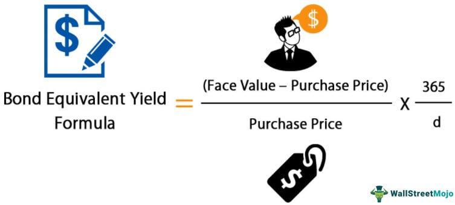

## Table of Contents

## What is Bond Equivalent Yield (BEY)?

Bond Equivalent Yield (BEY) is a way to figure out the annual yield of a bond that doesn't pay interest yearly. It helps compare bonds with different payment schedules by converting the yield into a yearly rate. Imagine you have a bond that pays interest every six months. To find the BEY, you double the semi-annual yield. This makes it easier to compare with bonds that pay interest once a year.

For example, if a bond pays 5% interest every six months, you would double that to get a BEY of 10%. This method is useful because it puts all bonds on the same footing, no matter how often they pay interest. It's commonly used by investors to make better decisions when choosing between different bonds.

## How is Bond Equivalent Yield calculated?

To calculate the Bond Equivalent Yield (BEY), you start with the bond's semi-annual yield. If a bond pays interest twice a year, you take the semi-annual yield and double it. For example, if a bond gives you 3% every six months, you would multiply that by 2 to get a BEY of 6%. This way, you can see what the bond would give you if it paid interest once a year.

The formula for BEY is pretty simple. It's BEY = (Semi-annual Yield) x 2. This calculation helps you compare different bonds easily. Whether a bond pays interest every month, every six months, or once a year, converting it to BEY lets you see which bond gives you a better yearly return.

## Why is Bond Equivalent Yield important for investors?

Bond Equivalent Yield (BEY) is important for investors because it helps them compare different bonds easily. Imagine you want to choose between two bonds, but one pays interest every month and the other pays every six months. BEY converts these different payment schedules into a yearly rate, so you can see which bond gives you a better return over a year. This makes it simpler to decide which bond is a better investment.

Using BEY also helps investors understand how much money they might make from a bond in a year. If a bond pays 2% every six months, the BEY would be 4%. Knowing this, investors can compare it with other investment options, like stocks or savings accounts, to see where their money could grow the most. This way, BEY helps investors make smarter choices about where to put their money.

## Can you explain the difference between Bond Equivalent Yield and Yield to Maturity?

Bond Equivalent Yield (BEY) and Yield to Maturity (YTM) are both ways to measure how much return you can expect from a bond, but they do it differently. BEY is a way to figure out the yearly return of a bond that pays interest more than once a year, like every six months. It takes the semi-annual yield and doubles it to give you an annual rate. This helps you compare bonds with different payment schedules on the same footing.

On the other hand, Yield to Maturity (YTM) looks at the total return you would get if you held the bond until it matures. It takes into account the bond's current market price, its face value, the interest payments you'll receive, and how long until the bond matures. YTM gives you a more complete picture of the bond's return over its entire life, not just the annual rate. While BEY is great for quick comparisons, YTM helps you understand the long-term value of holding onto the bond.

## How does Bond Equivalent Yield help in comparing different types of bonds?

Bond Equivalent Yield (BEY) helps in comparing different types of bonds by converting their yields into a yearly rate. Imagine you have one bond that pays interest every month and another that pays every six months. BEY takes the yield from these different payment schedules and turns them into an annual rate. This way, you can easily see which bond gives you a better return over a year. It's like putting all bonds on the same scale, so you can make a fair comparison.

This is really helpful for investors because bonds can have all sorts of ways to pay interest. Some might pay every three months, while others might pay once a year. By using BEY, you can look at the yearly return of each bond and decide which one is the best fit for your investment goals. It makes choosing between different bonds much simpler and helps you understand which one will give you more money at the end of the year.

## What are the limitations of using Bond Equivalent Yield?

Bond Equivalent Yield (BEY) is a useful tool, but it has some limitations. One big limitation is that BEY only looks at the yearly return based on the bond's interest payments. It doesn't take into account other important things like the bond's price changes or how long you plan to hold the bond. This means BEY might not give you the full picture of what you can expect to earn from the bond over time.

Another limitation is that BEY assumes you can reinvest the interest payments at the same rate. In real life, this might not happen. Interest rates can change, and you might not be able to find the same rate to reinvest your money. This can make the actual return you get different from what BEY predicts. So, while BEY is great for quick comparisons, it's important to look at other measures like Yield to Maturity to get a more complete understanding of a bond's potential return.

## How do you convert semi-annual yield to Bond Equivalent Yield?

Converting semi-annual yield to Bond Equivalent Yield (BEY) is pretty easy. If a bond pays interest every six months, you take the semi-annual yield and double it. For example, if a bond gives you 3% every six months, you would multiply that by 2 to get a BEY of 6%. This way, you can see what the bond would give you if it paid interest once a year.

This method helps you compare different bonds easily. Whether a bond pays interest every month, every six months, or once a year, converting it to BEY lets you see which bond gives you a better yearly return. It's like putting all bonds on the same scale, so you can make a fair comparison.

## In what scenarios would Bond Equivalent Yield be more useful than other yield measures?

Bond Equivalent Yield (BEY) is really useful when you want to compare bonds that pay interest at different times. Imagine you have one bond that pays interest every month and another that pays every six months. BEY takes these different payment schedules and turns them into a yearly rate. This way, you can see which bond gives you a better return over a year. It's like putting all bonds on the same scale, so you can make a fair comparison.

This method is especially handy for investors who want to quickly see which bond offers a better annual return without getting into the nitty-gritty details. If you just need a quick way to compare different bonds, BEY is perfect because it simplifies things. It's great for making fast investment decisions when you're looking at a bunch of bonds with different payment schedules.

## How does Bond Equivalent Yield apply to zero-coupon bonds?

Bond Equivalent Yield (BEY) can be used with zero-coupon bonds, even though these bonds don't pay interest regularly. Zero-coupon bonds are sold at a discount and pay their full face value when they mature. To find the BEY for a zero-coupon bond, you first figure out the bond's yield to maturity (YTM). The YTM is the total return you'd get if you held the bond until it matures. Once you have the YTM, you can convert it to a semi-annual yield by dividing it by 2, then double that number to get the BEY. This way, you can compare the zero-coupon bond's return to other bonds that pay interest more often.

Using BEY with zero-coupon bonds helps investors see what the yearly return would be if the bond paid interest twice a year, even though it doesn't. This makes it easier to compare zero-coupon bonds with other types of bonds. For example, if a zero-coupon bond's YTM is 6%, you would divide that by 2 to get a semi-annual yield of 3%, then double that to get a BEY of 6%. This way, you can see how the zero-coupon bond stacks up against a bond that pays 3% every six months.

## What role does Bond Equivalent Yield play in fixed income portfolio management?

Bond Equivalent Yield (BEY) is a helpful tool for people managing fixed income portfolios. It makes it easier to compare different bonds by turning their returns into a yearly rate. Imagine you have a bunch of bonds, some paying interest every month and others every six months. BEY helps you see which bond gives you a better return over a year, no matter how often they pay interest. This way, you can decide which bonds to buy or sell to make your portfolio better.

In fixed income portfolio management, BEY is really useful when you're making quick decisions. If you need to compare a lot of bonds fast, BEY gives you a simple way to do it. It doesn't tell you everything about a bond's return, but it's great for getting a quick idea of which bonds might be better for your portfolio. By using BEY, you can keep your fixed income investments on track and make smart choices about where to put your money.

## How can Bond Equivalent Yield be used to assess the risk of a bond?

Bond Equivalent Yield (BEY) can help you understand the risk of a bond by letting you compare its return to other bonds. If a bond has a high BEY, it might mean it's riskier. That's because investors often want a higher return for taking on more risk. By looking at the BEY, you can see if a bond's return is worth the risk compared to other bonds.

However, BEY doesn't tell you everything about a bond's risk. It's just one part of the puzzle. Other things like the bond's credit rating, how long until it matures, and what's happening in the market can also affect its risk. So, while BEY can give you a quick way to compare bonds, you should look at other factors too to get a full picture of the risk involved.

## What advanced techniques can be used to adjust Bond Equivalent Yield for inflation or currency risk?

To adjust Bond Equivalent Yield (BEY) for inflation, you can use the real yield, which takes inflation into account. You find the real yield by subtracting the expected inflation rate from the BEY. For example, if a bond's BEY is 5% and you expect inflation to be 2%, the real yield would be 3%. This helps you understand how much money you'll really make after inflation. By using real yield, you can compare bonds more accurately, considering that inflation can eat away at your returns.

For currency risk, you can use the concept of currency-adjusted yield. If you're investing in a bond from another country, changes in the exchange rate can affect your returns. To adjust for this, you add or subtract the expected change in the exchange rate to the BEY. For instance, if a foreign bond's BEY is 4% and you expect the currency to weaken by 1%, the currency-adjusted yield would be 3%. This way, you get a better idea of what you might earn when you convert the money back to your own currency. Adjusting BEY for inflation and currency risk helps you make smarter investment choices by considering more factors that can affect your returns.

## What is Bond Equivalent Yield (BEY) and how is it understood?

The Bond Equivalent Yield (BEY) is a financial metric essential for evaluating and comparing the performance of different bonds. It is particularly useful for investors because it standardizes the yield presentation across bonds with varying payment schedules. This standardization is crucial when assessing bonds with different coupon frequencies or zero-coupon structures, where no periodic interest payments occur. 

BEY is primarily applied to zero-coupon bonds or bonds with non-annual interest payments to present a uniform annual yield figure. This standardization allows investors to compare any bond's yield irrespective of its payment schedule, granting an apples-to-apples comparison across the investment landscape. The BEY calculates the annual yield by converting the bond's yield to an annual basis. 

The formula for calculating BEY ensures that investors can evaluate the annualized return by considering both the bond's purchase price and face value. The formula is as follows:

$$
\text{BEY} = \left( \frac{\text{Face Value} - \text{Purchase Price}}{\text{Purchase Price}} \right) \times \left( \frac{365}{\text{Days to Maturity}} \right)
$$

This formula effectively annualizes the yield by accounting for the bond's return over its actual holding period. This conversion permits straightforward comparison regardless of the bond's original frequency of payments, whether annual, semi-annual, or otherwise.

Understanding and employing BEY is integral for investors who aim to construct diversified and profitable portfolios, as it allows for consistent yield evaluations across the spectrum of fixed-income securities.

## How is the Bond Equivalent Yield Calculated?

The Bond Equivalent Yield (BEY) is calculated using the formula:

$$
\text{BEY} = \left( \frac{\text{Face Value} - \text{Purchase Price}}{\text{Purchase Price}} \right) \times \left( \frac{365}{\text{Days to Maturity}} \right)
$$

This formula is essential for investors as it provides an annualized yield measure, equipping them with a precise comparison tool across bonds that have varied maturities and payment structures. The bond equivalent yield helps in determining the return on investment on an annual basis, making it a key metric in investment decision-making.

The process of calculating BEY can be made more manageable through the use of various financial software applications and spreadsheet tools like Microsoft Excel or Google Sheets. These platforms allow for automatic computation and reduce the potential for human error, thus simplifying the task even for individuals who may not possess advanced expertise in financial calculations. Here's an example of how one might perform this calculation using Python:

```python
def calculate_bey(face_value, purchase_price, days_to_maturity):
    bey = ((face_value - purchase_price) / purchase_price) * (365 / days_to_maturity)
    return bey

# Example usage:
face_value = 1000  # The bond's face value
purchase_price = 950  # The price at which the bond was purchased
days_to_maturity = 180  # Days remaining until maturity

bey = calculate_bey(face_value, purchase_price, days_to_maturity)
print(f"The Bond Equivalent Yield is: {bey:.2f}%")
```

This script calculates the BEY with given parameters for face value, purchase price, and days to maturity, demonstrating how easily financial tools can be employed to perform necessary calculations.

## References & Further Reading

Investopedia: Bond Equivalent Yield - This resource provides a comprehensive overview of the Bond Equivalent Yield (BEY), detailing its significance, calculation methods, and applications. It is an essential reference for investors aiming to understand the intricacies of yield calculations and their impact on investment decisions.

Algorithmic Trading Resources and Libraries - A collection of resources and libraries that offer insights into [algorithmic trading](/wiki/algorithmic-trading) strategies, tools, and programming frameworks. These materials are invaluable for those looking to enhance their knowledge of algorithm automation and implementation in financial markets.

Wall Street Mojo: Bond Equivalent Yield Examples and Calculations - This reference offers practical examples and step-by-step calculations of BEY. It is particularly useful for those seeking to comprehend the application of BEY in real-world scenarios, providing clarity through detailed examples and case studies.

