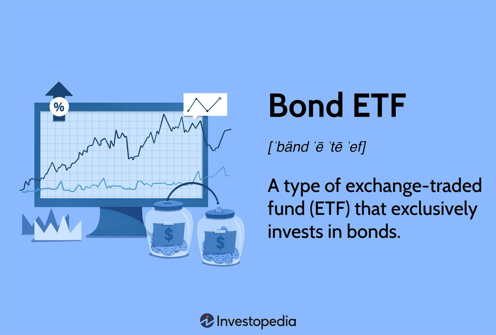

## Table of Contents

## What are Bond ETFs?

Bond ETFs, or Exchange-Traded Funds, are a type of investment that lets you buy a collection of bonds all at once. Instead of picking individual bonds, you can buy shares in a Bond ETF, which holds many different bonds inside it. This makes it easier and more affordable for people to invest in bonds, because you don't need a lot of money to start, and you can buy or sell shares anytime the stock market is open.

These ETFs can focus on different types of bonds, like government bonds, corporate bonds, or municipal bonds. This means you can choose a Bond ETF that matches your investment goals and how much risk you're willing to take. Bond ETFs also offer a way to get regular income, because the bonds inside the ETF pay interest, which is then passed on to the ETF shareholders. This can be a good option if you want a steady income from your investments.

## What are the different types of Bond ETFs?

Bond ETFs come in different types, depending on the kinds of bonds they hold. There are government bond ETFs that invest in bonds issued by governments, like U.S. Treasury bonds. These are seen as very safe because the government backs them. Then, there are corporate bond ETFs that hold bonds from companies. These can be riskier but might offer higher returns. Municipal bond ETFs focus on bonds issued by local governments or cities, and they can be good for people looking for tax benefits because the interest from these bonds is often tax-free.

Another type is the high-yield bond [ETF](/wiki/etf-trading-strategies), which invests in bonds that have a lower credit rating and therefore offer higher interest rates to attract investors. These are riskier but can provide bigger returns. There are also international bond ETFs that invest in bonds from other countries, which can help spread out risk but also come with currency risk. Lastly, there are inflation-protected bond ETFs, like TIPS (Treasury Inflation-Protected Securities) ETFs, which adjust their value based on inflation rates to protect investors' purchasing power. Each type of Bond ETF has its own level of risk and potential reward, so it's important to pick one that fits your investment goals and how much risk you're comfortable with.

## Can you provide examples of popular Bond ETFs?

Some popular Bond ETFs are the iShares Core U.S. Aggregate Bond ETF (AGG) and the Vanguard Total Bond Market ETF (BND). AGG tries to match the performance of the Bloomberg U.S. Aggregate Bond Index, which has a mix of government, corporate, and mortgage-backed securities. It's a good choice if you want a broad and safe way to invest in bonds. BND, on the other hand, aims to track the performance of the Bloomberg U.S. Aggregate Float Adjusted Index. This ETF is also very diverse, covering many types of bonds, and it's known for its low costs, making it a favorite among investors looking to keep their fees down.

Another well-known Bond ETF is the iShares TIPS Bond ETF (TIP), which focuses on Treasury Inflation-Protected Securities. These bonds help protect your money from inflation, so TIP is a good pick if you're worried about rising prices. For those interested in corporate bonds, the iShares iBoxx $ Investment Grade Corporate Bond ETF (LQD) is a popular choice. It invests in high-quality corporate bonds and can offer a bit more return than government bonds, though with a bit more risk. Each of these ETFs has its own focus and risk level, so you can choose the one that fits your investment goals best.

## How do Bond ETFs work?

Bond ETFs work by pooling money from many investors to buy a collection of bonds. When you buy shares in a Bond ETF, you're not buying individual bonds directly. Instead, you're buying a piece of the entire basket of bonds that the ETF holds. This makes it easier and cheaper for you to invest in bonds because you don't need a lot of money to start, and you can buy or sell shares anytime the stock market is open. The price of the Bond ETF shares goes up and down based on the value of the bonds inside the ETF.

The bonds in the ETF pay interest, and this interest is passed on to the ETF shareholders. This means you can get regular income from your investment in a Bond ETF. The type of bonds the ETF holds can vary, like government bonds, corporate bonds, or municipal bonds, so you can pick a Bond ETF that matches what you want to achieve with your investment and how much risk you're willing to take. Bond ETFs are a good way to spread out your risk because they hold many different bonds, which can help protect your money if one bond doesn't do well.

## What are the benefits of investing in Bond ETFs?

Investing in Bond ETFs has several benefits. One big advantage is that they are easy to buy and sell. You can trade them on the stock market anytime it's open, which is much simpler than buying and selling individual bonds. Bond ETFs also let you spread your risk. Instead of putting all your money into one bond, you're investing in a whole bunch of bonds at once. This can help protect your money if one bond doesn't do well.

Another benefit is that Bond ETFs can give you regular income. The bonds inside the ETF pay interest, and this interest gets passed on to you as the ETF shareholder. This can be a good way to get steady money from your investments. Plus, Bond ETFs often have lower costs than buying individual bonds. You don't need a lot of money to start, and the fees are usually lower, which means more of your money stays in your pocket.

## What are the risks associated with Bond ETFs?

Investing in Bond ETFs comes with some risks. One risk is [interest rate](/wiki/interest-rate-trading-strategies) risk. When interest rates go up, the value of the bonds inside the ETF can go down. This means the price of the Bond ETF might drop too. Another risk is credit risk. This happens if the bonds in the ETF are from companies or governments that might have trouble paying back their debts. If they can't pay, the value of the Bond ETF could fall.

There's also the risk of market risk. The overall stock market can affect Bond ETFs, and if the market goes down, the ETF might go down too. Liquidity risk is another concern. Sometimes, it might be hard to sell your Bond ETF shares quickly without losing money, especially if the market is not doing well. Lastly, while Bond ETFs can give you regular income, they might not grow as much as stocks over time, which means you might miss out on bigger gains if you put all your money in Bond ETFs.

## How do Bond ETFs compare to individual bonds?

Bond ETFs and individual bonds are two ways to invest in bonds, but they work a bit differently. When you buy an individual bond, you're lending money to a specific company or government, and they promise to pay you back with interest over time. With a Bond ETF, you're buying a share in a fund that holds many different bonds. This means you don't have to pick and manage each bond yourself, which can be easier and less time-consuming.

Bond ETFs also have some advantages over individual bonds. They are easier to buy and sell because you can trade them on the stock market anytime it's open. Plus, they let you spread your risk across many bonds, which can be safer than putting all your money into one bond. On the other hand, individual bonds give you more control over exactly which bonds you own and when they mature. But they can be more expensive to buy and harder to sell quickly. So, it depends on what you're looking for in an investment.

## What are some common investment strategies for Bond ETFs?

One common strategy for Bond ETFs is to use them to balance out risk in your investment portfolio. Since Bond ETFs often go up when the stock market goes down, they can help protect your money if the market takes a dip. This is called diversification. By putting some of your money into Bond ETFs, you spread out your risk, so if your stocks don't do well, your Bond ETFs might still be doing okay. This can make your overall investment safer and more stable.

Another strategy is to use Bond ETFs for regular income. Many people, especially those who are retired or close to retirement, like Bond ETFs because they pay out interest regularly. This can be a good way to get steady money from your investments. You can choose Bond ETFs that focus on different types of bonds, like government or corporate bonds, depending on how much risk you want to take and how much income you need. This way, you can get income without having to sell your investments.

A third strategy is to use Bond ETFs to take advantage of changes in interest rates. If you think interest rates are going to go down, you might want to buy Bond ETFs because their value usually goes up when rates fall. On the other hand, if you think rates are going to go up, you might want to sell your Bond ETFs or choose ones that are less affected by interest rate changes, like short-term bond ETFs. This can help you make money from interest rate movements, but it's a bit riskier and needs more attention to what's happening in the economy.

## How can Bond ETFs be used for diversification in a portfolio?

Bond ETFs can help you spread out your risk in your investment portfolio. When you put some of your money into Bond ETFs, you're not putting all your eggs in one basket. Instead of just investing in stocks, which can go up and down a lot, you're also investing in bonds. Bond ETFs hold many different bonds, so if one bond doesn't do well, the others might still be okay. This can make your overall investment safer because if the stock market goes down, your Bond ETFs might help balance things out.

Using Bond ETFs for diversification is especially helpful if you want to protect your money from big swings in the market. By mixing stocks and Bond ETFs, you can create a more stable portfolio. For example, if you have a lot of money in tech stocks and they suddenly drop, your Bond ETFs might not drop as much, or they might even go up. This can help keep your investments steady over time, making it easier to reach your financial goals without as much worry about big losses.

## What should be considered when choosing a Bond ETF?

When choosing a Bond ETF, think about what kind of bonds you want to invest in. Bond ETFs can hold different types of bonds, like government bonds, corporate bonds, or municipal bonds. Government bonds are usually safer because they're backed by the government, but they might not give you as much money back. Corporate bonds can be riskier but might offer higher returns. Municipal bonds can be good if you want to save on taxes because their interest is often tax-free. Decide what level of risk you're okay with and what your investment goals are.

Also, look at the costs of the Bond ETF. Some ETFs charge more fees than others, and these fees can eat into your returns over time. It's a good idea to pick an ETF with low costs so more of your money stays in your pocket. Another thing to consider is how the Bond ETF has done in the past. While past performance doesn't guarantee future results, it can give you an idea of how the ETF might do. Lastly, think about how easy it is to buy and sell the ETF. Some ETFs are more popular and easier to trade, which can be important if you need to sell your shares quickly.

## How do interest rate changes affect Bond ETFs?

When interest rates go up, the value of Bond ETFs usually goes down. This happens because new bonds that are issued will have higher interest rates, making the older bonds in the ETF less attractive. People will want to buy the new bonds that pay more interest, so the price of the older bonds, and the Bond ETF that holds them, drops. This is called interest rate risk. If you own a Bond ETF and interest rates go up, the value of your investment might go down.

On the other hand, when interest rates go down, the value of Bond ETFs usually goes up. This is because the older bonds in the ETF now pay more interest than the new bonds being issued. People will want to buy the older bonds that pay more, which makes their price go up, and the Bond ETF that holds them goes up too. So, if you think interest rates are going to go down, buying a Bond ETF might be a good move. But remember, trying to guess what interest rates will do can be tricky and risky.

## What advanced strategies can be employed with Bond ETFs for expert investors?

Expert investors can use Bond ETFs to do something called laddering. This means they buy Bond ETFs that focus on bonds with different times until they pay back, like short-term, medium-term, and long-term bonds. By doing this, they can get regular income and also spread out the risk of interest rate changes. If interest rates go up, the short-term bonds will mature soon, and they can reinvest the money into new bonds with higher rates. If rates go down, the long-term bonds will still be paying a higher rate than new bonds. This strategy helps keep their investments stable and can give them more control over their income.

Another advanced strategy is using Bond ETFs to bet on interest rate movements. This is called duration hedging. If an expert investor thinks interest rates are going to go up, they might sell their Bond ETFs or buy ones with shorter durations, which are less affected by interest rate changes. If they think rates are going to go down, they might buy Bond ETFs with longer durations to get more benefit from the falling rates. This can be a bit risky because guessing interest rates can be hard, but it can also help them make money if they guess right.

## What are Frequently Asked Questions?

### What are the risks associated with bond ETFs?

Bond ETFs, while providing diversification and [liquidity](/wiki/liquidity-risk-premium) benefits, are not devoid of risks. Some of the primary risks include interest rate risk, credit risk, and liquidity risk. 

**Interest Rate Risk**: As interest rates rise, the value of existing bonds typically falls, leading to a potential decrease in the net asset value of bond ETFs. This effect is particularly pronounced in long-duration bond ETFs which are more sensitive to rate changes.

**Credit Risk**: This risk pertains to the possibility of bond issuers defaulting on their payments. Corporate bond ETFs, especially those focusing on high-yield bonds, carry a higher credit risk compared to Treasury bond ETFs.

**Liquidity Risk**: While bond ETFs typically offer higher liquidity compared to individual bonds, there can be periods, especially during market stress, when liquidity diminishes. This can result in wider bid-ask spreads and potential difficulties in executing trades at desired prices.

### How can I choose the right type of ETF for my portfolio?

Selecting the appropriate ETF depends on various factors including investment goals, risk tolerance, investment horizon, and market outlook. Investors should consider the following:

- **Objective Alignment**: Ensure the ETF aligns with your investment goals, whether it’s income generation, capital appreciation, or diversification.
- **Risk Tolerance**: Assess the risk associated with the ETF, looking at factors like volatility, asset class, and historical performance.
- **Cost Consideration**: Evaluate the fees associated with the ETF, including the expense ratio and any brokerage fees, and weigh them against the expected returns.
- **Market Conditions**: Consider the current and projected market conditions. For instance, in a rising interest rate environment, short-duration bond ETFs might be more suitable.

### What is the impact of interest rates on bond ETFs?

Interest rates have a significant impact on bond ETFs, largely due to the inverse relationship between interest rates and bond prices. As interest rates increase, the prices of existing bonds generally decline, which can lead to a decrease in the market value of bond ETFs. Conversely, when interest rates fall, bond prices tend to rise, benefiting bond ETFs.

The sensitivity of bond ETFs to interest rate changes can be measured by their duration; ETFs with longer durations are more affected by rate movements. For example, the value of a 10-year duration ETF might drop by approximately 10% in response to a 1% rise in interest rates.

$$
\text{Price Change (%) } \approx -\text{Duration} \times \Delta \text{Interest Rate}
$$

### What are the basic requirements for algorithmic trading?

Establishing an [algorithmic trading](/wiki/algorithmic-trading) strategy requires a combination of technical infrastructure, market access, and strategy development. The basic requirements include:

- **Technical Infrastructure**: A robust trading platform that can handle large data volumes and execute trades swiftly is critical. This includes both hardware and software capabilities.
- **Data Access**: Reliable and real-time data feeds for assets being traded, including historical data for backtesting strategies, are essential.
- **Programming Skills**: Proficiency in programming languages such as Python or C++ is necessary to develop, test, and modify trading algorithms.
- **Risk Management**: The strategy should include risk management protocols to mitigate losses, including stop-loss limits and capital allocation rules.
- **Regulatory Compliance**: Ensure adherence to trading regulations and the requirements set by financial authorities in the jurisdictions where trading occurs.

## References & Further Reading

[1]: Jacobs, B. I., & Levy, K. N. (2012). ["Quantitative Equity Portfolio Management: An Active Approach to Portfolio Construction and Management."](https://hook.schlowlibrary.org/textbooks/virtual-library/index_htm_files/Quantitative_Equity_Portfolio_Management_An_Active_Approach_To_Portfolio_Construction_And_Management_Mcgraw_Hill_Library_Of_Investment_And_Finance.pdf) McGraw-Hill Education.

[2]: BlackRock. (2020). ["Bond ETFs: Benefits and Strategies."](https://www.blackrock.com/us/financial-professionals/investments/products/bond-etfs) BlackRock.

[3]: Fabozzi, F. J. (2007). ["Fixed Income Analysis."](https://www.amazon.com/Fixed-Income-Analysis-Frank-Fabozzi/dp/047005221X) CFA Institute Investment Series.

[4]: Narang, R. K. (2009). ["Inside the Black Box: The Simple Truth About Quantitative Trading."](https://onlinelibrary.wiley.com/doi/book/10.1002/9781118267738) Wiley.

[5]: Hasbrouck, J. (2007). ["Empirical Market Microstructure: The Institutions, Economics, and Econometrics of Securities Trading."](https://academic.oup.com/book/52241) Oxford University Press. 

[6]: Malkiel, B. G. (2019). ["A Random Walk Down Wall Street: The Time-Tested Strategy for Successful Investing."](https://www.amazon.com/Random-Walk-Down-Wall-Street/dp/0393330338) W. W. Norton & Company.

[7]: De Prado, M. L. (2018). ["Advances in Financial Machine Learning."](https://www.amazon.com/Advances-Financial-Machine-Learning-Marcos/dp/1119482089) Wiley. 

[8]: Poterba, J. M., & Shoven, J. B. (1991). ["Asset Location for Retirement Savers."](https://papers.ssrn.com/sol3/papers.cfm?abstract_id=248597) National Bureau of Economic Research.