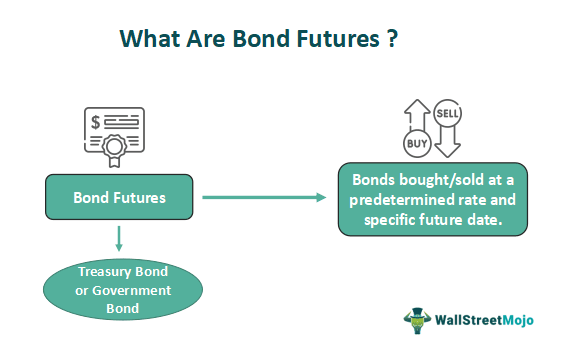

## Table of Contents

## What are bond futures?

Bond futures are contracts that let people buy or sell bonds at a set price on a future date. They are used by investors to guess about where interest rates are going and to manage the risk of their bond investments. Just like other futures, bond futures are traded on special markets called futures exchanges.

When someone buys a bond future, they agree to buy the bond later at the price set in the contract. If interest rates go up after the contract is made, the value of the bond future might go down because new bonds would pay more interest. But if interest rates go down, the bond future's value could go up because the bond it represents would be worth more than newer bonds. This way, bond futures help investors protect themselves from changes in interest rates or try to make money from those changes.

## How do bond futures work?

Bond futures are agreements to buy or sell bonds at a specific price on a future date. They are traded on futures exchanges, which are special markets for these kinds of contracts. When someone buys a bond future, they are locking in the price they will pay for the bond later. This can be useful if they think the price of the bond will go up before the future date arrives. On the other hand, if someone sells a bond future, they agree to deliver the bond at the set price, which can be good if they believe the bond's price will drop.

The value of bond futures moves in the opposite direction of interest rates. If interest rates go up, the price of existing bonds goes down because new bonds would offer higher interest. This makes the bond future less valuable since it represents an older bond with a lower interest rate. Conversely, if interest rates fall, the price of the bond future rises because the bond it represents now offers a better interest rate than new bonds. Investors use bond futures to protect themselves from interest rate changes or to bet on where they think rates are headed.

## What is the purpose of trading bond futures?

Trading bond futures helps people manage the risk that comes with changes in interest rates. When someone owns bonds, they can lose money if interest rates go up because new bonds will pay more interest. By trading bond futures, they can protect themselves. For example, if they think interest rates will go up, they can sell bond futures. If rates do go up, the value of the futures they sold will go down, but they can buy them back cheaper, making money to offset the loss on their bonds.

Bond futures also let people guess about where interest rates are going. If someone thinks rates will go down, they might buy bond futures. If rates do fall, the value of the bond futures will go up, and they can sell them for a profit. This way, bond futures are not just for protection; they're also a way to try to make money from guessing about interest rates.

## Who are the typical participants in the bond futures market?

The bond futures market has different types of people and groups that take part. One group is made up of big investors like banks, insurance companies, and pension funds. These groups use bond futures to manage the risk that comes from changes in interest rates. They might own a lot of bonds, and if interest rates go up, the value of their bonds goes down. By trading bond futures, they can protect themselves from losing money.

Another group includes hedge funds and individual traders. These people often use bond futures to try to make money by guessing about where interest rates are going. If they think rates will go down, they might buy bond futures. If they're right and rates do fall, the value of the bond futures goes up, and they can sell them for a profit. This kind of trading is more about trying to make money than protecting against risk.

## What are the different types of bond futures?

There are different kinds of bond futures, and they are based on the type of bond they represent. One common type is Treasury bond futures, which are based on U.S. government bonds. These are popular because they are seen as very safe. Another type is Treasury note futures, which are based on shorter-term U.S. government bonds. These are also widely traded because they help people manage the risk of changes in interest rates.

There are also futures based on other types of bonds, like municipal bond futures, which are based on bonds issued by local governments. These can be used to manage the risk of investing in local government bonds. Another type is corporate bond futures, which are based on bonds issued by companies. These are less common but can be useful for investors who want to protect themselves from changes in the value of their corporate bond investments.

In addition to these, there are also futures based on international bonds, like Eurobond futures, which are based on bonds issued in Europe. These can help investors manage the risk of investing in foreign bonds. Each type of bond future has its own characteristics and is used by different kinds of investors to manage different kinds of risks.

## How are bond futures priced?

Bond futures are priced based on the value of the underlying bond they represent. This value changes with interest rates. If interest rates go up, the price of the bond goes down because new bonds will offer higher interest. This makes the bond future less valuable because it represents an older bond with a lower interest rate. On the other hand, if interest rates go down, the price of the bond goes up, making the bond future more valuable because the bond it represents now offers a better interest rate than new bonds.

The price of a bond future also depends on things like the time until the future expires and how much the bond is expected to pay in interest. If the future is going to expire soon, its price might be more affected by changes in interest rates. Also, if the bond is expected to pay a lot of interest, the future might be more valuable. Traders look at all these things to figure out what a bond future should be worth and trade it at that price.

## What are the risks associated with trading bond futures?

Trading bond futures can be risky because the value of the futures can change a lot with interest rates. If interest rates go up, the price of the bond future goes down. This means that if you bought a bond future and interest rates go up, you could lose money. On the other hand, if interest rates go down, the price of the bond future goes up, and you could make money. But guessing wrong about where interest rates are going can lead to big losses.

Another risk is something called leverage. When you trade bond futures, you don't have to pay the full price of the bond right away. You only put down a small amount of money, called margin. This can make your gains bigger if you guess right about interest rates. But it can also make your losses bigger if you guess wrong. So, even a small change in the price of the bond future can lead to big losses if you're not careful.

Lastly, there's the risk of not being able to sell your bond future when you want to. This is called [liquidity](/wiki/liquidity-risk-premium) risk. If not many people are trading bond futures, it can be hard to find someone to buy yours. This can be a problem if you need to get out of your position quickly. So, it's important to think about how easy it will be to sell your bond future before you start trading.

## How can one start trading bond futures?

To start trading bond futures, you need to open an account with a brokerage firm that lets you trade futures. You can do this online or by talking to someone at the firm. Once your account is set up, you'll need to put some money into it. This money is called margin, and it's like a deposit that you use to trade futures. The amount of margin you need depends on the specific bond future you want to trade and the rules of the futures exchange.

After you have your account and margin ready, you can start buying and selling bond futures. You do this through the brokerage firm's trading platform, which is usually a website or an app. You choose the bond future you want to trade, decide if you want to buy or sell, and set the price you're willing to pay or accept. It's important to keep an eye on interest rates and other news that might affect the price of the bond future. Remember, trading bond futures can be risky, so it's a good idea to learn as much as you can before you start.

## What are the key strategies for trading bond futures?

One key strategy for trading bond futures is called hedging. This means using bond futures to protect against the risk of losing money if interest rates change. If you own bonds and you think interest rates might go up, you can sell bond futures. If rates do go up, the value of your bonds will go down, but the value of the bond futures you sold will also go down. You can then buy back those futures at a lower price, making money to offset the loss on your bonds. This way, you're protecting yourself from losing too much money.

Another strategy is called speculating. This is when you try to make money by guessing where interest rates are going. If you think interest rates will go down, you can buy bond futures. If rates do fall, the value of the bond futures will go up, and you can sell them for a profit. But if you guess wrong and rates go up instead, you could lose money. So, speculating can be risky, but it can also lead to big gains if you get it right.

A third strategy is called spreading. This involves buying and selling different bond futures at the same time to take advantage of the price difference between them. For example, you might buy one bond future and sell another that's similar but has a different expiration date. If the price difference between the two futures changes in your favor, you can make money. Spreading can be less risky than speculating because you're not betting on the direction of interest rates, but it still requires a good understanding of how bond futures work.

## How do bond futures affect the broader financial markets?

Bond futures can have a big impact on the broader financial markets because they help set the price of bonds. When lots of people trade bond futures, it can move the price of the futures up or down. This change in the price of bond futures can then affect the price of the actual bonds they represent. If bond futures go up in price, it usually means that people think interest rates will go down, so the price of bonds goes up too. On the other hand, if bond futures go down in price, it means people think interest rates will go up, and the price of bonds goes down. This can affect all kinds of investments, not just bonds, because many investments are tied to interest rates.

Bond futures also help make the financial markets more stable. They give investors a way to protect themselves from changes in interest rates. When investors feel safer, they are more likely to keep investing, which helps keep the markets running smoothly. But bond futures can also make the markets more volatile if lots of people start guessing about where interest rates are going and trading based on those guesses. If everyone starts selling bond futures because they think interest rates will go up, it can lead to big drops in bond prices and cause problems in other parts of the financial markets. So, bond futures can both help and hurt the stability of the broader financial markets.

## What are the regulatory considerations for trading bond futures?

Trading bond futures is watched over by rules to keep things fair and safe. In the United States, the main group in charge is the Commodity Futures Trading Commission (CFTC). They make sure that futures markets follow the rules and that people trading futures don't do anything wrong. Another group, the National Futures Association (NFA), also helps by making sure that people and companies trading futures are honest and follow the rules. These groups set rules about how much money you need to trade futures, how to report your trades, and how to handle any problems that come up.

These rules are important because they help keep the bond futures market working well. They stop people from doing things like lying about the price of futures or trying to trick others. They also make sure that if you lose money trading futures, you can still get it back if something goes wrong. By following these rules, people trading bond futures can feel safer and more confident that the market is fair.

## How do macroeconomic factors influence bond futures?

Macroeconomic factors like inflation, interest rates, and economic growth can have a big effect on bond futures. When inflation goes up, people expect interest rates to go up too. This means the price of bond futures usually goes down because new bonds will pay more interest. On the other hand, if the economy is not doing well and interest rates are expected to go down, the price of bond futures can go up because the bonds they represent will be worth more than new bonds with lower interest rates.

Another important [factor](/wiki/factor-investing) is what the government and central banks do. If the government spends a lot of money or the central bank decides to raise interest rates, this can make bond futures go down in price. But if the central bank lowers interest rates to help the economy grow, bond futures might go up in price. People who trade bond futures watch these macroeconomic factors closely because they can change the value of their investments a lot.

## What is the Role of Bond Futures?

Bond futures are financial derivatives that involve an agreement to buy or sell a specific bond at a predetermined price on a set date in the future. These instruments play a crucial role in the financial markets by providing a mechanism to manage and hedge against [interest rate](/wiki/interest-rate-trading-strategies) risks. As interest rates fluctuate, the prices of bonds and, consequently, bond futures, exhibit significant [volatility](/wiki/volatility-trading-strategies). This volatility can be leveraged by investors both as a hedging tool and a speculative instrument.

The primary utility of bond futures lies in their ability to hedge against interest rate changes. For instance, an institutional investor holding a large portfolio of fixed-income securities may use bond futures to protect against potential declines in bond prices caused by rising interest rates. By taking an opposite position in bond futures to their portfolio positions, investors can offset potential losses, thereby stabilizing their portfolio's overall value.

Apart from hedging, bond futures are also utilized by investors looking to capitalize on anticipated future price movements of bonds. Speculators, for example, may predict a decrease in interest rates and, consequently, an increase in bond prices, leading them to go long in bond futures—essentially betting that the bond's price at contract expiry will be higher than the agreed price.

A comprehensive understanding of the mechanics and strategies related to bond futures is imperative for effective portfolio management. Key aspects include the maturity of the futures contract, the underlying bond characteristics, and the valuation and margin requirements. The pricing of bond futures is typically determined using the following formula:

$$
F = \frac{B \cdot (1 + r)^{t}}{(1 + c)^{t}}
$$

where $F$ is the futures price, $B$ is the price of the underlying bond, $r$ is the risk-free interest rate, $c$ is the coupon rate of the bond, and $t$ is the time to maturity of the futures contract.

Bond futures are predominantly used by institutional investors and sophisticated traders due to the complexity of the strategies and the scale of resources required for effective implementation. These participants benefit from the liquidity, transparency, and price discovery functions provided by the futures market, which facilitate efficient trading and risk management. As a versatile tool in the financial instruments landscape, bond futures continue to be integral to the strategies of market participants aiming to optimize returns and mitigate risk exposure in an ever-evolving economic environment.

## References & Further Reading

[1]: Burgess, R., & Host, P. (2013). ["Futures and Options Markets: An Introduction."](https://books.google.com/books/about/Futures_and_Options_Markets.html?id=UccQAAAAQBAJ) Pearson Education.

[2]: Hull, J. C. (2017). ["Options, Futures, and Other Derivatives."](https://www.semanticscholar.org/paper/Options%2C-Futures%2C-and-Other-Derivatives-Hull/89bdee500c8623864fc9eb7a471546aa713acc44) Pearson.

[3]: Chincarini, L., & Kim, D. (2006). ["Quantitative Equity Portfolio Management: An Active Approach to Portfolio Construction and Management."](https://archive.org/details/quantitativeequi0000chin) McGraw-Hill.

[4]: Lopez de Prado, M. (2018). ["Advances in Financial Machine Learning."](https://www.amazon.com/Advances-Financial-Machine-Learning-Marcos/dp/1119482089) Wiley.

[5]: Jarrow, R. A., & Turnbull, S. M. (1996). ["Derivatives Securities."](https://archive.org/details/derivativesecuri0000jarr_r8m0) South-Western College Pub.