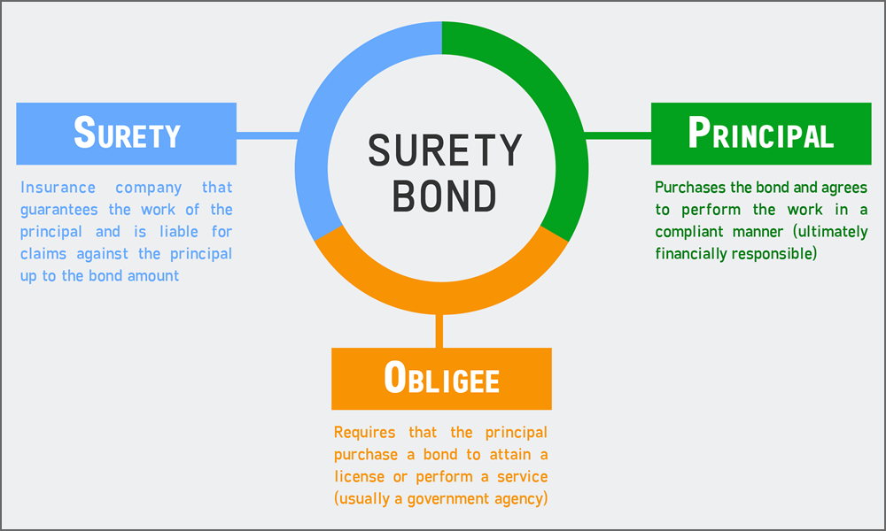

## Table of Contents

## What is bond insurance?

Bond insurance is a type of insurance that protects investors who buy bonds. When you buy a bond, you are lending money to the issuer, like a government or a company. Bond insurance makes sure that if the issuer can't pay back the money they owe, the insurance company will pay instead. This makes the bond safer for investors, and it can help the issuer get a lower interest rate on the bond because it's less risky.

Bond insurance is often used for municipal bonds, which are bonds issued by local governments to pay for things like schools or roads. By having insurance, these bonds can be more attractive to investors who might be worried about the financial health of the local government. The insurance company charges a fee for this protection, but it can be worth it if it helps the bond sell more easily and at a better rate.

## How does bond insurance work?

Bond insurance works by making sure that if the people who borrowed money by selling bonds can't pay it back, the insurance company will pay instead. When someone buys a bond, they are lending money to the issuer, like a city or a company. The issuer promises to pay back the money with interest over time. If the issuer runs into financial trouble and can't make the payments, the bond insurance steps in to cover the payments. This makes the bond safer for the person who bought it, because they know they will get their money back even if the issuer can't pay.

The insurance company charges a fee for this protection, which the issuer pays when they get the insurance. This fee is usually a small percentage of the total amount of the bond. By having insurance, the bond becomes less risky, which can help the issuer sell the bond more easily and at a lower interest rate. Investors feel more confident buying insured bonds because they know there's an extra layer of protection. This is especially important for municipal bonds, which are issued by local governments to fund projects like schools or roads.

## What types of bonds can be insured?

Bond insurance can cover many different types of bonds. The most common ones are municipal bonds, which are issued by cities, towns, or states to pay for things like schools, roads, and other public projects. These bonds are popular for insurance because they help local governments borrow money more easily and at a lower cost.

Besides municipal bonds, other types of bonds that can be insured include corporate bonds, which are issued by companies to raise money for their business needs. There are also revenue bonds, which are backed by the income from a specific project like a toll road or a hospital. Insuring these bonds makes them safer for investors, who are more likely to buy them knowing they have extra protection if the issuer can't pay back the money.

## Who are the main providers of bond insurance?

The main providers of bond insurance are called monoline insurers. These are companies that only offer insurance for bonds and nothing else. Some of the biggest monoline insurers are Assured Guaranty, Build America Mutual (BAM), and MBIA. These companies have been around for a long time and are well-known in the bond market.

Monoline insurers play a big role in making bonds safer for investors. When a city or company wants to sell bonds, they can go to a monoline insurer to get insurance. The insurer will charge a fee, but in return, they promise to pay back the bondholders if the city or company can't. This makes the bonds more attractive to people who want to invest their money safely.

## What are the benefits of bond insurance for investors?

Bond insurance gives investors a safety net. When you buy a bond, you are lending money to the issuer, like a city or a company. If the issuer can't pay you back, the insurance company will step in and pay instead. This means you are more likely to get your money back, even if things go wrong with the issuer. This extra protection can make you feel more confident about buying bonds, especially if you are worried about the financial health of the issuer.

Another benefit of bond insurance is that it can make bonds more attractive to buy. When a bond is insured, it is seen as less risky. This can lead to a higher demand for the bond, which might mean you can buy it at a better price or with a lower interest rate. For investors, this means you can potentially earn more money or pay less to get into the bond market. Overall, bond insurance helps make investing in bonds safer and more appealing.

## How does bond insurance affect bond ratings?

Bond insurance can help make a bond's rating better. When a bond is insured, it means that if the issuer can't pay back the money, the insurance company will. This makes the bond safer for investors. Rating agencies, like Moody's or Standard & Poor's, look at how safe a bond is when they give it a rating. If a bond has insurance, the rating agency might give it a higher rating because it's less risky.

A higher rating can make the bond more attractive to investors. When a bond has a good rating, more people want to buy it. This can help the issuer sell the bond more easily and maybe even at a lower interest rate. So, bond insurance not only makes the bond safer but can also help the issuer get better terms when they borrow money.

## What are the costs associated with bond insurance?

Bond insurance costs money. The issuer of the bond, like a city or a company, has to pay a fee to the insurance company. This fee is usually a small percentage of the total amount of the bond. For example, if a city wants to borrow $10 million by selling bonds, they might have to pay about 0.5% to 2% of that amount as an insurance fee. That means they could pay between $50,000 and $200,000 for the insurance.

Even though the insurance costs money, it can be worth it for the issuer. When a bond is insured, it becomes safer for investors. This can help the issuer sell the bond more easily and at a lower interest rate. So, while the insurance fee is an extra cost, it might save the issuer money in the long run by making the bond more attractive to buyers.

## Can bond insurance protect against all types of bond default risks?

Bond insurance can help protect against some types of bond default risks, but it can't cover everything. When a bond is insured, the insurance company promises to pay back the money if the issuer can't. This helps protect investors from the risk that the city or company borrowing the money runs into financial trouble and can't pay back the bond.

However, bond insurance doesn't cover all risks. For example, if there's a big economic crisis or if the insurance company itself goes bankrupt, the insurance might not be enough to fully protect investors. So, while bond insurance can make bonds safer, it's not a guarantee against every possible problem that could come up.

## What is the historical performance of insured bonds compared to uninsured bonds?

Historically, insured bonds have performed better than uninsured bonds in terms of safety and reliability. When a bond is insured, it means that if the issuer can't pay back the money, the insurance company will step in and pay instead. This makes insured bonds less risky for investors. During times of economic trouble, like the 2008 financial crisis, insured bonds were more likely to keep paying out on time, which helped investors feel more secure. This reliability can lead to higher demand for insured bonds, which can help issuers sell them more easily and at better rates.

However, insured bonds are not always better in every way. They can come with extra costs, like the insurance fee that the issuer has to pay. These costs can make the bond slightly more expensive for the issuer. Also, if the insurance company itself runs into financial trouble, the protection might not be as strong as expected. Over time, the performance of insured bonds compared to uninsured bonds can vary depending on the overall economic situation and the health of the insurance companies. But in general, insured bonds have provided a safer investment option for people looking to lend money through bonds.

## How has the bond insurance market evolved over the past decade?

Over the past decade, the bond insurance market has gone through big changes. After the 2008 financial crisis, many bond insurers got into trouble because they had promised to cover too many risky bonds. Some big insurers, like MBIA, had to split their businesses into different parts to handle the mess. Since then, the market has become smaller but more focused on safer bonds, like those from cities and towns. Newer companies like Build America Mutual (BAM) have started up, focusing just on insuring municipal bonds to help local governments borrow money more easily.

The bond insurance market has also become more careful. Insurers now look more closely at the bonds they agree to cover, making sure they are less likely to cause problems. This has helped rebuild trust with investors, who now see insured bonds as a safer place to put their money. Even though the market is smaller, it's still important for helping cities and towns get the money they need for things like schools and roads. Overall, the bond insurance market has learned from past mistakes and is now more focused on stability and safety.

## What are the regulatory considerations for bond insurance?

Bond insurance companies have to follow a lot of rules to make sure they can pay back investors if something goes wrong. In the United States, these rules come from groups like the National Association of Insurance Commissioners (NAIC) and state insurance departments. They check that the insurance companies have enough money to cover the bonds they insure. This helps keep the bond market safe and makes sure that investors can trust the insurance.

Over the years, the rules for bond insurance have changed to make the market even safer. After the 2008 financial crisis, new rules were put in place to stop insurers from taking on too much risk. Now, insurers have to be more careful about which bonds they agree to cover. These rules help make sure that bond insurance companies stay strong and can keep their promises to investors.

## What are the potential future developments in the bond insurance industry?

In the future, the bond insurance industry might see more technology being used. Companies could use new computer programs to check the risks of the bonds they want to insure. This could make the process faster and more accurate. Also, more bond insurance might happen online, making it easier for cities and companies to get insurance for their bonds.

Another big change could be how bond insurance companies work with other parts of the financial world. They might team up with banks and other investors to create new ways to make bonds safer. This could help more people feel confident about buying bonds, even if the economy is not doing well. Overall, the bond insurance industry could become more connected and use new tools to help everyone involved.

## What is the role of bond insurance in investment protection?

Bond insurance acts as a crucial stabilizing [factor](/wiki/factor-investing) in the often volatile financial markets, particularly for investors seeking to mitigate risks. By providing a financial guaranty, bond insurance ensures that bondholders receive timely payment of principal and interest, even if the issuer defaults. This operational setup not only guards against potential financial loss but also maintains stable returns, which is essential in turbulent economic periods.

For issuers, bond insurance serves as a valuable tool to secure lower interest rates. The presence of a guarantor lowers the perceived risk for investors, thus enabling issuers to access capital at reduced borrowing costs. This reduction in borrowing costs can be mathematically represented by considering the yield differential associated with insured versus uninsured bonds. Suppose $r_u$ is the yield of an uninsured bond and $r_i$ is the yield of an insured bond; the reduction in [interest rate](/wiki/interest-rate-trading-strategies) can be expressed as:

$$
\Delta r = r_u - r_i
$$

where $\Delta r$ represents the interest saving attributable to bond insurance. This reduced cost of capital makes bonds more appealing in the market, often leading to an increased issuance of insured bonds.

From the investor's perspective, bond insurance bolsters the creditworthiness of bonds through enhanced credit ratings. These higher credit ratings considerably lower the default risk, allowing investors to commit to longer-term investments with greater assurance. The enhanced credit rating is generally accompanied by improved bond [liquidity](/wiki/liquidity-risk-premium) and marketability, making it a preferred choice for institutional investors seeking balanced risk.

The integration of bond insurance into investment strategies allows portfolio managers to optimize risk-reward ratios effectively. By incorporating insured bonds into a portfolio, managers are able to achieve a diversified balance, reducing the [volatility](/wiki/volatility-trading-strategies) of returns while safeguarding against issuer default. This aligns with the investment objectives of both risk-averse individuals and institutions seeking long-term stability and growth in their financial assets.

In summary, bond insurance plays a vital role in investment protection by securing lower borrowing costs for issuers and providing investors with enhanced credit ratings and reduced default risks. These features collectively contribute to a more stable and appealing bond market, facilitating confident long-term investments.

## References & Further Reading

[1]: Zeidler, M. (2016). ["The Impact of Algorithmic Trading on Fixed-Income Markets."](http://datascienceassn.org/sites/default/files/Machine%20Learning%20and%20Algorithmic%20Trading%20In%20Fixed%20Income%20Markets.pdf) SSRN Electronic Journal.

[2]: Cantor, R., & Packer, F. (1997). ["Differences in the Financial Structure and Investment Outcomes between Public and Private Bond Insurance Companies."](https://ourcog.org/this-day-december-25-in-jewish-history-by-mitchell-a-and-deb-levin-zl-2/) Federal Reserve Bank of New York.

[3]: Fabozzi, F. J. (2007). ["Bond Markets, Analysis, and Strategies."](https://books.google.com/books/about/Bond_Markets_Analysis_and_Strategies_ten.html?id=bQpNEAAAQBAJ) Pearson.

[4]: Narang, R. (2013). ["Inside the Black Box: A Simple Guide to Quantitative and High-Frequency Trading."](https://onlinelibrary.wiley.com/doi/book/10.1002/9781118662717) Wiley.

[5]: Jobst, A. A. (2006). ["Asset Securitization as a Risk Management and Funding Tool: What Does it Hold in Store for Small and Micro Finance Institutions?"](https://staging.whowhatwhy.org/index_htm_files/Resources/files/the_effectiveness_of_public_sector_asset_management_qut.pdf) International Monetary Fund Working Paper.