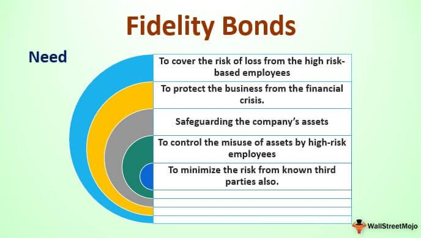

In today’s complex financial market, investors are constantly seeking ways to protect their investments while optimizing returns. As economic uncertainties and market volatilities persist, securing assets through innovative financial instruments becomes vital. This article explores the concept of bond insurance, a critical tool for safeguarding investments against issuer default, which enhances the creditworthiness of bonds and attracts more investors by lowering their perceived risk. Alongside, the emergence of algorithmic trading is reshaping the landscape of fixed income markets. By leveraging sophisticated algorithms, this technology improves market liquidity, reduces transaction costs, and enhances trading efficiency.

Bond insurance plays a pivotal role in maintaining stability and providing financial security, especially in volatile markets, by ensuring that investors receive principal and interest payments even when bond issuers face financial distress. Simultaneously, algorithmic trading facilitates rapid analysis of large data sets, identifying untapped market opportunities and optimizing pricing strategies in bonds and fixed income securities. These elements—bond insurance and algorithmic trading—work in tandem to offer enhanced safety, liquidity, and operational efficiency to market participants, thus forming the backbone of modern financial market dynamics. Understanding and integrating these strategies are crucial for investors striving to balance risk and return within their investment portfolios. The ability to navigate these financial instruments and technological advances enables investors to achieve well-rounded growth and risk management.



## Table of Contents

## Understanding Bond Insurance

Bond insurance serves as a crucial tool for mitigating the financial risk associated with bond investments by providing a financial guaranty against issuer default. At its core, bond insurance functions by transferring the risk of non-payment from the bondholder to the insurance provider, ensuring that both principal and interest payments are met even if the issuer defaults on its obligation. This mechanism not only protects investors but also adds an additional layer of security to the fixed income market.

The enhancement of credit ratings is one of the primary benefits of bond insurance. When a bond is insured, its creditworthiness is effectively backed by the insurer's higher credit rating, thus elevating the perceived safety of the bond itself. This enhancement makes the bonds more appealing to investors, as they are deemed less risky. Consequently, insurers can attract more investors, offering potentially lower interest rates due to the reduced risk perception.

Bond insurance is predominantly applied to municipal bonds and certain asset-backed securities. In the case of municipal bonds, cities, counties, and other governmental entities can benefit from lower borrowing costs. Since these governmental bodies often have limited financial resources, bond insurance allows them to secure more favorable terms when they issue debt securities, ultimately saving taxpayer money.

By ensuring payment continuity, bond insurance promotes market stability and decreases the chances of catastrophic losses for investors. It essentially provides a safety net, which is particularly attractive in volatile economic climates where the risk of default can escalate. The presence of bond insurance reassures investors that their investments are secure, not unlike a guarantee, and thereby facilitates more robust investment activities in the bond market.

## The Role of Bond Insurance in Investment Protection

Bond insurance acts as a crucial stabilizing [factor](/wiki/factor-investing) in the often volatile financial markets, particularly for investors seeking to mitigate risks. By providing a financial guaranty, bond insurance ensures that bondholders receive timely payment of principal and interest, even if the issuer defaults. This operational setup not only guards against potential financial loss but also maintains stable returns, which is essential in turbulent economic periods.

For issuers, bond insurance serves as a valuable tool to secure lower interest rates. The presence of a guarantor lowers the perceived risk for investors, thus enabling issuers to access capital at reduced borrowing costs. This reduction in borrowing costs can be mathematically represented by considering the yield differential associated with insured versus uninsured bonds. Suppose $r_u$ is the yield of an uninsured bond and $r_i$ is the yield of an insured bond; the reduction in [interest rate](/wiki/interest-rate-trading-strategies) can be expressed as:

$$
\Delta r = r_u - r_i
$$

where $\Delta r$ represents the interest saving attributable to bond insurance. This reduced cost of capital makes bonds more appealing in the market, often leading to an increased issuance of insured bonds.

From the investor's perspective, bond insurance bolsters the creditworthiness of bonds through enhanced credit ratings. These higher credit ratings considerably lower the default risk, allowing investors to commit to longer-term investments with greater assurance. The enhanced credit rating is generally accompanied by improved bond [liquidity](/wiki/liquidity-risk-premium) and marketability, making it a preferred choice for institutional investors seeking balanced risk.

The integration of bond insurance into investment strategies allows portfolio managers to optimize risk-reward ratios effectively. By incorporating insured bonds into a portfolio, managers are able to achieve a diversified balance, reducing the [volatility](/wiki/volatility-trading-strategies) of returns while safeguarding against issuer default. This aligns with the investment objectives of both risk-averse individuals and institutions seeking long-term stability and growth in their financial assets.

In summary, bond insurance plays a vital role in investment protection by securing lower borrowing costs for issuers and providing investors with enhanced credit ratings and reduced default risks. These features collectively contribute to a more stable and appealing bond market, facilitating confident long-term investments.

## Financial Security through Fixed-Income Investments

Bonds are integral to a well-rounded investment portfolio, offering predictable income streams and typically exhibiting lower volatility relative to equities. This combination of stability and income predictability makes bonds particularly appealing for risk-averse investors. Bonds provide a reliable method to hedge against market volatility, as their fixed interest payments ensure steady cash flows regardless of fluctuations in the equity markets. 

During periods characterized by low interest rates, bonds play a crucial role in maintaining income levels and safeguarding capital. They serve as a tool to minimize exposure to the inherent risks associated with more volatile assets. For example, when equity markets are turbulent, bonds can offer a more stable return, thus preserving capital and generating income through fixed interest payments.

Furthermore, bonds' ability to deliver consistent returns with lower risk profiles makes them ideal for those seeking long-term financial security. The fixed nature of bond payments allows investors to effectively forecast future cash flows and plan their financial strategies accordingly. This predictability complements a diversified investment strategy, balancing higher-risk assets, such as stocks, with the stability of fixed-income securities.

The inclusion of bonds in a portfolio also provides a diversification benefit. Since bond prices and equity prices often exhibit low correlation, bonds can help offset potential losses in other asset classes, thereby enhancing the overall risk-return profile of the investment portfolio. As such, bonds are not only a source of income but also a means to achieve a more balanced and resilient investment strategy.

## Algorithmic Trading and Its Impact on Fixed Income Markets

Algorithmic trading has significantly transformed the landscape of fixed income markets, primarily through the enhanced use of sophisticated algorithms to execute trades with greater efficiency. By doing so, it has increased market liquidity and reduced transaction costs, offering substantial benefits to both issuers and investors. This form of trading leverages advanced computing techniques to handle large volumes of data, rapidly process information, and execute trades in a matter of milliseconds, thus enhancing market dynamics and operational efficiency.

In the context of bonds and fixed income securities, [algorithmic trading](/wiki/algorithmic-trading) optimizes pricing by using algorithms that assess numerous market variables and historical data to forecast price movements. This predictive capability helps in setting competitive bid and ask prices, thereby refining the price discovery process. As a result, investors can access a broader range of market opportunities, facilitating more informed trading decisions and portfolio diversification.

Moreover, algorithmic trading allows traders to identify and exploit market inefficiencies that were previously difficult to detect. By analyzing vast datasets, algorithms can uncover patterns and anomalies in the market, enabling the execution of strategies such as [arbitrage](/wiki/arbitrage) to take advantage of these inefficiencies. This data-driven approach supports market participants in minimizing risks and maximizing returns on their investments.

The integration of technology in trading also ensures the rapid processing of large volumes of transactions, which bolsters market liquidity. As more orders are executed in a shorter timeframe, the overall depth and resilience of the market improve, benefiting all participants by enhancing the ability to buy and sell securities with ease.

Algorithmic trading continues to reshape fixed income markets by boosting transparency, increasing access to diverse investment opportunities, and promoting more stable and efficient market conditions. Its role in refining the balance between supply and demand makes it an indispensable tool for modern investors, enabling them to navigate the complexities of financial markets with greater confidence and precision.

## Challenges in Automating Bond Trading

The automation of bond trading presents significant challenges due to the inherent complexity of the bond market. Bonds are characterized by a diversity of credit ratings, maturities, and structural variations, which complicates automation. Unlike equities, where shares of a company are uniform, each bond issuance can have distinct terms based on its issuer, type (such as municipal or corporate), maturity date, coupon structure, and credit quality. This diversity makes it difficult to create one-size-fits-all algorithmic models that can effectively trade across the entire bond spectrum.

A primary challenge in automating bond trading is data fragmentation. The bond market lacks a centralized exchange and operates over-the-counter (OTC), leading to dispersed data across various platforms and institutions. This fragmentation can obstruct the seamless access to pricing information and liquidity data necessary for developing effective algorithms. Without standardization, aggregating and analyzing data from disparate sources becomes both time-consuming and error-prone, complicating the establishment of a comprehensive view of the market.

To address these challenges, algorithmic trading in bond markets requires advanced data analytics for integrating and normalizing fragmented data. Enhanced data analytics offer the ability to process varied data formats and sources with greater efficiency and accuracy. For instance, employing [machine learning](/wiki/machine-learning) models could allow for the pattern recognition and anomaly detection needed to navigate the multifaceted landscape of the bond markets. Here is a simple Python example that outlines a basic approach to handling fragmented data using pandas and scikit-learn:

```python
import pandas as pd
from sklearn.preprocessing import StandardScaler
from sklearn.decomposition import PCA

# Sample data frame simulation
bond_data = {
    'Issuance': ['BondA', 'BondB', 'BondC'],
    'CreditRating': [1, 2, 3],  # Numerical representation of credit ratings
    'Maturity': [10, 5, 7],     # Maturity in years
    'CouponRate': [5.5, 6.0, 5.0] # Coupon rates as percentages
}

df = pd.DataFrame(bond_data)

# Standardize data
scaler = StandardScaler()
scaled_data = scaler.fit_transform(df[['CreditRating', 'Maturity', 'CouponRate']])

# Implement Principal Component Analysis (PCA) for complexity reduction
pca = PCA(n_components=2)
principal_components = pca.fit_transform(scaled_data)

# Resulting principal components for each bond
principal_df = pd.DataFrame(principal_components, columns = ['PC1', 'PC2'])
print(principal_df)
```

This code standardizes credit rating, maturity, and coupon rate data, followed by applying Principal Component Analysis (PCA) to reduce complexity and focus on the most influential features affecting bond trading algorithms.

Ultimately, overcoming the challenges in automating bond trading lies in the development of robust algorithmic models that can accommodate the market's dynamism through advanced analytics and strategic integration. Enhanced technology and improved data handling techniques will be essential to unlock the benefits of widespread automation in the fixed income markets.

## Technological Innovations and Their Effects

Technological advancements, notably cloud computing and [artificial intelligence](/wiki/ai-artificial-intelligence) (AI), have significantly impacted bond trading by providing scalable solutions and enhancing processing capabilities. Cloud computing allows for vast amounts of data storage and computational power, facilitating the processing of large datasets essential to bond market operations. This capability supports high-frequency trading and real-time data analysis, enabling traders to make informed, timely decisions.

AI has introduced machine learning models that predict market trends and optimize trading strategies. These models analyze historical data and identify patterns, offering insights into potential market movements. For instance, AI algorithms can assess credit risk by analyzing issuer-specific data, ultimately leading to better pricing strategies and risk management.

Adopting AI and cloud computing fosters greater efficiency in bond markets. Automated systems reduce manual errors and expedite transaction processes, lowering operational costs and minimizing human intervention. Additionally, these technologies enhance transparency. For instance, blockchain, a type of distributed ledger technology, is emerging as a tool for maintaining secure and immutable records of bond transactions, offering investors greater confidence in the authenticity and accuracy of trade data.

In Python, traders can utilize libraries such as `pandas` and `scikit-learn` for data analysis and machine learning model development. A simple example of processing bond market data might involve loading historical price data, calculating moving averages, and plotting trends to identify buying or selling opportunities:

```python
import pandas as pd
import matplotlib.pyplot as plt

# Load historical bond price data
data = pd.read_csv('bond_prices.csv', parse_dates=['Date'], index_col='Date')

# Calculate moving averages
data['20_MA'] = data['Price'].rolling(window=20).mean()
data['50_MA'] = data['Price'].rolling(window=50).mean()

# Plot the data
plt.figure(figsize=(10, 6))
plt.plot(data.index, data['Price'], label='Bond Price')
plt.plot(data.index, data['20_MA'], label='20-Day MA')
plt.plot(data.index, data['50_MA'], label='50-Day MA')
plt.legend()
plt.title('Bond Price with Moving Averages')
plt.xlabel('Date')
plt.ylabel('Price')
plt.show()
```

This code loads bond price data, calculates 20-day and 50-day moving averages, and visualizes these metrics, providing traders with a straightforward way to assess market conditions.

The ongoing integration of cloud computing and AI continues to reshape the bond trading landscape, ultimately benefiting both issuers and investors through improved market dynamics, strategic insights, and operational efficiencies. These technologies are vital for adapting to evolving market conditions and ensuring sustainable growth in fixed income sectors.

## Future Directions in Bond Insurance and Algo Trading

The future of fixed income markets is poised for transformative changes, substantially driven by technological integration, regulatory adjustments, and evolving market dynamics. Technological advancements, particularly automation and artificial intelligence (AI), are expected to enhance market efficiency significantly. Automation facilitates the execution of trades at unprecedented speed and accuracy, minimizing human error and the associated costs. This improved efficiency in trade execution is complemented by AI-driven analytics, which enhances the decision-making process by predicting market trends and identifying lucrative investment opportunities with greater precision.

Regulatory changes are also pivotal in shaping the future landscape of bond insurance and algorithmic trading. As markets become increasingly digitized, regulatory frameworks must adapt to address challenges such as cybersecurity threats, data privacy, and market manipulation. Establishing robust regulatory policies will ensure the safe integration of new technologies while maintaining market integrity and protecting investor interests.

Evolving market dynamics, including the growing demand for sustainable investments, are influencing the direction of fixed-income markets. Investors and institutions are increasingly prioritizing Environmental, Social, and Governance ([ESG](/wiki/esg-investing)) criteria, shaping the development of financial products and trading strategies that align with these values. The integration of ESG considerations into bond insurance and algorithmic trading strategies can enhance market resilience and attract a broader range of investors.

Innovation plays a crucial role in realizing the full potential of these advancements. Emerging technologies like blockchain can bring transparency and security to bond transactions, enabling streamlined operations and reduced settlement times. Furthermore, the ongoing refinement of algorithmic models, through enhanced data analytics and machine learning, promises to optimize trade execution and risk management.

In conclusion, the future of bond insurance and algorithmic trading is intrinsically linked to technological innovation and regulatory evolution. A proactive approach in embracing these changes will ensure sustainable growth and robust market operations, ultimately benefiting investors and maintaining market stability. Staying abreast of these trends is essential for investors seeking to navigate the complexities of modern financial markets and optimally balance their risk and reward strategies.

## Conclusion

Bond insurance and algorithmic trading are pivotal tools in modern finance, each offering unique advantages that, when combined, significantly enhance investment protection and financial security. Bond insurance serves as a crucial risk management tool, providing a financial guaranty that protects investors from issuer default. This protection not only makes bonds more attractive by enhancing credit ratings but also enables issuers to secure more favorable borrowing terms, ultimately benefiting both parties.

Algorithmic trading, on the other hand, transforms the way trades are executed in fixed-income markets. By utilizing sophisticated algorithms, this trading method increases market efficiency through improved liquidity and reduced transaction costs. Algorithmic trading facilitates rapid and precise data processing, enabling the exploitation of market inefficiencies that may otherwise go unnoticed. This technological advancement is essential in modernizing market operations, making them more efficient, secure, and transparent.

The synergy between bond insurance and algorithmic trading is particularly beneficial in volatile financial landscapes. Bond insurance ensures that investors have financial protection and stability in their returns, while algorithmic trading provides the tools needed for dynamic and efficient market engagement. Together, these strategies enhance overall market integrity and create an environment conducive to both issuer and investor confidence.

Remaining informed and adaptable is crucial in harnessing the full potential of these developments. The rapidly evolving landscape of fixed-income markets requires investors and institutions to stay abreast of technological advancements and regulatory changes. By doing so, they can achieve a balanced approach to growth and risk management within their investment portfolios. Adapting to these emerging trends not only facilitates improved decision-making but also ensures sustainable development and resilience in the face of market uncertainties.

## References & Further Reading

[1]: Zeidler, M. (2016). ["The Impact of Algorithmic Trading on Fixed-Income Markets."](http://datascienceassn.org/sites/default/files/Machine%20Learning%20and%20Algorithmic%20Trading%20In%20Fixed%20Income%20Markets.pdf) SSRN Electronic Journal.

[2]: Cantor, R., & Packer, F. (1997). ["Differences in the Financial Structure and Investment Outcomes between Public and Private Bond Insurance Companies."](https://ourcog.org/this-day-december-25-in-jewish-history-by-mitchell-a-and-deb-levin-zl-2/) Federal Reserve Bank of New York.

[3]: Fabozzi, F. J. (2007). ["Bond Markets, Analysis, and Strategies."](https://books.google.com/books/about/Bond_Markets_Analysis_and_Strategies_ten.html?id=bQpNEAAAQBAJ) Pearson.

[4]: Narang, R. (2013). ["Inside the Black Box: A Simple Guide to Quantitative and High-Frequency Trading."](https://onlinelibrary.wiley.com/doi/book/10.1002/9781118662717) Wiley.

[5]: Jobst, A. A. (2006). ["Asset Securitization as a Risk Management and Funding Tool: What Does it Hold in Store for Small and Micro Finance Institutions?"](https://staging.whowhatwhy.org/index_htm_files/Resources/files/the_effectiveness_of_public_sector_asset_management_qut.pdf) International Monetary Fund Working Paper.