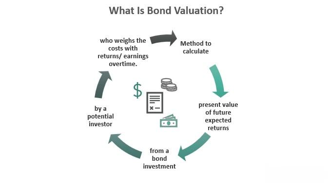

In finance, various instruments cater to different investor needs and goals. Within this spectrum, bonds stand as one of the most enduring forms of investment, continuing to attract a significant number of investors due to their perceived stability and predictable income streams. Bonds essentially represent loans made by an investor to a borrower, typically governmental or corporate entities, offering a fixed income over a predetermined period. This fixed-income attribute makes bonds particularly appealing to risk-averse investors seeking consistent returns.

The financial landscape has witnessed transformative shifts with the rise of technology, notably in the form of algorithmic trading. This article explores the intricate relationship between traditional bonds and the contemporary advancements such as algorithmic trading that have reshaped financial markets. Algorithmic trading utilizes computer algorithms to execute trades at speeds and efficiencies unattainable by human traders, revolutionizing not only equity markets but also the bond markets.

Understanding these concepts is crucial for investors aiming to make informed decisions and optimize their portfolios effectively. Bonds have evolved beyond their traditional roles, integrating with advanced technologies that offer new dimensions of investment strategies. As we explore the essence of bonds and their evolving role in modern investment strategies, we will examine how investors can navigate this complex landscape, balancing traditional wisdom with technological innovation to enhance portfolio performance.

## Table of Contents

## Understanding Bonds as Financial Instruments

Bonds, a fundamental component of the financial market, represent a form of debt investment where an investor lends money to a borrower—either corporate or governmental—for a defined period at a fixed interest rate. These instruments are deemed less volatile than stocks; hence, they offer a relatively predictable income stream over time. The primary appeal of bonds lies in their ability to provide investors with a fixed income through regular interest payments, known as coupon payments, until the bond's maturity when the principal amount is returned.

There are several key categories of bonds:

1. **Corporate Bonds**: Issued by corporations to raise capital for business activities, these bonds often come with higher yields than government bonds due to the increased risk associated with corporate creditworthiness. Corporations must maintain a balance sheet capable of sustaining interest payments, and investors often rely on credit ratings to assess this risk. Agencies like Moody’s, S&P Global Ratings, and Fitch Ratings evaluate a corporation's ability to meet its financial obligations, influencing the bond's perceived risk and expected return.

2. **Municipal Bonds**: These bonds are issued by city, state, or other local governments to finance public infrastructure projects. Interest income from municipal bonds is often exempt from federal taxes, and possibly state and local taxes, making them particularly attractive to investors in high tax brackets. However, the credit risk associated with municipal bonds needs careful consideration as municipalities can, though rarely, default.

3. **Treasury Bonds**: Issued by the United States government, they are among the safest investments since they are backed by the full faith and credit of the government. Treasury bonds are long-term securities with maturities ranging from 10 to 30 years. While they offer lower yields compared to corporate and municipal bonds, their high level of security is a strong draw for risk-averse investors.

Credit ratings play a crucial role in determining the risk and return profile of bonds. Bonds with high credit ratings (often 'AAA' or 'AA') are considered to have lower risk but typically offer lower yields. Conversely, bonds with lower credit ratings ('BBB-' and below, often referred to as "junk bonds") may offer higher yields to compensate for the increased risk of default. The yield of a bond can be understood as the return an investor can expect when holding the bond until maturity, factoring in interest payments and the bond’s purchasing price.

Incorporating bonds into a diversified investment portfolio is a critical strategy for risk management and income stability. Bonds typically have a low correlation with other asset classes such as equities, meaning they can provide a cushion during market downturns. For instance, during economic slumps, bond prices often rise as investors seek the relative safety that bonds provide, which can offset potential losses in equity investments. Thus, bonds effectively contribute to a balanced portfolio by mitigating overall risk while ensuring a steady flow of income.

In conclusion, bonds serve not only as a means of capital preservation and income generation but also as a stabilizing component within diverse investment portfolios. The careful selection and management of different types of bonds, in alignment with an investor’s risk tolerance and financial goals, are vital to maximizing returns while minimizing risk.

## The Rise of Algorithmic Trading

Algorithmic trading refers to the use of computer algorithms to execute trades at optimal speeds and prices, representing a paradigm shift in how financial markets operate, including the bond market. This method leverages powerful computational techniques and vast datasets, allowing for precise and timely execution of trades. By automating the trading process, [algorithmic trading](/wiki/algorithmic-trading) has significantly revolutionized the efficiency, cost structure, and accuracy within financial markets.

The impact of algorithmic trading on the financial markets can be seen in various dimensions. Firstly, it enhances efficiency by processing a high [volume](/wiki/volume-trading-strategy) of transactions in milliseconds, something unattainable through manual trading methods. This capability ensures that trades are executed at the best possible prices, benefiting both buyers and sellers in the financial ecosystem.

Another major advantage of algorithmic trading is the reduction of transaction costs. By automating the process, it negates the need for intermediaries, thus lowering the associated fees. Additionally, the precision of algorithms reduces market impact costs, a crucial [factor](/wiki/factor-investing) for large-volume institutional trades. The reduction in costs makes algorithmic trading an attractive option for institutional investors seeking to maximize their returns.

Moreover, algorithmic trading minimizes human errors—an inevitable occurrence in manual trading. Automated systems follow pre-set instructions and algorithms which operate devoid of emotional biases or fatigue-induced mistakes. This leads to more consistent and reliable trading outcomes.

The adoption of algorithmic trading has seen a significant surge among institutional investors, who leverage these technologies to gain competitive advantages. Institutions such as hedge funds, mutual funds, and pension funds utilize algorithms to optimize portfolio management strategies and exploit market inefficiencies more effectively.

Despite its advantages, algorithmic trading in the bond market encounters certain challenges and limitations. The bond market is traditionally less liquid than equity markets, leading to difficulties in executing high-frequency trades. Algorithmic systems often require adequate [liquidity](/wiki/liquidity-risk-premium) to function optimally, a condition not always met in bond markets.

Furthermore, the complexity of bond instruments and the diversity of bond issuers add layers of difficulty to algorithmic design. Algorithms must account for various credit risks, yield spreads, and [interest rate](/wiki/interest-rate-trading-strategies) changes, making them more intricate and data-intensive than those used in other markets.

Another concern is the increased risk of systemic failures that come with high-frequency and high-volume trading. Algorithms that malfunction can trigger significant market disruptions, as seen in past flash crashes. Therefore, effective risk management and rigorous testing protocols are essential to mitigate these risks.

In summary, algorithmic trading has profoundly changed the landscape of financial markets, bringing both efficiencies and challenges. While its implementation in the bond market is still evolving, it promises to transform trading strategies as more advanced algorithms are developed. As the bond market continues to adapt, the role of algorithmic trading is likely to expand, shaping the future dynamics of finance.

## Integrating Bonds and Algorithmic Trading in Investment Strategies

Algorithmic trading, a technology-driven approach to executing trades, plays a significant role in managing bond portfolios. By employing computer algorithms, investors can make decisions with precision and at unparalleled speeds. The integration of algorithmic trading into bond markets is transforming the way investors approach these traditionally stable financial instruments.

Algorithmic trading enhances bond portfolio management through automated strategies that optimize trade execution. These algorithms can handle large volumes of data and execute trades at the optimal moment, minimizing market impact and maximizing returns. With predefined criteria such as price, timing, and volume, algorithms ensure that trades are executed under the best possible conditions, improving liquidity and reducing transaction costs.

Technological advancements have a profound impact on bond markets, facilitating greater transparency and efficiency. The rise of electronic trading platforms and order management systems enables the handling of complex bond portfolios, enhancing accessibility for investors. In the future, these technologies are expected to further streamline trading processes, enabling real-time analytics and fostering increased participation from various market participants.

Several examples illustrate the successful integration of algorithmic trading within bond investments. For instance, large institutional investors employ bespoke algorithms that leverage historical data and predictive analytics to inform trading decisions. These case studies reveal that algorithmic strategies often outperform traditional, manual trading methods by adapting swiftly to changing market conditions.

To effectively engage in algorithmic trading of bonds, investors must understand the tools and platforms available. Platforms such as Tradeweb and Bloomberg provide robust infrastructures for electronic bond trading, offering features such as real-time pricing, execution management, and detailed analytics. These tools empower traders to implement sophisticated trading strategies and maintain an edge in the marketplace.

The regulatory environment surrounding algorithmic trading also bears significance. Regulators aim to ensure market stability and protect against the risks associated with high-frequency trading, such as flash crashes and market manipulation. Compliance with regulations like the MiFID II in Europe and the SEC's rules in the United States demands transparency and accountability, shaping the landscape in which algorithmic bond trading operates.

In conclusion, the integration of algorithmic trading in bond investment strategies marks a pivotal shift towards a more analytical and technology-driven approach. This evolution promises increased efficiency, reduced costs, and enhanced decision-making capabilities, underscoring the critical role of technology in the future of bond markets. Embracing these advancements while remaining cognizant of the regulatory frameworks will be crucial for investors aiming to leverage algorithmic trading successfully.

## The Future of Bonds in an Algorithm-Driven Market

The landscape of bond markets is on the cusp of transformation, driven by technological advancements and sophisticated data analytics. Emerging technologies are poised to further enhance the efficiency, accessibility, and precision of bond trading, creating new horizons for innovation in investments.

Advances in technology and data analytics are expected to further transform the bond market by making it more data-driven and agile. High-frequency trading ([HFT](/wiki/high-frequency-trading-strategies)) systems are starting to be implemented in bond markets, allowing for rapid execution of trades and capitalizing on market inefficiencies. These systems leverage complex algorithms capable of processing large volumes of data to provide real-time analytics, ensuring timely and optimal decision-making for traders.

Algorithmic trading systems, which are becoming ubiquitous across financial markets, are also finding innovative applications in the bond market. Areas of growth include the use of more sophisticated algorithms that employ big data and [machine learning](/wiki/machine-learning). Machine learning models utilize historical data to predict future bond price movements, thereby assisting traders in executing profitable trades. A potential growth area is the integration of natural language processing (NLP) with trading platforms, allowing systems to analyze news and social media sentiment to predict market trends.

Artificial Intelligence (AI) and machine learning are expected to continue playing a pivotal role in shaping the future of bond trading. Machine learning tools are increasingly proficient at identifying patterns and anomalies that may not be observable through traditional analysis. For example, clustering algorithms can group bonds with similar risk profiles, helping investors to optimize their portfolios effectively. Moreover, AI-based models can simulate a wide range of market scenarios to provide robust risk assessments and improve decision-making processes.

Concluding thoughts highlight the importance of balancing traditional investment strategies with modern algorithmic techniques. While algorithmic trading offers the advantages of speed, precision, and data-driven insights, it is essential to retain the foundational principles of risk management, diversification, and thorough market knowledge. Investors are encouraged to embrace technological innovations while maintaining a strategic approach to investing, as the financial landscape continues to evolve. Continuous learning and adaptation are key to navigating the dynamic market conditions of an algorithm-driven future.

## Conclusion

In summarizing the relationship between bonds as financial instruments and algorithmic trading, it becomes evident that both elements play a crucial role within the modern investment landscape. Bonds, traditionally valued for their stability and fixed income provision, are being complemented by algorithmic trading, which offers enhanced efficiency and precision in executing trades. The integration of algorithmic trading in bond investments presents numerous benefits, including optimized trade execution, reduced transaction costs, and minimized human error.

However, investors should carefully consider both the benefits and potential drawbacks of this integration. While algorithmic trading can enhance the liquidity and price discovery in the bond market, it also requires a robust understanding of the technology and market dynamics. The necessity for continuous monitoring and adjustment of algorithms is crucial to mitigate risks associated with algorithmic trading, such as market [volatility](/wiki/volatility-trading-strategies) and regulatory compliance issues.

Staying informed about technological advancements in the financial markets is essential for investors aiming to capitalize on the potential of algorithmic trading within bond investments. Advances in data analytics, [artificial intelligence](/wiki/ai-artificial-intelligence), and machine learning are further transforming bond trading, making it imperative for investors to maintain a keen awareness of these technologies and their implications.

Achieving a balanced and strategic approach to investment requires integrating traditional wisdom with modern techniques. While the core principles of diversification and risk management remain valid, the incorporation of algorithmic strategies should be done judiciously, ensuring alignment with overall investment goals.

In conclusion, the ongoing evolution of financial markets underscores the importance of continuous learning and adaptation. As technology reshapes the landscape, investors must remain agile and proactive, leveraging both traditional and algorithmic strategies to optimize portfolio performance and navigate the complexities of the financial world effectively.

## References & Further Reading

[1]: ["The Basics of Bonds"](https://www.investopedia.com/financial-edge/0312/the-basics-of-bonds.aspx) by Investopedia

[2]: Avellaneda, M., & Stoikov, S. (2008). ["High-frequency trading in a limit order book."](https://math.nyu.edu/~avellane/HighFrequencyTrading.pdf) Quantitative Finance.

[3]: Lopez de Prado, M. (2018). ["Advances in Financial Machine Learning."](https://www.amazon.com/Advances-Financial-Machine-Learning-Marcos/dp/1119482089) Wiley.

[4]: Chan, E. P. (2009). ["Quantitative Trading: How to Build Your Own Algorithmic Trading Business."](https://github.com/ftvision/quant_trading_echan_book) Wiley.

[5]: Aronson, D. R. (2006). ["Evidence-Based Technical Analysis: Applying the Scientific Method and Statistical Inference to Trading Signals."](https://www.amazon.com/Evidence-Based-Technical-Analysis-Scientific-Statistical/dp/0470008741) Wiley.

[6]: Jansen, S. (2020). ["Machine Learning for Algorithmic Trading."](https://github.com/stefan-jansen/machine-learning-for-trading) Packt Publishing.