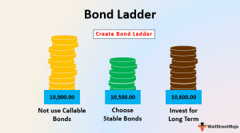

Fixed-income investment strategies are pivotal in crafting diversified portfolios designed to generate steady income and mitigate risks. Fundamental to these strategies are instruments like bond ladders and sophisticated methodologies like algorithmic trading. Fixed-income securities, such as bonds, offer regular interest payments and return the principal upon maturity, making them appealing for investors seeking stability and predictable returns.

Bond ladders represent a strategy where investors purchase bonds with varying maturity dates, creating a series of incremental maturity steps. This approach diversifies the interest rate risk and ensures liquidity by consistently providing access to cash flows as bonds in the ladder mature. The key advantage of a bond ladder is its ability to balance risk with income generation, as it provides the benefits of diversification across different interest rate environments.



Algorithmic trading brings optimization to bond ladder strategies by utilizing advanced computational algorithms to automate and enhance portfolio management. This involves using predefined rules and strategies to execute trades based on real-time market data and analytics. Algorithmic trading can optimize bond ladder strategies by efficiently managing large datasets, identifying optimal trading opportunities, and executing trades at speeds unattainable by human traders. For instance, algorithms can monitor fluctuations in interest rates and adjust the composition of a bond ladder swiftly to protect against interest rate decreases which could erode income.

Integrating algorithmic trading into fixed-income strategies ensures that bond ladders remain agile and responsive to market conditions. It enables the continuous balancing of portfolios in response to shifting economic indicators, thereby potentially maximizing returns while adhering to risk parameters. Moreover, algorithms can simulate various interest rate scenarios to inform strategic decisions, further bolstering the robustness of bond ladder strategies.

In summary, fixed-income strategies are crucial for achieving risk-adjusted returns in diversified portfolios. Bond ladders manage risks associated with interest rate changes, and algorithmic trading optimizes the construction and management of these strategies. Together, they form a sophisticated approach to managing fixed-income investments in an ever-evolving financial landscape.

## Table of Contents

## Understanding Fixed Income Investments

Fixed-income investments are financial instruments that provide returns in the form of regular, fixed interest payments until their maturity, at which point the principal is repaid. These investments are essential for investors seeking stability and predictable income, making them a cornerstone of diversified portfolios. Fixed-income securities are less volatile compared to equities, making them attractive for risk-averse investors or those who require steady cash flows.

The primary types of fixed-income securities include government bonds, corporate bonds, and municipal bonds:

1. **Government Bonds**: These are debt securities issued by a national government to support government spending and obligations. They are often considered low-risk investments since they are backed by the full faith and credit of the issuing government. Government bonds can be further categorized into treasury bonds, treasury notes, and treasury bills, which differ by their maturity periods and interest terms. For instance, U.S. Treasury bonds have maturities longer than ten years and typically offer fixed interest payments semi-annually.

2. **Corporate Bonds**: Issued by corporations to raise capital, these bonds tend to carry higher risk compared to government bonds, as the creditworthiness of the issuer plays a critical role in the investment's security. Consequently, corporate bonds usually offer higher yields to compensate for the increased risk. Rating agencies assign credit ratings to these bonds to help investors evaluate the issuer's reliability, ranging from investment-grade (lower risk) to high-yield or "junk" status (higher risk).

3. **Municipal Bonds**: These are issued by local and state governments or their agencies to fund public projects such as infrastructure, schools, and hospitals. Interest earned on municipal bonds is often exempt from federal income taxes, and possibly state and local taxes if the investor resides in the issuing state, enhancing their appeal to investors in higher tax brackets. Municipal bonds generally carry lower yields than corporate bonds but offer tax advantages that improve their effective return.

In summary, fixed-income investments offer a reliable income stream and help mitigate portfolio risk through diversification. Understanding the characteristics and trade-offs of different fixed-income securities enables investors to align their investment choices with their financial goals and risk tolerance.

## What is a Bond Ladder?

A bond ladder is an investment strategy that involves purchasing a series of bonds with staggered maturities. This method is designed to help investors manage [interest rate](/wiki/interest-rate-trading-strategies) risks and ensure a consistent stream of income. By diversifying the maturity dates, a bond ladder allows for the reinvestment of matured bonds, potentially at higher interest rates, while simultaneously providing [liquidity](/wiki/liquidity-risk-premium) and reducing the impact of rate fluctuations.

To illustrate, consider an investor who creates a bond ladder using five bonds, each with a maturity spaced one year apart. For example, if the investor starts with bonds maturing in one, two, three, four, and five years, they hold a bond portfolio that provides annual cash flow through bond maturity values and coupon payments. At the end of the first year, as the shortest-term bond matures, the investor reinvests the principal into a new five-year bond, thus maintaining the ladder's structure.

The mechanics of bond ladders enhance risk management through diversification across various interest rate environments. When interest rates rise, the bonds within the ladder continue to mature at regular intervals, permitting the reinvestment of funds into newly issued bonds with higher yields. Conversely, in a declining interest rate environment, the longer-term bonds in the ladder that still hold higher initial yields can help balance returns.

This strategy differs from traditional bond investing approaches, such as buying a single long-term bond or a bond fund, where exposure to interest rate risk is more pronounced. A single bond purchase ties the investor's capital to a fixed interest rate over a longer period, potentially leading to opportunity costs if market rates increase. On the other hand, investing in a bond fund exposes the investor to market [volatility](/wiki/volatility-trading-strategies) and potential principal loss, as bond funds do not have a fixed maturity date and are subject to market price fluctuations.

In conclusion, bond ladders provide a structured yet flexible approach to fixed-income investing, balancing income stability and risk management without needing constant market timing decisions.

## Benefits of a Bond Ladder Strategy

A bond ladder strategy offers numerous benefits, particularly regarding diversification, risk management, income stability, and flexibility. This strategy involves purchasing bonds with staggered maturities, ensuring that a portion of the portfolio matures periodically. This allows investors to reinvest in new bonds, mitigating the risk of interest rate fluctuations over time.

### Diversification

A bond ladder provides diversification by spreading investments across different maturities. This approach minimizes the reliance on a single interest rate environment and helps protect against the risks associated with reinvesting a large sum in an unfavorable rate scenario. By diversifying maturities, investors can potentially optimize returns and reduce volatility in their fixed-income portfolio.

### Risk Management

Managing interest rate risk is a critical component of fixed-income investing. A bond ladder can reduce interest rate risk by ensuring that not all bonds in a portfolio mature at the same time. When rates rise, investors can reinvest maturing proceeds at higher yields. Conversely, if rates fall, the retained longer-term bonds provide better returns than newly issued lower-yielding ones. This structure balances reinvestment risk and takes advantage of varying interest rate cycles.

### Income Stability

Income stability is a prominent advantage of employing a bond ladder. As bonds mature at regular intervals, investors receive a steady stream of cash flow, which provides predictability in income generation. This consistent flow of income is particularly attractive to retirees or those requiring reliable cash streams for financial planning.

### Flexibility

Bond ladders offer significant flexibility, allowing investors to adjust their portfolio to adapt to changing financial needs or market conditions. As each bond matures, investors have the opportunity to reassess their investment strategy and either reinvest in new bonds or reallocate funds to other asset classes. This flexibility is crucial in maintaining an agile investment portfolio that can react to economic shifts or personal financial changes.

### Performance in Volatile Interest Rate Environments

Bond ladders have shown to be particularly effective in volatile interest rate environments. During periods of rising interest rates, maturing bonds provide the opportunity to reinvest at higher yields, shielding investors from the adverse effects of a prolonged low-yield period. Conversely, when interest rates decline, the longer-term bonds in the ladder continue to deliver higher yields, preserving the portfolio's income-generating potential.

In summary, a bond ladder strategy is valuable for its ability to diversify risk, manage interest rate exposure, provide a stable income stream, and offer flexibility. This approach is advantageous across various market scenarios, ensuring steady and reliable investment performance.

## Algorithmic Trading in Bond Ladders

Algorithmic trading refers to the use of computer algorithms to automate and optimize trading decisions based on predetermined criteria and quantitative models. This approach is increasingly applied to fixed-income markets, including the management of bond ladders—a strategy designed to provide consistent income while managing interest rate risk by staggering bond maturities over different periods.

In the context of bond ladders, [algorithmic trading](/wiki/algorithmic-trading) can significantly enhance both the management and efficiency of these strategies. Algorithms can monitor market conditions continuously, making automatic adjustments to the bond ladder to optimize for yield, liquidity, and diversification. This automated process can include the reinvestment of proceeds from maturing bonds into new bonds that fit the ladder's criteria, ensuring the portfolio remains aligned with the investor's objectives.

One of the primary benefits of incorporating algorithmic trading into bond ladder strategies is the ability to manage large sets of data and trade operations with greater precision and speed than manual methods permit. Algorithms can swiftly evaluate factors such as bond pricing, interest rate trends, issuer credit quality, and economic indicators to make informed purchasing decisions. They can also help in executing trades at the best available prices by analyzing market liquidity and timing.

Moreover, advanced algorithms can employ [machine learning](/wiki/machine-learning) to improve decision-making over time. For instance, a machine learning algorithm might be trained to predict interest rate movements based on historical data, news sentiment, and macroeconomic indicators. This predictive capability could inform adjustments to the bond ladder, such as altering the duration of bond holdings to either capitalize on or shield against anticipated interest rate changes.

Consider the following simplified Python example of an algorithm designed to manage a bond ladder strategy:

```python
import pandas as pd

# Hypothetical bond data
bond_data = {
    'Bond': ['Bond A', 'Bond B', 'Bond C'],
    'Maturity': [2025, 2030, 2035],
    'Coupon': [0.03, 0.035, 0.04],
    'Price': [100, 105, 110]
}

# Create a DataFrame
df = pd.DataFrame(bond_data)

# Function to calculate yield to maturity (YTM)
def calculate_ytm(face_value, price, coupon_rate, years_to_maturity):
    annual_coupon = face_value * coupon_rate
    ytm = (annual_coupon + ((face_value - price) / years_to_maturity)) / ((face_value + price) / 2)
    return ytm

# Apply the YTM calculation
df['YTM'] = df.apply(lambda row: calculate_ytm(1000, row['Price'], row['Coupon'], row['Maturity'] - 2023), axis=1)

# Consider holding the bond with the highest YTM
best_bond = df.loc[df['YTM'].idxmax()]

print("Optimal bond to purchase for the ladder:")
print(best_bond)
```

This simple script calculates the yield to maturity for a series of hypothetical bonds and identifies the bond that offers the highest yield, reflecting a basic decision-making process that could be automated within a broader algorithmic trading framework.

Overall, algorithmic trading in bond ladders can provide enhanced precision in executing investment strategies, improved portfolio management through systematic rebalancing, and can potentially uncover opportunities that are not readily apparent through traditional methods. Nonetheless, while powerful, it is essential to consider algorithmic trading limitations, including the risk of overfitting models or encountering unexpected market anomalies.

## Challenges and Downsides

Bond ladder strategies, while beneficial for diversification and income stability, are not without challenges. One primary risk associated with bond ladders is the potential for low returns. As these strategies typically involve investing in high-grade bonds that mature sequentially over time, the yields may be lower compared to other investment opportunities, particularly during periods of low interest rates. This can limit the growth potential of the overall investment portfolio.

Liquidity issues also present a significant challenge. Bonds, especially those that are not government-issued, can be less liquid than stocks. This means that in the event an investor needs to access their capital quickly, they might face difficulties or incur losses if the bonds must be sold at a discount. The liquidity risk is compounded for longer-maturity bonds within the ladder, which might not be in high demand in secondary markets.

When considering algorithmic trading in the context of bond ladders, several limitations surface. Algorithmic trading, which involves using automated systems and complex algorithms to execute trades, might face technical challenges in fixed-income markets. The bond market is less centralized and more opaque than equity markets, meaning the data necessary for algorithm optimization could be sparse or inconsistent. This lack of transparency can lead to inefficiencies and affect the algorithm’s ability to exploit market anomalies effectively.

Moreover, market anomalies themselves present a hurdle. Unlike equities, where price movements and trends are relatively more predictable, bonds can be influenced by a range of unpredictable factors such as interest rate changes, geopolitical events, and issuer-specific issues. These anomalies can substantially affect the efficacy of an algorithmic approach.

The technical infrastructure needed for successful algorithmic trading is another critical consideration. High-frequency trading systems require substantial computational resources and sophisticated technology to minimize latency and execution costs. In the fixed-income domain, the development and maintenance of such systems can be cost-prohibitive, especially for individual investors or smaller firms.

In summary, while bond ladders and algorithmic trading offer pathways to optimize fixed-income investments, they come with their set of challenges. These include the risk of low returns, liquidity concerns, and the inherent limitations of algorithmic trading in a less transparent and more fragmented bond market. Balancing these risks against potential rewards is crucial for investors aiming to incorporate these strategies into their portfolios.

## Building and Managing a Bond Ladder

To construct a bond ladder tailored to investor needs and market conditions, follow these steps:

### Step 1: Define Investment Goals and Time Horizon
Begin by clearly identifying your investment objectives, such as regular income, capital preservation, or specific future financial needs. Determine your time horizon to decide the range of bond maturities that align with your goals.

### Step 2: Determine Ladder Parameters
Specify the structure of your bond ladder by deciding:
- **Number of rungs**: This is the number of bonds in your ladder, typically spread across different maturities.
- **Maturity intervals**: Maturities could be staggered annually, semi-annually, or according to any interval that suits your financial planning.
- **Investment amount per rung**: Allocate equal or varying amounts to each rung based on risk tolerance and income requirements.

### Step 3: Select Bond Types and Issuers
Choose from various fixed-income securities, such as:
- **Government Bonds**: Often considered safe, with lower yields.
- **Corporate Bonds**: Offering higher yields with increased risk.
- **Municipal Bonds**: Tax-efficient options, beneficial for high-tax bracket investors.

Diversification among these types and issuers can mitigate issuer-specific risks.

### Step 4: Choose Bond Maturities
Select bonds with staggered maturities to match your ladder structure. For example, in a 5-year ladder, purchase bonds maturing each year from 1 to 5 years. This strategy provides a continuous income stream while hedging against interest rate fluctuations.

### Step 5: Implement and Monitor the Ladder
Purchase the bonds according to your plan and maintain the ladder by:
- **Monitoring Interest Rates**: Adjust strategies based on interest rate movements. If rates are expected to rise, you may want to shift investments into shorter-term bonds to reinvest at higher rates later.
- **Reinvestment**: As bonds mature, reinvest in new bonds at the longest maturity to maintain the ladder's structure consistent with current market conditions.

### Tips on Maintenance
- **Rebalancing**: Regularly review and rebalance your portfolio to ensure alignment with your initial investment goals and changes in your financial situation or the market.
- **Tax Efficiency**: Understand potential tax implications, as interest income from various bonds may be taxed differently. Municipal bonds might be preferable for tax advantages.
- **Liquidity Needs**: Maintain a portion of liquid assets to cover unexpected financial needs without dismantling your ladder.

### Example: Python Code to Simulate Bond Ladder Investment

Here's a simple Python script that models a basic bond ladder setup:

```python
import numpy as np

def create_bond_ladder(initial_investment, num_rungs, interest_rate, duration):
    ladder = []
    investment_per_rung = initial_investment / num_rungs
    for i in range(1, num_rungs + 1):
        maturity_value = investment_per_rung * (1 + interest_rate)**i
        ladder.append((i, maturity_value))
    return ladder

# Example execution
initial_investment = 50000  # Total money invested
num_rungs = 5  # Number of bonds with staggered maturities
interest_rate = 0.03  # Annual interest rate
ladder = create_bond_ladder(initial_investment, num_rungs, interest_rate, num_rungs)

for year, value in ladder:
    print(f"Maturity in Year {year}: ${value:.2f}")
```

This script calculates the maturity value for each rung of a ladder, considering a constant interest rate. Adjust variables based on current market interest rates and specific investment amounts.

By following these steps and customizing based on personal financial goals, market conditions, and risk preferences, investors can effectively build and manage a bond ladder suited to their needs.

## Future Trends and Innovations

The landscape of fixed-income investing is experiencing rapid transformation, driven by technological advancements and innovative financial strategies. Among these, robo-advisors and smart beta strategies are gaining traction, offering investors new methods to maximize returns while managing risk.

Robo-advisors, which utilize algorithms to automate investment decisions, have become increasingly sophisticated. These platforms provide cost-effective and efficient investment solutions by automatically adjusting portfolios based on individual preferences and market conditions. They leverage algorithms to assess an investor's risk tolerance, time horizon, and financial goals, subsequently constructing diversified portfolios that often include fixed-income securities. The incorporation of fixed-income assets helps stabilize portfolios, providing steady income with lower volatility compared to equities.

Smart beta strategies are another burgeoning area of innovation. These strategies aim to outperform traditional market-cap weighted indexes by systematically tilting portfolios towards certain factors or characteristics such as value, [momentum](/wiki/momentum), or low volatility. In the context of fixed-income, smart beta involves creating bond indexes that optimize for characteristics like interest rate sensitivity or credit risk. By utilizing these factors, investors can potentially enhance returns or reduce risk compared to traditional fixed-income benchmarks.

Technological advancements continue to shape the future of algorithmic fixed-income trading. Machine learning and [artificial intelligence](/wiki/ai-artificial-intelligence) are playing pivotal roles in predicting bond yields and assessing credit risks with greater accuracy. These tools analyze vast datasets, identifying patterns and trends that human analysts might overlook. Additionally, blockchain technology holds promise for enhancing transparency and security in fixed-income transactions by providing immutable records and enabling faster settlement times.

Cloud computing and big data analytics are further revolutionizing fixed-income trading by enabling real-time data processing and complex quantitative analyses. These technologies allow investors to dynamically manage their bond portfolios, optimizing for various risk factors and return objectives under different market conditions.

In summary, the integration of robo-advisors and smart beta strategies, coupled with emerging technologies, is significantly transforming fixed-income investing. These innovations offer the potential for improved efficiency, enhanced returns, and better risk management, paving the way for a more dynamic and adaptable fixed-income market ecosystem.

## Conclusion

Integrating bond ladders and algorithmic trading into fixed-income portfolios offers a multifaceted approach to optimizing returns while managing risks effectively. Bond ladders provide investors with a structured method to manage duration risk and ensure a steady stream of income by staggering bond maturities. This strategy can help investors mitigate the impact of fluctuating interest rates and reinvest maturing bonds at prevailing rates, thus preserving capital and income.

Algorithmic trading, on the other hand, introduces a level of precision and efficiency that can significantly enhance the management of bond ladders. By automating the buying and selling process based on pre-set parameters and real-time data, algorithms can help optimize yields, reduce costs, and respond swiftly to market changes. The integration of these technologies allows for real-time monitoring and adjustment of portfolios, potentially enhancing performance and profitability.

However, the success of combining bond ladders and algorithmic trading hinges on a balanced approach. Investors must consider individual risk tolerance, investment goals, and market conditions when implementing these strategies. For instance, a risk-averse investor may prioritize income stability and capital preservation, opting for high-quality bonds within the ladder. Conversely, those with a higher risk appetite might leverage algorithmic models to explore opportunities in more volatile segments of the fixed-income market.

Ultimately, the integration of bond ladders with algorithmic trading offers the potential for superior customization and control in fixed-income portfolios. When aligned with personal investment objectives and a thorough understanding of market dynamics, this strategy can serve as a robust foundation for achieving financial goals.

## References & Further Reading

[1]: Reilly, F. K., & Brown, K. C. (2011). "Investment Analysis and Portfolio Management." South-Western College Pub.

[2]: Fabozzi, F. J. (2007). "Fixed Income Analysis." Wiley.

[3]: Lopez de Prado, M. (2018). ["Advances in Financial Machine Learning."](https://www.amazon.com/Advances-Financial-Machine-Learning-Marcos/dp/1119482089) Wiley.

[4]: Chan, E. (2008). ["Quantitative Trading: How to Build Your Own Algorithmic Trading Business."](https://rickorford.com/quantitative-trading/) Wiley.

[5]: Jansen, S. (2018). ["Machine Learning for Algorithmic Trading."](https://www.amazon.com/Hands-Machine-Learning-Algorithmic-Trading/dp/178934641X) Packt Publishing.

[6]: Fabozzi, F. J., & Mann, S. V. (2010). "The Handbook of Fixed Income Securities." McGraw-Hill Education.

[7]: LMS (Library of Congress Subject Headings), "Bond ladder (Investment strategy)."