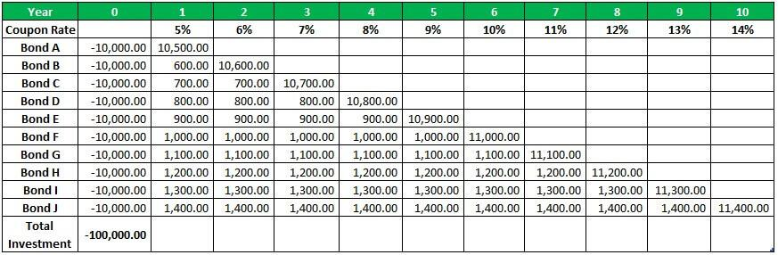

In the ever-evolving landscape of financial planning and investment strategies, bond laddering stands out as a versatile tool for managing fixed-income assets. This approach involves purchasing bonds with staggered maturity dates, providing investors with a consistent strategy to manage interest rate risks and ensure liquidity. Bond laddering is especially significant in the current financial climate, where interest rate volatility poses a considerable challenge for portfolio management.

This article explores the intricacies of bond laddering within the broader context of financial planning, including its integration with algorithmic trading. The advent of technology and its application in the financial sector have introduced algorithmic trading as a powerful ally in optimizing bond laddering strategies. Algorithms can enhance efficiency by automating processes involved in buying and selling bonds, thus contributing to better yield optimization and diversification.



We'll cover the fundamental principles of bond laddering, its benefits, challenges, and how algorithmic trading can enhance the effectiveness of this strategy. The strategy not only offers a predictable income stream but also allows investors the flexibility to adjust their portfolios as market conditions change. Moreover, it mitigates risks associated with reinvestment and interest rate fluctuations, crucial for preserving capital and ensuring steady returns over time.

Whether you're a seasoned investor or new to fixed-income investments, understanding how to build and manage a bond ladder can be crucial for optimizing your portfolio's performance. Through a mix of different bond types and staggered maturities, it is possible to balance risk and return effectively.

Understanding bond laddering in detail will equip investors with the knowledge needed to navigate the complexities of modern financial planning. Let's examine how this strategy fits into contemporary investment strategies, offering a structured pathway to stability and growth.

## Table of Contents

## Understanding Bond Laddering

Bond laddering is an investment strategy centered on the purchase of bonds with staggered maturity dates, creating a systematic framework for reallocating capital over time. This strategy is particularly beneficial for investors seeking to mitigate interest rate risks while ensuring a reliable income stream. As bonds mature at even intervals, investors can reinvest the principal in new bonds, taking advantage of prevailing interest rates.

The core objective of bond laddering is to diversify [interest rate](/wiki/interest-rate-trading-strategies) exposure and maintain [liquidity](/wiki/liquidity-risk-premium) within the portfolio. By scheduling maturities periodically, investors are not overly exposed to any single interest rate environment. This systematic approach reduces the impact of interest rate fluctuations, a significant concern in fixed-income investments. 

To optimize returns while balancing risk, investors typically select a mix of bond types and maturities. For instance, incorporating government, corporate, and municipal bonds across short, medium, and long-term maturities can create a well-rounded portfolio. This diversification ensures that a portion of the portfolio is regularly accessible as bonds mature, offering both flexibility and stability in cash flows.

Overall, bond laddering provides a structured method to manage fixed-income investments, granting investors the dual advantage of income predictability and risk diversification.

## Benefits of Bond Laddering

Bond laddering serves as a robust investment strategy by offering several key benefits, particularly in terms of diversification, risk management, income stability, and flexibility.

**Diversification**: One of the primary advantages of bond laddering is its capacity to diversify investments across varying maturities. This diversification diminishes the portfolio's reliance on the interest rate environment of a single maturity date. By holding bonds that mature at different times, investors are less exposed to unfavorable shifts in interest rates, creating a more stable financial footing.

**Risk Management**: Effective risk management is vital for any investment strategy. Bond laddering aids in mitigating interest rate risk and reinvestment risk. By spreading out bond maturities, an investor ensures that they are not compelled to reinvest a significant portion of their portfolio in a potentially adverse interest rate environment all at once. When portions of the laddered bonds mature, investors can selectively reinvest in new bonds that offer greater yields in an improving rate scenario.

**Income Stability**: The consistent maturation of bonds within a ladder provides a regular and predictable stream of income. This is particularly beneficial for individuals focused on financial planning and meeting retirement needs, as it permits a steady cash flow. The periodic payouts as bonds mature can be carefully planned to fund ongoing or future financial commitments, offering peace of mind and planning certainty.

**Flexibility**: Finally, bond laddering imparts significant flexibility to investors. As bonds mature, investors have the autonomy to reallocate their resources based on the evolving market landscapes and their financial goals. This aspect of the strategy is crucial for adapting to changing conditions in interest rates, economic cycles, and individual financial objectives. By allowing adjustments at regular intervals, bond laddering accommodates both active management and passive strategies, offering a customized approach to investment management.

In essence, the strategic allocation and management of a bond ladder afford investors a balanced approach to handling fixed-income portfolios, effectively marrying the need for both security and potential growth.

## Challenges and Considerations

Low return potential is a notable challenge in bond laddering, particularly when dealing with high-grade bonds. These bonds, often issued by stable governments or corporations, typically offer lower yields. In environments characterized by low-interest rates, the growth potential of these bonds is notably limited, which could impact the overall financial goals of an investor seeking higher returns. The challenge lies in balancing the need for security with the desire for yield, especially during periods when interest rates remain suppressed.

Liquidity concerns present another significant consideration. Bonds generally possess less liquidity compared to other asset classes, such as equities. This reduced liquidity means that investors may face difficulties if there is an immediate need for cash, as bonds cannot always be sold quickly without potential losses. The illiquid nature of bonds requires careful planning to ensure adequate cash flow from maturing bonds, aligning with the investor's financial needs.

Reinvestment risk becomes particularly pertinent in a declining interest rate environment. As bonds in a ladder mature, reinvesting the principal at lower interest rates could result in diminished returns. This risk underscores the importance of strategic planning in bond laddering, where investors must constantly evaluate interest rate trends and adjust accordingly to maintain the effectiveness of their investment strategy.

Market anomalies add another layer of complexity to bond laddering. Various factors, including geopolitical events, sudden changes in economic policy, or issuer-specific issues, can cause unexpected fluctuations in bond prices. These anomalies can disrupt the stability one might expect from a bond ladder strategy, necessitating vigilant monitoring and the ability to adapt quickly to changing market conditions.

Addressing these challenges requires a comprehensive understanding of the bond market and a proactive approach that combines careful selection and timing of bond purchases with a readiness to adjust strategies in response to market dynamics.

## Algorithmic Trading in Bond Laddering

Algorithmic trading employs computer algorithms to automate and optimize trading decisions based on predefined criteria, significantly impacting how bond ladders are constructed and maintained. In the context of bond laddering, these algorithms facilitate the streamlined management of portfolios by automating the buying and selling of bonds as they mature. This automation ensures optimal yield, diversification, and liquidity, effectively addressing the challenges inherent in managing staggered maturities manually.

One of the primary advantages of using algorithms in bond laddering is their capacity to process enormous datasets quickly and accurately. Algorithms analyze vast amounts of historical and real-time data to provide actionable insights into bond pricing, interest rate trends, and issuer credit quality. This data-driven approach enables enhanced decision-making compared to traditional methods.

Furthermore, advanced algorithms often incorporate [machine learning](/wiki/machine-learning) techniques. Machine learning models can be trained on historical financial data to predict future movements in interest rates, a critical component in optimizing bond ladder strategies. For example, regression analysis or neural networks can model and forecast interest rate trends, allowing for proactive adjustments in bond ladder components. Consider a simple linear regression example in Python:

```python
import numpy as np
from sklearn.linear_model import LinearRegression

# Example historical data: years and interest rates
years = np.array([[1], [2], [3], [4], [5]])
interest_rates = np.array([2.5, 2.6, 2.8, 3.0, 3.1])

# Initialize and fit the linear regression model
model = LinearRegression()
model.fit(years, interest_rates)

# Predict future interest rates
future_years = np.array([[6], [7], [8]])
predicted_rates = model.predict(future_years)

print(predicted_rates)
```

This script illustrates how machine learning models might be used to predict future rates based on past performance. Such predictive capabilities allow investors to capitalize on favorable interest rate movements by dynamically adjusting bond maturity selections, thus optimizing portfolio returns.

In summary, [algorithmic trading](/wiki/algorithmic-trading) provides significant advantages in bond ladder management by automating routine tasks, providing deep insights through data analytics, and utilizing predictive models to enhance decision-making processes. As technology continues to advance, the integration of algorithmic strategies will likely become increasingly prevalent in fixed-income investment management.

## Building and Managing a Bond Ladder

To effectively build and manage a bond ladder, it is crucial to follow a structured approach that aligns with your financial objectives and addresses the complexities of interest rate environments. Here's how you can achieve that:

### Define Investment Goals
The first step in constructing a bond ladder is to clearly define your investment goals. Consider your financial objectives, risk tolerance, and investment horizon. Understanding these factors will help shape the structure of your ladder. For instance, if your primary goal is to generate a stable income during retirement, you might prioritize bonds that provide regular interest payments. Conversely, if you are focused on preserving capital with minimal risk, you might opt for higher-grade bonds with shorter maturities.

### Select Bond Types
The next step is to choose appropriate bond types that match your investment goals and risk preferences. You can select from various types of bonds, such as:

- **Government Bonds**: These are generally considered lower risk and provide moderate yields, suitable for conservative investors.
- **Corporate Bonds**: Offering higher yields than government bonds, these can be ideal if you are willing to take on additional credit risk.
- **Municipal Bonds**: These often provide tax advantages and are a good fit for individuals in higher tax brackets seeking tax-exempt income.

Each bond type presents its own set of yield expectations and risk profiles, so choosing the right mix is critical for achieving a balanced ladder.

### Choose Maturities
A successful bond ladder requires selecting bonds with staggered maturities. This strategy ensures regular liquidity and can help mitigate interest rate risk. For instance, a ladder composed of bonds maturing annually over a 5-year period allows for a bond to mature each year, providing opportunities to reinvest at prevailing interest rates.

Statistical models can aid in selecting the optimal maturity structure. A simple linear optimization problem that maximizes expected returns subject to risk constraints can be formulated as follows:

$$
\text{Maximize } \sum_{i=1}^{n} (R_i \cdot x_i) \]  
$$
\text{Subject to } \sum_{i=1}^{n} (V_i \cdot x_i) \leq C \]  
$$
\sum_{i=1}^{n} x_i = 1
$$

Where $R_i$ is the expected return of bond $i$, $V_i$ is the [volatility](/wiki/volatility-trading-strategies), $C$ is the investor's risk tolerance, and $x_i$ is the proportion of investment in bond $i$.

### Monitor and Rebalance
Once your bond ladder is in place, ongoing management is essential to ensure that it continues to align with your financial targets and adapts to market dynamics. Regularly monitoring interest rates, credit quality of issuers, and broader economic indicators can inform necessary adjustments. Rebalancing might involve reinvesting the proceeds from maturing bonds either into new bonds with desired maturities or reallocating funds to different asset classes if market conditions warrant.

For a more automated approach, algorithmic trading strategies can be utilized to manage this process. Python scripts can automate monitoring and rebalancing using libraries such as `pandas` for data handling and `numpy` for numerical calculations to evaluate and optimize portfolio constituents dynamically.

```python
import numpy as np
import pandas as pd

def optimize_portfolio(bonds_df, target_volatility):
    # Calculate expected returns and risk
    expected_returns = bonds_df['Expected Return']
    volatility = bonds_df['Volatility']

    # Initialize weights
    weights = np.array([1/len(bonds_df)] * len(bonds_df))

    # Optimization logic
    # Placeholder optimization algorithm to adjust weights
    optimized_weights = np.clip(weights - 0.01 * (volatility - target_volatility), 0, 1)
    optimized_weights /= np.sum(optimized_weights)

    return optimized_weights

# Example DataFrame with bond data
bonds_data = pd.DataFrame({
    'Bond': ['Gov1', 'Corp1', 'Muni1'],
    'Expected Return': [0.03, 0.05, 0.04],
    'Volatility': [0.02, 0.04, 0.03]
})

# Targeted risk level
target_vol = 0.03
new_weights = optimize_portfolio(bonds_data, target_vol)
print(new_weights)
```

This example showcases how mathematical and computational tools can enhance the precision in constructing and managing a bond ladder, offering a robust approach to fixed-income investing.

## Future Trends and Innovations

The integration of technology is transforming fixed-income investing by enhancing the creation and management of bond ladders. One of the most significant developments is the use of robo-advisors, which utilize algorithms to provide automated investment advice and management. These platforms can efficiently execute bond ladder strategies by selecting optimal bonds based on predefined criteria such as yield, maturity, and risk tolerance. The use of robo-advisors democratizes access to sophisticated investment strategies, making them available to a broader range of investors without the need for extensive financial expertise.

Smart beta strategies are also gaining traction in bond ladder construction. These strategies employ advanced indexing techniques that go beyond traditional market-capitalization-weighted indices by incorporating additional factors such as volatility, [momentum](/wiki/momentum), and liquidity. By doing so, smart beta strategies aim to enhance returns and manage risk more effectively than conventional strategies. In the context of bond laddering, smart beta can help fine-tune portfolio compositions to achieve more consistent risk-adjusted returns.

Machine learning and [artificial intelligence](/wiki/ai-artificial-intelligence) (AI) are revolutionizing how investors forecast bond yields and assess credit risks. Machine learning models can analyze large datasets to identify patterns that might indicate future trends in interest rates and credit quality. For instance, machine learning algorithms can be trained to predict interest rate movements by analyzing economic indicators, monetary policy signals, and historical yield curves. Such predictive analytics enable more precise adjustments to bond ladders, optimizing the balance between yield and risk.

Blockchain technology offers the potential to enhance transparency and security in bond transactions. By leveraging distributed ledger technology, blockchain can streamline the settlement process, reduce the risk of fraud, and provide real-time visibility into bond ownership. The immutable nature of blockchain ensures that transaction records are tamper-proof, increasing trust among investors and issuers. Additionally, smart contracts—self-executing contracts with the terms of the agreement directly written into code—can automate coupon payments and redemptions, further simplifying bond management.

Together, these technological advancements are poised to redefine the fixed-income landscape, offering investors more efficient and robust tools for managing bond ladders. The integration of these innovations enables more informed decision-making, reduces operational costs, and improves the overall performance of fixed-income portfolios.

## Conclusion

Bond laddering remains a fundamental strategy for managing fixed-income portfolios, providing a balanced method to handle risk and ensure consistent income generation. The staggered maturity dates within a bond ladder allow investors to diversify interest rate exposure and manage liquidity effectively, addressing the challenges posed by fluctuating market conditions. When this traditional strategy intersects with the precision and computational power of algorithmic trading, its efficacy is significantly enhanced. Algorithms not only automate the buying and selling processes but also optimize for yield, diversification, and liquidity by processing extensive datasets and predicting interest rate movements through machine learning techniques.

Investors must carefully consider their individual risk profiles and the prevailing market conditions when implementing bond ladder strategies. The selection of bond types—whether government, corporate, or municipal—along with an appropriate mix of maturities should align with personal financial goals and risk tolerance levels. As economic conditions evolve, continually adjusting and rebalancing the bond ladder is crucial to maintaining its effectiveness. By leveraging advancements in technology, such as machine learning for yield predictions and blockchain for transaction transparency, investors can enhance the stability and growth potential of their fixed-income portfolios. This strategic integration ensures that bond laddering remains a robust tool for financial planning across diverse economic landscapes.

## References & Further Reading

[1]: ["The Bond Book, Third Edition: Everything Investors Need to Know About Treasuries, Municipals, GNMAs, Corporates, Zeros, Bond Funds, Money Market Funds, and More"](https://www.amazon.com/Bond-Book-Third-Everything-Treasuries/dp/007166470X) by Annette Thau

[2]: ["Fixed Income Analysis"](https://en.wikipedia.org/wiki/Fixed_income_analysis) by Barbara S. Petitt and Jerald E. Pinto

[3]: ["Advances in Financial Machine Learning"](https://www.amazon.com/Advances-Financial-Machine-Learning-Marcos/dp/1119482089) by Marcos Lopez de Prado

[4]: ["Algorithmic and High-Frequency Trading"](https://www.amazon.com/Algorithmic-High-Frequency-Trading-Mathematics-Finance/dp/1107091144) by Álvaro Cartea, Sebastian Jaimungal, and José Penalva

[5]: ["Quantitative Trading: How to Build Your Own Algorithmic Trading Business"](https://www.amazon.com/Quantitative-Trading-Build-Algorithmic-Business/dp/1119800064) by Ernest P. Chan

[6]: ["Investing in Fixed Income Securities: Understanding the Bond Market"](https://www.amazon.com/Investing-Fixed-Income-Securities-Understanding/dp/0471465127) by Gary Strumeyer

[7]: Fabozzi, F. J., & Mann, S. V. (2012). ["Introduction to Fixed Income Analytics: Relative Value Analysis, Risk Measures and Valuation"](https://onlinelibrary.wiley.com/doi/book/10.1002/9781118266649). Wiley Finance. 

[8]: ["Bond Markets, Analysis, and Strategies"](https://mitpress.mit.edu/9780262046275/bond-markets-analysis-and-strategies/) by Frank J. Fabozzi