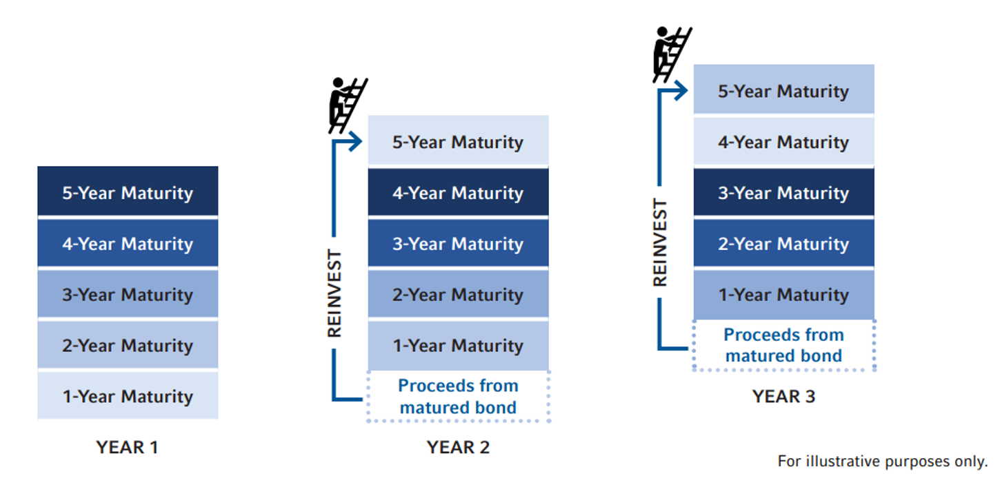

## Table of Contents

## What is bond laddering?

Bond laddering is a way to invest in bonds that helps spread out risk and improve returns. Instead of putting all your money into one bond, you buy several bonds that mature at different times. Imagine a ladder where each rung is a bond that matures at a different date. This way, you can get your money back at different times and reinvest it or use it as needed.

This strategy can be useful because it helps you manage interest rate risk. If rates go up, you can reinvest the money from the bonds that mature at a higher rate. If rates go down, you still have bonds that were bought at higher rates. It also provides a steady stream of income because as each bond matures, you get your money back to either spend or reinvest. This makes bond laddering a good choice for people who want a more predictable income from their investments.

## How does bond laddering work?

Bond laddering is a way to invest in bonds by spreading out when they mature. Imagine you have some money to invest in bonds. Instead of buying just one bond that matures in, say, 10 years, you buy several bonds. You might buy one bond that matures in 1 year, another in 2 years, another in 3 years, and so on up to 10 years. This creates a "ladder" where each "rung" is a bond that matures at a different time.

This strategy helps manage risk and improve returns. If interest rates go up, the bonds that mature soon can be reinvested at the new, higher rate. If interest rates go down, you still have bonds that were bought at the older, higher rates. This way, you don't have all your money locked in at one rate. Plus, as each bond matures, you get money back regularly, which you can either use or reinvest. This makes bond laddering a good choice for people who want a steady income from their investments.

## What are the basic steps to create a bond ladder?

To create a bond ladder, first decide how much money you want to invest and how long you want your ladder to be. For example, if you have $50,000 and want a 5-year ladder, you might divide the money into five equal parts, so $10,000 for each year. Then, you buy bonds that will mature in 1 year, 2 years, 3 years, 4 years, and 5 years. This way, every year, one of your bonds will mature, and you'll get your money back.

Next, choose the types of bonds you want to include in your ladder. You can pick from government bonds, corporate bonds, or municipal bonds, depending on your risk tolerance and tax situation. Make sure to spread your investments across different issuers to reduce risk. Once you have your bonds, you just need to wait for them to mature. When a bond matures, you can either spend the money or reinvest it in a new bond at the longest maturity of your ladder to keep it going. This helps you manage interest rate changes and provides a regular income stream.

## What are the advantages of bond laddering for a beginner investor?

Bond laddering can be a great way for a beginner investor to start investing in bonds. It helps spread out the risk because instead of putting all your money into one bond, you buy several bonds that mature at different times. This means you don't have to worry as much about interest rates going up or down because you have bonds maturing at different times. If rates go up, you can reinvest the money from the bonds that mature at the new higher rate. If rates go down, you still have bonds that were bought at the higher rate, so you're protected.

Another advantage is that bond laddering can give you a steady income. As each bond matures, you get your money back. You can then use this money for your expenses or reinvest it in a new bond to keep your ladder going. This can be really helpful if you need a regular income from your investments. It also makes it easier to plan your finances because you know when you'll get your money back.

## Can you explain the concept of reinvestment risk and how bond laddering mitigates it?

Reinvestment risk is the chance that when your bond matures, you might have to reinvest the money at a lower interest rate than the one you had before. This can happen if interest rates go down while you're holding your bond. For example, if you bought a bond that pays 5% interest and it matures when rates have dropped to 3%, you'll have to reinvest your money at the lower rate, which means you'll earn less interest.

Bond laddering helps lower this risk by spreading out when your bonds mature. Instead of having all your money tied up in one bond, you buy several bonds that mature at different times. This way, if interest rates go down, only part of your money will be affected because only some of your bonds will mature at the lower rate. The rest of your bonds will still be earning at the higher rates you locked in earlier. This strategy gives you a chance to reinvest some of your money at new rates without having to reinvest all of it at once, making your investment more stable and predictable.

## How does bond laddering help in managing interest rate risk?

Bond laddering helps manage interest rate risk by spreading out when your bonds mature. Instead of putting all your money into one bond, you buy several bonds that mature at different times. This way, if interest rates go up, you can reinvest the money from the bonds that mature at the higher rate. If interest rates go down, you still have bonds that were bought at the higher rates, so you're protected. This strategy means you don't have to worry as much about what interest rates will do because you have bonds maturing at different times.

This approach also makes your investment more stable. When you have a bond ladder, you're not betting all your money on what interest rates will do in the future. You get a chance to reinvest some of your money at new rates without having to reinvest all of it at once. This helps you manage the risk of interest rates changing and makes your investment more predictable.

## What types of bonds are typically used in a bond ladder?

When building a bond ladder, people often use different types of bonds to spread out their risk. Government bonds, like U.S. Treasury bonds, are very popular because they are backed by the government and are considered very safe. These bonds come in different lengths, so you can easily find ones that fit the different rungs of your ladder. Another common choice is corporate bonds, which are issued by companies. These can offer higher interest rates than government bonds, but they also come with more risk because companies can go bankrupt.

Municipal bonds are also used in bond ladders. These bonds are issued by local governments and can be a good choice if you want to avoid paying federal taxes on the interest you earn. They can offer a good balance between risk and reward. By mixing these different types of bonds, you can create a bond ladder that matches your risk tolerance and financial goals. This way, you have a steady stream of income and can manage the ups and downs of interest rates.

## How can an investor adjust a bond ladder to match their income needs?

An investor can adjust a bond ladder to match their income needs by choosing the right length for the ladder and the amounts of money to invest in each bond. For example, if you need money every year, you can set up a ladder where bonds mature each year. If you need more money in some years than others, you can put more money into the bonds that mature in those years. This way, you can make sure you have enough money coming in when you need it.

Another way to adjust the ladder is by picking the right types of bonds. If you need a steady income, you might choose government bonds because they are safe and reliable. If you can take a bit more risk for higher income, you might add some corporate bonds. By mixing different types of bonds and adjusting the amounts and timing of when they mature, you can create a bond ladder that fits your income needs perfectly.

## What are some common variations of bond laddering strategies?

One common variation of bond laddering is the barbell strategy. In this approach, instead of spreading your money evenly across all rungs of the ladder, you put most of your money into short-term and long-term bonds, with very little in the middle. This can help you take advantage of higher interest rates on long-term bonds while still having some money coming back to you soon from the short-term bonds.

Another variation is the bullet strategy. With this approach, you focus your investments on bonds that all mature around the same time in the future. This can be useful if you know you'll need a large amount of money at a specific time, like when you plan to retire or buy a house. By concentrating your bonds to mature at that time, you make sure you have the money when you need it.

A third variation is using callable bonds in your ladder. Callable bonds can be paid back by the issuer before they mature, which adds another layer of risk and potential reward. If interest rates drop, the issuer might call the bond early, and you'll have to reinvest at a lower rate. But if rates stay the same or go up, you keep earning the higher rate. Including callable bonds can make your ladder more flexible and potentially more profitable, but it also adds more complexity to manage.

## How does the choice of bond maturity dates affect the performance of a bond ladder?

The choice of bond maturity dates is really important for how well a bond ladder works. If you pick dates that spread out evenly, like one bond maturing each year, you get a steady stream of money coming back to you. This can be great if you need regular income. But if you put too much money into bonds that mature all at once, you might have a lot of money to reinvest at the same time, which can be risky if interest rates have changed a lot.

Also, the timing of the maturity dates can affect how you deal with changes in interest rates. If you have bonds maturing every year, you can take advantage of higher rates as they come up, or you won't lose out too much if rates go down because only part of your money is affected. But if all your bonds mature at the same time, you could be stuck reinvesting a big chunk of money at a lower rate if interest rates drop right before they mature. So, choosing the right maturity dates helps you manage both your income needs and the risks from changing interest rates.

## Can you discuss the tax implications of bond laddering?

When you use bond laddering, you need to think about taxes because different bonds can affect your taxes in different ways. If you buy government bonds like U.S. Treasury bonds, the interest you earn is usually not taxed by state or local governments. This can save you money if you live in a place with high state taxes. But, you still have to pay federal taxes on the interest. On the other hand, if you buy corporate bonds, the interest you earn is taxed at both the federal and state levels, which can mean you pay more in taxes.

Municipal bonds can be a good choice if you want to avoid paying federal taxes on the interest you earn. Sometimes, if you buy municipal bonds from your own state, you might not have to pay state taxes on the interest either. This makes them really attractive if you need income and want to keep your tax bill low. But, remember that the tax benefits of different bonds can change based on your own tax situation and where you live, so it's a good idea to talk to a tax advisor to make sure you're making the best choices for your bond ladder.

## What are advanced techniques for optimizing a bond ladder for expert investors?

For expert investors, one advanced technique to optimize a bond ladder is to use a dynamic approach to adjusting the ladder based on market conditions. Instead of setting a fixed schedule for bond maturities, an expert investor might choose to shorten or lengthen the ladder depending on their expectations for interest rate movements. For example, if they think rates will rise soon, they might invest more in short-term bonds to take advantage of higher rates when those bonds mature. This flexibility allows them to maximize returns by actively managing their bond investments.

Another technique involves using a mix of different types of bonds, including those with more complex features like callable or convertible bonds. Callable bonds can be called back by the issuer before they mature, which can be beneficial if rates drop and the issuer wants to refinance at a lower rate. Convertible bonds, on the other hand, can be turned into stock, which can be useful if the investor believes the issuing company's stock will go up in value. By including these types of bonds, an expert investor can add layers of potential reward to their ladder, although this also increases the complexity and risk they need to manage.

## How can one build and manage a bond ladder?

To effectively build and manage a bond ladder, it is crucial to follow a structured approach that aligns with your financial objectives and addresses the complexities of interest rate environments. Here's how you can achieve that:

### Define Investment Goals
The first step in constructing a bond ladder is to clearly define your investment goals. Consider your financial objectives, risk tolerance, and investment horizon. Understanding these factors will help shape the structure of your ladder. For instance, if your primary goal is to generate a stable income during retirement, you might prioritize bonds that provide regular interest payments. Conversely, if you are focused on preserving capital with minimal risk, you might opt for higher-grade bonds with shorter maturities.

### Select Bond Types
The next step is to choose appropriate bond types that match your investment goals and risk preferences. You can select from various types of bonds, such as:

- **Government Bonds**: These are generally considered lower risk and provide moderate yields, suitable for conservative investors.
- **Corporate Bonds**: Offering higher yields than government bonds, these can be ideal if you are willing to take on additional credit risk.
- **Municipal Bonds**: These often provide tax advantages and are a good fit for individuals in higher tax brackets seeking tax-exempt income.

Each bond type presents its own set of yield expectations and risk profiles, so choosing the right mix is critical for achieving a balanced ladder.

### Choose Maturities
A successful bond ladder requires selecting bonds with staggered maturities. This strategy ensures regular liquidity and can help mitigate interest rate risk. For instance, a ladder composed of bonds maturing annually over a 5-year period allows for a bond to mature each year, providing opportunities to reinvest at prevailing interest rates.

Statistical models can aid in selecting the optimal maturity structure. A simple linear optimization problem that maximizes expected returns subject to risk constraints can be formulated as follows:

$$
\text{Maximize } \sum_{i=1}^{n} (R_i \cdot x_i) \]  
$$
\text{Subject to } \sum_{i=1}^{n} (V_i \cdot x_i) \leq C \]  
$$
\sum_{i=1}^{n} x_i = 1
$$

Where $R_i$ is the expected return of bond $i$, $V_i$ is the [volatility](/wiki/volatility-trading-strategies), $C$ is the investor's risk tolerance, and $x_i$ is the proportion of investment in bond $i$.

### Monitor and Rebalance
Once your bond ladder is in place, ongoing management is essential to ensure that it continues to align with your financial targets and adapts to market dynamics. Regularly monitoring interest rates, credit quality of issuers, and broader economic indicators can inform necessary adjustments. Rebalancing might involve reinvesting the proceeds from maturing bonds either into new bonds with desired maturities or reallocating funds to different asset classes if market conditions warrant.

For a more automated approach, algorithmic trading strategies can be utilized to manage this process. Python scripts can automate monitoring and rebalancing using libraries such as `pandas` for data handling and `numpy` for numerical calculations to evaluate and optimize portfolio constituents dynamically.

```python
import numpy as np
import pandas as pd

def optimize_portfolio(bonds_df, target_volatility):
    # Calculate expected returns and risk
    expected_returns = bonds_df['Expected Return']
    volatility = bonds_df['Volatility']

    # Initialize weights
    weights = np.array([1/len(bonds_df)] * len(bonds_df))

    # Optimization logic
    # Placeholder optimization algorithm to adjust weights
    optimized_weights = np.clip(weights - 0.01 * (volatility - target_volatility), 0, 1)
    optimized_weights /= np.sum(optimized_weights)

    return optimized_weights

# Example DataFrame with bond data
bonds_data = pd.DataFrame({
    'Bond': ['Gov1', 'Corp1', 'Muni1'],
    'Expected Return': [0.03, 0.05, 0.04],
    'Volatility': [0.02, 0.04, 0.03]
})

# Targeted risk level
target_vol = 0.03
new_weights = optimize_portfolio(bonds_data, target_vol)
print(new_weights)
```

This example showcases how mathematical and computational tools can enhance the precision in constructing and managing a bond ladder, offering a robust approach to fixed-income investing.

## References & Further Reading

[1]: ["The Bond Book, Third Edition: Everything Investors Need to Know About Treasuries, Municipals, GNMAs, Corporates, Zeros, Bond Funds, Money Market Funds, and More"](https://www.amazon.com/Bond-Book-Third-Everything-Treasuries/dp/007166470X) by Annette Thau

[2]: ["Fixed Income Analysis"](https://en.wikipedia.org/wiki/Fixed_income_analysis) by Barbara S. Petitt and Jerald E. Pinto

[3]: ["Advances in Financial Machine Learning"](https://www.amazon.com/Advances-Financial-Machine-Learning-Marcos/dp/1119482089) by Marcos Lopez de Prado

[4]: ["Algorithmic and High-Frequency Trading"](https://www.amazon.com/Algorithmic-High-Frequency-Trading-Mathematics-Finance/dp/1107091144) by Álvaro Cartea, Sebastian Jaimungal, and José Penalva

[5]: ["Quantitative Trading: How to Build Your Own Algorithmic Trading Business"](https://www.amazon.com/Quantitative-Trading-Build-Algorithmic-Business/dp/1119800064) by Ernest P. Chan

[6]: ["Investing in Fixed Income Securities: Understanding the Bond Market"](https://www.amazon.com/Investing-Fixed-Income-Securities-Understanding/dp/0471465127) by Gary Strumeyer

[7]: Fabozzi, F. J., & Mann, S. V. (2012). ["Introduction to Fixed Income Analytics: Relative Value Analysis, Risk Measures and Valuation"](https://onlinelibrary.wiley.com/doi/book/10.1002/9781118266649). Wiley Finance. 

[8]: ["Bond Markets, Analysis, and Strategies"](https://mitpress.mit.edu/9780262046275/bond-markets-analysis-and-strategies/) by Frank J. Fabozzi